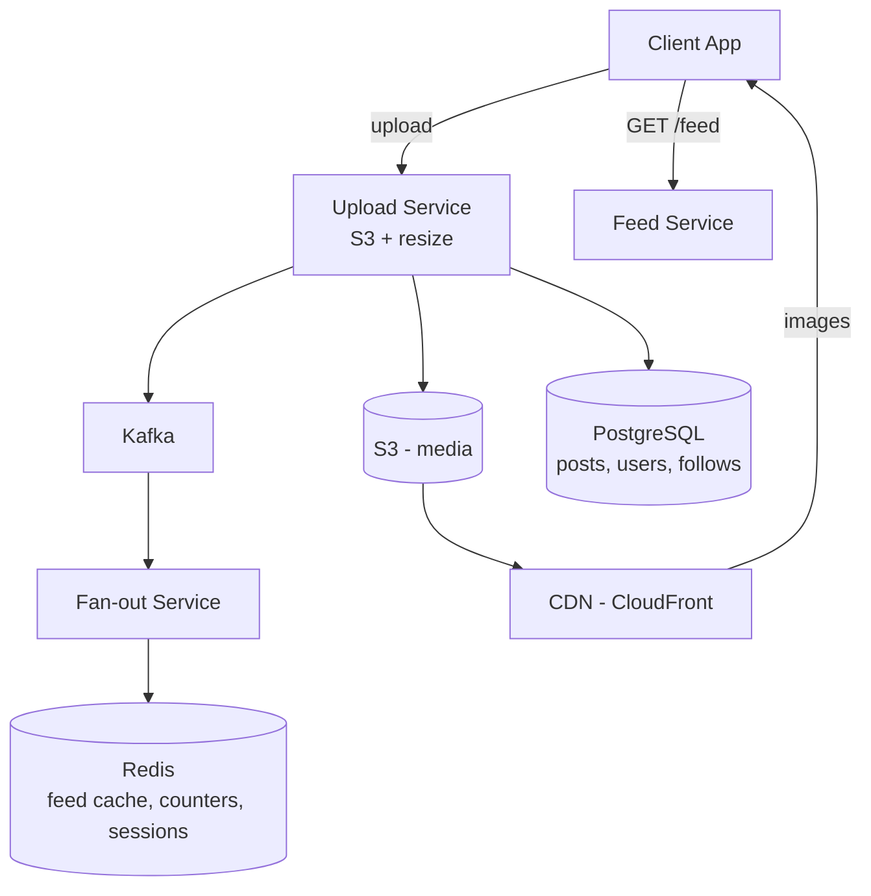

# HLD 09: Instagram

> **Difficulty**: Medium
> **Key Concepts**: Media storage, CDN, feed generation, image processing

---

## 1. Requirements

### Functional Requirements

- Upload photos/videos with captions and tags
- Follow/unfollow users
- Home feed (posts from followed users)
- Explore page (discover new content)
- Like, comment, save posts
- Stories (24-hour ephemeral content)
- Direct messages

### Non-Functional Requirements

- **Low latency**: Feed < 500ms, image load < 200ms
- **Scale**: 2B MAU, 500M DAU, 100M photos/day
- **Storage**: Petabytes of media (images + videos)
- **Availability**: 99.99%

---

## 2. Capacity Estimation

```
Uploads: 100M photos/day ≈ 1200/sec
  Avg photo: 2 MB original → stored in multiple resolutions
  Per photo: original (2MB) + 4 resizes = ~5 MB total
  100M × 5 MB = 500 TB/day new media

Feed reads: 500M DAU × 15 sessions/day = 7.5B feed reads/day ≈ 87K/sec

CDN bandwidth:
  87K reads/sec × 10 images/page × 200 KB avg = 174 GB/sec peak
```

---

## 3. High-Level Architecture



---

## 4. Key Design Decisions

### Image Upload Pipeline

```
1. Client uploads original image to Upload Service
2. Upload Service:
   a. Validate (size, format, content moderation)
   b. Store original in S3: s3://media/originals/{user_id}/{photo_id}.jpg
   c. Emit event to Kafka: image.uploaded
3. Image Processing Workers (async):
   a. Generate resolutions: 150×150, 320×320, 640×640, 1080×1080
   b. Generate WebP variants (30% smaller than JPEG)
   c. Strip EXIF metadata (privacy)
   d. Store in S3: s3://media/resized/{photo_id}/{resolution}.webp
   e. Update CDN: invalidate or pre-warm cache
4. Post creation:
   a. Store post metadata in PostgreSQL
   b. Fan-out to followers' feeds

Client requests image:
  
  CDN serves from edge cache → S3 origin if cache miss
```

### Feed (Same as Social Media Feed)

```
Hybrid fan-out:
  Regular users (< 10K followers): Fan-out on write
  Celebrities (> 10K followers): Fan-out on read (merge at read time)
  
Feed stored in Redis sorted sets per user.
  ZREVRANGE feed:{user_id} 0 19 → top 20 post IDs
  Hydrate: Batch fetch post details from PostgreSQL/cache
```

### Stories

```
Stories: Ephemeral content, disappears after 24 hours.

Storage:
  S3 with lifecycle rule: delete after 25 hours
  Metadata in Redis (TTL = 24 hours): story:{user_id} → [story_ids]

Feed:
  Stories bar = list of users who have active stories
  For each followed user: check Redis if they have stories
  Cache the "users with stories" list (refresh every 30s)

View tracking:
  Redis SET: story:{story_id}:viewers → {user_ids}
  Shows poster who viewed their story
```

### Explore Page

```
Content discovery for users (not based on follows).

Approach:
  1. Collaborative filtering: "Users similar to you liked these posts"
  2. Content-based: Post category, hashtags, engagement rate
  3. Trending: Posts with high engagement velocity in last hour

Pipeline:
  Post engagement events → Kafka → ML scoring pipeline → candidate pool
  Personalization: Re-rank candidates per user based on their interests
  Cache explore feed per user segment (refresh every 15 min)
```

---

## 5. Scaling & Bottlenecks

```
Media storage:
  S3: unlimited, multi-region replication
  CDN: CloudFront with 400+ edge locations
  Cost: S3 Standard-IA for photos older than 30 days

Image processing:
  Lambda or dedicated workers (auto-scale based on upload queue depth)
  Process 1200 images/sec × 5 resolutions = 6000 operations/sec

Feed:
  Redis Cluster: 10+ TB for feed cache
  Celebrity posts: merge at read time (max ~50 celebrity follows per user)

Database:
  PostgreSQL: Sharded by user_id
  Separate read replicas for feed hydration queries
```

---

## 6. Trade-offs

| Decision | Trade-off |
|----------|-----------|
| Eager resize vs on-demand | Storage cost vs first-load latency |
| WebP vs JPEG | Browser support vs file size |
| S3 Standard vs IA | Cost vs access latency for old photos |
| Fan-out write vs read | Write amplification vs read latency |

---

## 7. Summary

- **Core**: Upload pipeline (S3 + async resize + CDN) + hybrid fan-out feed
- **Media**: S3 for storage, CloudFront CDN for delivery, async image processing
- **Feed**: Hybrid fan-out (push for regular, pull for celebrities), Redis sorted sets
- **Stories**: Redis with 24h TTL, S3 lifecycle for auto-deletion
- **Explore**: ML-based content recommendation, cached per user segment

> **Next**: [10 — Twitter/X Timeline](10-twitter-timeline.md)
