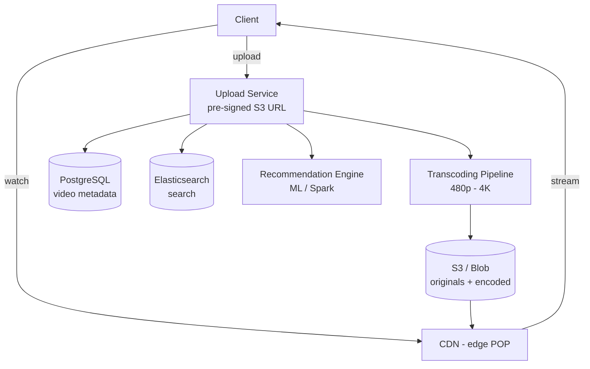

# HLD 11: YouTube

> **Difficulty**: Hard
> **Key Concepts**: Video processing, adaptive streaming, CDN, recommendations

---

## 1. Requirements

### Functional Requirements

- Upload videos (up to 1 hour, multiple formats)
- Watch videos (adaptive streaming based on bandwidth)
- Search videos (title, description, tags)
- Subscriptions and home feed
- Like, comment, share
- Video recommendations
- Live streaming (optional)

### Non-Functional Requirements

- **Scale**: 2B MAU, 500 hours of video uploaded per minute
- **Availability**: 99.99%
- **Latency**: Video start < 2s, search < 200ms
- **Global**: Serve users worldwide via CDN

---

## 2. Capacity Estimation

```
Uploads: 500 hours/min = 720K hours/day
  Avg video: 10 min, 1 GB original → stored in ~10 resolutions = ~3 GB
  720K hours = 4.3M videos/day × 3 GB = 13 PB/day new storage

Views: 1B video views/day
  Avg watch: 5 min at 720p = ~100 MB streamed
  Peak bandwidth: ~5 Tbps

Storage total: Exabytes (multi-year retention)
```

---

## 3. High-Level Architecture



---

## 4. Key Design Decisions

### Video Upload & Processing Pipeline

```
1. Client requests upload:
   POST /api/v1/videos/upload-url
   → Returns pre-signed S3 URL (client uploads directly to S3)

2. Client uploads to S3 (original video)

3. S3 event triggers processing pipeline (Kafka/SQS):
   a. Validation: format, duration, content moderation (ML)
   b. Transcoding: FFmpeg workers convert to multiple formats
      - 240p, 360p, 480p, 720p, 1080p, 4K
      - Codecs: H.264 (compatibility), H.265 (efficiency), VP9, AV1
   c. Chunking: Split into 2-10 second segments for adaptive streaming
   d. Thumbnail generation: Extract frames, ML-select best thumbnail
   e. Store encoded segments in S3
   f. Update metadata DB: video is "ready"
   g. Generate HLS/DASH manifest files

4. Processing time: 1× to 3× video duration
   Parallelized: Each resolution processed independently
   Priority queue: Verified creators processed first
```

### Adaptive Bitrate Streaming (ABR)

```
HLS (HTTP Live Streaming) / DASH:

  Video split into 2-10 second segments at multiple bitrates:
  
  manifest.m3u8:
    #EXT-X-STREAM-INF:BANDWIDTH=800000,RESOLUTION=640x360
    360p/segment_{n}.ts
    #EXT-X-STREAM-INF:BANDWIDTH=2400000,RESOLUTION=1280x720
    720p/segment_{n}.ts
    #EXT-X-STREAM-INF:BANDWIDTH=6000000,RESOLUTION=1920x1080
    1080p/segment_{n}.ts

  Player behavior:
    1. Download manifest (lists available qualities)
    2. Start with low quality (fast start)
    3. Monitor bandwidth → switch to higher quality
    4. Bandwidth drops → seamlessly switch to lower quality

  Each segment served from nearest CDN edge
  CDN caches popular segments → 95%+ cache hit rate
```

### Recommendation Engine

```
"Up Next" and home feed recommendations:

  Candidate generation (thousands of videos):
    - Collaborative filtering: "Users who watched X also watched Y"
    - Content-based: Similar tags, category, creator
    - Subscriptions: Latest from subscribed channels
    - Trending: High engagement velocity

  Ranking (narrow to top 20):
    ML model scores each candidate:
    Features: user history, video features, context (time, device)
    Optimize for: watch time, satisfaction (not just clicks)

  Pipeline: Spark/TensorFlow batch training + real-time serving
  Updated: Model retrained daily, features updated in real-time
```

---

## 5. Scaling & Bottlenecks

```
Storage:
  S3: Exabyte-scale, lifecycle policies (cold storage for old unpopular videos)
  Cost optimization: Less popular videos → S3-IA → Glacier

CDN:
  Google's global CDN (YouTube) or CloudFront
  Edge caching: Popular videos cached at 200+ edge locations
  Long tail: Less popular → fetch from origin

Transcoding:
  Auto-scaling worker fleet (GPU instances for H.265/AV1)
  500 hours/min upload → thousands of transcoding jobs in parallel
  Priority: Live streams > new uploads > re-encoding old content

Search:
  Elasticsearch: Index video titles, descriptions, tags, captions
  Auto-generated captions (speech-to-text) improve search coverage
```

---

## 6. Trade-offs

| Decision | Trade-off |
|----------|-----------|
| More resolutions | Storage/processing cost vs user experience |
| H.265 vs H.264 | Compression (50% smaller) vs compatibility |
| Pre-signed S3 upload | Scalability vs upload control |
| Aggressive CDN caching | Cost vs latency |

---

## 7. Summary

- **Upload**: Pre-signed S3 URL → async transcoding pipeline → multi-resolution segments
- **Streaming**: HLS/DASH adaptive bitrate, CDN edge caching
- **Recommendations**: Collaborative + content-based filtering, ML ranking
- **Scale**: Exabyte storage, global CDN, auto-scaling transcoding fleet
- **Key insight**: Separate upload (async, heavy processing) from playback (CDN, fast)

> **Next**: [12 — Netflix](12-netflix.md)
