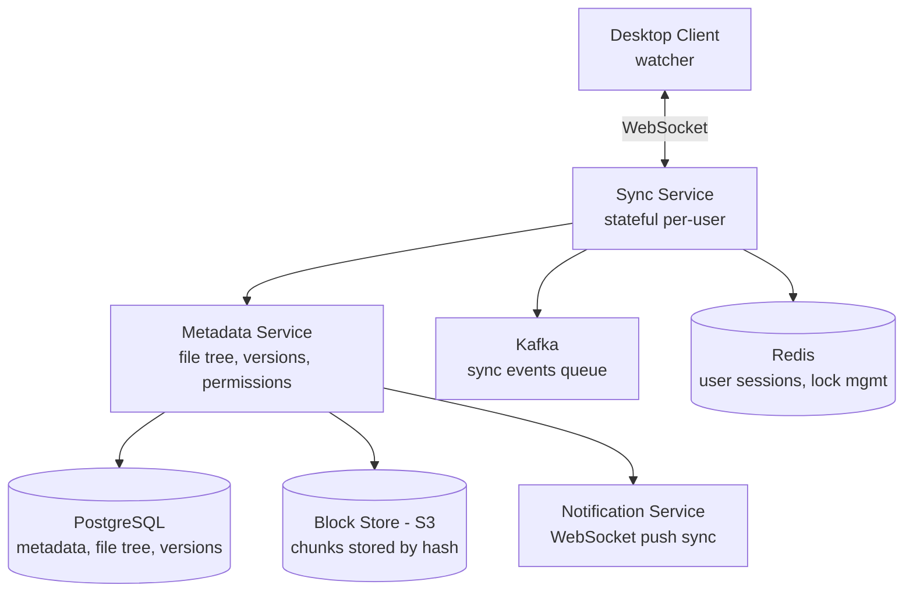

# HLD 13: Dropbox / Google Drive

> **Difficulty**: Hard
> **Key Concepts**: File sync, chunking, conflict resolution, deduplication

---

## 1. Requirements

### Functional Requirements

- Upload/download files (any type, up to 50 GB)
- Automatic sync across devices
- File/folder sharing with permissions (view, edit)
- Version history and restore
- Offline access with sync on reconnect
- Real-time collaboration (Google Docs)

### Non-Functional Requirements

- **Reliability**: No data loss, ever
- **Consistency**: All devices see same file state eventually
- **Scale**: 500M users, 100B files stored
- **Bandwidth**: Minimize data transfer (only sync changes)
- **Latency**: Small file sync < 5s, large file: streaming

---

## 2. Capacity Estimation

```
Files: 100B total, 1B new/modified per day
Avg file size: 1 MB → 1 PB new data/day
Total storage: 100B × 1 MB avg = 100 PB

Sync events: 1B file changes/day ≈ 12K sync events/sec
Metadata: 100B files × 200 bytes metadata = 20 TB

Bandwidth optimization:
  Without chunking: Upload entire 100 MB file for 1-byte change
  With chunking: Upload only the changed 4 MB chunk → 25× savings
```

---

## 3. High-Level Architecture



---

## 4. Key Design Decisions

### File Chunking

```
Split files into fixed-size chunks (4 MB each):

  100 MB file → 25 chunks of 4 MB each
  Each chunk: SHA-256 hash as identifier

  Upload:
    1. Client splits file into chunks
    2. Compute hash of each chunk
    3. Send chunk hashes to server: "Do you have these?"
    4. Server responds: "I need chunks 3, 17" (others already exist)
    5. Client uploads only missing chunks
    6. Server stores metadata: file → [chunk_hash_1, chunk_hash_2, ...]

  Benefits:
  • Delta sync: Only changed chunks uploaded (not entire file)
  • Deduplication: Same chunk in different files stored once
  • Resume: Interrupted uploads resume from last chunk
  • Parallel: Upload/download multiple chunks simultaneously

  Example:
    User edits page 3 of a 50 MB PDF
    Only 1 chunk (4 MB) changes → upload 4 MB instead of 50 MB
    92% bandwidth savings
```

### Deduplication

```
Content-addressable storage: chunks stored by their hash.

  chunk_hash = SHA-256(chunk_data)
  S3 key: s3://blocks/{chunk_hash}

  If two users upload the same file:
    Same chunks → same hashes → stored ONCE
    Each user's metadata points to the same chunks

  Cross-user dedup savings: ~30-50% storage reduction
  Within-user dedup: ~10-20% (similar file versions)

  Dedup check: Before uploading, client sends hash list
  Server: "I already have 20 of 25 chunks" → upload only 5
```

### Sync Protocol

```
1. Client starts → connect WebSocket to Sync Service
2. Client sends: "My last sync timestamp was T1"
3. Server sends: "Here are changes since T1" (list of file operations)
4. Client applies changes locally (download new/modified chunks)

File watcher (desktop client):
  inotify (Linux) / FSEvents (macOS) / ReadDirectoryChanges (Windows)
  Detects: file created, modified, deleted, moved

Change propagation:
  Client A modifies file → uploads chunks → updates metadata
  Sync Service emits event to Kafka: file.changed
  Notification Service: push to all other devices of same user
  Client B receives notification → fetches updated metadata → downloads chunks
  
Latency: Client A save → Client B sees update: ~3-5 seconds
```

### Conflict Resolution

```
Scenario: User edits file on laptop (offline) AND phone simultaneously.

  Laptop: version 3 → edits → tries to save as version 4
  Phone:  version 3 → edits → saves as version 4 (succeeds first)
  Laptop: comes online → tries to save version 4 → CONFLICT (version 4 exists)

Resolution strategies:
  1. LAST WRITER WINS (simple, data loss risk)
     Whichever saves last overwrites. Simple but lossy.

  2. KEEP BOTH (Dropbox approach):
     Save conflicting version as "file (conflicted copy - laptop).txt"
     User manually resolves.

  3. MERGE (Google Docs approach):
     Operational Transform (OT) or CRDT for real-time collaborative editing.
     Merge character-level edits automatically.

  For file sync (Dropbox): Option 2 (keep both, user resolves)
  For real-time docs (Google Docs): Option 3 (automatic merge via OT/CRDT)
```

---

## 5. Scaling & Bottlenecks

```
Storage:
  S3: 100 PB+, deduplication saves 30-50%
  Lifecycle: Move cold chunks to S3-IA / Glacier

Metadata:
  PostgreSQL: Sharded by user_id
  100B file records → heavy DB, partition by user

Sync:
  WebSocket: 500M users → millions of concurrent connections
  Stateful sync servers (user pinned to server during session)
  Kafka for cross-server event delivery

Bandwidth:
  Chunking + dedup: 50-90% bandwidth reduction
  Compression: gzip chunks before upload
  CDN: Popular shared files served from edge
```

---

## 6. Trade-offs

| Decision | Trade-off |
|----------|-----------|
| Fixed vs variable chunk size | Simplicity vs dedup efficiency |
| Client-side vs server-side chunking | Bandwidth savings vs client complexity |
| Keep-both vs auto-merge conflicts | Safety vs user experience |
| WebSocket vs polling for sync | Real-time vs infrastructure complexity |

---

## 7. Summary

- **Core**: File chunking (4 MB) + content-addressable storage + sync via WebSocket
- **Dedup**: SHA-256 hash per chunk, store once, reference many times
- **Sync**: File watcher → detect change → upload chunks → notify other devices
- **Conflicts**: Keep both copies (Dropbox) or auto-merge (Google Docs OT/CRDT)
- **Scale**: S3 for blocks, PostgreSQL for metadata, Kafka for sync events

> **Next**: [14 — Web Crawler](14-web-crawler.md)
