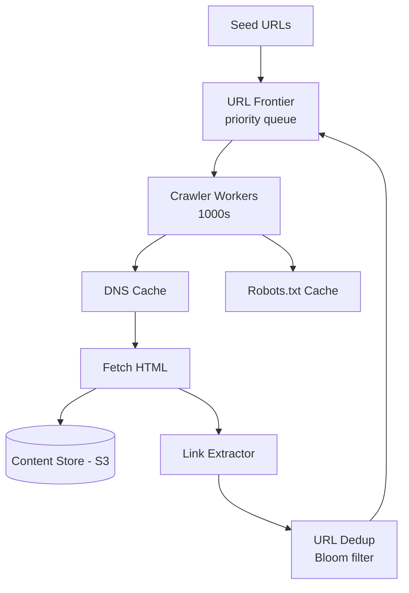

# HLD 14: Web Crawler

> **Difficulty**: Medium
> **Key Concepts**: BFS/DFS, politeness, deduplication, distributed crawling

---

## 1. Requirements

### Functional Requirements

- Crawl billions of web pages starting from seed URLs
- Extract and follow links (discover new pages)
- Store page content for indexing/analysis
- Respect robots.txt and crawl rate limits
- Handle dynamic content (JavaScript-rendered pages)
- Detect and skip duplicate content

### Non-Functional Requirements

- **Scale**: Crawl 1B pages/day
- **Politeness**: Don't overwhelm any single website
- **Freshness**: Re-crawl important pages frequently
- **Robustness**: Handle malformed HTML, timeouts, infinite loops

---

## 2. Capacity Estimation

```
Pages: 1B/day ≈ 12K pages/sec
Avg page size: 100 KB
Storage: 1B × 100 KB = 100 TB/day raw HTML
Bandwidth: 12K × 100 KB = 1.2 GB/sec outbound

URLs discovered: ~10 links per page → 10B new URLs/day
URL frontier size: Billions of URLs to crawl (prioritized queue)

DNS lookups: 12K/sec (cache heavily)
```

---

## 3. High-Level Architecture



---

## 4. Key Design Decisions

### URL Frontier (Priority Queue)

```
Not a simple FIFO queue — URLs have different priorities:

  Priority factors:
  • PageRank / domain authority
  • Freshness: How long since last crawl?
  • Change frequency: Pages that change often get higher priority
  • Depth: Shallower pages (homepage) before deep pages

  Structure: Multiple priority queues
  
  HIGH:   [google.com, amazon.com, ...] (re-crawl every hour)
  MEDIUM: [blog.example.com/2024, ...] (re-crawl daily)
  LOW:    [forum.old.com/thread/123, ...] (re-crawl weekly)

  Politeness constraint:
  Per-host queue: Only one request to same host at a time.
  Rate limit: max 1 request/second per domain.
  
  Frontier = Priority router → Per-host queues → Workers pick from queues
```

### Deduplication

```
URL dedup (don't crawl same URL twice):
  Bloom filter: O(1) lookup, ~1% false positive rate
  10B URLs × 10 bytes = 100 GB Bloom filter (fits in memory cluster)

  Before adding URL to frontier:
    if bloom_filter.contains(url): skip
    else: bloom_filter.add(url), add to frontier

Content dedup (same content at different URLs):
  SimHash / MinHash: Fingerprint of page content
  If fingerprint matches existing page → skip (mirror/duplicate)
  
  Example: article.com/post/123 and article.com/post/123?utm=abc
  Same content, different URLs → content dedup catches this
```

### Politeness

```
robots.txt: Fetch and cache per domain (refresh every 24h)
  Check before crawling any URL on that domain.
  Respect Crawl-delay directive.

Per-domain rate limiting:
  Redis: INCR crawl_rate:{domain}, EXPIRE 1 second
  If count > allowed_rate → delay and retry later

  Mapping: Each worker assigned to specific domains
  Worker A: handles *.example.com (all URLs for that domain)
  → Naturally enforces per-domain rate limit
```

### Handling Traps

```
Spider traps: URLs that generate infinite pages
  Example: calendar.site.com/2024/01/01 → links to /2024/01/02 → forever

  Defenses:
  1. Max depth limit (don't follow links deeper than 15 levels)
  2. Max pages per domain (cap at 100K pages per domain per crawl)
  3. URL pattern detection: If URLs follow a repeating pattern → stop
  4. Page similarity: If consecutive pages are >95% similar → stop
```

---

## 5. Scaling & Bottlenecks

```
Crawl workers:
  1000+ distributed workers, each crawls ~12 pages/sec
  Auto-scale based on frontier queue depth

DNS:
  12K lookups/sec → local DNS cache + dedicated DNS resolver
  Cache TTL: 1 hour (domains don't change IP frequently)

Storage:
  S3 for raw HTML (100 TB/day)
  Lifecycle: Delete after processing or move to Glacier

URL frontier:
  Redis or Kafka for distributed priority queue
  Billions of URLs → partition by domain hash

Network:
  Distributed across regions (crawl from US, EU, Asia)
  Closer to target = lower latency, more polite
```

---

## 6. Trade-offs

| Decision | Trade-off |
|----------|-----------|
| BFS vs DFS traversal | Breadth coverage vs depth on important sites |
| Bloom filter (false positives) | Memory efficiency vs missing some URLs |
| Headless browser vs HTTP fetch | JavaScript rendering vs 10× slower crawl |
| Freshness vs coverage | Re-crawl important pages vs discover new ones |

---

## 7. Summary

- **Core**: URL frontier (priority queue) → workers fetch → extract links → dedup → repeat
- **Politeness**: robots.txt, per-domain rate limiting, per-host queues
- **Dedup**: Bloom filter for URLs, SimHash for content
- **Traps**: Max depth, max pages per domain, pattern detection
- **Scale**: 1000+ distributed workers, DNS cache, S3 for storage

> **Next**: [15 — Search Autocomplete](15-search-autocomplete.md)
