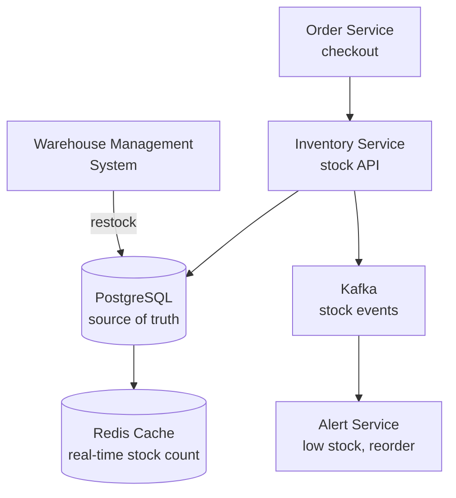

# HLD 19: Inventory Management

> **Difficulty**: Medium
> **Key Concepts**: Stock tracking, reservations, consistency, warehouse management

---

## 1. Requirements

### Functional Requirements

- Track stock levels per product per warehouse/location
- Reserve inventory during checkout (temporary hold)
- Deduct stock on order confirmation
- Restock on returns or new shipments
- Low stock alerts and auto-reorder triggers
- Multi-warehouse support (ship from nearest)
- Bulk inventory updates (CSV import, supplier feeds)

### Non-Functional Requirements

- **Consistency**: No overselling (stock can't go negative)
- **Scale**: 10M SKUs, 100K stock updates/sec during peak
- **Latency**: Stock check < 10ms, reservation < 50ms
- **Availability**: 99.99% (blocks checkout if down)

---

## 2. High-Level Architecture



---

## 3. Key Design Decisions

### Stock Model

```
inventory:
  sku          | warehouse_id | total_stock | reserved | available
  PHONE-128-BK | WH-US-EAST  | 500         | 23       | 477
  PHONE-128-BK | WH-US-WEST  | 300         | 10       | 290
  PHONE-128-BK | WH-EU       | 200         | 5        | 195

  available = total_stock - reserved

  Operations:
  CHECK:    SELECT available WHERE sku = X AND warehouse_id = Y
  RESERVE:  UPDATE SET reserved += qty, available -= qty WHERE available >= qty
  CONFIRM:  UPDATE SET total_stock -= qty, reserved -= qty
  RELEASE:  UPDATE SET reserved -= qty, available += qty
  RESTOCK:  UPDATE SET total_stock += qty, available += qty
```

### Reservation with Timeout

```
Reservation lifecycle:

  1. Checkout starts → RESERVE inventory (hold for 10 min)
  2. Payment succeeds → CONFIRM (deduct from total)
  3. Payment fails / timeout → RELEASE (give back to available)

  Timeout enforcement:
    reservations table:
      id | sku | warehouse_id | qty | expires_at | status
    
    Cron job (every minute):
      UPDATE inventory SET reserved -= r.qty, available += r.qty
      FROM reservations r
      WHERE r.expires_at < now() AND r.status = 'active'
      
      UPDATE reservations SET status = 'expired'
      WHERE expires_at < now() AND status = 'active'

  Alternative: Redis with TTL for reservations
    SET reservation:{order_id}:{sku} qty EX 600
    On expiry → Kafka event → release stock
```

### Flash Sale / Hot Product

```
Problem: 10K users buying same product simultaneously.
  Database becomes bottleneck (row-level lock contention).

Solution: Redis as front-line stock counter

  Pre-load: SET stock:{sku} 1000
  
  Reserve (atomic):
    remaining = DECRBY stock:{sku} qty
    if remaining < 0:
        INCRBY stock:{sku} qty  // rollback
        return "OUT_OF_STOCK"
    // Proceed with order, async sync to DB

  Benefits:
  • Redis handles 100K+ ops/sec on single key
  • No DB lock contention
  • Sync Redis → DB in batches (every 5 seconds)

  Risk: Redis crash → stock count lost
  Mitigation: Redis AOF persistence + periodic DB reconciliation
```

---

## 4. Scaling & Bottlenecks

```
Multi-warehouse routing:
  Customer in NYC → check WH-US-EAST first, fallback to WH-US-WEST
  Strategy: Nearest warehouse with available stock

Stock updates:
  Bulk restock (supplier shipment): Kafka → batch DB update
  Real-time (per-order): Redis + async DB sync

Sharding:
  Shard by SKU hash across DB partitions
  Hot SKUs (popular products) → Redis front-line

Monitoring:
  Stock level alerts: Kafka event when available < threshold
  Auto-reorder: Trigger purchase order when stock < reorder_point
```

---

## 5. Trade-offs

| Decision | Trade-off |
|----------|-----------|
| Redis front-line vs DB-only | Speed vs consistency (eventual sync) |
| Reservation timeout (10 min) | User experience vs stock lock duration |
| Per-warehouse vs global stock | Shipping optimization vs complexity |
| Optimistic vs pessimistic locking | Throughput vs strict consistency |

---

## 6. Summary

- **Core**: Reserve → Confirm/Release pattern with timeout
- **Consistency**: `WHERE available >= qty` guard prevents overselling
- **Hot products**: Redis DECRBY as front-line counter, async DB sync
- **Multi-warehouse**: Route to nearest warehouse with stock
- **Alerts**: Kafka events for low stock, auto-reorder triggers

> **Next**: [20 — Hotel Booking](20-hotel-booking.md)
