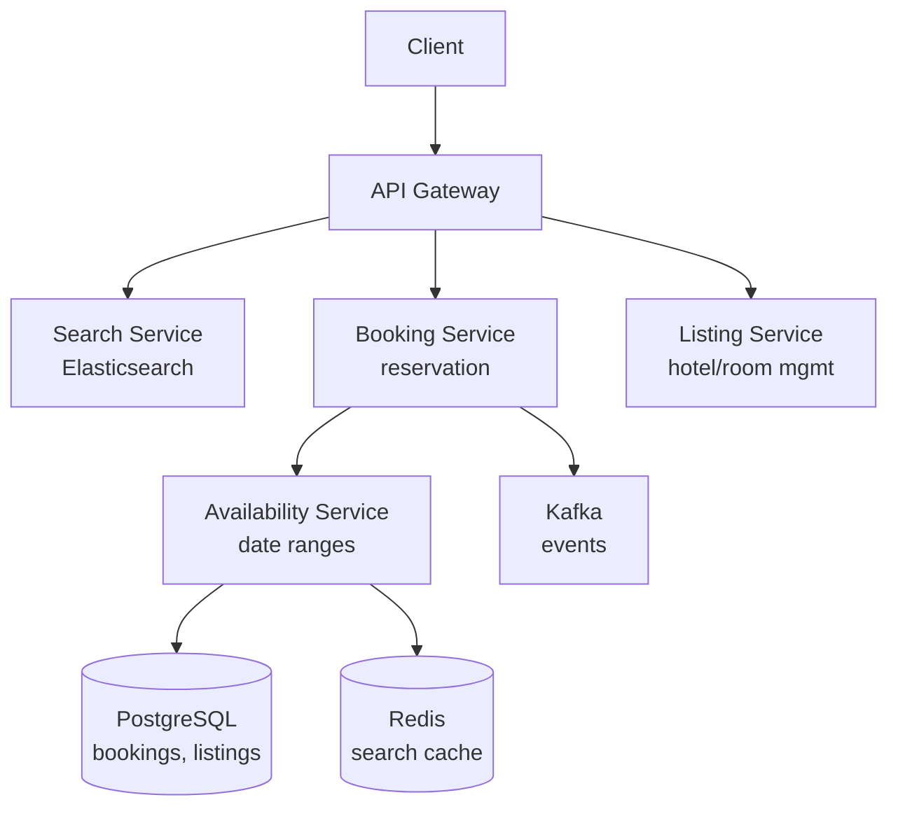

# HLD 20: Hotel Booking (Booking.com / Airbnb)

> **Difficulty**: Medium
> **Key Concepts**: Availability, overbooking, double booking prevention, search

---

## 1. Requirements

### Functional Requirements

- Search hotels by location, dates, guests, filters (price, rating, amenities)
- View hotel details, room types, photos, reviews
- Book a room (select dates → reserve → pay)
- Manage bookings (view, cancel, modify)
- Host/hotel admin: manage listings, pricing, availability
- Reviews and ratings

### Non-Functional Requirements

- **Consistency**: No double booking (same room, same dates)
- **Scale**: 1M properties, 10M searches/day, 500K bookings/day
- **Latency**: Search < 500ms, booking < 3s
- **Availability**: 99.99%

---

## 2. High-Level Architecture



---

## 3. Key Design Decisions

### Availability Model

```
How to track which rooms are available on which dates?

Option A: Date-range rows (recommended)
  room_availability:
    room_type_id | date       | total_rooms | booked | available
    DELUXE-101   | 2024-01-15 | 10          | 7      | 3
    DELUXE-101   | 2024-01-16 | 10          | 8      | 2
    DELUXE-101   | 2024-01-17 | 10          | 5      | 5

  Check availability for Jan 15-17:
    SELECT MIN(available) FROM room_availability
    WHERE room_type_id = 'DELUXE-101'
      AND date BETWEEN '2024-01-15' AND '2024-01-17'
    → min(3, 2, 5) = 2 rooms available for entire stay

Option B: Booking intervals (check for overlaps)
  bookings: room_id | check_in | check_out
  
  Check: SELECT count(*) FROM bookings
         WHERE room_id = X AND check_in < desired_checkout
           AND check_out > desired_checkin
  
  Simpler but slower for availability search across many rooms.

Recommended: Option A for search (pre-computed), Option B as source of truth.
```

### Booking Flow (Prevent Double Booking)

```
1. User searches → sees "3 rooms available"
2. User selects room → clicks "Book Now"
3. Server: Atomic reservation

  BEGIN TRANSACTION;
  
  -- Lock and check availability for all dates
  SELECT available FROM room_availability
  WHERE room_type_id = 'DELUXE-101'
    AND date BETWEEN '2024-01-15' AND '2024-01-17'
    AND available > 0
  FOR UPDATE;  -- row-level lock
  
  -- If all dates have availability:
  UPDATE room_availability
  SET booked = booked + 1, available = available - 1
  WHERE room_type_id = 'DELUXE-101'
    AND date BETWEEN '2024-01-15' AND '2024-01-17';
  
  INSERT INTO bookings (user_id, room_type_id, check_in, check_out, status)
  VALUES ('u1', 'DELUXE-101', '2024-01-15', '2024-01-17', 'confirmed');
  
  COMMIT;

  -- If any date has available = 0 → ROLLBACK → "Sold out"
  
  FOR UPDATE ensures no two transactions book the same last room.
```

### Dynamic Pricing

```
Price varies by:
  • Day of week (weekends more expensive)
  • Season (holidays, events → surge)
  • Demand (occupancy rate > 80% → increase price)
  • Lead time (last-minute vs months ahead)
  • Competitor pricing

Pricing model:
  base_price × day_of_week_multiplier × season_multiplier × demand_multiplier

  room_pricing:
    room_type_id | date       | base_price | final_price
    DELUXE-101   | 2024-01-15 | $150       | $225  (weekend + high demand)
    DELUXE-101   | 2024-01-16 | $150       | $180  (weekend)
    DELUXE-101   | 2024-01-17 | $150       | $150  (weekday, normal)

  Pricing engine: Batch job recalculates prices every hour
  Stored in DB + cached in Redis for fast search display
```

---

## 4. Scaling & Bottlenecks

```
Search:
  Elasticsearch: Index properties with location, amenities, price, availability
  Geo-search: "Hotels within 10 km of Times Square"
  Cache popular searches (NYC, Jan 15-17, 2 guests) in Redis

Booking (write-heavy at peak):
  FOR UPDATE locks → limits concurrent bookings per room_type
  Mitigation: Partition by hotel_id, each hotel's bookings independent
  Queue-based: If overwhelmed, use booking queue with confirmation

Availability cache:
  Redis: availability:{room_type_id}:{date} → available count
  Invalidate on booking/cancellation
  Search reads from cache → DB only on cache miss
```

---

## 5. Trade-offs

| Decision | Trade-off |
|----------|-----------|
| Pre-computed availability vs on-demand | Speed vs storage + cache invalidation |
| Pessimistic lock (FOR UPDATE) vs optimistic | No double booking vs throughput |
| Show exact availability vs "few left" | Transparency vs booking urgency |
| Dynamic pricing | Revenue optimization vs customer trust |

---

## 6. Summary

- **Availability**: Per-date rows with `available` counter, pre-computed for search
- **Booking**: Atomic transaction with `FOR UPDATE` lock prevents double booking
- **Search**: Elasticsearch with geo + date + filter, cached in Redis
- **Pricing**: Dynamic based on demand, season, day of week, recalculated hourly
- **Scale**: Partition by hotel, cache availability, queue bookings at peak

> **Next**: [21 — Ticket Booking](21-ticket-booking.md)
