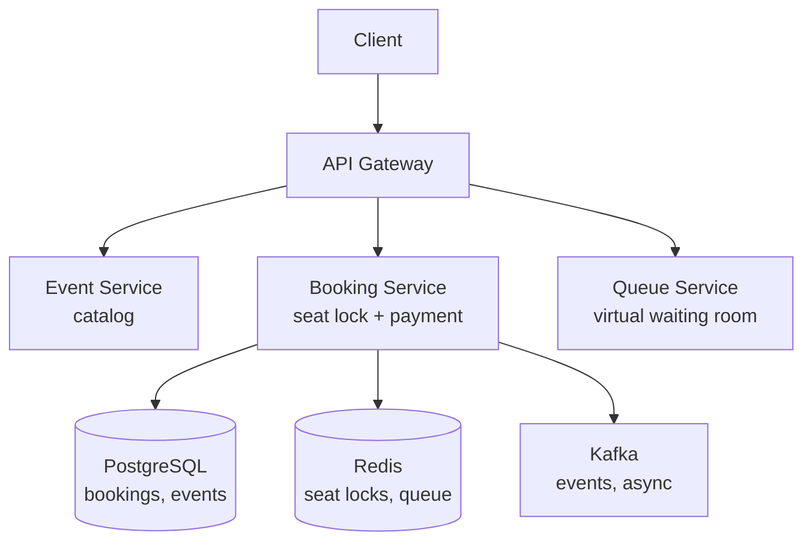

# HLD 21: Ticket Booking (BookMyShow / Ticketmaster)

> **Difficulty**: Medium
> **Key Concepts**: Seat locking, concurrency, fairness, virtual queue

---

## 1. Requirements

### Functional Requirements

- Browse events (movies, concerts, sports)
- View seat map with real-time availability
- Select seats and hold temporarily
- Complete booking with payment
- Cancel/refund bookings
- Virtual waiting queue for high-demand events

### Non-Functional Requirements

- **Consistency**: No double booking of same seat
- **Scale**: 10M users, 1M bookings/day, 50K concurrent for popular events
- **Latency**: Seat selection < 1s, booking < 3s
- **Fairness**: First-come-first-served for popular events

---

## 2. High-Level Architecture



---

## 3. Key Design Decisions

### Seat Locking (Temporary Hold)

```
When user selects seats, lock them for 7 minutes (payment window):

  Redis-based seat lock:
    SET seat_lock:{event_id}:{seat_id} {user_id} EX 420 NX
    
    NX: Only set if not exists (atomic — prevents double lock)
    EX 420: Auto-expires in 7 minutes (420 seconds)
    
  If SET returns OK → seat locked for this user
  If SET returns nil → seat already locked by another user → reject

  Release on:
    • Payment success → convert to permanent booking (DB)
    • Payment failure → DELETE lock (or let TTL expire)
    • User abandons → TTL auto-expires → seat available again

  Seat map display:
    For each seat: check Redis → show as "available" or "locked/booked"
    Color coding: green (available), yellow (locked), red (booked)
```

### Booking Flow

```
1. User selects seats [A1, A2]
2. Server: Lock seats in Redis (NX + TTL)
   If any seat already locked → return error "Seat taken"
   Lock ALL selected seats atomically (Lua script)

3. User proceeds to payment (7-minute window)
4. Payment success:
   BEGIN TRANSACTION;
   INSERT INTO bookings (event_id, user_id, seats, status) ...
   UPDATE seats SET status = 'booked' WHERE seat_id IN (A1, A2);
   COMMIT;
   DELETE Redis locks (now permanent in DB)

5. Payment timeout (7 min):
   Redis locks auto-expire → seats available again
   No DB cleanup needed

Lua script for atomic multi-seat lock:
  local locked = {}
  for i, seat in ipairs(KEYS) do
    local result = redis.call('SET', seat, ARGV[1], 'NX', 'EX', 420)
    if not result then
      -- Rollback already locked seats
      for j = 1, #locked do redis.call('DEL', locked[j]) end
      return 0  -- FAIL
    end
    table.insert(locked, seat)
  end
  return 1  -- SUCCESS
```

### Virtual Queue (High-Demand Events)

```
Problem: Concert tickets go on sale → 500K users hit the system simultaneously.

Solution: Virtual waiting room

  1. Before sale opens: All users placed in queue
     ZADD queue:{event_id} {timestamp} {user_id}
     
  2. Display: "You are #4,532 in line. Estimated wait: 8 minutes"

  3. Process N users per batch (e.g., 100 every 10 seconds)
     Admitted users get a time-limited token to access booking page
     Token valid for 10 minutes

  4. Admitted user selects seats and books normally

  Benefits:
  • Protects backend from 500K simultaneous requests
  • Fair (FIFO ordering)
  • Predictable load on booking system
  • Better UX than "site crashed" or random 503 errors
```

---

## 4. Scaling & Bottlenecks

```
Seat map reads (high frequency):
  Cache seat status in Redis (per event)
  WebSocket push: Broadcast seat status changes to all viewers
  Reduce polling: Event-driven updates instead of refresh

Booking writes:
  PostgreSQL: Partition by event_id
  Each event's bookings are independent → no cross-event contention
  Popular event: Queue limits concurrent bookers → controlled load

Redis:
  Seat locks: event with 50K seats = 50K Redis keys (trivial)
  Queue: Sorted set with 500K members → Redis handles easily
```

---

## 5. Trade-offs

| Decision | Trade-off |
|----------|-----------|
| Lock timeout (7 min) | User experience (enough time) vs seat lock duration |
| Redis lock vs DB lock | Speed vs durability (Redis crash = lost locks) |
| Virtual queue vs first-come | Fairness + stability vs instant access |
| Real-time seat map vs cached | Accuracy vs server load |

---

## 6. Summary

- **Seat locking**: Redis SET NX EX for temporary holds, auto-expire on timeout
- **Atomic multi-seat**: Lua script locks all-or-nothing
- **Booking**: Lock → Pay → Confirm (DB) → Release lock
- **Virtual queue**: FIFO waiting room for high-demand events, batch admission
- **Scale**: Partition by event, Redis for locks/queue, WebSocket for real-time seat map

> **Next**: [22 — Distributed Cache](22-distributed-cache.md)
