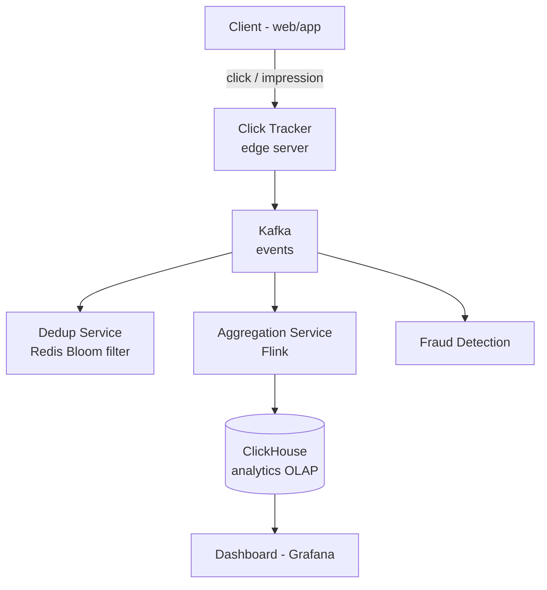

# HLD 27: Ad Click Tracking

> **Difficulty**: Medium
> **Key Concepts**: Event streaming, deduplication, analytics, real-time aggregation

---

## 1. Requirements

### Functional Requirements

- Track ad impressions (ad shown to user)
- Track ad clicks (user clicks on ad)
- Click-through rate (CTR) calculation in real-time
- Conversion tracking (click → purchase)
- Fraud detection (bot clicks, click farms)
- Reporting dashboard (by campaign, ad group, time period)
- Billing: Charge advertisers per click (CPC) or per 1000 impressions (CPM)

### Non-Functional Requirements

- **Scale**: 10B impressions/day, 500M clicks/day
- **Latency**: Click tracked < 1s, reporting delay < 5 minutes
- **Accuracy**: No duplicate clicks (billing depends on accuracy)
- **Availability**: 99.99% (lost clicks = lost revenue)

---

## 2. High-Level Architecture



---

## 3. Key Design Decisions

### Click Tracking Mechanism

```
Two approaches for tracking clicks:

Option A: REDIRECT (server-side tracking)
  Ad link: https://tracker.ads.com/click?ad_id=123&redirect=https://shop.com
  
  1. User clicks ad → hits tracker server
  2. Tracker logs click event to Kafka
  3. Tracker returns HTTP 302 redirect to actual destination
  4. User lands on advertiser's page
  
  Pro: Reliable, works everywhere
  Con: Adds latency (one extra hop), redirect visible in URL

Option B: PIXEL + BEACON (client-side tracking)
  On click: JavaScript fires async request
    navigator.sendBeacon("https://tracker.ads.com/click", {ad_id: 123})
  
  Pro: No redirect latency, invisible to user
  Con: Can be blocked by ad blockers, less reliable

Recommended: Redirect for clicks (reliable billing), beacon for impressions.
```

### Deduplication

```
Problem: Same click tracked twice (network retry, double-click, bots)
  → Advertiser charged twice → trust issue

Solution: Multi-layer dedup

Layer 1: Client-side
  Disable click after first click (UI debounce)
  Add click_id (UUID) to each event

Layer 2: Edge server
  Short-term dedup in Redis:
    SET click:{click_id} 1 NX EX 300  (5-minute window)
    If NX fails → duplicate → drop

Layer 3: Stream processing
  Flink dedup: Window of 1 hour, key by (user_id, ad_id)
  If same user clicked same ad within 1 hour → drop duplicate

Layer 4: Batch reconciliation
  Daily job: Detect anomalies in click patterns
  Flag suspicious activity for manual review
```

### Real-Time Aggregation

```
Flink streaming pipeline:

  Kafka (raw events) → Flink → ClickHouse (aggregated)

  Aggregations computed in real-time:
    impressions_count: GROUP BY (ad_id, 1-minute window)
    clicks_count:      GROUP BY (ad_id, 1-minute window)
    ctr:               clicks / impressions per ad
    spend:             clicks × CPC per campaign

  ClickHouse tables:
    ad_events_raw:     Every event (for debugging, audit)
    ad_stats_minutely: Pre-aggregated per minute per ad
    ad_stats_hourly:   Rolled up from minutely
    ad_stats_daily:    Rolled up from hourly

  Dashboard queries hit pre-aggregated tables → fast
  "CTR for campaign X last 7 days" → query ad_stats_daily → <100ms
```

### Fraud Detection

```
Bot detection signals:
  • Click rate: > 10 clicks/sec from same IP → bot
  • No impression before click (click without seeing ad)
  • User agent analysis (headless browsers, known bot UA)
  • Geographic anomaly (1000 clicks from same /24 subnet)
  • Click-to-conversion ratio anomaly (100% CTR, 0% conversion)

Real-time:
  Flink rules engine checks each click against fraud patterns
  Flag suspicious clicks → don't bill advertiser
  
Offline:
  ML model trained on historical fraud patterns
  Batch scoring of click data daily
  Refund advertiser for fraudulent clicks detected post-hoc
```

---

## 4. Scaling & Bottlenecks

```
Event ingestion (10B impressions + 500M clicks/day):
  Kafka: 200+ partitions, handles billions/day easily
  Edge servers: CDN-like distribution, close to users

Dedup (Redis):
  500M clicks/day × 100 bytes per key = 50 GB (5-min TTL window)
  Redis Cluster handles this across a few nodes

Analytics (ClickHouse):
  Columnar storage: Excellent compression for event data
  10B rows/day → partitioned by date, sharded by campaign_id
  Pre-aggregated tables for fast dashboard queries

Billing:
  Aggregated click counts per advertiser per day
  Reconciliation: Match clicks with charges daily
  Invoice generation: Monthly batch job
```

---

## 5. Trade-offs

| Decision | Trade-off |
|----------|-----------|
| Redirect vs beacon tracking | Reliability vs latency |
| Real-time vs batch aggregation | Freshness vs processing cost |
| Aggressive vs lenient fraud detection | Advertiser trust vs publisher revenue |
| Raw event retention (30d vs 1y) | Audit capability vs storage cost |

---

## 6. Summary

- **Tracking**: Redirect for clicks (reliable), beacon for impressions (async)
- **Dedup**: Redis NX (edge) + Flink window (stream) + batch reconciliation
- **Analytics**: Kafka → Flink (real-time aggregation) → ClickHouse (OLAP)
- **Fraud**: Real-time rules + offline ML, flag suspicious clicks
- **Billing**: Pre-aggregated click counts, daily reconciliation
- **Scale**: Kafka for billions of events, ClickHouse for fast analytics

---

> This completes the HLD section. Return to [HLD README](README.md) for the full list.
