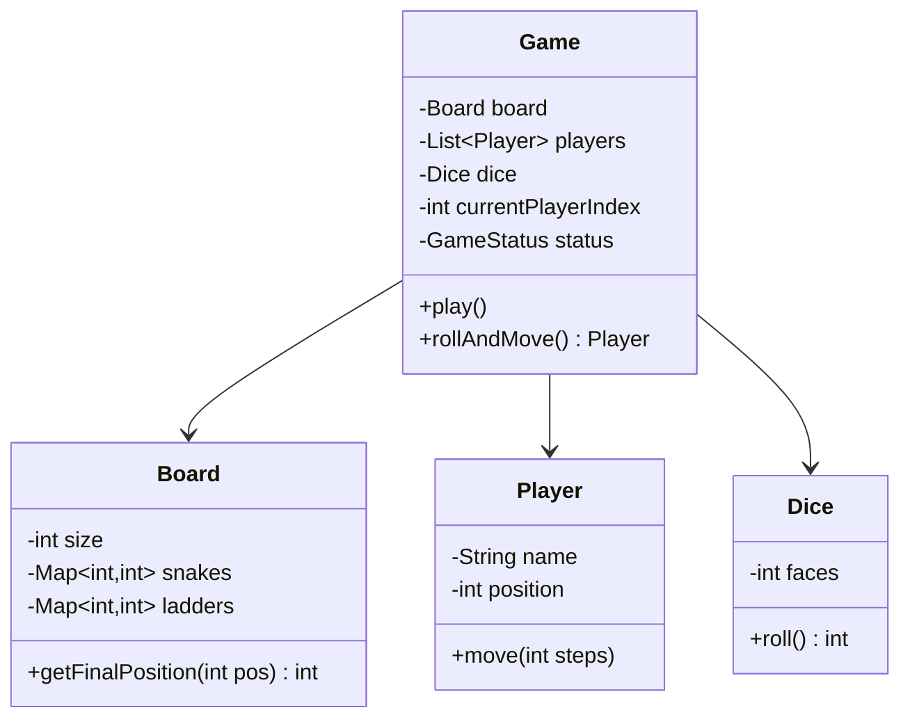
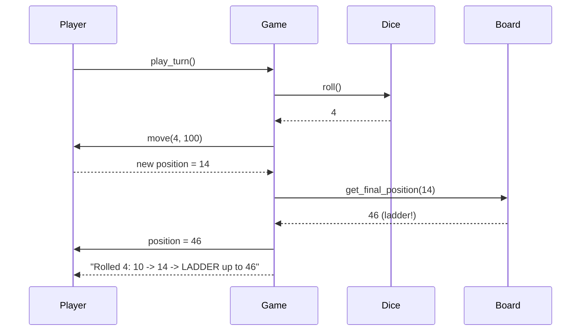

# LLD 09: Snake and Ladder

> **Difficulty**: Easy
> **Key Concepts**: OOP, game loop, board modeling, dice

---

## 1. Requirements

- Board with configurable size (default 100 cells)
- Configurable snakes (head → tail, moves down) and ladders (bottom → top, moves up)
- 2+ players, turn-based
- Dice roll (1–6), move player forward
- If land on snake head → slide down to tail
- If land on ladder bottom → climb to top
- First player to reach or exceed final cell wins

---

## 2. Class Diagram



---

## 3. Core Classes

```java
public class Dice {
    private final int faces;
    private final Random random = new Random();

    public Dice() { this(6); }
    public Dice(int faces) { this.faces = faces; }
    public int roll() { return random.nextInt(faces) + 1; }
}

public class Player {
    private final String name;
    private int position = 0; // start off the board

    public Player(String name) { this.name = name; }

    public boolean move(int steps, int boardSize) {
        int newPos = position + steps;
        if (newPos > boardSize) return false;
        position = newPos;
        return true;
    }

    public String getName() { return name; }
    public int getPosition() { return position; }
    public void setPosition(int pos) { position = pos; }
}

public class Board {
    private final int size;
    private final Map<Integer, Integer> snakes = new HashMap<>();  // head -> tail
    private final Map<Integer, Integer> ladders = new HashMap<>(); // bottom -> top

    public Board() { this(100); }
    public Board(int size) { this.size = size; }

    public void addSnake(int head, int tail) {
        if (head <= tail) throw new IllegalArgumentException("Snake head must be above tail");
        if (ladders.containsKey(head)) throw new IllegalArgumentException("Cannot place snake on ladder start");
        snakes.put(head, tail);
    }

    public void addLadder(int bottom, int top) {
        if (bottom >= top) throw new IllegalArgumentException("Ladder bottom must be below top");
        if (snakes.containsKey(bottom)) throw new IllegalArgumentException("Cannot place ladder on snake head");
        ladders.put(bottom, top);
    }

    public int getFinalPosition(int position) {
        if (snakes.containsKey(position)) return snakes.get(position);
        if (ladders.containsKey(position)) return ladders.get(position);
        return position;
    }

    public int getSize() { return size; }
}
```

---

## 4. Game Controller

```java
public enum GameStatus { NOT_STARTED, IN_PROGRESS, FINISHED }

public class Game {
    private final Board board;
    private final List<Player> players;
    private final Dice dice;
    private int currentPlayerIndex = 0;
    private GameStatus status = GameStatus.NOT_STARTED;
    private Player winner;

    public Game(Board board, List<Player> players, Dice dice) {
        if (players.size() < 2) throw new IllegalArgumentException("Need at least 2 players");
        this.board = board;
        this.players = players;
        this.dice = (dice != null) ? dice : new Dice();
    }

    public String playTurn() {
        if (status == GameStatus.FINISHED) throw new RuntimeException("Game is already over");
        status = GameStatus.IN_PROGRESS;
        Player player = players.get(currentPlayerIndex);
        int roll = dice.roll();
        int oldPos = player.getPosition();
        String result;

        if (!player.move(roll, board.getSize())) {
            result = player.getName() + " rolled " + roll + " but can't move (would exceed board)";
        } else {
            int finalPos = board.getFinalPosition(player.getPosition());
            if (finalPos != player.getPosition()) {
                String type = (finalPos < player.getPosition()) ? "SNAKE down" : "LADDER up";
                result = player.getName() + " rolled " + roll + ": " + oldPos
                    + " -> " + player.getPosition() + " -> " + type + " to " + finalPos;
                player.setPosition(finalPos);
            } else {
                result = player.getName() + " rolled " + roll + ": " + oldPos + " -> " + player.getPosition();
            }
            if (player.getPosition() == board.getSize()) {
                winner = player;
                status = GameStatus.FINISHED;
                result += " - " + player.getName() + " WINS!";
            }
        }
        currentPlayerIndex = (currentPlayerIndex + 1) % players.size();
        return result;
    }

    public Player play() {
        while (status != GameStatus.FINISHED) System.out.println(playTurn());
        return winner;
    }
}
```

---

## 5. Sequence Flow



---

## 6. Design Patterns Used

| Pattern | Where | Why |
|---------|-------|-----|
| **Composition** | Game has Board, Players, Dice | Clean separation of concerns |
| **Iterator** | Turn rotation via index | Cycle through players |
| **State** | GameStatus | Track game lifecycle |

---

## 7. Edge Cases

- **Roll exceeds board**: Player stays in place (must land exactly on 100)
- **Snake at 99**: Possible to be sent back near the end
- **Ladder on snake tail**: Chain reactions (optional rule)
- **Single dice vs two dice**: Configurable via Dice class
- **Consecutive 6s**: Optional rule — extra turn on 6

> **Next**: [10 — Tic-Tac-Toe](10-tic-tac-toe.md)
