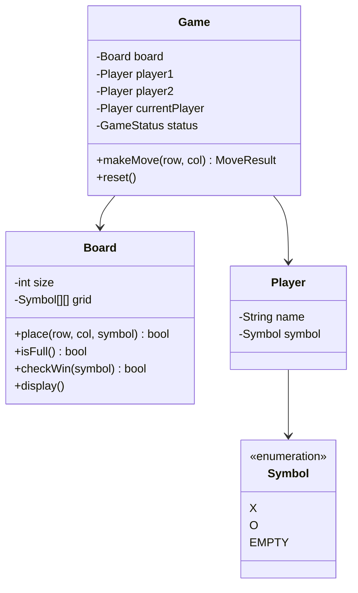
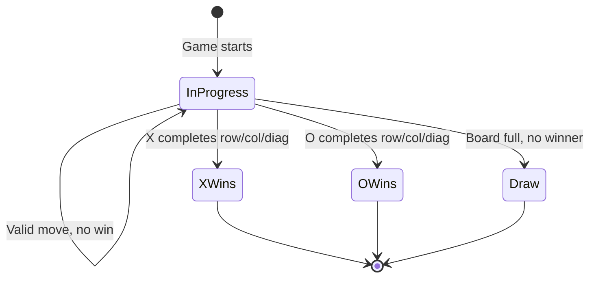

# LLD 10: Tic-Tac-Toe

> **Difficulty**: Easy
> **Key Concepts**: OOP, game state, win detection, board representation

---

## 1. Requirements

- 3×3 board (extensible to N×N)
- Two players (X and O), turn-based
- Detect win (row, column, diagonal) and draw
- Input validation (occupied cell, out of bounds)
- Display board state after each move

---

## 2. Class Diagram



---

## 3. Core Classes

```java
public enum Symbol {
    X("X"), O("O"), EMPTY(" ");
    private final String value;
    Symbol(String value) { this.value = value; }
    public String getValue() { return value; }
}

public enum GameStatus { IN_PROGRESS, X_WINS, O_WINS, DRAW }

public class Player {
    private final String name;
    private final Symbol symbol;

    public Player(String name, Symbol symbol) { this.name = name; this.symbol = symbol; }
    public String getName() { return name; }
    public Symbol getSymbol() { return symbol; }
}

public class Board {
    private final int size;
    private final Symbol[][] grid;
    private int movesCount = 0;

    public Board() { this(3); }
    public Board(int size) {
        this.size = size;
        grid = new Symbol[size][size];
        for (Symbol[] row : grid) Arrays.fill(row, Symbol.EMPTY);
    }

    public boolean place(int row, int col, Symbol symbol) {
        if (row < 0 || row >= size || col < 0 || col >= size)
            throw new IllegalArgumentException("Position (" + row + "," + col + ") is out of bounds");
        if (grid[row][col] != Symbol.EMPTY)
            throw new IllegalArgumentException("Position (" + row + "," + col + ") is already occupied");
        grid[row][col] = symbol;
        movesCount++;
        return true;
    }

    public boolean isFull() { return movesCount == size * size; }

    public boolean checkWin(Symbol symbol) {
        for (int r = 0; r < size; r++) {
            boolean rowWin = true;
            for (int c = 0; c < size; c++) if (grid[r][c] != symbol) { rowWin = false; break; }
            if (rowWin) return true;
        }
        for (int c = 0; c < size; c++) {
            boolean colWin = true;
            for (int r = 0; r < size; r++) if (grid[r][c] != symbol) { colWin = false; break; }
            if (colWin) return true;
        }
        boolean diag = true, antiDiag = true;
        for (int i = 0; i < size; i++) {
            if (grid[i][i] != symbol) diag = false;
            if (grid[i][size - 1 - i] != symbol) antiDiag = false;
        }
        return diag || antiDiag;
    }

    public String display() {
        StringBuilder sb = new StringBuilder();
        String sep = "-".repeat(size * 4 - 1);
        for (int r = 0; r < size; r++) {
            if (r > 0) sb.append("\n").append(sep).append("\n");
            for (int c = 0; c < size; c++) {
                if (c > 0) sb.append(" | ");
                sb.append(" ").append(grid[r][c].getValue()).append(" ");
            }
        }
        return sb.toString();
    }

    public int getSize() { return size; }
}
```

---

## 4. Game Controller

```java
public class Game {
    private Board board;
    private final Player player1;
    private final Player player2;
    private Player currentPlayer;
    private GameStatus status = GameStatus.IN_PROGRESS;

    public Game(String player1Name, String player2Name, int boardSize) {
        this.board = new Board(boardSize);
        this.player1 = new Player(player1Name, Symbol.X);
        this.player2 = new Player(player2Name, Symbol.O);
        this.currentPlayer = player1;
    }
    public Game(String p1, String p2) { this(p1, p2, 3); }

    public String makeMove(int row, int col) {
        if (status != GameStatus.IN_PROGRESS)
            throw new RuntimeException("Game is already over");

        board.place(row, col, currentPlayer.getSymbol());

        if (board.checkWin(currentPlayer.getSymbol())) {
            status = (currentPlayer.getSymbol() == Symbol.X) ? GameStatus.X_WINS : GameStatus.O_WINS;
            return currentPlayer.getName() + " (" + currentPlayer.getSymbol().getValue() + ") wins!";
        }
        if (board.isFull()) {
            status = GameStatus.DRAW;
            return "It's a draw!";
        }

        currentPlayer = (currentPlayer == player1) ? player2 : player1;
        return currentPlayer.getName() + "'s turn (" + currentPlayer.getSymbol().getValue() + ")";
    }

    public void reset() {
        board = new Board(board.getSize());
        currentPlayer = player1;
        status = GameStatus.IN_PROGRESS;
    }
}
```

---

## 5. Game Flow



---

## 6. Design Patterns Used

| Pattern | Where | Why |
|---------|-------|-----|
| **State** | GameStatus | Track game lifecycle |
| **MVC** | Board (model), display (view), Game (controller) | Separation of concerns |
| **Turn-based** | current_player toggle | Alternate between players |

---

## 7. Edge Cases

- **Occupied cell**: Raise error, don't switch turns
- **Out of bounds**: Validate row/col before placing
- **Immediate win**: Check after every move (not batch)
- **N×N extension**: `check_win` works for any size
- **AI opponent**: Add `Player` subclass with minimax algorithm

> **Next**: [11 — Pub-Sub Messaging System](11-pub-sub-messaging.md)
