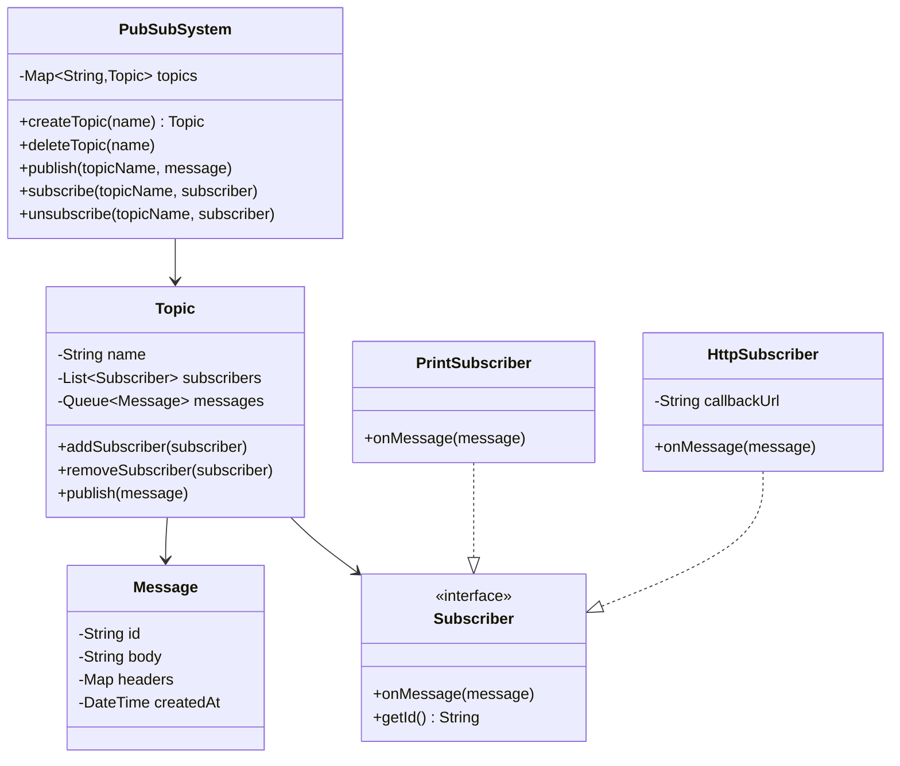
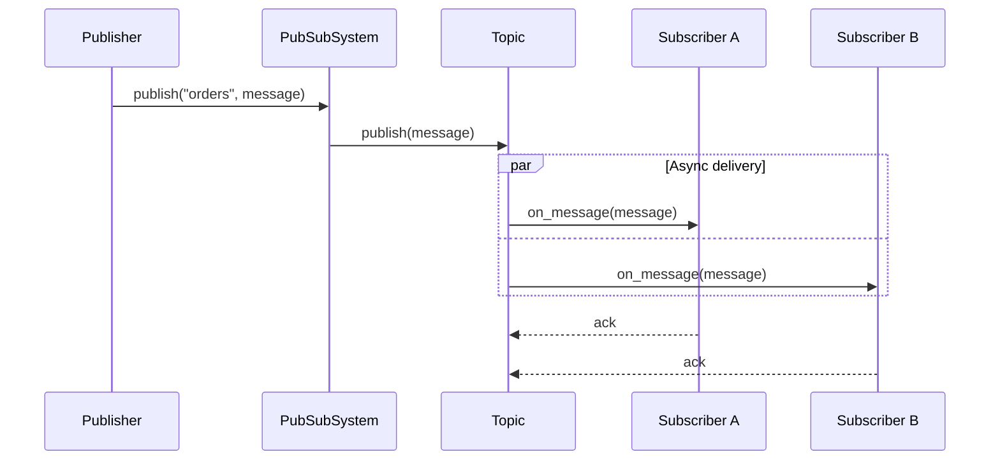

# LLD 11: Pub-Sub Messaging System

> **Difficulty**: Medium
> **Key Concepts**: Observer pattern, topics, subscribers, message delivery

---

## 1. Requirements

- Create topics (named channels)
- Publishers send messages to topics
- Subscribers subscribe/unsubscribe to topics
- Messages delivered to all subscribers of a topic
- Support message filtering (optional)
- At-least-once delivery guarantee
- Async message processing per subscriber

---

## 2. Class Diagram



---

## 3. Core Classes

```java
public class Message {
    private final String id;
    private final String body;
    private final Map<String, String> headers;
    private final LocalDateTime createdAt;

    public Message(String body, Map<String, String> headers) {
        this.id = UUID.randomUUID().toString();
        this.body = body;
        this.headers = (headers != null) ? headers : Map.of();
        this.createdAt = LocalDateTime.now();
    }
    public Message(String body) { this(body, null); }
    public String getBody() { return body; }
}

public interface Subscriber {
    void onMessage(Message message);
    String getId();
}

public class PrintSubscriber implements Subscriber {
    private final String name;
    public PrintSubscriber(String name) { this.name = name; }

    @Override
    public void onMessage(Message message) {
        System.out.println("[" + name + "] Received: " + message.getBody());
    }

    @Override
    public String getId() { return name; }
}

public class Topic {
    private final String name;
    private final List<Subscriber> subscribers = new ArrayList<>();
    private final Object lock = new Object();
    private final ExecutorService executor = Executors.newCachedThreadPool();

    public Topic(String name) { this.name = name; }

    public void addSubscriber(Subscriber subscriber) {
        synchronized (lock) {
            if (subscribers.stream().noneMatch(s -> s.getId().equals(subscriber.getId())))
                subscribers.add(subscriber);
        }
    }

    public void removeSubscriber(Subscriber subscriber) {
        synchronized (lock) {
            subscribers.removeIf(s -> s.getId().equals(subscriber.getId()));
        }
    }

    public void publish(Message message) {
        List<Subscriber> snapshot;
        synchronized (lock) { snapshot = new ArrayList<>(subscribers); }
        for (Subscriber sub : snapshot) {
            executor.submit(() -> deliver(sub, message));
        }
    }

    private void deliver(Subscriber subscriber, Message message) {
        try {
            subscriber.onMessage(message);
        } catch (Exception e) {
            System.err.println("Delivery failed to " + subscriber.getId() + ": " + e.getMessage());
            // Retry logic could go here
        }
    }
}
```

---

## 4. PubSub System

```java
public class PubSubSystem {
    private static PubSubSystem instance;
    private final Map<String, Topic> topics = new HashMap<>();
    private final Object lock = new Object();

    private PubSubSystem() {}

    public static synchronized PubSubSystem getInstance() {
        if (instance == null) instance = new PubSubSystem();
        return instance;
    }

    public Topic createTopic(String name) {
        synchronized (lock) {
            if (topics.containsKey(name))
                throw new IllegalArgumentException("Topic '" + name + "' already exists");
            Topic topic = new Topic(name);
            topics.put(name, topic);
            return topic;
        }
    }

    public void deleteTopic(String name) {
        synchronized (lock) {
            if (!topics.containsKey(name))
                throw new IllegalArgumentException("Topic '" + name + "' not found");
            topics.remove(name);
        }
    }

    public void publish(String topicName, Message message) {
        getTopic(topicName).publish(message);
    }

    public void subscribe(String topicName, Subscriber subscriber) {
        getTopic(topicName).addSubscriber(subscriber);
    }

    public void unsubscribe(String topicName, Subscriber subscriber) {
        getTopic(topicName).removeSubscriber(subscriber);
    }

    private Topic getTopic(String name) {
        synchronized (lock) {
            Topic topic = topics.get(name);
            if (topic == null) throw new IllegalArgumentException("Topic '" + name + "' not found");
            return topic;
        }
    }
}
```

---

## 5. Message Flow



---

## 6. Design Patterns Used

| Pattern | Where | Why |
|---------|-------|-----|
| **Observer** | Topic → Subscribers | Core pub-sub notification pattern |
| **Singleton** | PubSubSystem | One system instance |
| **Strategy** | Subscriber implementations | Different delivery methods (print, HTTP, queue) |
| **Thread-per-message** | Topic.publish() | Async, non-blocking delivery |

---

## 7. Edge Cases

- **Slow subscriber**: Async delivery prevents blocking others
- **Subscriber failure**: Catch exception, retry with backoff
- **Topic deleted with active subscribers**: Notify subscribers, unsubscribe all
- **Duplicate subscribe**: Check by ID before adding
- **Message ordering**: Per-subscriber queue for ordered delivery (optional)

> **Next**: [12 — In-Memory Cache (LRU)](12-in-memory-cache.md)
