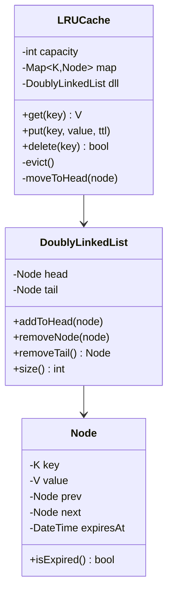
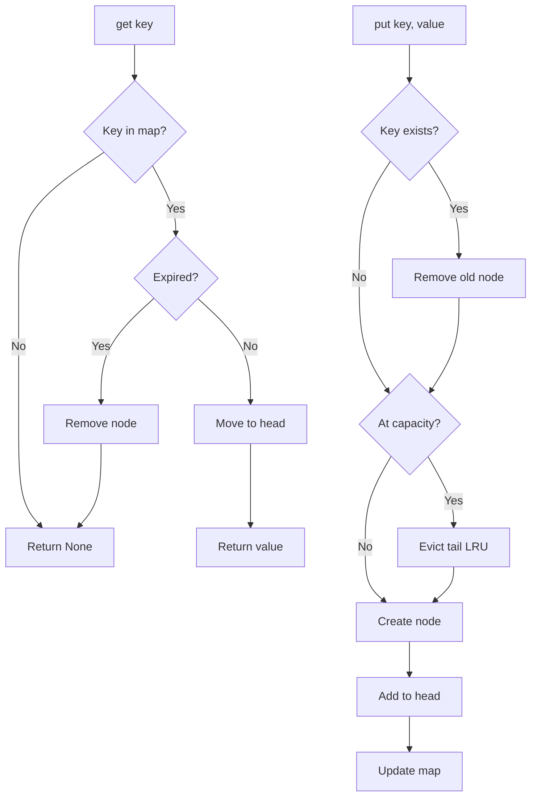

# LLD 12: In-Memory Cache (LRU)

> **Difficulty**: Medium
> **Key Concepts**: LRU eviction, doubly linked list, hash map, TTL

---

## 1. Requirements

- GET / PUT / DELETE key-value pairs
- LRU eviction when capacity is reached
- Optional TTL (time-to-live) per entry
- O(1) time for all operations
- Thread-safe operations

---

## 2. Class Diagram



---

## 3. Core Implementation

```java
public class Node<V> {
    final String key;
    V value;
    Node<V> prev, next;
    final LocalDateTime expiresAt;

    public Node(String key, V value, Long ttlSeconds) {
        this.key = key; this.value = value;
        this.expiresAt = (ttlSeconds != null)
            ? LocalDateTime.now().plusSeconds(ttlSeconds) : null;
    }
    public Node(String key, V value) { this(key, value, null); }
    public boolean isExpired() {
        return expiresAt != null && LocalDateTime.now().isAfter(expiresAt);
    }
}

public class DoublyLinkedList<V> {
    private final Node<V> head = new Node<>("", null);
    private final Node<V> tail = new Node<>("", null);
    private int size = 0;

    public DoublyLinkedList() { head.next = tail; tail.prev = head; }

    public void addToHead(Node<V> node) {
        node.prev = head; node.next = head.next;
        head.next.prev = node; head.next = node;
        size++;
    }

    public void removeNode(Node<V> node) {
        node.prev.next = node.next; node.next.prev = node.prev;
        node.prev = null; node.next = null;
        size--;
    }

    public Node<V> removeTail() {
        if (size == 0) return null;
        Node<V> tailNode = tail.prev;
        removeNode(tailNode);
        return tailNode;
    }

    public int size() { return size; }
}

public class LRUCache<V> {
    private final int capacity;
    private final Map<String, Node<V>> map = new HashMap<>();
    private final DoublyLinkedList<V> dll = new DoublyLinkedList<>();
    private final Object lock = new Object();

    public LRUCache(int capacity) {
        if (capacity <= 0) throw new IllegalArgumentException("Capacity must be positive");
        this.capacity = capacity;
    }

    public V get(String key) {
        synchronized (lock) {
            Node<V> node = map.get(key);
            if (node == null) return null;
            if (node.isExpired()) { remove(node); return null; }
            dll.removeNode(node);
            dll.addToHead(node);
            return node.value;
        }
    }

    public void put(String key, V value, Long ttlSeconds) {
        synchronized (lock) {
            if (map.containsKey(key)) {
                dll.removeNode(map.remove(key));
            }
            if (dll.size() >= capacity) evict();
            Node<V> newNode = new Node<>(key, value, ttlSeconds);
            dll.addToHead(newNode);
            map.put(key, newNode);
        }
    }
    public void put(String key, V value) { put(key, value, null); }

    public boolean delete(String key) {
        synchronized (lock) {
            Node<V> node = map.get(key);
            if (node == null) return false;
            remove(node); return true;
        }
    }

    private void evict() {
        Node<V> tail = dll.removeTail();
        if (tail != null) map.remove(tail.key);
    }

    private void remove(Node<V> node) {
        dll.removeNode(node); map.remove(node.key);
    }

    public int size() { return dll.size(); }
}
```

---

## 4. Operation Flow



---

## 5. Complexity Analysis

| Operation | Time | Space |
|-----------|------|-------|
| `get(key)` | O(1) | — |
| `put(key, value)` | O(1) | O(1) per entry |
| `delete(key)` | O(1) | — |
| Eviction | O(1) | — |

**Data structures**: HashMap (O(1) lookup) + Doubly Linked List (O(1) insert/remove).

---

## 6. Design Patterns Used

| Pattern | Where | Why |
|---------|-------|-----|
| **Composite DS** | HashMap + DLL | O(1) for both lookup and ordering |
| **Sentinel nodes** | head/tail in DLL | Simplify edge cases (empty list) |
| **Thread-safe** | Lock per operation | Safe concurrent access |

---

## 7. Edge Cases

- **TTL expired on access**: Lazy deletion — check on `get()`, remove if expired
- **Same key re-inserted**: Update value and reset to head
- **Capacity = 1**: Evict on every new insert
- **Concurrent get+put**: Lock ensures consistency
- **Cache warming**: Pre-load frequently accessed keys at startup

> **Next**: [13 — Rate Limiter](13-rate-limiter.md)
