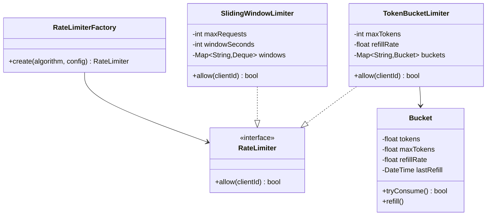
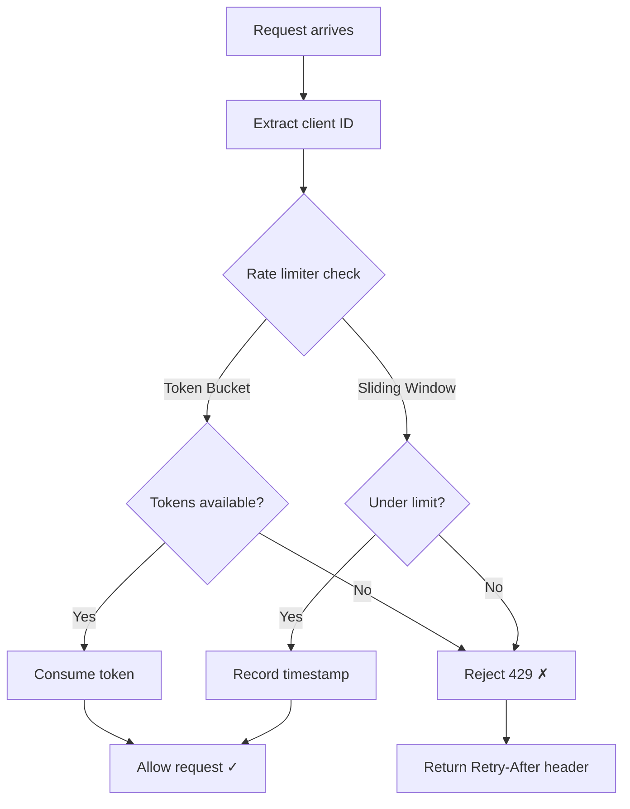

# LLD 13: Rate Limiter

> **Difficulty**: Medium
> **Key Concepts**: Token bucket, sliding window, decorator pattern

---

## 1. Requirements

- Limit requests per client (by IP, API key, or user ID)
- Configurable rate (e.g., 100 requests/minute)
- Multiple algorithm support (token bucket, sliding window)
- Thread-safe operations
- Return appropriate response when rate limited (429 Too Many Requests)

---

## 2. Class Diagram



---

## 3. Token Bucket Implementation

```java
public class Bucket {
    private final int maxTokens;
    private double tokens;
    private final double refillRate; // tokens per second
    private long lastRefillNanos;
    private final Object lock = new Object();

    public Bucket(int maxTokens, double refillRate) {
        this.maxTokens = maxTokens;
        this.tokens = maxTokens;
        this.refillRate = refillRate;
        this.lastRefillNanos = System.nanoTime();
    }

    public boolean tryConsume() {
        synchronized (lock) {
            refill();
            if (tokens >= 1) { tokens -= 1; return true; }
            return false;
        }
    }

    private void refill() {
        long now = System.nanoTime();
        double elapsed = (now - lastRefillNanos) / 1_000_000_000.0;
        tokens = Math.min(maxTokens, tokens + elapsed * refillRate);
        lastRefillNanos = now;
    }
}

public class TokenBucketLimiter implements RateLimiter {
    private final int maxTokens;
    private final double refillRate;
    private final Map<String, Bucket> buckets = new HashMap<>();
    private final Object lock = new Object();

    public TokenBucketLimiter(int maxTokens, double refillRate) {
        this.maxTokens = maxTokens; this.refillRate = refillRate;
    }
    public TokenBucketLimiter() { this(10, 1.0); }

    @Override
    public boolean allow(String clientId) {
        return getBucket(clientId).tryConsume();
    }

    private Bucket getBucket(String clientId) {
        synchronized (lock) {
            return buckets.computeIfAbsent(clientId, k -> new Bucket(maxTokens, refillRate));
        }
    }
}

public interface RateLimiter {
    boolean allow(String clientId);
}
```

---

## 4. Sliding Window Implementation

```java
public class SlidingWindowLimiter implements RateLimiter {
    private final int maxRequests;
    private final long windowNanos;
    private final Map<String, Deque<Long>> windows = new HashMap<>();
    private final Object lock = new Object();

    public SlidingWindowLimiter(int maxRequests, int windowSeconds) {
        this.maxRequests = maxRequests;
        this.windowNanos = windowSeconds * 1_000_000_000L;
    }
    public SlidingWindowLimiter() { this(100, 60); }

    @Override
    public boolean allow(String clientId) {
        long now = System.nanoTime();
        synchronized (lock) {
            Deque<Long> window = windows.computeIfAbsent(clientId, k -> new ArrayDeque<>());
            long cutoff = now - windowNanos;

            while (!window.isEmpty() && window.peekFirst() <= cutoff)
                window.pollFirst();

            if (window.size() < maxRequests) {
                window.addLast(now);
                return true;
            }
            return false;
        }
    }
}
```

---

## 5. Rate Limiter Flow



---

## 6. Design Patterns Used

| Pattern | Where | Why |
|---------|-------|-----|
| **Strategy** | RateLimiter interface | Swap algorithms (token bucket, sliding window) |
| **Factory** | RateLimiterFactory | Create limiter by algorithm name |
| **Decorator** | Middleware wrapper | Apply rate limiting without modifying endpoints |

---

## 7. Algorithm Comparison

| Algorithm | Pros | Cons |
|-----------|------|------|
| **Token Bucket** | Allows bursts, smooth refill | Memory per bucket |
| **Sliding Window Log** | Precise, no boundary issue | Memory for timestamps |
| **Sliding Window Counter** | Low memory | Approximate at boundaries |
| **Fixed Window** | Simple | Burst at window boundaries |

---

## 8. Edge Cases

- **Client cleanup**: Periodically remove inactive client buckets
- **Distributed**: Use Redis for shared state across servers
- **Burst handling**: Token bucket naturally allows controlled bursts
- **Clock skew**: Use monotonic clock, not wall clock
- **Graceful degradation**: If Redis is down, allow requests (fail open)

> **Next**: [14 — Logger Framework](14-logger-framework.md)
