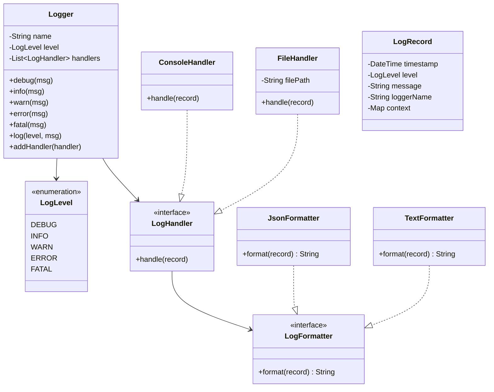
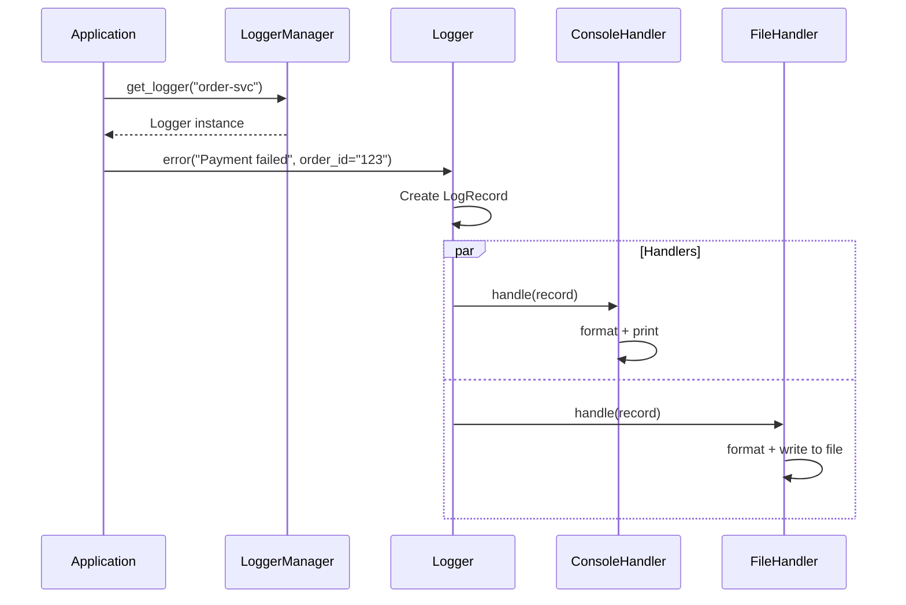

# LLD 14: Logger Framework

> **Difficulty**: Easy
> **Key Concepts**: Singleton, Chain of Responsibility, Strategy pattern

---

## 1. Requirements

- Log messages at different levels (DEBUG, INFO, WARN, ERROR, FATAL)
- Multiple output destinations (console, file, remote server)
- Configurable log level threshold (e.g., only log WARN and above)
- Structured log format (timestamp, level, message, context)
- Thread-safe logging
- Support multiple loggers with different configurations

---

## 2. Class Diagram



---

## 3. Core Implementation

```java
public enum LogLevel {
    DEBUG(10), INFO(20), WARN(30), ERROR(40), FATAL(50);
    private final int value;
    LogLevel(int value) { this.value = value; }
    public int getValue() { return value; }
}

public class LogRecord {
    private final LocalDateTime timestamp;
    private final LogLevel level;
    private final String message;
    private final String loggerName;
    private final Map<String, String> context;

    public LogRecord(LogLevel level, String message, String loggerName, Map<String, String> context) {
        this.timestamp = LocalDateTime.now();
        this.level = level; this.message = message;
        this.loggerName = loggerName;
        this.context = (context != null) ? context : Map.of();
    }
    public LocalDateTime getTimestamp() { return timestamp; }
    public LogLevel getLevel() { return level; }
    public String getMessage() { return message; }
    public String getLoggerName() { return loggerName; }
    public Map<String, String> getContext() { return context; }
}

public interface LogFormatter {
    String format(LogRecord record);
}

public class TextFormatter implements LogFormatter {
    @Override
    public String format(LogRecord record) {
        String ts = record.getTimestamp().format(
            java.time.format.DateTimeFormatter.ofPattern("yyyy-MM-dd HH:mm:ss.SSS"));
        String ctx = record.getContext().isEmpty() ? "" : " | " + record.getContext();
        return "[" + ts + "] [" + record.getLevel() + "] [" + record.getLoggerName()
            + "] " + record.getMessage() + ctx;
    }
}

public class JsonFormatter implements LogFormatter {
    @Override
    public String format(LogRecord record) {
        Map<String, Object> data = new LinkedHashMap<>();
        data.put("timestamp", record.getTimestamp().toString());
        data.put("level", record.getLevel().name());
        data.put("logger", record.getLoggerName());
        data.put("message", record.getMessage());
        data.putAll(record.getContext());
        // Simple JSON serialization
        StringBuilder sb = new StringBuilder("{");
        int i = 0;
        for (Map.Entry<String, Object> e : data.entrySet()) {
            if (i++ > 0) sb.append(",");
            sb.append("\"").append(e.getKey()).append("\":\"").append(e.getValue()).append("\"");
        }
        return sb.append("}").toString();
    }
}

public abstract class LogHandler {
    protected LogFormatter formatter;
    protected LogLevel level;

    public LogHandler(LogFormatter formatter, LogLevel level) {
        this.formatter = (formatter != null) ? formatter : new TextFormatter();
        this.level = level;
    }
    public LogHandler() { this(null, LogLevel.DEBUG); }

    protected abstract void emit(LogRecord record);

    public void handle(LogRecord record) {
        if (record.getLevel().getValue() >= level.getValue()) emit(record);
    }
}

public class ConsoleHandler extends LogHandler {
    public ConsoleHandler(LogFormatter f, LogLevel l) { super(f, l); }
    public ConsoleHandler() { super(); }
    @Override
    protected void emit(LogRecord record) { System.out.println(formatter.format(record)); }
}

public class FileHandler extends LogHandler {
    private final String filePath;
    private final Object lock = new Object();

    public FileHandler(String filePath, LogFormatter formatter, LogLevel level) {
        super(formatter, level); this.filePath = filePath;
    }
    public FileHandler(String filePath) { this(filePath, null, LogLevel.DEBUG); }

    @Override
    protected void emit(LogRecord record) {
        String line = formatter.format(record) + "\n";
        synchronized (lock) {
            try (var writer = new java.io.FileWriter(filePath, true)) {
                writer.write(line);
            } catch (java.io.IOException e) {
                System.err.println("Failed to write log: " + e.getMessage());
            }
        }
    }
}
```

---

## 4. Logger & Manager

```java
public class Logger {
    private final String name;
    private final LogLevel level;
    private final List<LogHandler> handlers = new ArrayList<>();
    private final Object lock = new Object();

    public Logger(String name, LogLevel level) { this.name = name; this.level = level; }
    public Logger(String name) { this(name, LogLevel.DEBUG); }

    public void addHandler(LogHandler handler) { handlers.add(handler); }

    public void log(LogLevel level, String message, Map<String, String> context) {
        if (level.getValue() < this.level.getValue()) return;
        LogRecord record = new LogRecord(level, message, name, context);
        synchronized (lock) {
            for (LogHandler handler : handlers) {
                try { handler.handle(record); }
                catch (Exception e) { System.err.println("Handler error: " + e.getMessage()); }
            }
        }
    }

    public void debug(String msg) { log(LogLevel.DEBUG, msg, null); }
    public void info(String msg)  { log(LogLevel.INFO, msg, null); }
    public void warn(String msg)  { log(LogLevel.WARN, msg, null); }
    public void error(String msg) { log(LogLevel.ERROR, msg, null); }
    public void fatal(String msg) { log(LogLevel.FATAL, msg, null); }

    public void error(String msg, Map<String, String> ctx) { log(LogLevel.ERROR, msg, ctx); }
}

public class LoggerManager {
    private static final Map<String, Logger> loggers = new HashMap<>();
    private static final Object lock = new Object();

    private LoggerManager() {}

    public static Logger getLogger(String name, LogLevel level) {
        synchronized (lock) {
            return loggers.computeIfAbsent(name, k -> new Logger(k, level));
        }
    }
    public static Logger getLogger(String name) { return getLogger(name, LogLevel.DEBUG); }
}
```

---

## 5. Usage Flow



---

## 6. Design Patterns Used

| Pattern | Where | Why |
|---------|-------|-----|
| **Singleton** | LoggerManager | One registry for all loggers |
| **Chain of Responsibility** | Handler level filtering | Each handler decides if it handles the record |
| **Strategy** | LogFormatter | Swap text/JSON formatting |
| **Observer** | Logger → Handlers | Multiple outputs per logger |

---

## 7. Edge Cases

- **File rotation**: Extend FileHandler to rotate at size/time limits
- **Async logging**: Queue records, separate writer thread (for high throughput)
- **Buffered writes**: Batch file writes to reduce I/O
- **Sensitive data**: Mask PII in log records before formatting
- **Log aggregation**: Add RemoteHandler for shipping to ELK/Splunk

> **Next**: [15 — Notification Service](15-notification-service.md)
