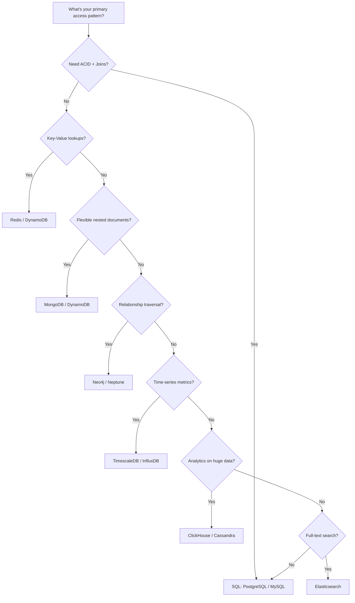
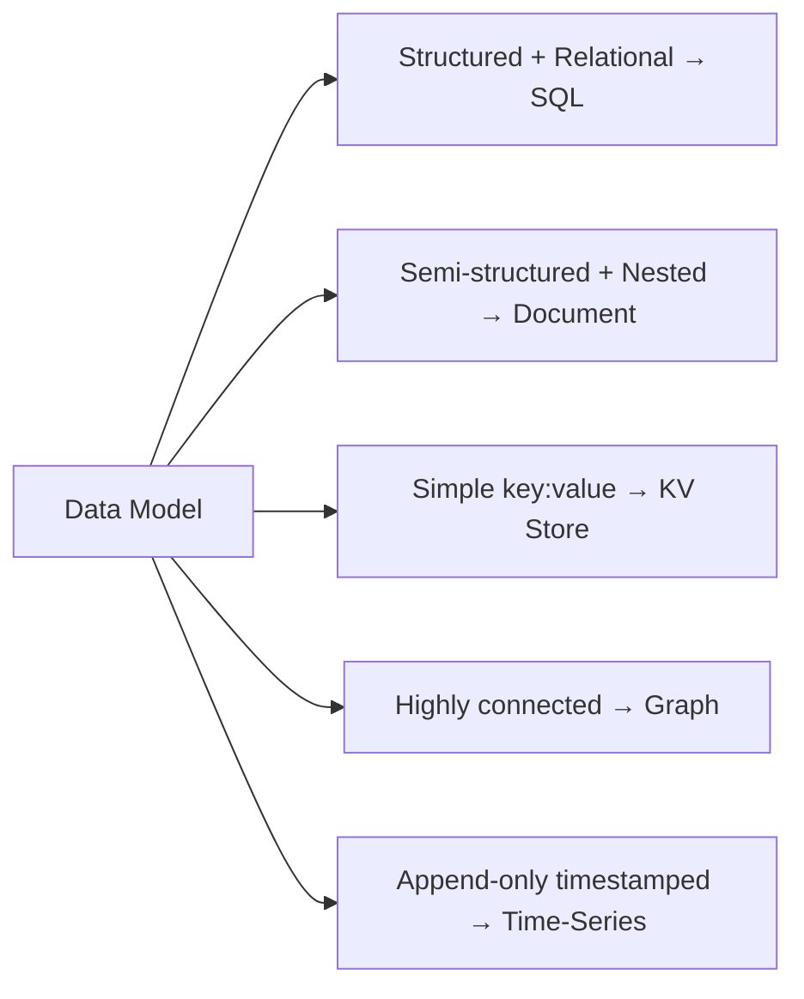
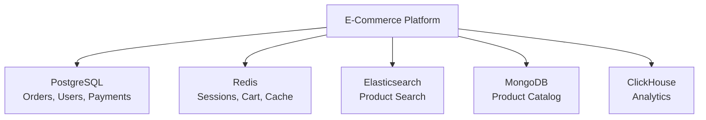

# Comparison 01: How to Choose a Database

> The single most important decision in system design interviews.

---

## 1. Decision Framework

---

## 2. Database Types at a Glance

| Type | Best For | Examples | Scale Model |
|------|----------|----------|-------------|
| **Relational (SQL)** | Transactions, joins, structured data | PostgreSQL, MySQL | Vertical + read replicas |
| **Document** | Flexible schema, nested objects | MongoDB, DynamoDB | Horizontal (sharding) |
| **Key-Value** | Cache, sessions, simple lookups | Redis, Memcached | In-memory, cluster |
| **Wide-Column** | High write throughput, time-series | Cassandra, HBase | Horizontal (peer-to-peer) |
| **Graph** | Relationships, recommendations | Neo4j, Neptune | Limited horizontal |
| **Time-Series** | Metrics, IoT, monitoring | InfluxDB, TimescaleDB | Retention + downsampling |
| **Search** | Full-text search, logs | Elasticsearch | Horizontal (shards) |

---

## 3. Decision Criteria

### Data Model

### Consistency vs Availability

| Requirement | Choose |
|-------------|--------|
| Strong consistency (banking, inventory) | PostgreSQL, MySQL |
| Eventual consistency OK (social, analytics) | Cassandra, DynamoDB |
| Tunable consistency | DynamoDB, Cassandra |

### Scale Requirements

| Scale Need | Choose |
|------------|--------|
| Moderate (< 1 TB, < 10K QPS) | PostgreSQL (simplest) |
| High reads | PostgreSQL + Redis cache + read replicas |
| High writes | Cassandra, DynamoDB, sharded PostgreSQL |
| Massive (PB+) | Cassandra, BigTable, DynamoDB |

### Query Patterns

| Pattern | Choose |
|---------|--------|
| Complex joins, aggregations | SQL |
| Single-key lookups | KV store or DynamoDB |
| Range scans by partition key | Cassandra, DynamoDB |
| Full-text search | Elasticsearch |
| Geospatial queries | PostgreSQL (PostGIS), MongoDB, Redis GEO |

---

## 4. Real-World Examples

| System | Primary DB | Why |
|--------|-----------|-----|
| **E-commerce orders** | PostgreSQL | ACID for payments, complex joins |
| **User sessions** | Redis | Fast KV lookup, TTL auto-expire |
| **Product catalog** | MongoDB | Flexible attributes per category |
| **Social graph** | Neo4j | Friend-of-friend queries |
| **Metrics/monitoring** | TimescaleDB | Time-range queries, downsampling |
| **Chat messages** | Cassandra | High write throughput, partition by chat |
| **Search** | Elasticsearch | Full-text with relevance scoring |
| **URL shortener** | DynamoDB | Simple KV, massive scale |

---

## 5. Polyglot Persistence

Most real systems use multiple databases:

---

## 6. Interview Tips

- **Always justify** your DB choice with access pattern, not just "it scales"
- **Start with PostgreSQL** unless you have a specific reason not to (it's the safe default)
- **Name the trade-off**: "I chose Cassandra for write throughput, accepting eventual consistency"
- **Mention caching**: Almost every system benefits from Redis in front of the primary DB
- **Don't over-engineer**: A single PostgreSQL instance handles more than most people think

> **Next**: [02 — How to Choose a Cache](02-how-to-choose-cache.md)
