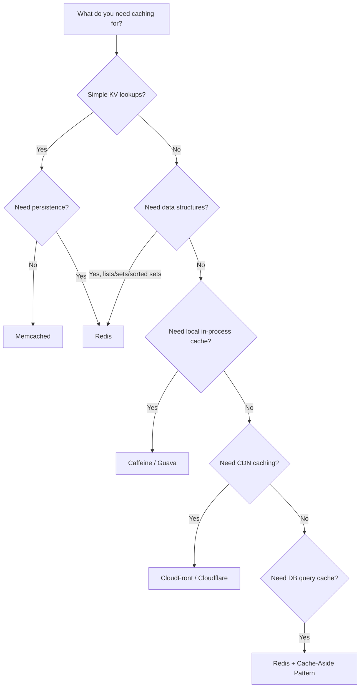
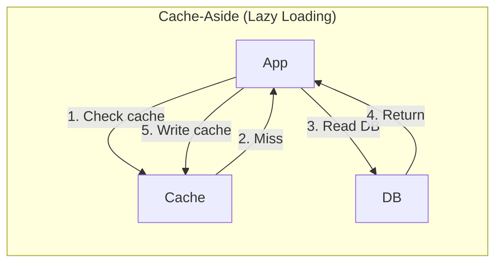
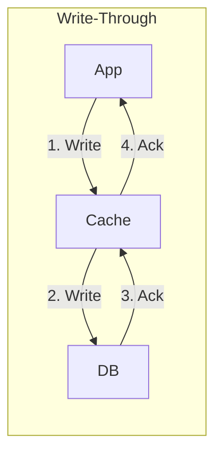
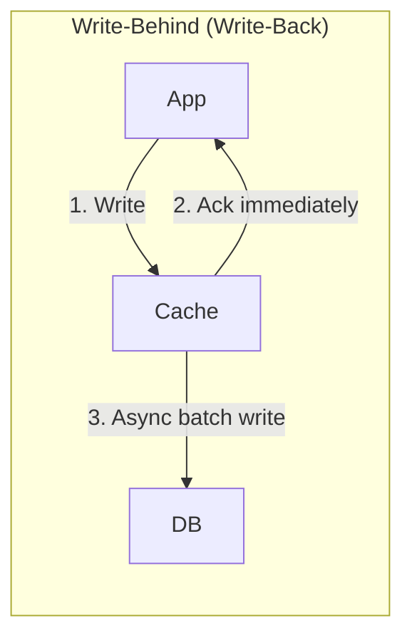
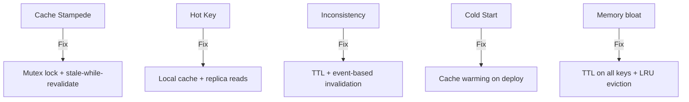

# Comparison 02: How to Choose a Cache

> Caching is the most impactful performance optimization in any system.

---

## 1. Decision Framework

---

## 2. Cache Types Comparison

| Type | Example | Latency | Use Case |
|------|---------|---------|----------|
| **In-process** | Caffeine, Guava | ~1μs | Hot config, small datasets |
| **Distributed** | Redis, Memcached | ~1ms | Sessions, API responses |
| **CDN** | CloudFront, Cloudflare | ~10ms | Static assets, images |
| **DB query cache** | Redis cache-aside | ~1ms | Expensive query results |
| **Browser cache** | HTTP headers | 0ms | Static files, API responses |

---

## 3. Redis vs Memcached

| Feature | Redis | Memcached |
|---------|-------|-----------|
| **Data structures** | Strings, hashes, lists, sets, sorted sets, streams | Strings only |
| **Persistence** | RDB snapshots + AOF | None |
| **Replication** | Primary-replica | None (client-side sharding) |
| **Cluster mode** | Built-in (Redis Cluster) | Client-side consistent hashing |
| **Pub/Sub** | Yes | No |
| **Lua scripting** | Yes | No |
| **Multi-threaded** | Single-threaded (I/O threads in 6.0+) | Multi-threaded |
| **Max value size** | 512 MB | 1 MB |

### When to use Memcached over Redis

- Pure string caching with maximum simplicity
- Multi-threaded performance for simple GET/SET
- No need for persistence or data structures

### When to use Redis (most cases)

- Need data structures (sorted sets for leaderboards, lists for queues)
- Need persistence (session store, rate limiting counters)
- Need pub/sub or Lua scripting
- Need built-in clustering and replication

---

## 4. Caching Patterns

| Pattern | Pros | Cons | Best For |
|---------|------|------|----------|
| **Cache-Aside** | Simple, only caches what's needed | First request always misses | General purpose (default) |
| **Write-Through** | Cache always consistent | Higher write latency | Read-heavy, consistency needed |
| **Write-Behind** | Fast writes, batch DB updates | Data loss risk if cache dies | Write-heavy workloads |
| **Read-Through** | App doesn't manage cache logic | Cache needs DB access | Simplify app code |

---

## 5. Cache Invalidation Strategies

| Strategy | How | When |
|----------|-----|------|
| **TTL** | Key expires after N seconds | Most common, good enough for most cases |
| **Event-based** | Invalidate on DB write (Kafka event) | When consistency matters |
| **Version-based** | `key:v2` instead of updating `key` | When rollback needed |
| **Purge on write** | Delete cache key on every write | Simple, effective |

---

## 6. Common Pitfalls

---

## 7. Interview Tips

- **Default to Redis** unless you have a specific reason for Memcached
- **Cache-aside** is the safest pattern to propose in interviews
- **Always mention TTL** — unbounded caches cause memory issues
- **Name the invalidation strategy** — "I'll use TTL of 5 minutes with event-based purge on write"
- **Acknowledge the trade-off**: "Caching improves latency but introduces consistency lag"

> **Next**: [03 — Kafka vs RabbitMQ](03-kafka-vs-rabbitmq.md)
