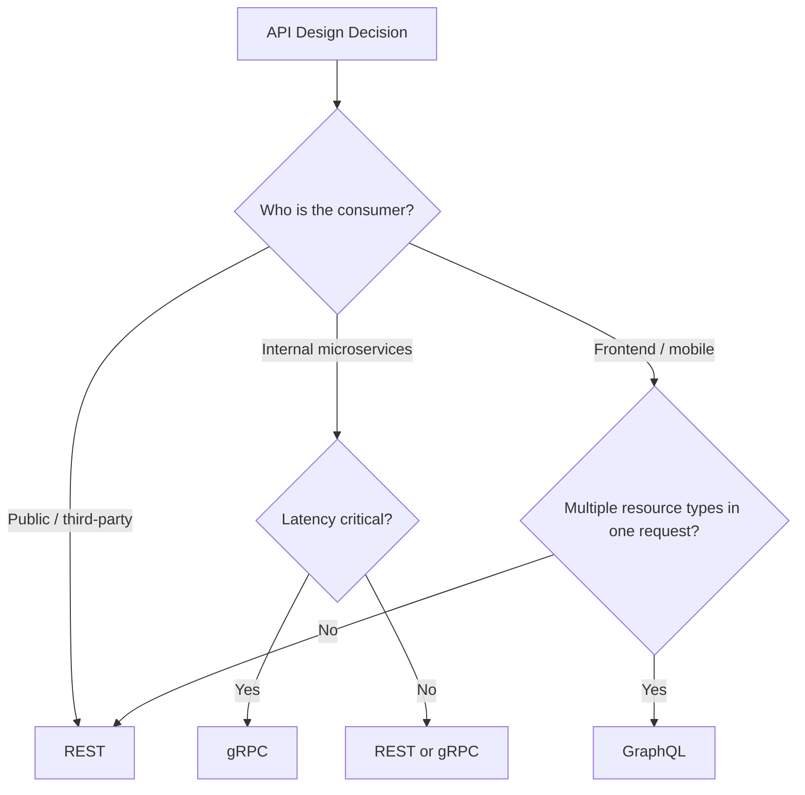
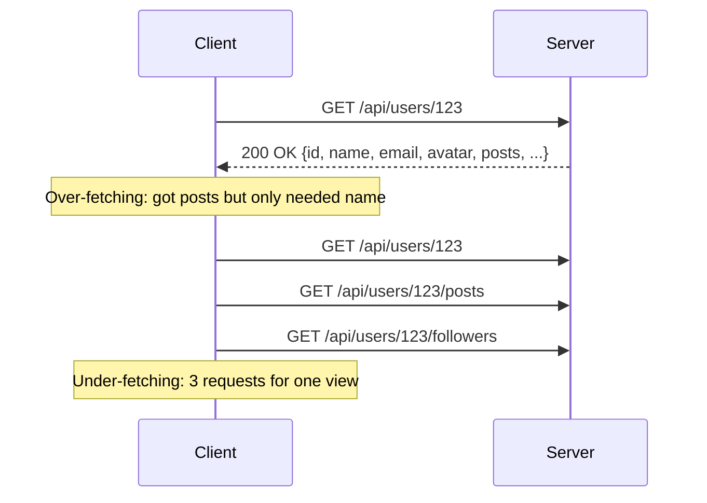
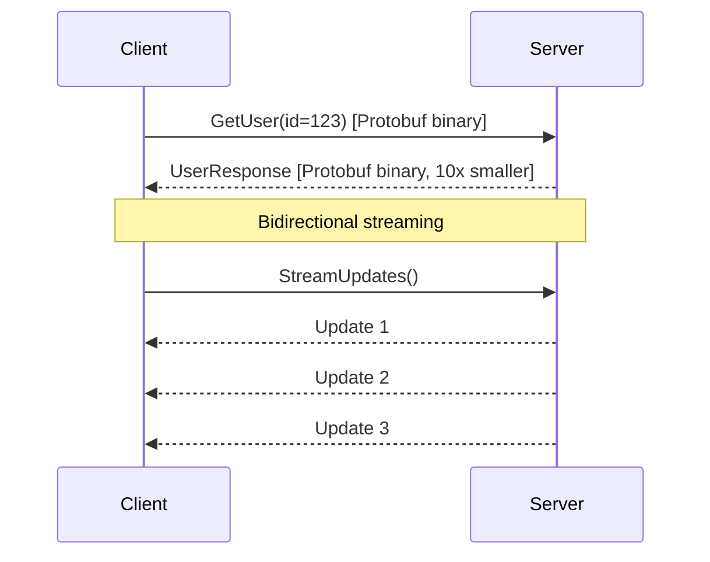
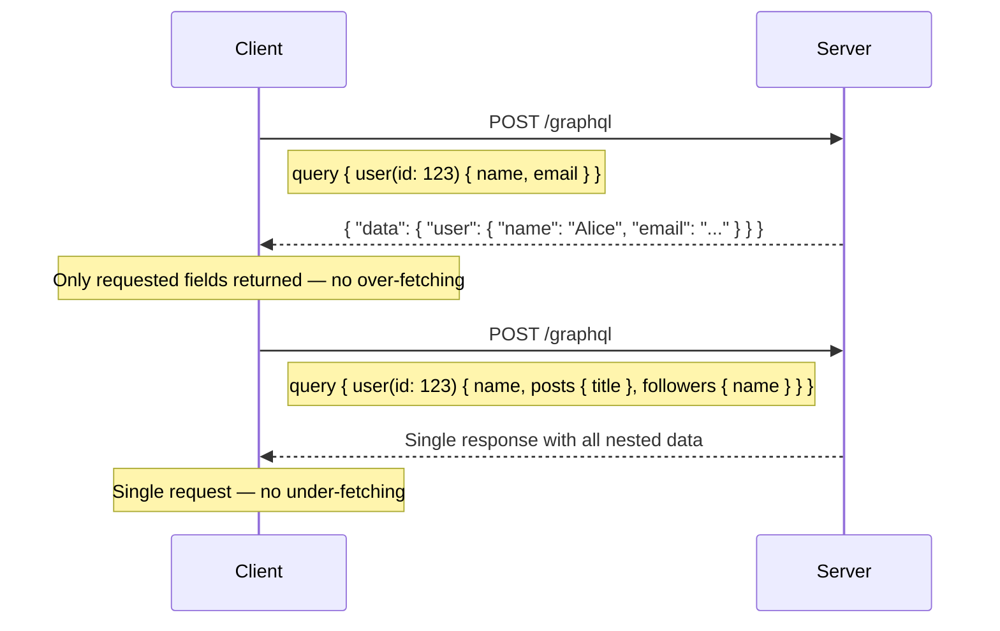
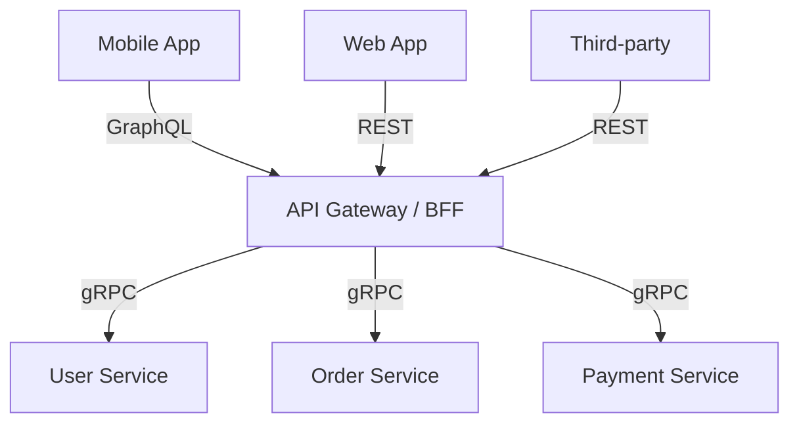

# Comparison 07: REST vs gRPC vs GraphQL

> Choosing the right API protocol for your system.

---

## 1. Decision Framework

---

## 2. Core Comparison

| Dimension | REST | gRPC | GraphQL |
|-----------|------|------|---------|
| **Protocol** | HTTP/1.1 (JSON) | HTTP/2 (Protobuf) | HTTP/1.1 or 2 (JSON) |
| **Data format** | JSON (text) | Protobuf (binary) | JSON (text) |
| **Contract** | OpenAPI / Swagger | .proto files (strict) | Schema + types |
| **Streaming** | Limited (SSE, chunked) | Bidirectional streaming | Subscriptions (WebSocket) |
| **Performance** | Moderate | Fast (10x smaller payload) | Moderate |
| **Caching** | Native HTTP caching | No HTTP caching | Complex (query-based) |
| **Code generation** | Optional (OpenAPI codegen) | Built-in (protoc) | Built-in (codegen) |
| **Browser support** | Native | Needs grpc-web proxy | Native |
| **Learning curve** | Low | Medium | Medium-High |
| **Over/under-fetching** | Common problem | N/A (defined messages) | Solved (client picks fields) |

---

## 3. REST

**When to use REST**:
- Public APIs (most developers know REST)
- CRUD operations on resources
- When HTTP caching is important
- Simple request/response patterns

**Strengths**: Universal, simple, cacheable, well-tooled
**Weaknesses**: Over/under-fetching, no streaming, versioning challenges

---

## 4. gRPC

**When to use gRPC**:
- Internal service-to-service communication
- Low latency / high throughput requirements
- Bidirectional streaming (real-time data)
- Polyglot environments (auto-generated clients)

**Strengths**: Fast, strongly typed, streaming, code generation
**Weaknesses**: No browser support (needs proxy), not human-readable, no HTTP caching

---

## 5. GraphQL

**When to use GraphQL**:
- Frontend-driven development (mobile apps with varying needs)
- Multiple client types needing different data shapes
- Aggregating data from multiple backend services
- Rapid iteration on UI without backend changes

**Strengths**: No over/under-fetching, single endpoint, self-documenting schema
**Weaknesses**: Complex caching, N+1 query problem, security (query depth attacks)

---

## 6. Head-to-Head Scenarios

| Scenario | Best Choice | Why |
|----------|-------------|-----|
| **Public API** | REST | Universal, well-understood, cacheable |
| **Microservice ↔ microservice** | gRPC | Low latency, strict contracts, streaming |
| **Mobile app with limited bandwidth** | GraphQL | Fetch exactly what's needed |
| **Real-time data streaming** | gRPC | Bidirectional HTTP/2 streaming |
| **API gateway aggregation** | GraphQL | Stitch multiple services into one query |
| **File upload** | REST | Multipart form, well-supported |
| **IoT / embedded** | gRPC | Small binary payloads, efficient |
| **Dashboard with many widgets** | GraphQL | Each widget queries different fields |

---

## 7. Can They Coexist?

**Common pattern**: REST or GraphQL externally, gRPC internally.

---

## 8. Interview Tips

- **Default**: "REST for public APIs, gRPC for internal services"
- **GraphQL**: Propose when the interviewer mentions mobile or varying frontend needs
- **Name the trade-off**: "gRPC is faster but doesn't work in browsers natively"
- **Don't overcomplicate**: REST is sufficient for most interview problems
- **Mention Protobuf**: "gRPC uses Protocol Buffers — 10x smaller than JSON, with strict typing"

---

> This completes the Comparisons section. Return to [Comparisons README](README.md) for the full list.
