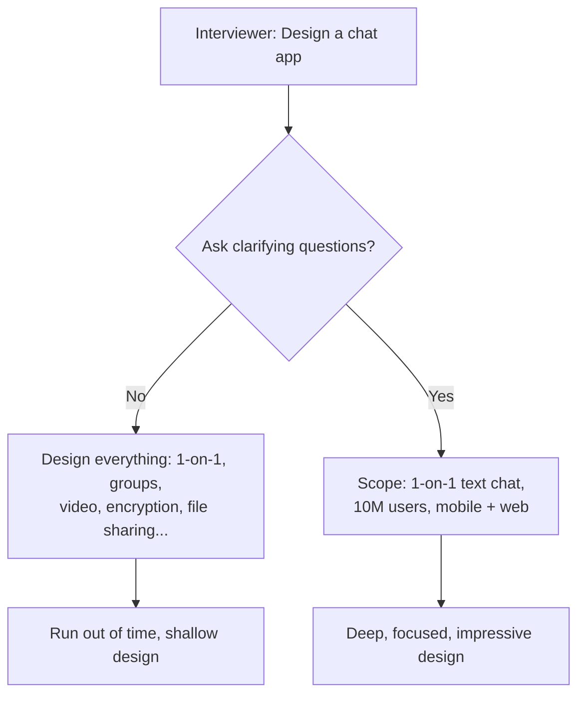
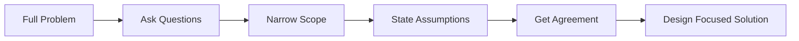

# Interview Prep 02: Clarifying Questions

> The first 5 minutes of your interview determine its trajectory. Great engineers ask great questions.

---

## 1. Why Clarifying Questions Matter



---

## 2. Question Categories

### Users & Scale

- How many users? (DAU / MAU)
- What's the read-to-write ratio?
- Any geographic distribution? (single region vs global)
- Peak traffic patterns? (time of day, events)

### Functional Scope

- What are the core features? (MVP vs full product)
- What can I leave out? (explicitly ask)
- Any specific user flows to prioritize?
- Mobile, web, or both?

### Non-Functional Requirements

- What's the availability target? (99.9% vs 99.99%)
- Latency requirements? (< 200ms, < 1s)
- Consistency model? (strong vs eventual — acceptable?)
- Data retention? (how long to keep data)

### Existing Constraints

- Any existing infrastructure to integrate with?
- Budget or technology constraints?
- Compliance requirements? (GDPR, PCI-DSS, HIPAA)

---

## 3. Question Templates by System Type

### URL Shortener

| Question | Why It Matters |
|----------|---------------|
| What's the expected URL creation rate? | Determines ID generation strategy |
| Should shortened URLs expire? | TTL vs permanent storage |
| Do we need analytics (click tracking)? | Adds complexity, affects DB choice |
| Custom aliases allowed? | Collision handling changes |

### Chat Application

| Question | Why It Matters |
|----------|---------------|
| 1-on-1 only or group chat too? | Fan-out strategy changes |
| Max group size? | Affects message delivery architecture |
| Message persistence? How long? | Storage estimation |
| End-to-end encryption needed? | Key management complexity |
| Read receipts, typing indicators? | Real-time push requirements |

### Social Media Feed

| Question | Why It Matters |
|----------|---------------|
| Chronological or ranked feed? | Algorithm vs simple sort |
| Average followers per user? | Fan-out strategy |
| Celebrity users (millions of followers)? | Hybrid fan-out needed |
| Media types: text only or images/videos? | CDN and processing pipeline |

### E-Commerce

| Question | Why It Matters |
|----------|---------------|
| Number of products in catalog? | Search and indexing strategy |
| Flash sales / high concurrency events? | Inventory locking approach |
| Payment providers? | Integration complexity |
| International (multi-currency, multi-language)? | Data model complexity |

---

## 4. The Art of Scoping



**Good scoping statements**:
- "I'll focus on the core read/write path and skip the admin dashboard for now"
- "I'll assume single region initially and discuss multi-region at the end"
- "Let me handle the happy path first, then address failure scenarios"
- "I'll design for 10M DAU — we can discuss scaling beyond that"

---

## 5. Anti-Patterns

| Don't Do This | Do This Instead |
|---------------|-----------------|
| Ask 15+ questions (stalling) | Ask 4-6 targeted questions |
| Ask obvious questions ("What is a URL shortener?") | Ask clarifying scope questions |
| Wait for interviewer to tell you scope | Propose scope and get agreement |
| Assume everything | State assumptions and validate |
| Skip this phase entirely | Always spend 3-5 minutes here |

---

## 6. Practice Template

For any system design problem, always ask:

```
1. USERS:   "How many users? What's the scale?"
2. SCOPE:   "What are the must-have features for this discussion?"
3. SCALE:   "Read-heavy or write-heavy? What's the ratio?"
4. NONFUNC: "Latency and availability targets?"
5. SPECIAL: [One domain-specific question]
```

> **Next**: [03 — Requirement Gathering](03-requirement-gathering.md)
