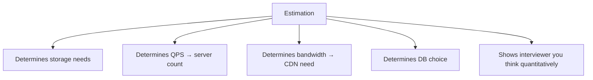
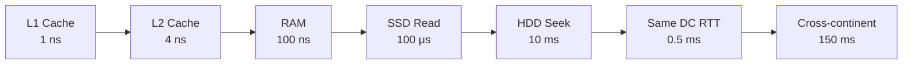
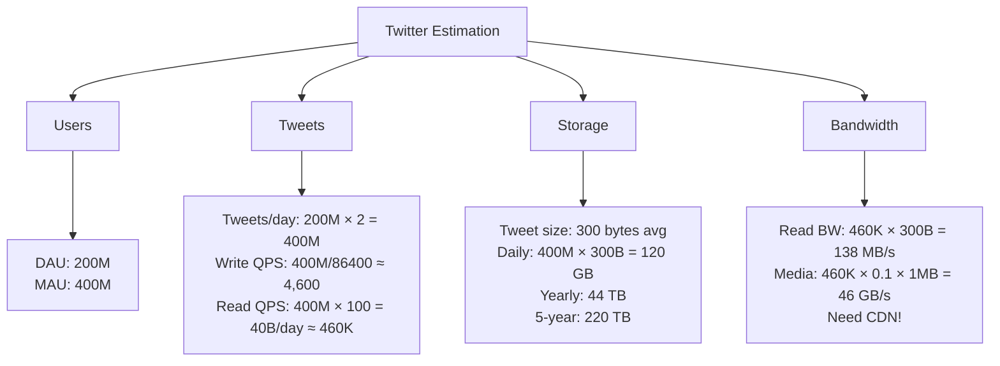

# Interview Prep 04: Envelope Calculations

> Back-of-the-envelope estimation turns vague requirements into concrete design constraints.

---

## 1. Why Estimation Matters



---

## 2. Key Numbers to Memorize

### Powers of 2

| Power | Value | Approx |
|-------|-------|--------|
| 2^10 | 1,024 | ~1 Thousand (KB) |
| 2^20 | 1,048,576 | ~1 Million (MB) |
| 2^30 | ~1 Billion | ~1 GB |
| 2^40 | ~1 Trillion | ~1 TB |

### Time Conversions

| Period | Seconds |
|--------|---------|
| 1 minute | 60 |
| 1 hour | 3,600 |
| 1 day | 86,400 (~10^5) |
| 1 month | 2.6M (~2.5 × 10^6) |
| 1 year | 31.5M (~3 × 10^7) |

### Latency Numbers



| Operation | Latency |
|-----------|---------|
| L1 cache reference | 1 ns |
| RAM reference | 100 ns |
| SSD random read | 100 μs |
| Network round trip (same DC) | 500 μs |
| HDD seek | 10 ms |
| Cross-continent round trip | 150 ms |

---

## 3. Estimation Templates

### QPS (Queries Per Second)

```
DAU = 10M
Queries per user per day = 10
Total queries/day = 100M
QPS = 100M / 86,400 ≈ 1,200
Peak QPS = QPS × 2~3 ≈ 3,000
```

### Storage

```
New records/day = 1M
Record size = 1 KB
Daily storage = 1 GB
Yearly storage = 365 GB
5-year storage = 1.8 TB
With replication (3x) = 5.4 TB
```

### Bandwidth

```
QPS = 1,200
Response size = 10 KB
Bandwidth = 1,200 × 10 KB = 12 MB/s
Peak bandwidth = 36 MB/s
```

### Server Count

```
QPS = 3,000 (peak)
Single server handles = 500 QPS (typical web server)
Servers needed = 3,000 / 500 = 6
With redundancy (2x) = 12 servers
```

---

## 4. Worked Example: Twitter



---

## 5. Common System Estimations

| System | Write QPS | Read QPS | Storage/day | Key Insight |
|--------|-----------|----------|-------------|-------------|
| **URL Shortener** | 1K | 100K | 100 MB | Read-heavy (100:1) |
| **Twitter** | 5K | 500K | 120 GB | Fan-out on read vs write |
| **Instagram** | 1K | 100K | 50 TB (images) | Media-heavy, need CDN |
| **Chat (WhatsApp)** | 50K | 50K | 5 GB (text) | Write-heavy, low latency |
| **YouTube** | 100 (uploads) | 1M (views) | 500 TB (video) | Extreme read-heavy + CDN |

---

## 6. Estimation Cheat Sheet

```
Quick QPS formula:
  QPS = (DAU × actions_per_user) / 86,400
  Peak = QPS × 3

Quick storage formula:
  Daily = records_per_day × record_size
  Yearly = Daily × 365
  5-year = Yearly × 5 × replication_factor

Quick bandwidth formula:
  BW = QPS × response_size

Server count:
  Servers = Peak_QPS / QPS_per_server × 2 (redundancy)
```

---

## 7. Interview Tips

- **Round aggressively**: 86,400 ≈ 100,000. Exact numbers don't matter.
- **State assumptions**: "I'll assume 10M DAU with 5 reads per user"
- **Show the formula**: Write it out, don't just give the answer
- **Don't over-invest**: 2-3 minutes max. Get key numbers, move on.
- **Key numbers to derive**: QPS, storage, bandwidth — that's it

> **Next**: [05 — API Design](05-api-design.md)
