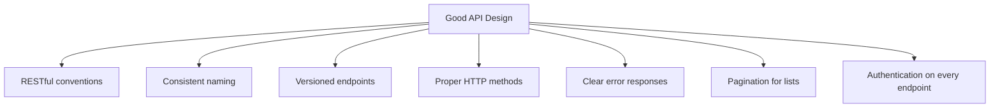
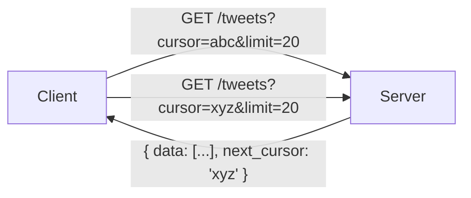

# Interview Prep 05: API Design

> Clean API design shows the interviewer you think about contracts, not just boxes and arrows.

---

## 1. API Design Principles



---

## 2. REST Conventions

### HTTP Methods

| Method | Purpose | Idempotent | Example |
|--------|---------|------------|---------|
| **GET** | Read a resource | Yes | `GET /api/v1/users/123` |
| **POST** | Create a resource | No | `POST /api/v1/users` |
| **PUT** | Replace a resource | Yes | `PUT /api/v1/users/123` |
| **PATCH** | Partial update | No | `PATCH /api/v1/users/123` |
| **DELETE** | Remove a resource | Yes | `DELETE /api/v1/users/123` |

### URL Structure

```
https://api.example.com/v1/resource_name
                         │   │
                    version   plural noun (never verbs)
```

**Good**: `GET /api/v1/tweets`, `POST /api/v1/tweets`
**Bad**: `GET /api/v1/getTweets`, `POST /api/v1/createTweet`

---

## 3. Response Design

### Success Response

```json
{
  "data": {
    "id": "abc123",
    "type": "tweet",
    "attributes": {
      "text": "Hello world",
      "created_at": "2024-01-15T10:30:00Z"
    }
  }
}
```

### Error Response

```json
{
  "error": {
    "code": "VALIDATION_ERROR",
    "message": "Tweet text cannot exceed 280 characters",
    "details": [
      {"field": "text", "issue": "max_length_exceeded", "max": 280}
    ]
  }
}
```

### HTTP Status Codes

| Code | Meaning | When to Use |
|------|---------|-------------|
| 200 | OK | Successful GET, PUT, PATCH |
| 201 | Created | Successful POST |
| 204 | No Content | Successful DELETE |
| 400 | Bad Request | Invalid input |
| 401 | Unauthorized | No/invalid auth token |
| 403 | Forbidden | Valid token but no permission |
| 404 | Not Found | Resource doesn't exist |
| 409 | Conflict | Duplicate resource |
| 429 | Too Many Requests | Rate limited |
| 500 | Internal Server Error | Server bug |

---

## 4. Pagination



### Cursor-Based (Preferred)

```json
{
  "data": [...],
  "pagination": {
    "next_cursor": "eyJpZCI6MTAwfQ==",
    "has_more": true
  }
}
```

### Offset-Based (Simpler but less efficient)

```json
{
  "data": [...],
  "pagination": {
    "offset": 20,
    "limit": 20,
    "total": 1500
  }
}
```

| Method | Pros | Cons |
|--------|------|------|
| **Cursor** | Consistent with real-time data, fast | Can't jump to page N |
| **Offset** | Simple, can jump to any page | Slow on large datasets, inconsistent with inserts |

---

## 5. API Design Template for Interviews

For any system, list 3-5 core endpoints:

```
System: URL Shortener

POST   /api/v1/urls
  Body: { "long_url": "https://...", "custom_alias": "my-link" }
  Response: 201 { "short_url": "https://short.ly/abc123", "expires_at": "..." }
  Auth: Bearer token

GET    /api/v1/urls/{short_code}
  Response: 301 Redirect to long_url
  Auth: None (public)

GET    /api/v1/urls/{short_code}/analytics
  Response: 200 { "total_clicks": 1500, "clicks_by_day": [...] }
  Auth: Bearer token (owner only)

DELETE /api/v1/urls/{short_code}
  Response: 204 No Content
  Auth: Bearer token (owner only)
```

---

## 6. Common Interview API Patterns

### Rate Limiting Headers

```
X-RateLimit-Limit: 100
X-RateLimit-Remaining: 42
X-RateLimit-Reset: 1609459200
```

### Idempotency Key (for POST)

```
POST /api/v1/payments
Headers:
  Idempotency-Key: "unique-request-id-123"
  Authorization: Bearer <token>
```

### Webhook Callbacks

```json
{
  "event": "payment.completed",
  "data": {
    "payment_id": "pay_123",
    "amount": 5000,
    "currency": "USD"
  },
  "timestamp": "2024-01-15T10:30:00Z"
}
```

---

## 7. Interview Tips

- **Always version your API**: `/api/v1/...`
- **Use nouns, not verbs**: `/users` not `/getUsers`
- **Include auth**: "All endpoints require a Bearer token in the header"
- **Show request + response**: Don't just list endpoints — show the bodies
- **Mention pagination**: For any list endpoint
- **Keep it concise**: 3-5 endpoints, not 15

> **Next**: [06 — Defending Trade-offs](06-defending-tradeoffs.md)
