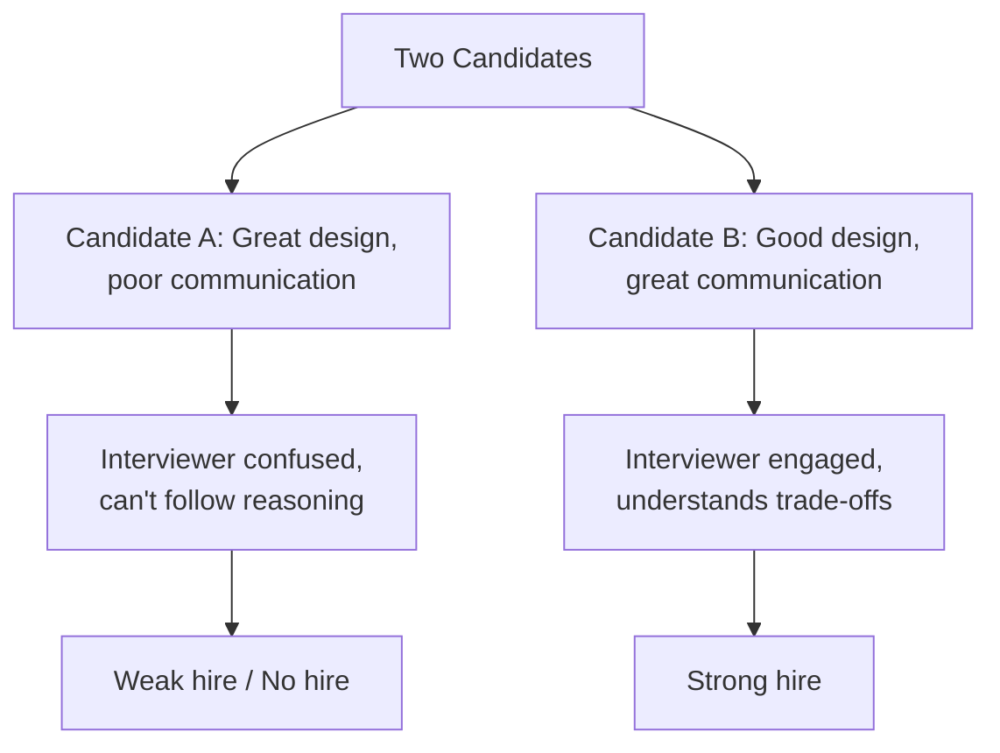
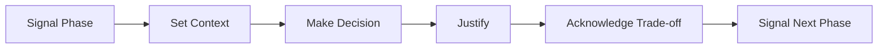
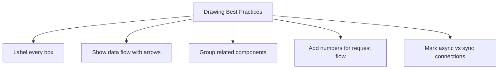

# Interview Prep 07: Communication

> System design interviews are 50% technical skill and 50% communication skill.

---

## 1. Why Communication Matters

---

## 2. The Think-Out-Loud Method

### What Interviewers Want to Hear

| Phase | What to Say |
|-------|-------------|
| **Exploring** | "Let me think about the options here..." |
| **Deciding** | "I'm choosing X because of Y requirement" |
| **Acknowledging** | "The trade-off is Z, but that's acceptable because..." |
| **Transitioning** | "Now let me move to the data model..." |
| **Uncertain** | "I'm not 100% sure about this, but my intuition says..." |

### What NOT to Do

- Go silent for 30+ seconds
- Mumble or rush through decisions
- Say "I think" without explaining why
- Jump between topics without signaling

---

## 3. Structuring Your Communication

### Example Transcript

> **Signal**: "Let me start with the high-level architecture."
>
> **Context**: "We need to handle 10M DAU with read-heavy traffic — about 100:1 read-to-write ratio."
>
> **Decision**: "I'll put a Redis cache in front of PostgreSQL."
>
> **Justify**: "This handles the read-heavy pattern — 95% of reads will hit cache."
>
> **Trade-off**: "The trade-off is data can be up to 60 seconds stale, but for a social feed that's fine."
>
> **Transition**: "Now let me dive into the database schema..."

---

## 4. Signposting Techniques

Use verbal markers to help the interviewer follow your thinking:

### Phase Transitions

- "Let me start with requirements..."
- "Moving on to capacity estimation..."
- "Now I'll sketch the high-level architecture..."
- "Let me deep-dive into the most complex component..."
- "Finally, let's discuss scaling and bottlenecks..."

### Decision Points

- "I have two options here: A and B. I'll go with A because..."
- "The key question is whether to use SQL or NoSQL. Given our access pattern..."
- "There's a trade-off between consistency and latency. For this use case..."

### Checking In

- "Does this direction make sense so far?"
- "Should I go deeper into this component, or move on?"
- "Is there a particular aspect you'd like me to focus on?"

---

## 5. Handling Difficult Moments

| Situation | Response |
|-----------|----------|
| **Don't know something** | "I'm not certain about the exact implementation, but conceptually it works by..." |
| **Made a mistake** | "Actually, let me reconsider — I think a better approach is..." |
| **Interviewer redirects** | "Great point. Let me adjust my design to account for that." |
| **Stuck on a component** | "Let me note this as a detail to revisit and focus on the broader architecture first." |
| **Running out of time** | "Let me quickly summarize the remaining components at a high level..." |

---

## 6. Visual Communication

### Drawing Tips

- **Label everything**: Every box, arrow, and database should have a name
- **Number the flow**: "Step 1: Client sends request to LB, Step 2: LB routes to API server..."
- **Use consistent notation**: Solid lines for sync, dashed for async
- **Keep it clean**: Don't cram 20 components — start with 5-7

---

## 7. Communication Anti-Patterns

| Anti-Pattern | Why It Hurts | Fix |
|--------------|-------------|-----|
| **Monologuing** | Interviewer can't redirect | Pause every 2-3 minutes, check in |
| **Silence** | Interviewer can't assess thinking | Narrate your thoughts |
| **Jumping around** | Hard to follow | Use signposting ("Now moving to...") |
| **Over-confidence** | Seems inflexible | Acknowledge trade-offs and alternatives |
| **Under-confidence** | Seems unsure | State decisions firmly, then qualify |

---

## 8. Practice Exercise

Practice explaining these decisions out loud (2 minutes each):

1. **Why Redis over Memcached** for a session store
2. **Why Kafka over RabbitMQ** for an event pipeline
3. **Why PostgreSQL over MongoDB** for an e-commerce order system
4. **Why cache-aside over write-through** for a social media feed

Use the format: Decision → Benefit → Trade-off → Why it's acceptable

> **Next**: [08 — Time Management](08-time-management.md)
