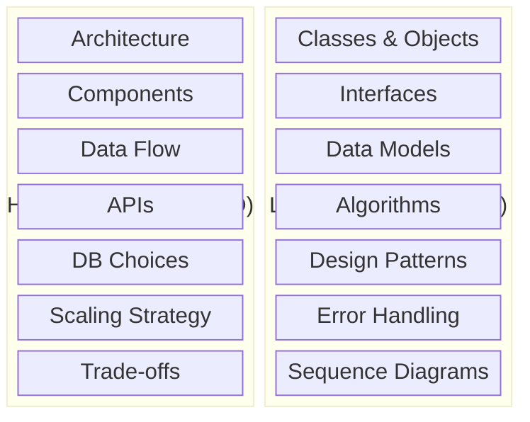
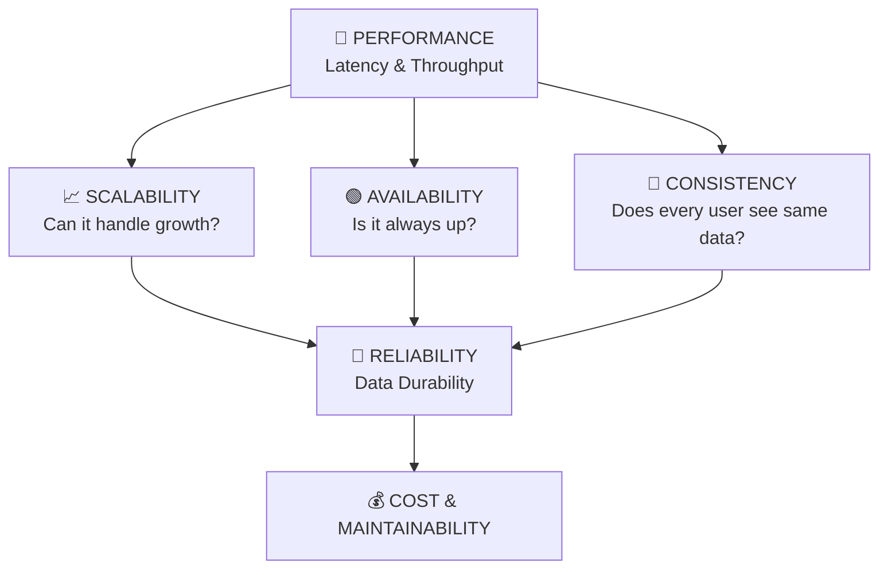
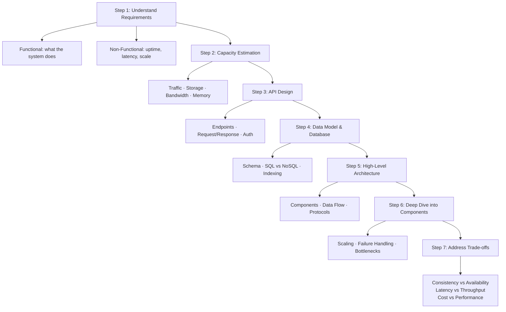
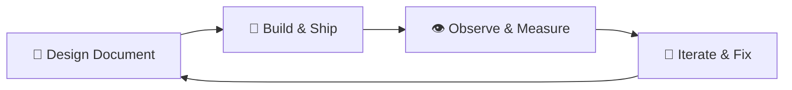
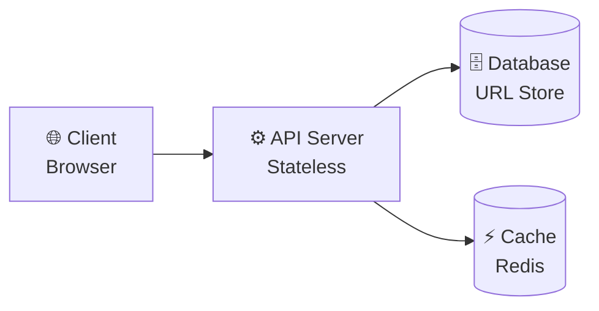
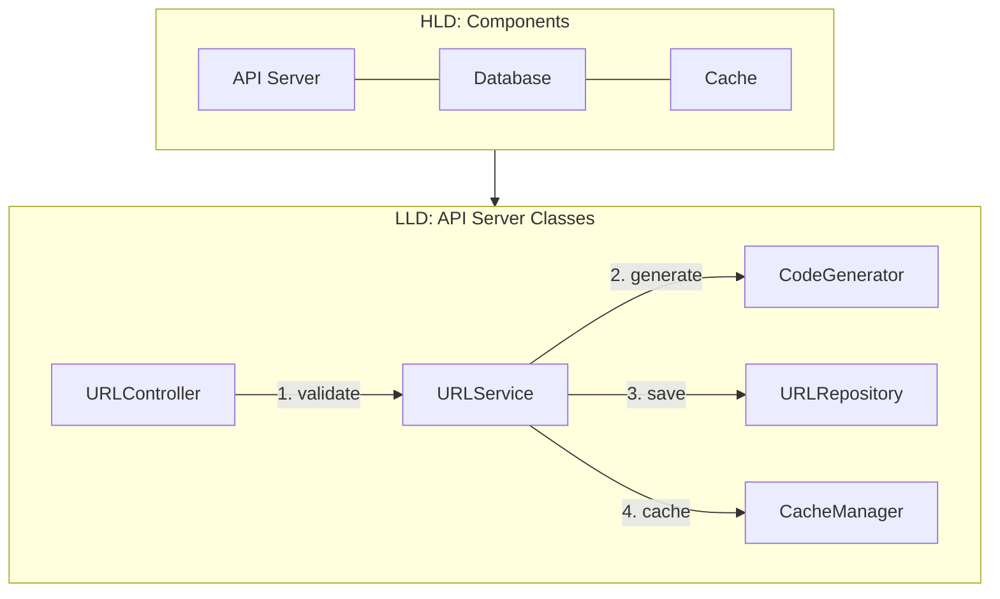

# Topic 1: What is System Design?

> **Track**: Core Concepts — Fundamentals
> **Difficulty**: Beginner
> **Prerequisites**: Basic programming knowledge

---

## Table of Contents

- [A. Concept Explanation](#a-concept-explanation)
- [B. Interview View](#b-interview-view)
- [C. Practical Engineering View](#c-practical-engineering-view)
- [D. Example](#d-example)
- [E. HLD and LLD](#e-hld-and-lld)
- [F. Summary & Practice](#f-summary--practice)

---

## A. Concept Explanation

### What is System Design?

System Design is the process of defining the **architecture, components, modules, interfaces, and data flow** of a system to satisfy specified requirements. It is the blueprint of how software systems are built to serve millions (or billions) of users reliably, efficiently, and at scale.

Think of it like architecture for buildings — before you lay a single brick, you need to know:

- How many people will use the building?
- What will they do inside?
- How do you make sure it doesn't collapse under load?
- What happens when something breaks?

### Why is System Design Needed?

| Problem | What System Design Solves |
|---------|--------------------------|
| Single server can't handle all users | **Scaling** — distribute load across machines |
| Server goes down, users lose access | **Availability** — redundancy and failover |
| Data gets corrupted or lost | **Reliability** — replication and backups |
| Response takes 10 seconds | **Performance** — caching, CDN, optimization |
| Feature changes break everything | **Modularity** — separation of concerns |
| Two users see different data | **Consistency** — data synchronization |
| System gets hacked | **Security** — authentication, encryption |

### The Two Levels of System Design



> **HLD** = "WHAT components exist and how they connect" | **LLD** = "HOW each component works internally"

### When Do You Need System Design?

**Use system design when:**

- Building a product that serves more than a few hundred users
- Working with distributed systems (multiple servers/services)
- Designing APIs or services that other teams depend on
- Making technology choices (DB, cache, queue, protocol)
- Preparing for scale (traffic growth, data growth)
- Interview preparation for senior+ engineering roles

**You don't need formal system design when:**

- Building a simple script or CLI tool
- Prototyping / hackathon / throwaway code
- Single-user desktop applications
- The system has no scaling or reliability requirements

### Core Pillars of System Design

Every system design revolves around balancing these pillars:



**Key insight**: You can NEVER optimize all pillars simultaneously. System design is about making **informed trade-offs**.

### The System Design Process (Step by Step)



### Common Mistakes in System Design

| Mistake | Why It's Wrong | What to Do Instead |
|---------|---------------|-------------------|
| Jumping into components without requirements | You'll design for wrong problems | Always start with requirements |
| Over-engineering | Premature optimization wastes time | Design for current needs + reasonable growth |
| Ignoring non-functional requirements | System may be correct but unusable | Always discuss latency, availability, scale |
| Single point of failure | One failure takes down everything | Redundancy at every layer |
| Ignoring data volume | Works in dev, fails in production | Always do capacity estimation |
| Not discussing trade-offs | Shows shallow understanding | Every choice has a trade-off — discuss it |

---

## B. Interview View

### How "What is System Design?" Appears in Interviews

This topic itself is rarely asked directly. However, every system design interview implicitly tests whether you understand **what system design is** by evaluating how you approach the problem.

### What Interviewers Expect

| Signal | What They Look For |
|--------|-------------------|
| **Structured Thinking** | Do you follow a clear process? Requirements → Estimation → Design → Trade-offs |
| **Requirement Gathering** | Do you ask clarifying questions before designing? |
| **Trade-off Awareness** | Can you explain WHY you chose X over Y? |
| **Scale Awareness** | Do you consider millions of users, not just 10? |
| **Breadth + Depth** | Can you sketch the big picture AND dive deep into one component? |

### Red Flags in Answers

- Starting to draw architecture without asking a single question
- Saying "we'll use microservices" without justification
- Not mentioning any numbers (users, QPS, storage)
- Designing only for the happy path (no failure handling)
- Using buzzwords without understanding them (e.g., "blockchain" for a chat app)

### Common Follow-up Questions

1. "How would you handle 10x traffic?"
2. "What happens if this component fails?"
3. "Why did you choose this database over alternatives?"
4. "What are the trade-offs of your approach?"
5. "How would you monitor this system in production?"

### How to Open a System Design Interview

```
"Before I start designing, let me make sure I understand the requirements.

Functional Requirements:
- [List what the system should do]

Non-Functional Requirements:
- [Scale, latency, availability, consistency needs]

Assumptions:
- [State any assumptions explicitly]

Let me do a quick capacity estimation, then I'll walk through the
high-level architecture..."
```

This opening alone puts you ahead of 70% of candidates.

---

## C. Practical Engineering View

### How System Design Works in Real Companies

In production, system design isn't a one-time activity — it's continuous:



### Design Documents (Design Docs)

In companies like Google, Amazon, and Meta, engineers write **design documents** before building. A typical design doc includes:

| Section | Content |
|---------|---------|
| **Context** | Why are we building this? |
| **Goals / Non-Goals** | What we will and won't solve |
| **Proposed Design** | Architecture, data flow, APIs |
| **Alternatives Considered** | Other approaches and why rejected |
| **Capacity Planning** | Estimated load and resources |
| **Security & Privacy** | Data protection considerations |
| **Observability** | How we'll monitor it |
| **Rollout Plan** | How we'll deploy it safely |
| **Open Questions** | Things we don't know yet |

### Operational Concerns

Real system design goes beyond architecture diagrams:

- **Deployment**: How do you roll out changes safely? (Blue-green, canary, feature flags)
- **Monitoring**: What metrics do you track? (Latency p50/p99, error rate, throughput)
- **Alerting**: When do you page an engineer? (SLA breach, error spike, capacity warning)
- **Incident Response**: What happens when things break? (Runbooks, on-call rotation)
- **Capacity Planning**: How far ahead do you plan for growth?
- **Cost Management**: Is this design cost-efficient? (Cloud bills, infra footprint)
- **Security**: Who can access what? Is data encrypted?

### The Difference Between Interview and Real-World Design

| Aspect | Interview | Real World |
|--------|-----------|------------|
| **Time** | 45 minutes | Weeks to months |
| **Scope** | High-level sketch | Detailed docs + implementation |
| **Feedback** | Interviewer hints | Peer reviews, load testing |
| **Trade-offs** | Discussed verbally | Measured with data |
| **Iteration** | One-shot | Continuous improvement |
| **Team** | Solo | Collaborative (multiple engineers) |

---

## D. Example: Designing a Simple "URL Shortener" (Preview)

Let's walk through a mini-example to show what system design looks like in practice. (A full deep-dive is in `03-hld/01-url-shortener.md`.)

### Problem Statement

Design a service like bit.ly that takes long URLs and creates short aliases.

### Step 1: Requirements

**Functional:**

- Given a long URL, generate a short URL
- When user visits short URL, redirect to the original
- Short URLs should expire after a configurable time (optional)

**Non-Functional:**

- Highly available (redirects must always work)
- Low latency (redirect in <100ms)
- Short URLs should not be guessable

### Step 2: Capacity Estimation

```
Assumptions:
- 100M new URLs per month
- Read:Write ratio = 100:1
- Average URL size = 500 bytes

Writes: 100M / (30 * 24 * 3600) ≈ ~40 URLs/sec
Reads:  40 * 100 = 4,000 redirects/sec

Storage (5 years):
  100M * 12 * 5 = 6 Billion URLs
  6B * 500 bytes = ~3 TB
```

### Step 3: High-Level Architecture



**Write Flow:** Client → API Server → Generate Short Code → Store in DB → Return Short URL

**Read Flow:** Client → API Server → Check Cache → (Miss?) → Query DB → Redirect

### Step 4: Key Decisions

| Decision | Choice | Why |
|----------|--------|-----|
| **Short code generation** | Base62 encoding of auto-increment ID | Simple, unique, no collisions |
| **Database** | NoSQL (DynamoDB or Cassandra) | Key-value lookup pattern, high write throughput |
| **Cache** | Redis | Hot URLs are read frequently, cache reduces DB load |
| **Scaling** | Horizontal scaling of API servers behind a load balancer | Stateless servers scale easily |

This is what system design looks like at a high level. Every topic in this repository builds the knowledge needed to make these decisions confidently.

---

## E. HLD and LLD

### E.1 HLD — "What is System Design" (Meta-Level)

At the HLD level, system design is about answering these questions for any given problem:

| Question | Maps To |
|----------|---------|
| What does the system do? | Functional Requirements |
| How well must it perform? | Non-Functional Requirements |
| How much data/traffic? | Capacity Estimation |
| What APIs are exposed? | API Design |
| What stores data and how? | Database Choice + Schema |
| What are the major components? | Architecture Diagram |
| How do components communicate? | Data Flow + Protocols |
| How does it scale? | Scaling Strategy |
| What can go wrong? | Failure Modes + Mitigation |
| What did we sacrifice? | Trade-offs |

### E.2 LLD — "What is System Design" (Meta-Level)

At the LLD level, system design is about:

| Question | Maps To |
|----------|---------|
| What classes/modules exist? | Component Breakdown |
| What are their responsibilities? | Single Responsibility |
| How do they interact? | Interfaces + Contracts |
| What data structures are used? | Data Models |
| What's the step-by-step flow? | Sequence Diagrams |
| How are errors handled? | Validation + Error Codes |
| What edge cases exist? | Edge Case Analysis |
| How is it tested? | Test Strategy |

### Relationship Between HLD and LLD



---

## F. Summary & Practice

### Key Takeaways

1. **System Design** = defining architecture, components, data flow, and trade-offs for a system that meets functional and non-functional requirements
2. It has two levels: **HLD** (what components and how they connect) and **LLD** (how each component works internally)
3. The process is: Requirements → Estimation → API → Data Model → Architecture → Deep Dive → Trade-offs
4. **Trade-offs are the heart of system design** — there is no perfect design, only appropriate ones
5. In interviews, structured thinking and trade-off awareness matter more than the "right" answer
6. In production, system design is continuous and includes operational concerns (monitoring, deployment, cost)

### Revision Checklist

- [ ] Can I explain what system design is in one sentence?
- [ ] Can I name the core pillars (scalability, availability, reliability, consistency, performance)?
- [ ] Can I list the steps of the system design process?
- [ ] Do I know the difference between HLD and LLD?
- [ ] Can I explain why trade-offs matter?
- [ ] Can I list common mistakes in system design?
- [ ] Do I know how to open a system design interview?
- [ ] Can I do a basic capacity estimation?

### Interview Questions

**Conceptual:**

1. What is system design and why is it important?
2. What is the difference between HLD and LLD?
3. Name the core pillars of system design.
4. What are functional vs non-functional requirements? Give examples.
5. Why are trade-offs central to system design?

**Scenario-Based:**

6. You're asked to design a system but given only 45 minutes. How do you structure your time?
7. Your system needs to handle 1 million requests per second. Where do you start?
8. The interviewer says "design X." What's the first thing you do?
9. How do you decide between SQL and NoSQL for a new system?
10. You realize mid-design that your approach has a bottleneck. What do you do?

### Practice Exercises

1. **Exercise 1**: Take any app you use daily (e.g., Instagram, Uber, WhatsApp). List its functional and non-functional requirements from a system design perspective.

2. **Exercise 2**: Do a capacity estimation for WhatsApp:
   - 2 billion users
   - Average 50 messages/day per user
   - Average message size: 100 bytes
   - How much storage per day? Per year?

3. **Exercise 3**: Draw a simple architecture for a "Notes App" with:
   - User can create, read, update, delete notes
   - Notes sync across devices
   - Supports 1 million users
   - Name the components and explain why you chose them

4. **Exercise 4**: For the Notes App above, list 3 trade-offs you'd need to make and explain your choice for each.

---

> **Next Topic**: [02 — Client-Server Architecture](02-client-server-architecture.md)
