# Topic 2: Client-Server Architecture

> **Track**: Core Concepts — Fundamentals
> **Difficulty**: Beginner
> **Prerequisites**: Topic 1 — What is System Design

---

## Table of Contents

- [A. Concept Explanation](#a-concept-explanation)
- [B. Interview View](#b-interview-view)
- [C. Practical Engineering View](#c-practical-engineering-view)
- [D. Example](#d-example)
- [E. HLD and LLD](#e-hld-and-lld)
- [F. Summary & Practice](#f-summary--practice)

---

## A. Concept Explanation

### What is Client-Server Architecture?

Client-Server Architecture is a computing model where **two distinct roles** exist:

- **Client**: The requester — initiates communication, sends requests, and presents results to the user
- **Server**: The responder — listens for requests, processes them, and returns results

This is the most fundamental pattern in networked computing. Every time you open a website, use an app, or call an API — you are a client talking to a server.

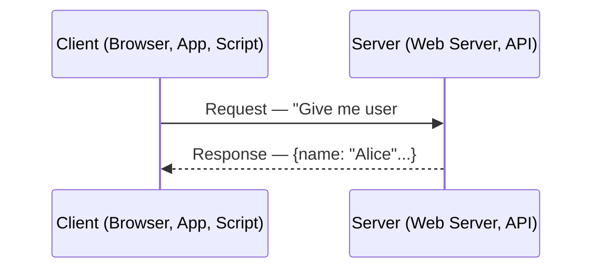

### Why is Client-Server Important?

It is the **foundational model** upon which virtually all modern systems are built:

| What It Enables | How |
|----------------|-----|
| **Separation of concerns** | Client handles UI/UX; server handles logic and data |
| **Centralized data** | Single source of truth on the server |
| **Independent scaling** | Scale clients and servers separately |
| **Security** | Server controls access; client never touches raw data directly |
| **Multiple client types** | One server can serve web, mobile, IoT, CLI clients |
| **Shared resources** | Many clients share one server (or cluster) |

### Client-Server vs Other Models

#### Peer-to-Peer (P2P)

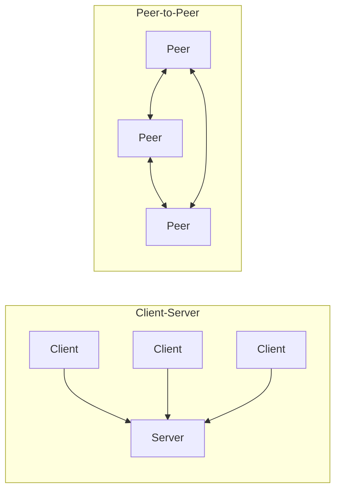

| Aspect | Client-Server | Peer-to-Peer |
|--------|--------------|-------------|
| **Control** | Centralized | Decentralized |
| **Scaling** | Scale server tier | Every peer adds capacity |
| **Security** | Easier to enforce | Harder to control |
| **Reliability** | Server = SPOF (unless redundant) | No single point of failure |
| **Complexity** | Simpler to reason about | Complex coordination |
| **Examples** | Web apps, APIs, databases | BitTorrent, blockchain, WebRTC |

#### Serverless

Serverless is **still client-server** — the "server" is just managed by a cloud provider. You write functions; the provider handles infrastructure. The client still sends requests; something still responds.

### How Client-Server Communication Works

#### The Request-Response Cycle

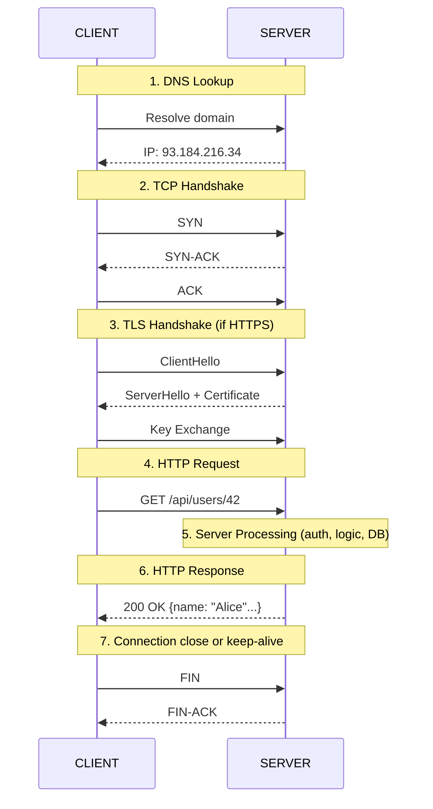

#### Key Protocols in Client-Server

| Protocol | Layer | Purpose | Example |
|----------|-------|---------|---------|
| **HTTP/HTTPS** | Application | Web requests/responses | Browser → Web Server |
| **WebSocket** | Application | Bidirectional real-time | Chat apps, live feeds |
| **gRPC** | Application | Efficient service-to-service | Microservice communication |
| **TCP** | Transport | Reliable, ordered delivery | Almost everything |
| **UDP** | Transport | Fast, no guarantees | Video streaming, gaming, DNS |
| **DNS** | Application | Domain → IP resolution | Every web request starts here |
| **TLS/SSL** | Between Transport & App | Encryption in transit | HTTPS = HTTP + TLS |

### Types of Client-Server Architectures

#### 1-Tier (Single Machine)

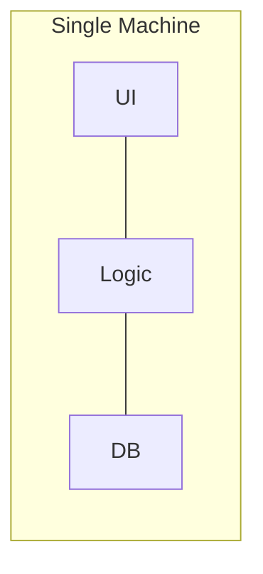

- Everything on one machine
- Example: Desktop apps with embedded DB (SQLite)
- **Use case**: Local tools, embedded systems

#### 2-Tier (Client + Server)

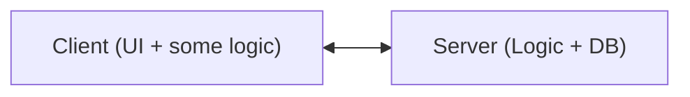

- Client talks directly to database server
- Example: Traditional desktop app with remote DB
- **Use case**: Small internal tools, simple CRUD apps

#### 3-Tier (Client + App Server + DB) ⭐ Most Common

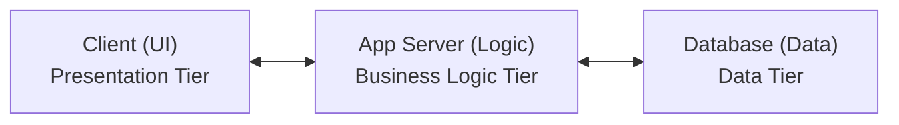

- Clear separation of concerns
- Each tier can scale independently
- **This is the standard web application architecture**
- Example: React frontend → Node.js API → PostgreSQL

#### N-Tier (Multi-Tier)

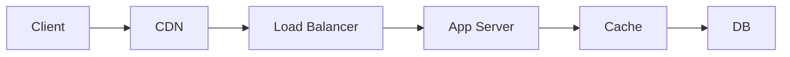

- Real production systems have many tiers
- Each tier handles a specific concern
- **This is what you design in system design interviews**

### When to Use Client-Server

**Use when:**

- You need centralized data management
- Multiple clients need to access the same resources
- You need access control and security enforcement
- The server has more computing power than clients
- You want to update server logic without updating clients

**Consider alternatives when:**

- You need direct peer communication (use P2P — e.g., video calls via WebRTC)
- You need offline-first capability (use local-first architecture)
- You need extreme fault tolerance with no central point (use P2P/mesh)
- Latency between client and server is unacceptable (use edge computing)

### Trade-offs

| Advantage | Disadvantage |
|-----------|-------------|
| Centralized control and security | Server is a potential single point of failure |
| Easy to update server-side logic | Network latency on every request |
| Scales server independently | Server costs grow with users |
| Supports multiple client types | Requires network connectivity |
| Single source of truth for data | Bandwidth bottleneck at the server |

### Scaling the Server Side

As the number of clients grows, a single server becomes a bottleneck. Here's how the architecture evolves:

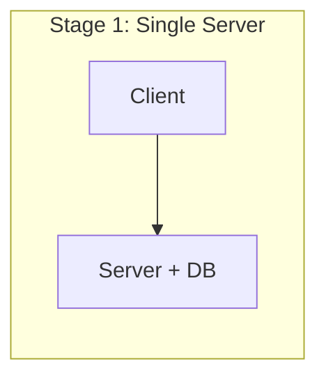

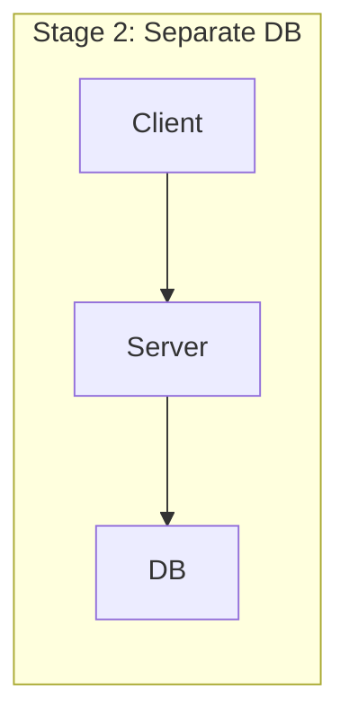

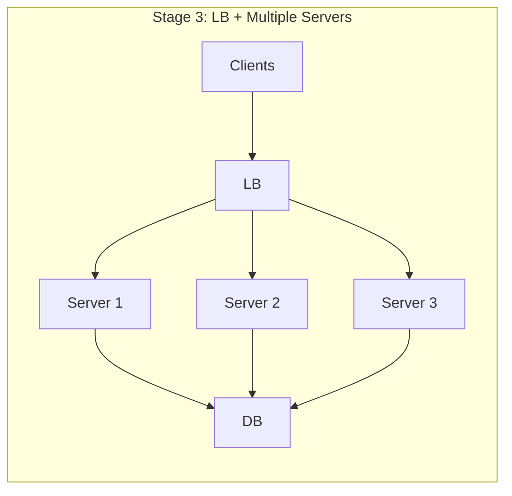

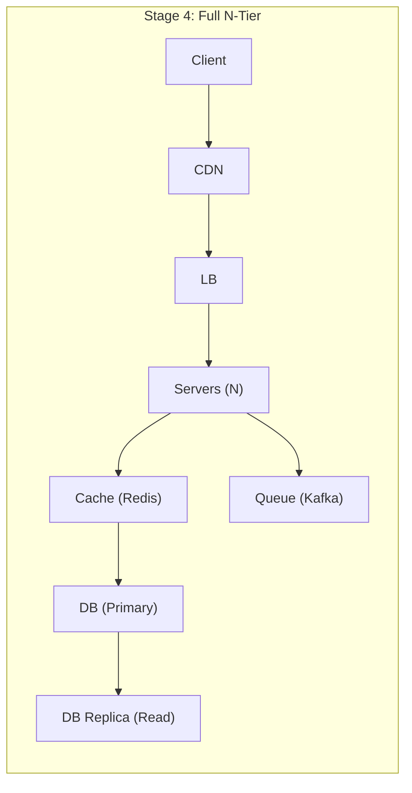

### Communication Patterns

| Pattern | Direction | Use Case | Example |
|---------|----------|----------|---------|
| **Request-Response** | Client → Server → Client | Standard CRUD operations | REST API call |
| **Polling** | Client → Server (repeated) | Check for updates | Email refresh every 30s |
| **Long Polling** | Client → Server (held open) | Near-real-time updates | Chat before WebSockets |
| **Server-Sent Events (SSE)** | Server → Client (one-way stream) | Live feeds, notifications | Stock ticker |
| **WebSocket** | Client ↔ Server (bidirectional) | Real-time interactive | Chat, gaming, collab editing |
| **Webhooks** | Server → Server (event-driven) | Async notifications | Payment status update |

#### When to Use Each

```mermaid
flowchart LR
    A[Need standard CRUD?] -->|Yes|> B[Request-Response (REST)]
    A -->|No|> C[Need updates every few seconds?]
    C -->|Yes|> D[ Polling (simple) or SSE (efficient)]
    C -->|No|> E[Need real-time bidirectional?]
    E -->|Yes|> F[WebSocket]
    E -->|No|> G[Need server to push events?]
    G -->|Yes|> H[SSE or WebSocket]
    G -->|No|> I[Need server-to-server async notify?]
    I -->|Yes|> J[Webhook]
    I -->|No|> K[Need low-latency inter-service?]
    K -->|Yes|> L[gRPC]
```

---

## B. Interview View

### How Client-Server Appears in Interviews

Client-server is **implicitly assumed** in nearly every system design interview. You won't be asked "explain client-server" directly, but your understanding is tested through:

- How you draw architecture diagrams (client → LB → servers → DB)
- Whether you separate concerns properly (presentation vs logic vs data)
- How you handle different client types (web, mobile, API consumers)
- Your choice of communication protocols (REST, WebSocket, gRPC)

### What Interviewers Expect

| Signal | What They Want to See |
|--------|----------------------|
| **Clear tier separation** | Don't mix UI and business logic in the same box |
| **Protocol awareness** | Know when to use REST vs WebSocket vs gRPC |
| **Multiple client support** | Acknowledge web + mobile + third-party API consumers |
| **Stateless servers** | Servers should not store session state locally |
| **Connection management** | Mention keep-alive, connection pooling, timeouts |

### Red Flags

- Drawing a client talking directly to a database
- Not mentioning a load balancer when there are multiple servers
- Assuming the client and server are always on the same network
- Ignoring mobile clients (they have different constraints — bandwidth, battery, offline)
- Not considering what happens when the server is unreachable

### Common Follow-up Questions

1. "What happens if the server goes down? How does the client handle it?"
2. "How would you support both web and mobile clients with the same backend?"
3. "When would you use WebSocket instead of REST?"
4. "How does the client know which server to talk to?"
5. "What's the difference between polling and push-based communication?"
6. "How would you handle slow or unreliable network connections?"

---

## C. Practical Engineering View

### Real-World Client-Server Patterns

#### API Versioning

Real servers evolve over time. Clients may be on different versions:

```mermaid
flowchart LR
    C1[Client v1] -->|GET /api/v1/users|> S1[Server]
    C2[Client v2] -->|GET /api/v2/users|> S1
    C3[Client v3] -->|GET /api/v3/users|> S1
```

**Strategies:**

| Strategy | How | Pros | Cons |
|----------|-----|------|------|
| **URL Versioning** | `/api/v1/`, `/api/v2/` | Simple, explicit | URL pollution |
| **Header Versioning** | `Accept: application/vnd.api.v2+json` | Clean URLs | Less discoverable |
| **Query Param** | `/api/users?version=2` | Easy to test | Easy to forget |

#### Connection Pooling

Creating a new TCP connection for every request is expensive. Real servers use **connection pooling**:

```mermaid
flowchart LR
    C[Client] --> P[Pool]
    P -->|conn1|> S1[Server]
    P -->|conn2|> S1
    P -->|conn3|> S1
```

This applies to:
- DB connections (PostgreSQL connection pool via PgBouncer)
- HTTP clients (keep-alive connections)
- gRPC channels (multiplexed streams)

#### Timeouts and Retries

In production, clients must handle server failures gracefully:

```mermaid
flowchart LR
    C[Client] -->|Request|> S[Server]
    S -->|Timeout|> C
    C -->|Retry|> S
```

#### Observability in Client-Server

| What to Monitor | Where | Tool Examples |
|----------------|-------|---------------|
| **Request latency (p50, p99)** | Server | Prometheus, Datadog |
| **Error rate (5xx, 4xx)** | Server | Grafana, CloudWatch |
| **QPS (queries per second)** | Server / LB | Prometheus |
| **Connection pool utilization** | Server | Custom metrics |
| **DNS resolution time** | Client | Browser DevTools |
| **TLS handshake time** | Client/Server | OpenTelemetry |
| **Client-side errors** | Client | Sentry, LogRocket |
| **Network round-trip time** | Both | Distributed tracing (Jaeger) |

#### Security Considerations

| Concern | Mitigation |
|---------|-----------|
| **Man-in-the-middle attacks** | Always use HTTPS (TLS) |
| **Data exposure** | Never send secrets in URLs; use headers/body |
| **DDoS** | Rate limiting, WAF, CDN |
| **CORS** | Configure allowed origins on server |
| **CSRF** | Use CSRF tokens for state-changing requests |
| **Input validation** | Validate on BOTH client and server (never trust client) |
| **Auth** | Use JWT/OAuth for authentication; verify on every request |

#### Cost and Infrastructure

| Component | Cost Driver | Optimization |
|-----------|------------|-------------|
| **Servers** | CPU, memory usage | Auto-scale, right-size instances |
| **Load Balancer** | Number of connections, bandwidth | Use efficient L4 LB where possible |
| **Bandwidth** | Data transferred | Compression (gzip/brotli), CDN |
| **SSL Certificates** | Certificate management | Let's Encrypt (free), ACM |
| **DNS** | Query volume | Caching, longer TTL |

---

## D. Example: E-Commerce Product Page

### Problem

Design the client-server interaction for loading a product page on an e-commerce site.

### Requirements

- Display product details, images, reviews, recommendations
- Support web and mobile clients
- Handle 50,000 concurrent users
- Page load time < 2 seconds

### Architecture Flow

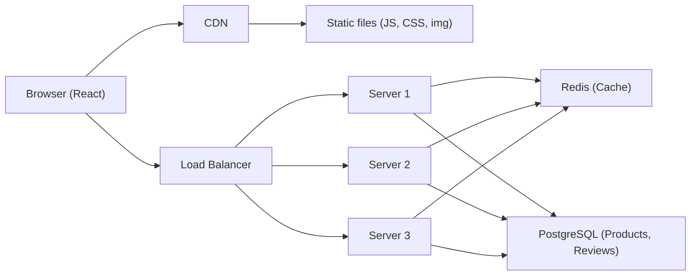

### Step-by-Step Request Flow

```mermaid
flowchart LR
    C[Client] -->|GET /product/12345|> CDN
    CDN -->|Cache HIT|> C
    CDN -->|Cache MISS|> LB
    LB -->|Forward|> S[Server]
    S -->|Cache HIT|> C
    S -->|Cache MISS|> PG
    PG -->|Row data|> S
    S -->|SET cache|> Redis
    S -->|200 OK|> C
```

### API Design

```java
public class Product {
    private int id;
    private String name;
    private double price;
    private String currency;
    private String description;
    private List<String> images;
    private boolean inStock;
    private double rating;
    private int reviewCount;
    // getters and setters
}

public class Review {
    private int id;
    private int productId;
    private String text;
    private int rating;
    // getters and setters
}

public class Recommendation {
    private int id;
    private int productId;
    private String name;
    private double price;
    // getters and setters
}
```

### Key Decisions

| Decision | Choice | Why |
|----------|--------|-----|
| **CDN** | CloudFront | Serve images and static assets close to users globally |
| **App servers** | Stateless Node.js behind LB | Easy horizontal scaling |
| **Cache** | Redis with 15-min TTL | Product data changes infrequently; cache reduces DB load |
| **DB** | PostgreSQL | Products have structured data with relationships (categories, variants) |
| **API style** | REST over HTTPS | Standard, well-supported by web and mobile clients |
| **Parallel requests** | 3 independent API calls | Faster than sequential; client assembles the page |

---

## E. HLD and LLD

### E.1 HLD — Client-Server for a Generic Web Application

#### Requirements

**Functional:**
- Clients send requests and receive responses
- Support multiple client types (web, mobile, API)
- Serve both static and dynamic content

**Non-Functional:**
- Low latency (<200ms p99 for API calls)
- High availability (99.9% uptime)
- Support 100K concurrent connections
- Secure (HTTPS, auth on every request)

#### Capacity Estimation

```java
public class CapacityEstimator {
    private int dau; // Daily Active Users
    private int requestsPerUser; // Average requests per user per session
    private int sessionsPerDay; // Average sessions per day per user
    private int qps; // Queries per second
    private int peakQps; // Peak queries per second
    private int avgResponseSize; // Average response size in bytes
    private int bandwidth; // Bandwidth in bytes per second

    public CapacityEstimator(int dau, int requestsPerUser, int sessionsPerDay) {
        this.dau = dau;
        this.requestsPerUser = requestsPerUser;
        this.sessionsPerDay = sessionsPerDay;
        this.qps = calculateQps();
        this.peakQps = calculatePeakQps();
        this.avgResponseSize = 5000; // 5 KB
        this.bandwidth = calculateBandwidth();
    }

    private int calculateQps() {
        return dau * requestsPerUser * sessionsPerDay / 86400;
    }

    private int calculatePeakQps() {
        return qps * 3;
    }

    private int calculateBandwidth() {
        return peakQps * avgResponseSize;
    }

    public static void main(String[] args) {
        CapacityEstimator estimator = new CapacityEstimator(1000000, 20, 2);
        System.out.println("QPS: " + estimator.qps);
        System.out.println("Peak QPS: " + estimator.peakQps);
        System.out.println("Bandwidth: " + estimator.bandwidth + " bytes/sec");
    }
}
```

#### Architecture Diagram

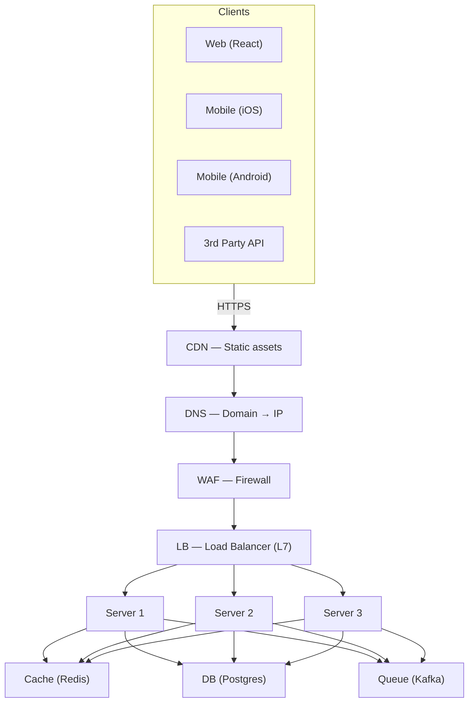

#### Data Flow

**Read path:** Client → CDN (static) / LB (dynamic) → Server → Cache → DB → Response
**Write path:** Client → LB → Server → Validate → DB → (optional) Queue → Response

#### Scaling Approach

| Layer | Strategy |
|-------|----------|
| **Client** | CDN for static assets; client-side caching |
| **Load Balancer** | Managed LB (ALB/NLB) with auto-scaling |
| **App Servers** | Horizontal scaling (add more stateless instances) |
| **Cache** | Redis cluster with consistent hashing |
| **Database** | Read replicas for reads; sharding for writes |
| **Queue** | Partition-based scaling (Kafka partitions) |

#### Bottlenecks

| Bottleneck | Symptom | Solution |
|-----------|---------|----------|
| Single DB | High query latency | Read replicas, caching |
| Hot server | Uneven load | Better LB algorithm |
| Large payloads | High bandwidth cost | Compression, pagination |
| SSL termination | LB CPU spike | Offload to CDN / dedicated SSL terminators |
| Connection limits | Connection refused errors | Connection pooling, increase limits |

#### Trade-offs

| Trade-off | Option A | Option B |
|-----------|----------|----------|
| **Latency vs Consistency** | Serve from cache (fast, possibly stale) | Always hit DB (slow, always fresh) |
| **Thin vs Thick client** | Server renders HTML (SEO friendly) | Client renders SPA (richer UX) |
| **REST vs WebSocket** | Simpler, cacheable | Real-time, but more complex |
| **Single API vs BFF** | One API for all clients | Backend-for-Frontend per client type |

---

### E.2 LLD — Client-Server Request Handler

#### Classes and Components

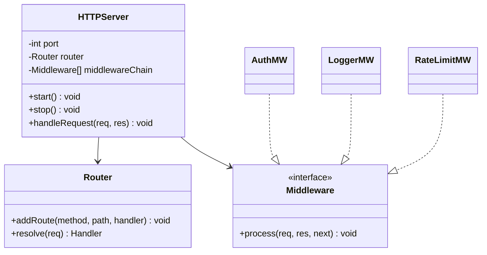

#### Interfaces

```java
public class Request {
    private String method;          // GET, POST, PUT, DELETE
    private String path;            // /api/v1/users/42
    private Map<String, String> headers;   // {Authorization: "Bearer ..."}
    private Map<String, String> queryParams; // {page: "1", limit: "10"}
    private String body;            // JSON body for POST/PUT
    private String clientIp;
    private LocalDateTime timestamp;
    // getters and setters
}

public class Response {
    private int statusCode;         // 200, 404, 500
    private Map<String, String> headers;
    private Object body;            // Response payload

    public Response() {}
    public Response(int statusCode, Object body) {
        this.statusCode = statusCode; this.body = body;
    }
    // getters and setters
}

public interface Handler {
    Response handle(Request request);
}

public interface Middleware {
    void process(Request request, Response response, Runnable next);
}
```

#### Data Models

```sql
-- Request log table (for observability)
CREATE TABLE request_logs (
    id            BIGSERIAL PRIMARY KEY,
    request_id    UUID NOT NULL,         -- Unique trace ID
    method        VARCHAR(10) NOT NULL,
    path          VARCHAR(500) NOT NULL,
    client_ip     VARCHAR(45),
    user_id       BIGINT,                -- Null if unauthenticated
    status_code   INT NOT NULL,
    latency_ms    INT NOT NULL,
    request_size  INT,
    response_size INT,
    user_agent    VARCHAR(500),
    created_at    TIMESTAMP DEFAULT NOW()
);

CREATE INDEX idx_request_logs_created_at ON request_logs(created_at);
CREATE INDEX idx_request_logs_user_id ON request_logs(user_id);
CREATE INDEX idx_request_logs_status ON request_logs(status_code);
```

#### Sequence Flow — Handling a GET Request

```
Client              LB              Server           Middleware          Handler         Cache         DB
  │                  │                 │                  │                 │              │            │
  │── GET /users/42 ─►                 │                  │                 │              │            │
  │                  │── Forward ──────►                   │                 │              │            │
  │                  │                 │── AuthMiddleware ─►                │              │            │
  │                  │                 │                  │ Verify JWT      │              │            │
  │                  │                 │                  │ ✓ Valid         │              │            │
  │                  │                 │◄─ next() ────────│                 │              │            │
  │                  │                 │── LogMiddleware ──►                │              │            │
  │                  │                 │                  │ Log request     │              │            │
  │                  │                 │◄─ next() ────────│                 │              │            │
  │                  │                 │── RateLimitMW ───►                 │              │            │
  │                  │                 │                  │ Check limit     │              │            │
  │                  │                 │◄─ next() ────────│                 │              │            │
  │                  │                 │── Route match ────────────────────►│              │            │
  │                  │                 │                                    │── GET key ──►│            │
  │                  │                 │                                    │◄─ MISS ──────│            │
  │                  │                 │                                    │── SELECT ────────────────►│
  │                  │                 │                                    │◄─ Row data ──────────────│
  │                  │                 │                                    │── SET cache ─►│           │
  │                  │                 │◄── 200 OK {user data} ────────────│              │            │
  │                  │◄── Response ────│                                    │              │            │
  │◄── 200 OK ──────│                 │                                    │              │            │
```

#### Pseudocode — Server Request Handling

```java
public class HTTPServer {
    private final int port;
    private final Router router = new Router();
    private final List<Middleware> middlewares = new ArrayList<>();

    public HTTPServer(int port) { this.port = port; }

    public void use(Middleware middleware) { middlewares.add(middleware); }

    public Response handleRequest(String rawRequest) {
        // 1. Parse the raw HTTP request
        Request request = parseRequest(rawRequest);
        Response response = new Response();

        try {
            // 2. Run middleware chain
            buildMiddlewareChain(request, response, 0);

            // 3. Route to the correct handler
            Handler handler = router.resolve(request);
            if (handler == null)
                return new Response(404, Map.of("error", "Not Found"));

            // 4. Execute handler
            response = handler.handle(request);

        } catch (AuthenticationException e) {
            response = new Response(401, Map.of("error", "Unauthorized"));
        } catch (RateLimitExceededException e) {
            response = new Response(429, Map.of("error", "Too Many Requests"));
        } catch (ValidationException e) {
            response = new Response(400, Map.of("error", e.getMessage()));
        } catch (Exception e) {
            logger.error("Unhandled error: " + e.getMessage());
            response = new Response(500, Map.of("error", "Internal Server Error"));
        } finally {
            // 5. Log the request
            logRequest(request, response);
        }
        return response;
    }

    private void buildMiddlewareChain(Request req, Response res, int index) {
        if (index < middlewares.size()) {
            middlewares.get(index).process(req, res,
                () -> buildMiddlewareChain(req, res, index + 1));
        }
    }
}
```

#### Edge Cases

| Edge Case | How to Handle |
|-----------|--------------|
| Request body too large | Return 413 Payload Too Large; enforce max body size |
| Malformed JSON | Return 400 Bad Request with clear error message |
| Missing auth header | Return 401 Unauthorized |
| Expired JWT token | Return 401 with "token_expired" error code |
| Server overloaded | Return 503 Service Unavailable; client retries with backoff |
| Slow downstream DB | Set timeouts; return 504 Gateway Timeout |
| Client disconnects mid-request | Detect and abort processing; clean up resources |
| Duplicate request (network retry) | Idempotency key to prevent duplicate processing |
| Path traversal attack | Sanitize paths; never use raw path in file operations |
| SQL injection | Use parameterized queries; never concatenate user input |

---

## F. Summary & Practice

### Key Takeaways

1. **Client-Server** is the foundational model: client requests, server responds
2. **3-tier architecture** (Presentation → Logic → Data) is the industry standard for web apps
3. Real systems evolve from single server → LB + multiple servers → full N-tier with CDN, cache, queue
4. **Communication protocols** matter: REST for CRUD, WebSocket for real-time, gRPC for internal services
5. **Stateless servers** are critical for horizontal scaling — never store session state locally
6. In production, you must handle **timeouts, retries, connection pooling, and failure gracefully**
7. Security is non-negotiable: HTTPS everywhere, validate on server, never trust the client
8. **Observability** (latency, error rate, QPS) is how you keep client-server systems healthy

### Revision Checklist

- [ ] Can I explain client-server architecture in one sentence?
- [ ] Can I draw a 3-tier architecture diagram?
- [ ] Can I explain the full request-response lifecycle (DNS → TCP → TLS → HTTP → Response)?
- [ ] Do I know the difference between 1-tier, 2-tier, 3-tier, and N-tier?
- [ ] Can I compare client-server with peer-to-peer?
- [ ] Can I name 5 communication patterns (request-response, polling, long polling, SSE, WebSocket)?
- [ ] Do I know when to use REST vs WebSocket vs gRPC?
- [ ] Can I explain how a single-server setup evolves to a scaled N-tier system?
- [ ] Can I list 5 security concerns in client-server communication?
- [ ] Do I understand connection pooling and why it matters?

### Interview Questions

**Conceptual:**

1. What is client-server architecture? How does it differ from P2P?
2. Walk me through what happens when you type a URL in the browser and press Enter.
3. What are the layers in a 3-tier architecture and what does each do?
4. Why should app servers be stateless?
5. What's the difference between a thin client and a thick client?

**Protocol & Communication:**

6. When would you use WebSocket instead of REST?
7. What's the difference between polling, long polling, and server-sent events?
8. How does gRPC differ from REST? When would you choose each?
9. What is a keep-alive connection and why is it useful?
10. How does TLS work at a high level?

**Scaling & Production:**

11. How would you scale a client-server system from 1,000 to 1,000,000 users?
12. What is connection pooling and why is it important?
13. How do you handle API versioning when you have millions of clients?
14. What observability metrics would you track for a client-server system?
15. How do you handle a client sending duplicate requests due to retries?

### Practice Exercises

1. **Exercise 1**: Draw the full lifecycle of an HTTPS request from a mobile app to a server, including DNS, TCP, TLS, and the HTTP request/response. Label every step.

2. **Exercise 2**: Design the client-server architecture for a "Weather App" that:
   - Shows current weather for a user's location
   - Updates every 5 minutes
   - Supports web and mobile
   - 10M DAU
   - Choose the communication pattern and justify it

3. **Exercise 3**: Compare REST, WebSocket, and gRPC for a food delivery app. Which would you use for:
   - Browsing restaurants (read-heavy, cacheable)
   - Live order tracking (real-time location updates)
   - Internal communication between Order Service and Payment Service

4. **Exercise 4**: A server currently handles 500 req/sec on a single machine. Traffic is expected to grow to 50,000 req/sec. Design the scaling strategy — what components do you add and in what order?

---

> **Previous**: [01 — What is System Design](01-what-is-system-design.md)
> **Next**: [03 — Monolith vs Microservices](03-monolith-vs-microservices.md)
