# Topic 3: Monolith vs Microservices

> **Track**: Core Concepts — Fundamentals
> **Difficulty**: Beginner → Intermediate
> **Prerequisites**: Topic 1 — What is System Design, Topic 2 — Client-Server Architecture

---

## Table of Contents

- [A. Concept Explanation](#a-concept-explanation)
- [B. Interview View](#b-interview-view)
- [C. Practical Engineering View](#c-practical-engineering-view)
- [D. Example](#d-example)
- [E. HLD and LLD](#e-hld-and-lld)
- [F. Summary & Practice](#f-summary--practice)

---

## A. Concept Explanation

### What is a Monolith?

A **monolith** is an application where all features, modules, and logic are built, deployed, and run as **a single unit**.

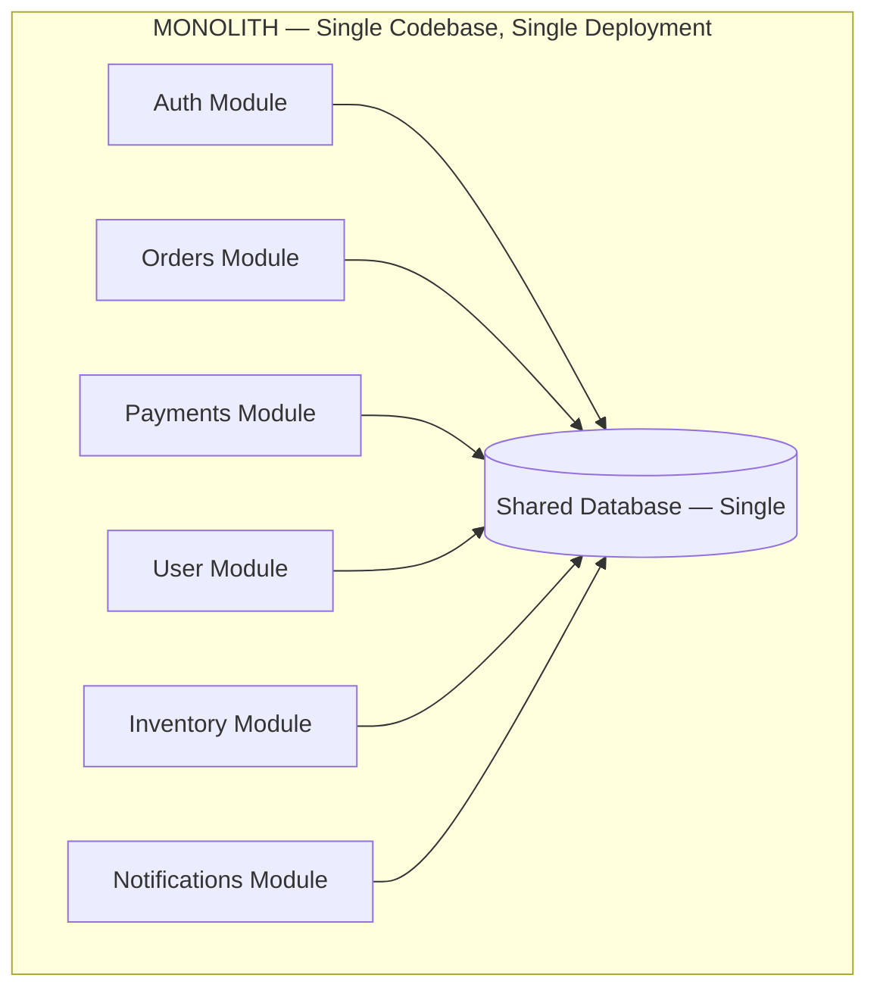

**Key characteristics:**
- One codebase, one repository
- All modules share the same process and memory space
- Single deployment artifact (WAR, JAR, binary, container)
- Shared database — all modules read/write the same DB
- Internal function calls between modules (no network overhead)

### What are Microservices?

**Microservices** is an architecture where the application is composed of **small, independent services**, each responsible for a single business capability, deployed and scaled independently.

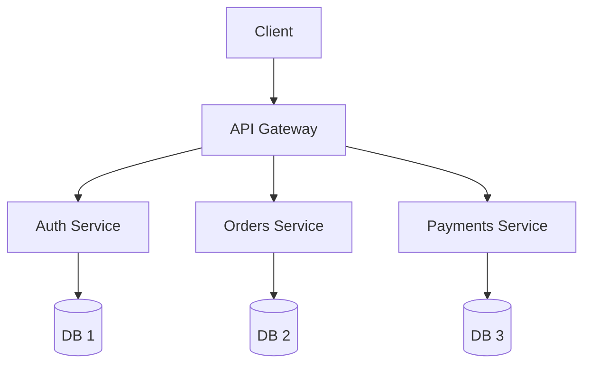

Each service: 
  ✓ Own codebase 
  ✓ Own database 
  ✓ Own deployment pipeline 
  ✓ Communicates via network (HTTP/gRPC/messaging) 
  ✓ Can be written in different languages 
  ✓ Can scale independently

### Head-to-Head Comparison

| Dimension | Monolith | Microservices |
|-----------|----------|--------------|
| **Codebase** | Single repo, single codebase | Multiple repos or monorepo with separate services |
| **Deployment** | Deploy entire application | Deploy each service independently |
| **Scaling** | Scale entire app (vertical or horizontal) | Scale individual services based on load |
| **Technology** | Single tech stack | Polyglot (different languages/frameworks per service) |
| **Database** | Shared database | Database-per-service (ideally) |
| **Communication** | In-process function calls | Network calls (REST, gRPC, messaging) |
| **Failure Blast Radius** | One bug can crash everything | One service fails, others continue |
| **Development Speed (small team)** | Faster — no network complexity | Slower — distributed system overhead |
| **Development Speed (large team)** | Slower — merge conflicts, coordination | Faster — teams own independent services |
| **Testing** | Simple end-to-end | Complex integration testing |
| **Debugging** | Single process, easy stack traces | Distributed tracing required |
| **Latency** | Lower (in-process calls) | Higher (network hops between services) |
| **Data Consistency** | Easy (single DB, ACID transactions) | Hard (distributed transactions, eventual consistency) |
| **Operational Complexity** | Low | High (service discovery, orchestration, monitoring) |
| **Team Structure** | Any team structure | Works best with small, autonomous teams |

### When to Use Monolith

**Choose monolith when:**

- You're a startup or small team (< 10 engineers)
- The domain is not well understood yet (still exploring)
- Speed of initial development matters most
- You don't need independent scaling of components
- Your team doesn't have DevOps/infrastructure maturity
- The application is simple or medium complexity

**Real-world monoliths:**
- Shopify (started as a monolith, still largely monolithic — "Modular Monolith")
- Basecamp / Hey.com (Rails monolith by choice)
- Stack Overflow (runs on a handful of servers as a monolith)
- Early-stage almost everything (Twitter, Netflix, Amazon all started as monoliths)

### When to Use Microservices

**Choose microservices when:**

- You have a large engineering organization (50+ engineers)
- Different parts of the system have very different scaling needs
- Teams need to deploy independently without coordinating releases
- The domain is well understood and bounded contexts are clear
- You have mature DevOps, CI/CD, and observability infrastructure
- You need technology diversity (e.g., ML service in Python, API in Go)

**Real-world microservices:**
- Netflix (1,000+ microservices)
- Amazon (services organized by business capability)
- Uber (domain-oriented microservice architecture — DOMA)
- Spotify (squads own services)

### The Monolith-to-Microservices Spectrum

Most real systems are NOT purely one or the other. There's a spectrum:

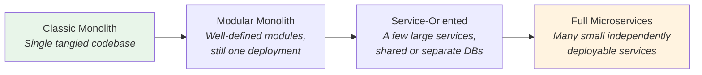

> **← Simple** ... **Complex →** | Recommended: start left, evolve as needed

### The Modular Monolith — The Best of Both Worlds?

A **Modular Monolith** is a monolith with well-defined internal boundaries:

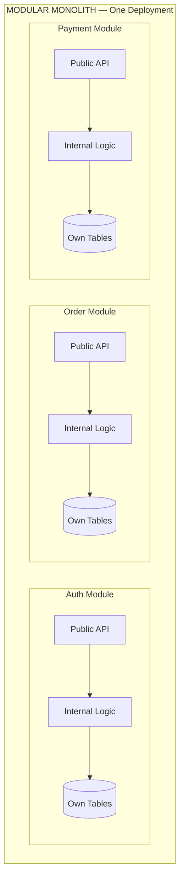

> **Rules**: Modules communicate ONLY through public APIs · No direct DB access across boundaries · Each module owns its tables · Still ONE deployment · Easy to extract into microservice later

**Why it matters:** This gives you clean boundaries without distributed system complexity. If you later need to extract a service, the module already has a clear API.

### Key Microservices Patterns

| Pattern | What It Solves | How |
|---------|---------------|-----|
| **API Gateway** | Single entry point for clients | Routes requests to appropriate services |
| **Service Discovery** | Services finding each other | Registry (Consul, Eureka) or DNS-based |
| **Circuit Breaker** | Cascading failures | Stop calling a failing service temporarily |
| **Saga Pattern** | Distributed transactions | Chain of local transactions with compensations |
| **CQRS** | Read/write optimization | Separate read and write models |
| **Event Sourcing** | Audit trail, state reconstruction | Store events instead of current state |
| **Sidecar Pattern** | Cross-cutting concerns | Proxy handles logging, auth, tracing (Envoy, Istio) |
| **Strangler Fig** | Incremental migration | Replace monolith pieces one at a time |
| **BFF (Backend for Frontend)** | Client-specific APIs | Separate backend per client type |
| **Database per Service** | Data isolation | Each service owns its data |

### Trade-offs Deep Dive

#### 1. Development Velocity

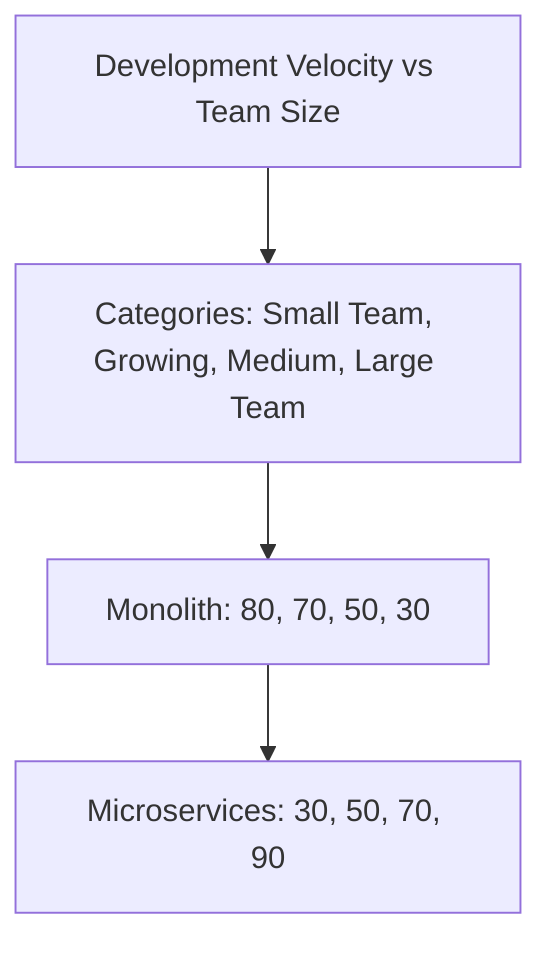

> **Insight**: Monolith wins for small teams (simpler, faster to start). Microservices win for large teams (teams work independently).

#### 2. Data Consistency

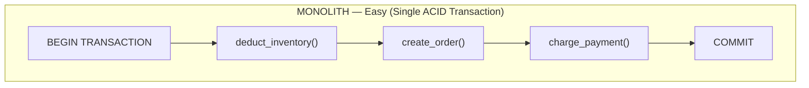

> All or nothing. Simple ACID transaction.

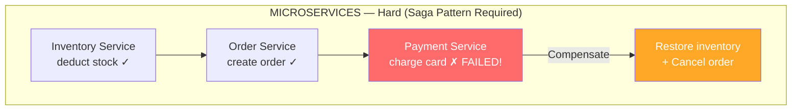

> Need compensating transactions (Saga pattern). Much harder to implement correctly.

#### 3. Failure Handling

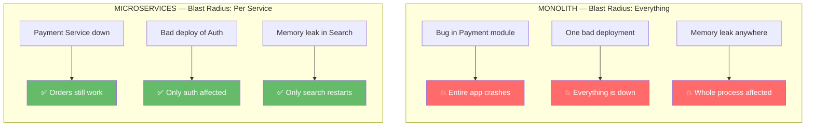

> **BUT**: Microservices introduce NEW problems — network failures, timeout cascades, and partial failures that you didn't have before.

### Common Mistakes

| Mistake | Why It's Wrong | What to Do Instead |
|---------|---------------|-------------------|
| "We need microservices from day 1" | Premature complexity; you don't know your boundaries yet | Start with a monolith or modular monolith |
| Creating nano-services | Too fine-grained = network overhead + complexity explosion | Services should map to business capabilities, not functions |
| Sharing databases between services | Couples services; defeats the purpose | Database-per-service; use APIs/events to share data |
| Synchronous chains | A → B → C → D; if D is slow, everything is slow | Use async messaging where possible |
| No observability | Can't debug distributed systems without it | Invest in logging, metrics, distributed tracing from day 1 |
| Big-bang migration | Rewriting entire monolith at once is risky | Use Strangler Fig pattern; migrate incrementally |
| Ignoring data consistency | Distributed transactions are hard | Plan your saga/compensation strategy upfront |
| "Microservices = just smaller code" | It's an organizational AND architectural change | Align teams to services (Conway's Law) |

---

## B. Interview View

### How This Topic Appears in Interviews

This is one of the **most commonly discussed topics** in system design interviews. It appears in two ways:

1. **Direct question**: "Would you use a monolith or microservices for this system?"
2. **Implicit**: Every time you draw an architecture, you're choosing between them

### What Interviewers Expect

| Level | Expectation |
|-------|------------|
| **Junior** | Know the basic differences; can name pros/cons |
| **Mid** | Can justify the choice for a given problem; knows trade-offs |
| **Senior** | Discusses migration strategies, data consistency challenges, team structure implications |
| **Staff+** | Talks about organizational impact (Conway's Law), modular monolith as intermediate step, and when to split/merge services |

### How to Answer in an Interview

**Framework for deciding:**

```
1. "Given the scale requirements of [X users, Y QPS], let me consider 
    whether monolith or microservices is more appropriate..."

2. Consider:
   - Team size? (small → monolith, large → microservices)
   - Domain clarity? (unclear → monolith, clear → microservices)
   - Scaling needs? (uniform → monolith, varied → microservices)
   - Deployment frequency? (weekly → monolith, hourly → microservices)
   - Existing infrastructure? (basic → monolith, mature → microservices)

3. "For this design, I'll go with [choice] because [2-3 concrete reasons]"

4. "If we needed to evolve later, we could [migration strategy]"
```

### Red Flags in Answers

- Saying "always use microservices" without justification
- Not mentioning data consistency challenges
- Ignoring operational complexity
- Drawing 20 microservices for a simple CRUD app
- Not knowing what the Saga pattern is
- Claiming microservices are "just REST APIs"
- Not mentioning Conway's Law when discussing team structure

### Common Follow-up Questions

1. "How would you handle a transaction that spans multiple services?"
2. "What happens when Service A depends on Service B and B is down?"
3. "How do you migrate from monolith to microservices?"
4. "How do you decide the boundaries of a microservice?"
5. "What is the Saga pattern? When would you use it?"
6. "What is Conway's Law and how does it relate to microservices?"
7. "How do you handle shared data between services?"
8. "What's a modular monolith and when is it appropriate?"

---

## C. Practical Engineering View

### Conway's Law

> "Organizations which design systems are constrained to produce designs which are copies of the communication structures of these organizations." — Melvin Conway

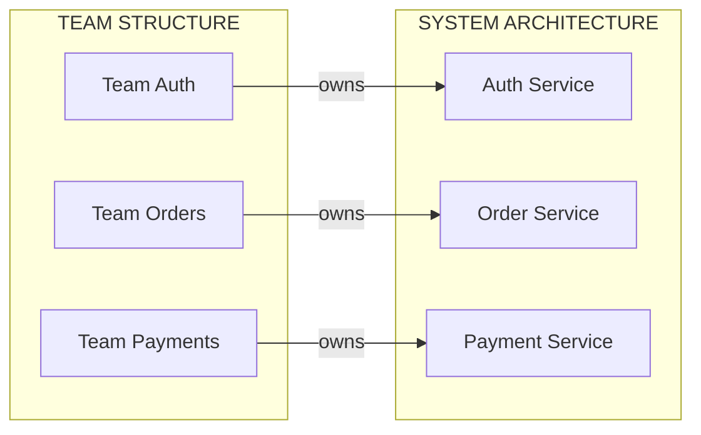

> The architecture WILL mirror the team structure. Plan teams and services together, not separately.

**Practical implication**: If you want microservices, you need small autonomous teams (2-pizza teams / squads). If you have one big team, microservices will create coordination overhead.
- **Owns its data** (no shared databases)
- **Can be developed by one team** (2-pizza team size)

### Migration Strategy: Strangler Fig Pattern

Named after a vine that grows around a tree, eventually replacing it.

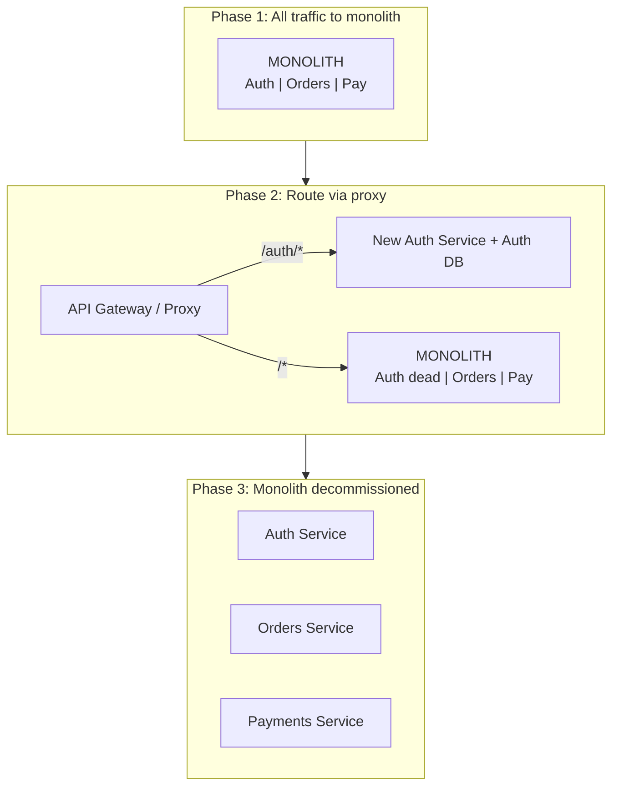

### Operational Concerns

#### Monolith Operations

| Concern | How It's Handled |
|---------|-----------------|
| **Deployment** | One artifact, one deploy pipeline |
| **Monitoring** | Monitor one application, standard APM |
| **Debugging** | Single process stack traces |
| **Log management** | Logs from one application |
| **Testing** | Unit + integration + E2E in one codebase |
| **On-call** | One team can own everything |

#### Microservices Operations

| Concern | How It's Handled | Tools |
|---------|-----------------|-------|
| **Deployment** | Per-service CI/CD pipelines | GitHub Actions, ArgoCD, Spinnaker |
| **Container orchestration** | Manage containers at scale | Kubernetes, ECS |
| **Service discovery** | Services find each other dynamically | Consul, Kubernetes DNS, Eureka |
| **Service mesh** | Handle cross-cutting concerns (mTLS, retries, tracing) | Istio, Linkerd, Envoy |
| **Monitoring** | Per-service metrics + aggregate dashboards | Prometheus + Grafana, Datadog |
| **Distributed tracing** | Trace requests across service boundaries | Jaeger, Zipkin, OpenTelemetry |
| **Log aggregation** | Centralize logs from all services | ELK Stack, Loki, Splunk |
| **API Gateway** | Single entry point, auth, rate limiting | Kong, AWS API Gateway, Nginx |
| **Configuration** | Centralized config management | Consul, Spring Cloud Config, etcd |
| **Testing** | Contract testing + integration testing | Pact, WireMock |
| **On-call** | Per-service ownership | PagerDuty, OpsGenie |

### Cost Comparison

```
MONOLITH:
  • 2–5 servers behind a load balancer
  • 1 database (maybe with read replica)
  • 1 CI/CD pipeline
  • 1 monitoring stack
  • Estimated: $500–$5,000/month (cloud)

MICROSERVICES (10 services):
  • 20–50 containers across a Kubernetes cluster
  • 10 databases (or managed DB instances)
  • 10 CI/CD pipelines
  • Service mesh, distributed tracing, log aggregation
  • API Gateway, service registry
  • Estimated: $5,000–$50,000/month (cloud)
  
The infrastructure cost of microservices is 5–10x higher.
You need the organizational benefits to justify the cost.
```

### Security in Microservices

| Challenge | Solution |
|-----------|---------|
| **Inter-service auth** | Mutual TLS (mTLS) via service mesh |
| **API Gateway auth** | JWT validation at the gateway |
| **Secret management** | HashiCorp Vault, AWS Secrets Manager |
| **Network isolation** | Network policies in Kubernetes |
| **Service-to-service trust** | Service identities (SPIFFE/SPIRE) |
| **Audit trail** | Centralized logging with correlation IDs |

---

## D. Example: E-Commerce Platform — Monolith vs Microservices

### Scenario

You're building an e-commerce platform. Let's compare both architectures.

### Monolith Version

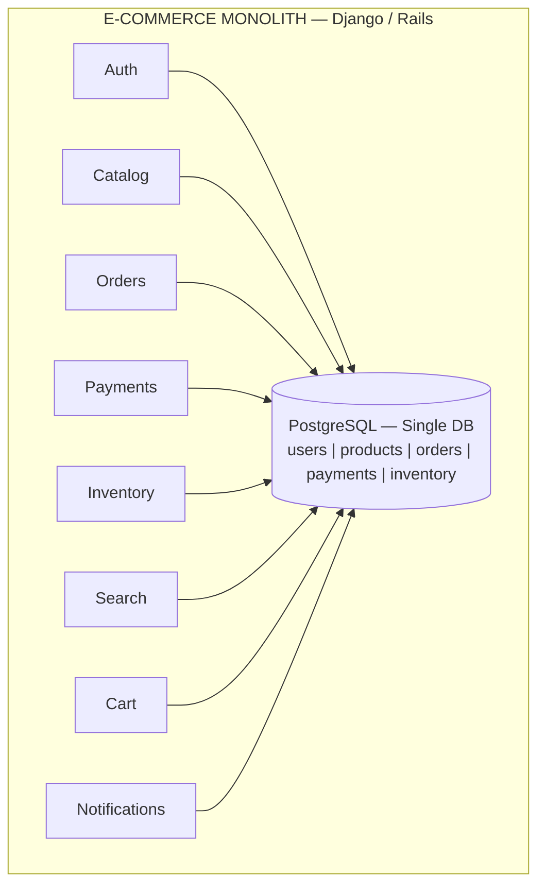

**Place Order Flow** (single ACID transaction): Validate cart → Check inventory → Create order → Process payment → Send notification → COMMIT. If payment fails, everything rolls back automatically.

### Microservices Version

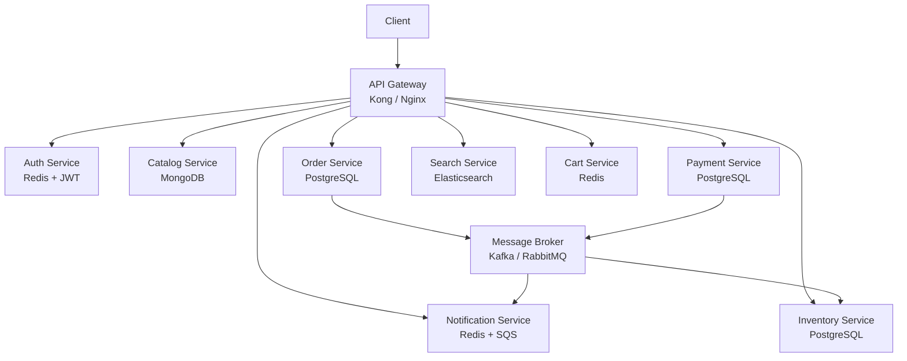

### Place Order Flow (Saga Pattern)

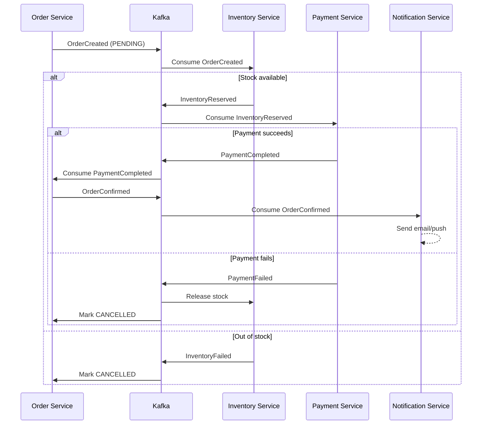

### Side-by-Side Decision

| Factor | Monolith Best | Microservices Best |
|--------|-------------|-------------------|
| Team size: 5 engineers | ✅ | |
| Team size: 50 engineers | | ✅ |
| Daily deployments by multiple teams | | ✅ |
| Search needs 10x more resources than auth | | ✅ (scale independently) |
| Need ACID transaction across order+payment | ✅ | |
| Catalog uses MongoDB, payments needs PostgreSQL | | ✅ (polyglot persistence) |
| Startup exploring product-market fit | ✅ | |
| 100M users, 99.99% uptime SLA | | ✅ |

---

## E. HLD and LLD

### E.1 HLD — Microservices E-Commerce Platform

#### Requirements

**Functional:**
- User registration and authentication
- Product catalog with search
- Shopping cart management
- Order placement and tracking
- Payment processing
- Inventory management
- Notifications (email, push)

**Non-Functional:**
- 10M DAU, 100K concurrent users
- Order placement < 500ms (p99)
- 99.9% availability
- Catalog eventually consistent (OK if product update takes 1-2 seconds)
- Payments must be strongly consistent (no double charges)

#### Capacity Estimation

```
DAU: 10M
Avg sessions/user/day: 2
Avg product views/session: 10
Avg orders/user/day: 0.05 (5% conversion)

Product View QPS: 10M × 2 × 10 / 86,400 ≈ 2,300 req/sec
Peak Product QPS: 2,300 × 3 ≈ 7,000 req/sec

Order QPS: 10M × 0.05 / 86,400 ≈ 6 orders/sec
Peak Order QPS: 6 × 5 ≈ 30 orders/sec (flash sales)

Product catalog size: 1M products × 5 KB = 5 GB
Order storage/year: 10M × 0.05 × 365 × 2 KB = 365 GB/year
```

#### API Design

```
Auth Service:
  POST   /auth/register        { email, password, name }
  POST   /auth/login           { email, password } → { token }
  POST   /auth/refresh         { refresh_token } → { token }

Catalog Service:
  GET    /products?q=&category=&page=&limit=
  GET    /products/{id}
  POST   /products             { name, price, category, ... }  (admin)
  PUT    /products/{id}        { updated fields }              (admin)

Cart Service:
  GET    /cart                  → { items: [...] }
  POST   /cart/items           { product_id, quantity }
  PUT    /cart/items/{id}      { quantity }
  DELETE /cart/items/{id}

Order Service:
  POST   /orders               { cart_id, shipping_address, payment_method }
  GET    /orders/{id}          → { order details + status }
  GET    /orders?user_id=&status=&page=

Payment Service:
  POST   /payments             { order_id, amount, method }
  GET    /payments/{id}        → { payment status }

All requests include: Authorization: Bearer <JWT>
```

#### Database Choices

| Service | Database | Why |
|---------|----------|-----|
| **Auth** | Redis + PostgreSQL | Redis for sessions/tokens; Postgres for user records |
| **Catalog** | MongoDB + Elasticsearch | Flexible product schema; full-text search |
| **Cart** | Redis | Fast in-memory access; TTL for abandoned carts |
| **Orders** | PostgreSQL | ACID transactions; structured order data |
| **Payments** | PostgreSQL | Strong consistency; audit requirements |
| **Inventory** | PostgreSQL | Accurate stock counts; ACID for decrement |
| **Notifications** | Redis (queue) + DynamoDB (log) | Queue for processing; log for delivery tracking |

#### Architecture Diagram

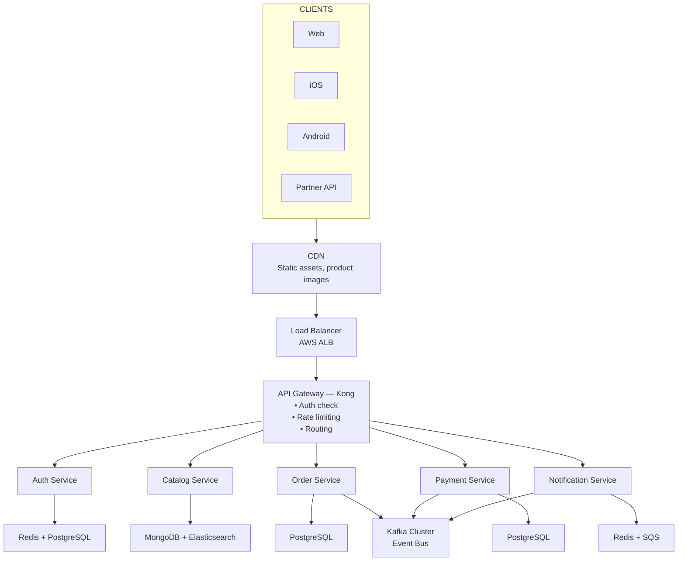

#### Scaling Approach

| Service | Scaling Strategy | Why |
|---------|-----------------|-----|
| **API Gateway** | Horizontal + managed (Kong/AWS) | High traffic entry point |
| **Auth** | Horizontal (stateless with JWT) | High volume, low compute |
| **Catalog** | Horizontal + Elasticsearch replicas | Read-heavy (7K QPS) |
| **Cart** | Horizontal + Redis Cluster | Session-like data, high concurrency |
| **Orders** | Horizontal + DB read replicas | Write-moderate, read-heavy (order history) |
| **Payments** | Horizontal (carefully) + DB | Must be idempotent; consistency critical |
| **Inventory** | Horizontal + DB sharding by region | Hot path during checkout |
| **Kafka** | Add partitions + brokers | Scale with event volume |

#### Trade-offs

| Decision | Chosen | Alternative | Why |
|----------|--------|------------|-----|
| **Saga vs 2PC** for orders | Saga (choreography) | 2PC (distributed lock) | Saga scales better; 2PC is blocking |
| **MongoDB vs Postgres** for catalog | MongoDB | PostgreSQL | Flexible product schema; products vary wildly |
| **Redis vs DB** for cart | Redis | PostgreSQL | Cart is ephemeral; speed matters; TTL for cleanup |
| **Kafka vs RabbitMQ** for events | Kafka | RabbitMQ | Log-based (replay), higher throughput, ordering guarantees |
| **JWT vs Session** for auth | JWT | Server-side sessions | Stateless; scales with horizontal app servers |

---

### E.2 LLD — Service Communication Module

#### Classes and Components

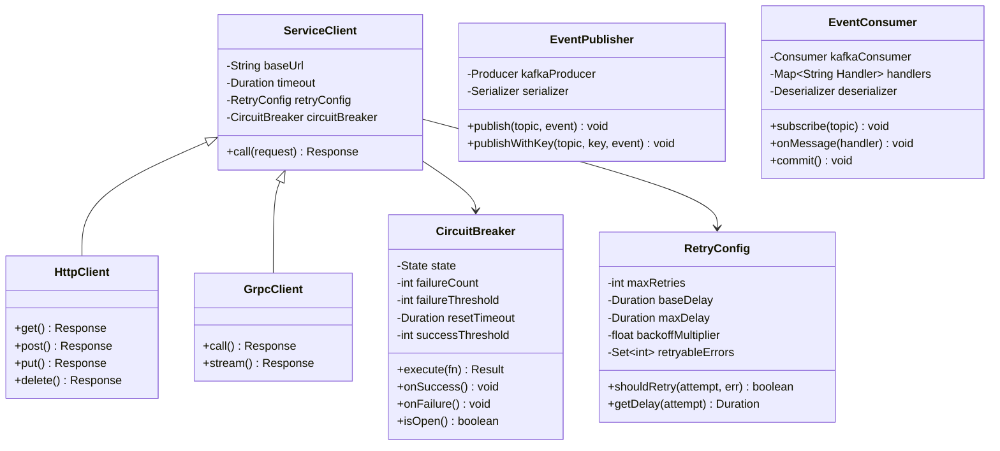

#### Data Models

```java
public class OrderCreatedEvent {
    private String eventId;        // UUID — for idempotency
    private String eventType;      // "order.created"
    private LocalDateTime timestamp;
    private int version;           // Schema version
    private String orderId;
    private String userId;
    private List<OrderItem> items;
    private double totalAmount;
    private String currency;
    private Address shippingAddress;
}

public class OrderItem {
    private String productId;
    private int quantity;
    private double price;
}

public class InventoryReservedEvent {
    private String eventId;
    private String eventType;      // "inventory.reserved"
    private LocalDateTime timestamp;
    private int version;
    private String orderId;
    private String reservationId;
    private List<ReservationItem> items;
    private LocalDateTime expiresAt; // Reservation TTL
}

public class ReservationItem {
    private String productId;
    private int quantity;
    private String warehouse;
}

public class PaymentCompletedEvent {
    private String eventId;
    private String eventType;      // "payment.completed"
    private LocalDateTime timestamp;
    private int version;
    private String orderId;
    private String paymentId;
    private double amount;
    private String currency;
    private String method;         // "credit_card", "paypal"
    private String transactionRef;
}
```

#### Sequence Flow — Order Placement Saga

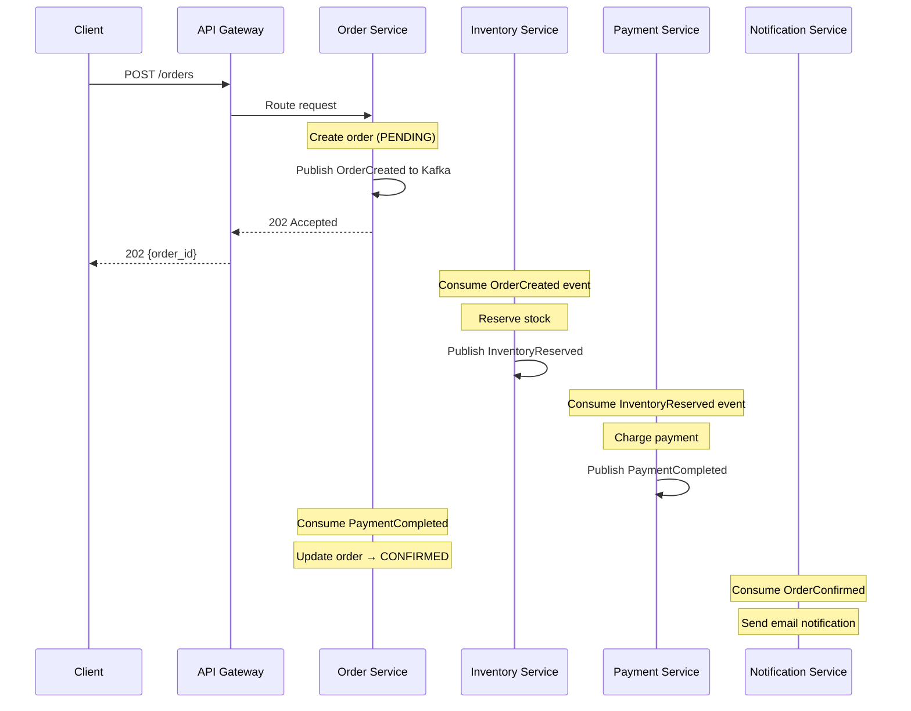

#### Pseudocode — Circuit Breaker

```java
public class CircuitBreaker {
    enum State { CLOSED, OPEN, HALF_OPEN }

    private State state = State.CLOSED;
    private int failureCount = 0;
    private int successCount = 0;
    private final int failureThreshold;
    private final long resetTimeoutMs;
    private final int successThreshold;
    private long lastFailureTime = 0;

    public CircuitBreaker(int failureThreshold, long resetTimeoutMs, int successThreshold) {
        this.failureThreshold = failureThreshold;
        this.resetTimeoutMs = resetTimeoutMs;
        this.successThreshold = successThreshold;
    }

    public <T> T execute(Supplier<T> fn) {
        if (state == State.OPEN) {
            if (shouldAttemptReset()) state = State.HALF_OPEN;
            else throw new RuntimeException("Circuit is OPEN; request blocked");
        }
        try {
            T result = fn.get();
            onSuccess();
            return result;
        } catch (Exception e) {
            onFailure();
            throw e;
        }
    }

    private void onSuccess() {
        if (state == State.HALF_OPEN) {
            successCount++;
            if (successCount >= successThreshold) {
                state = State.CLOSED;
                failureCount = 0; successCount = 0;
            }
        } else { failureCount = 0; }
    }

    private void onFailure() {
        failureCount++;
        lastFailureTime = System.currentTimeMillis();
        successCount = 0;
        if (failureCount >= failureThreshold) state = State.OPEN;
    }

    private boolean shouldAttemptReset() {
        return (System.currentTimeMillis() - lastFailureTime) > resetTimeoutMs;
    }
}
```

#### Edge Cases

| Edge Case | How to Handle |
|-----------|--------------|
| Payment succeeds but event publish fails | Use outbox pattern: write event to DB, then publish asynchronously |
| Inventory reserved but payment times out | Reservation has TTL; if payment doesn't confirm, stock is released |
| Duplicate event consumed | Idempotency: check `event_id` before processing; store processed IDs |
| Service deployed with incompatible event schema | Schema registry (Avro/Protobuf); versioned events; backward compatibility |
| Kafka broker goes down | Kafka replication (3 replicas); producer retries with backoff |
| Order Service crashes mid-saga | On restart, read incomplete orders from DB and resume/compensate |
| User cancels order after payment but before shipping | Publish "OrderCancelled" event; Payment Service issues refund |
| Flash sale: 10,000 concurrent orders for 100 items | Inventory Service uses optimistic locking or Redis atomic decrement |

---

## F. Summary & Practice

### Key Takeaways

1. **Monolith** = single deployable unit; simpler, faster to start, but harder to scale organizationally
2. **Microservices** = independently deployable services; scales teams and components separately, but adds distributed system complexity
3. **Start monolith, migrate later** is the safest default strategy for most teams
4. **Modular Monolith** gives you clean boundaries without distributed system overhead — best of both worlds for many cases
5. **Service boundaries** should align with business capabilities (DDD bounded contexts), not technical layers
6. **Data consistency** is the hardest challenge in microservices — use Sagas, not distributed transactions
7. **Conway's Law** is real — your architecture will mirror your team structure
8. **Operational cost** of microservices is 5-10x higher — you need organizational benefits to justify it
9. **Strangler Fig** is the safest migration pattern — replace pieces incrementally, not all at once
10. Never use microservices because it's "trendy" — justify with concrete team size, scaling, and deployment needs

### Revision Checklist

- [ ] Can I explain monolith and microservices in one sentence each?
- [ ] Can I list 5 advantages and 5 disadvantages of each?
- [ ] Can I draw both architectures for the same system?
- [ ] Do I know when to choose monolith vs microservices? (decision criteria)
- [ ] Can I explain the Saga pattern and when it's needed?
- [ ] Can I explain the Strangler Fig migration pattern?
- [ ] Do I know what a Modular Monolith is and why it matters?
- [ ] Can I explain Conway's Law and its practical impact?
- [ ] Can I name 5 operational challenges unique to microservices?
- [ ] Do I understand the data consistency trade-off between monolith and microservices?
- [ ] Can I explain the Circuit Breaker pattern?
- [ ] Can I list tools needed for microservices (service mesh, tracing, gateway)?

### Interview Questions

**Conceptual:**

1. What is the difference between a monolith and microservices?
2. When would you choose a monolith over microservices?
3. What is a modular monolith? When is it appropriate?
4. What is Conway's Law and how does it affect architecture decisions?
5. What are bounded contexts and how do they relate to microservice boundaries?

**Design & Trade-offs:**

6. How do you handle transactions that span multiple microservices?
7. Explain the Saga pattern with an example.
8. What is the Strangler Fig pattern? Walk me through a migration.
9. How do you handle a microservice that another service depends on going down?
10. What's the difference between orchestration and choreography in sagas?

**Operational:**

11. What tools and infrastructure do you need to run microservices in production?
12. How do you debug a request that fails across 5 different services?
13. How do you handle schema changes in events between services?
14. What is a service mesh? When do you need one?
15. How do you ensure idempotency in event-driven microservices?

### Practice Exercises

1. **Exercise 1**: You're building a social media platform for 10,000 users (startup). Would you choose monolith or microservices? List 5 reasons.

2. **Exercise 2**: Draw both monolith and microservices architectures for a food delivery app (like UberEats). Include: User, Restaurant, Order, Delivery, Payment, and Notification modules. For the microservices version, show how the "place order" flow works using the Saga pattern.

3. **Exercise 3**: Your monolith e-commerce app has grown to 200 engineers and deployments take 3 hours due to merge conflicts. Design a migration plan using the Strangler Fig pattern. Which service would you extract first and why?

4. **Exercise 4**: Implement a Circuit Breaker class in your preferred language with the three states (CLOSED, OPEN, HALF_OPEN). Write unit tests for:
   - Normal operation (CLOSED state)
   - Transitioning to OPEN after N failures
   - Transitioning to HALF_OPEN after timeout
   - Recovering back to CLOSED after N successes in HALF_OPEN

5. **Exercise 5**: Compare the operational cost (infrastructure, team, tooling) of running the same application as a monolith vs 8 microservices. List every component you'd need for each approach and estimate the monthly cloud cost.

---

> **Previous**: [02 — Client-Server Architecture](02-client-server-architecture.md)
> **Next**: [04 — Latency vs Throughput](04-latency-vs-throughput.md)
