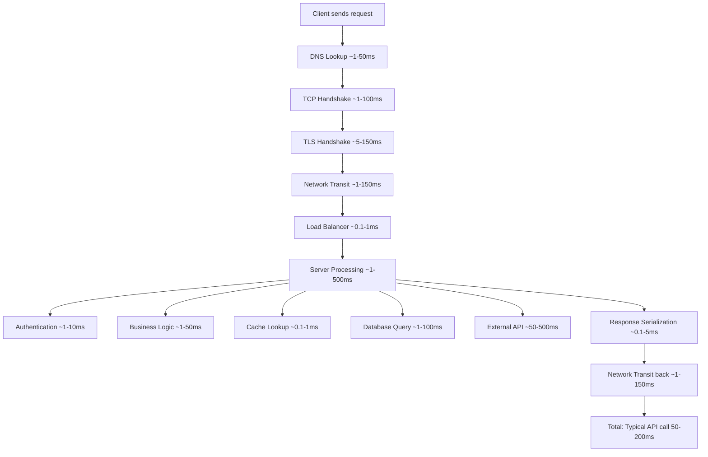
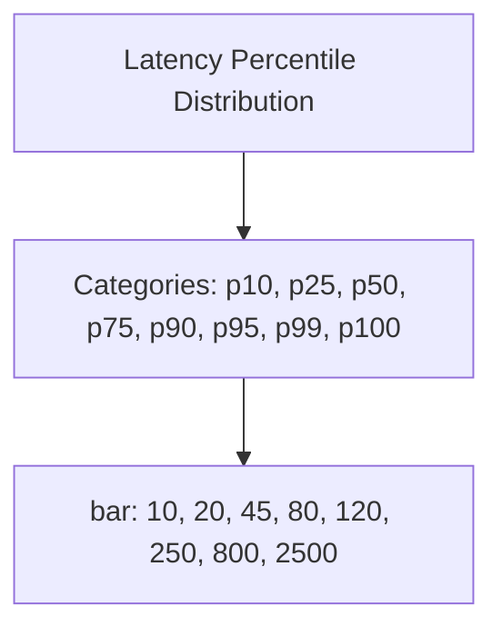
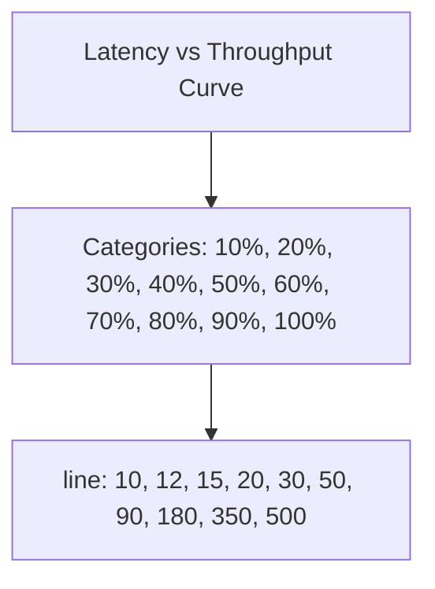
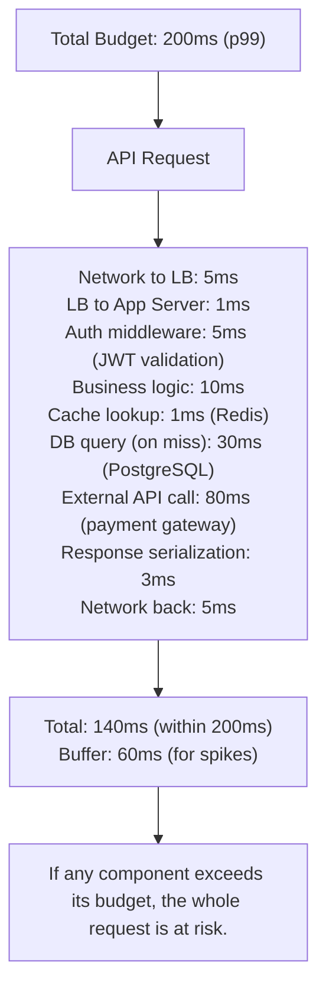
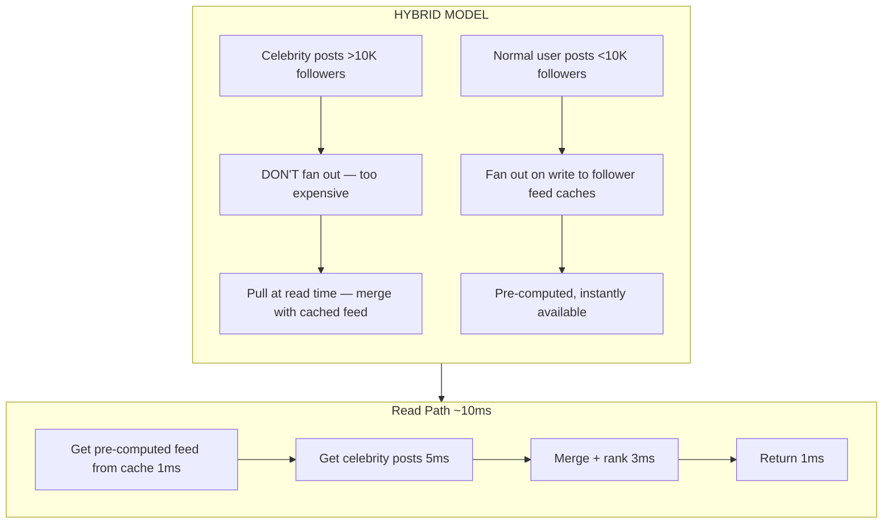
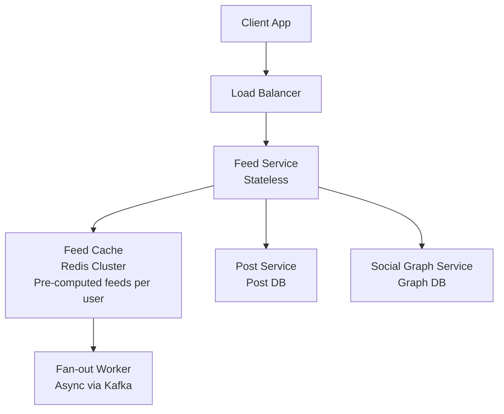
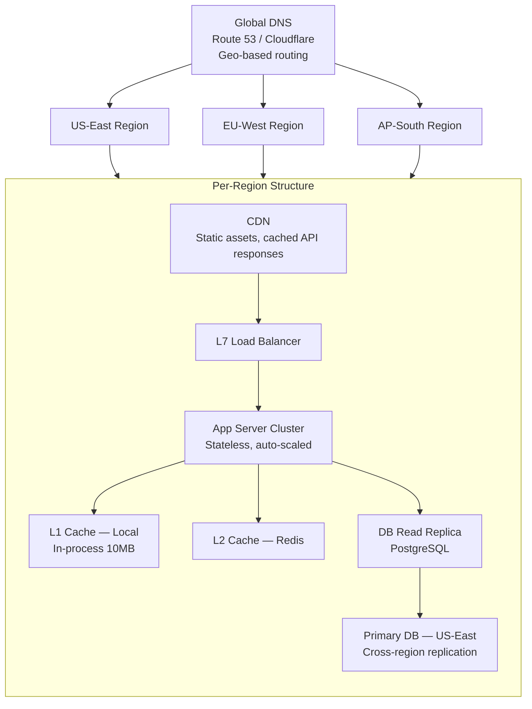
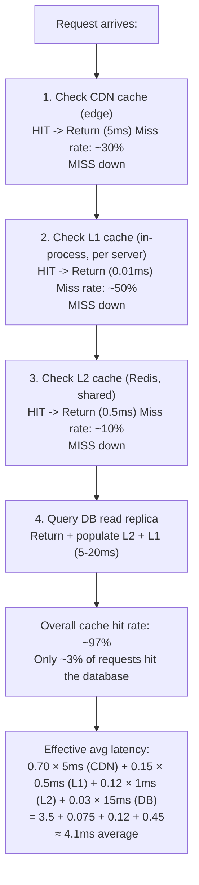
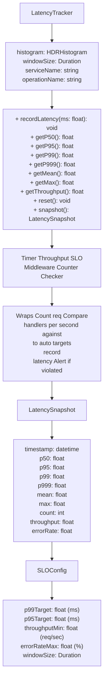
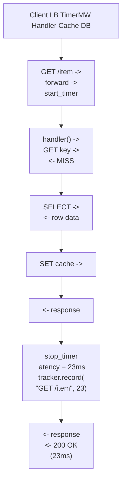

# Topic 4: Latency vs Throughput

> **Track**: Core Concepts — Fundamentals
> **Difficulty**: Beginner → Intermediate
> **Prerequisites**: Topic 1 — What is System Design, Topic 2 — Client-Server Architecture

---

## Table of Contents

- [A. Concept Explanation](#a-concept-explanation)
- [B. Interview View](#b-interview-view)
- [C. Practical Engineering View](#c-practical-engineering-view)
- [D. Example](#d-example)
- [E. HLD and LLD](#e-hld-and-lld)
- [F. Summary & Practice](#f-summary--practice)

---

## A. Concept Explanation

### Definitions

**Latency** is the time it takes for a single request to travel from the client to the server and back. It answers: *"How long does one operation take?"*

**Throughput** is the number of operations a system can handle per unit of time. It answers: *"How many operations can we do per second?"*

```
LATENCY = Time for ONE request (measured in ms or seconds)
THROUGHPUT = Requests handled per SECOND (measured in req/sec, QPS, TPS, RPS)

Analogy — Highway:
  Latency    = How long it takes ONE car to drive from A to B
  Throughput = How many cars pass a point per hour
  Bandwidth  = How many lanes the highway has (maximum capacity)
```

### The Three Related Metrics

| Metric | Definition | Unit | Question |
|--------|-----------|------|----------|
| **Latency** | Time for a single operation | ms, μs, s | "How fast is one request?" |
| **Throughput** | Operations per unit time | req/sec, QPS | "How many requests per second?" |
| **Bandwidth** | Maximum theoretical capacity | Mbps, Gbps | "What's the max the pipe can carry?" |

```
Relationship:

  Bandwidth is the PIPE SIZE (theoretical max)
  Throughput is the ACTUAL FLOW (what you achieve)
  Latency is how FAST each drop moves through the pipe

  Throughput ≤ Bandwidth (always)
  
  You can have:
    High bandwidth + high latency  (satellite internet: fast downloads, slow ping)
    Low bandwidth + low latency    (local serial connection: fast response, slow bulk)
    High throughput + high latency  (batch processing: lots of work, each takes time)
    Low latency + low throughput   (single-threaded real-time: instant response, one at a time)
```

### Latency Breakdown — Where Does Time Go?



### Latency Percentiles — Why Average Lies

Never measure latency with just the **average**. Use **percentiles**:

```
Example: 100 requests, sorted by latency:

  Request  1: 10ms
  Request  2: 12ms
  ...
  Request 50: 45ms   ← p50 (median): 50% of requests are faster than this
  ...
  Request 90: 120ms  ← p90: 90% of requests are faster than this
  Request 95: 250ms  ← p95: 95% are faster
  Request 99: 800ms  ← p99: 99% are faster (tail latency)
  Request100: 2500ms ← p100 (max): worst case

  Average: 85ms  ← Hides the fact that 1% of users wait 800ms+
```

**Why percentiles matter:**
- **p50** = typical user experience
- **p95/p99** = worst-case user experience (the "tail")
- **Amazon found**: every 100ms of latency = 1% decrease in sales
- **Google found**: 500ms extra latency = 20% traffic drop
- Tail latency matters because high-value customers often trigger complex queries (more data, more items, more history) → they experience p99



> **Most users** (p50 and below) get fast responses. The **tail** (p99+) experiences 10-50x worse latency — and these are often your highest-value customers.

### The Latency-Throughput Trade-off

Latency and throughput are **often inversely related** under load:



> As throughput increases → latency stays flat initially → then rises gradually → then **EXPLODES** near capacity. **Rule of thumb**: Operate at 50-70% of max throughput to keep latency reasonable.

**Why this happens:**
- At low load: plenty of resources → fast responses
- At moderate load: some queuing → slightly slower
- Near capacity: heavy queuing, resource contention → latency spikes
- Over capacity: requests time out, errors occur → system degrades

### Techniques to Reduce Latency

| Technique | How It Helps | Latency Reduction |
|-----------|-------------|------------------|
| **Caching** | Avoid recomputation/DB hits | DB query (5-50ms) → Cache (0.1-1ms) |
| **CDN** | Serve content closer to user | 150ms → 20ms (geographic proximity) |
| **Connection pooling** | Skip TCP/TLS handshake | Save 50-300ms per request |
| **Read replicas** | Distribute read load | Reduce DB query latency under load |
| **Async processing** | Don't wait for slow operations | Remove slow steps from critical path |
| **Compression** | Reduce data on the wire | Faster network transit |
| **Indexing** | Speed up DB lookups | Full scan (100ms) → Index lookup (1ms) |
| **Denormalization** | Avoid JOINs | Multi-table join (50ms) → Single read (5ms) |
| **Edge computing** | Process at the edge | Reduce round-trip to origin |
| **Protocol optimization** | HTTP/2, gRPC, QUIC | Multiplexing, less overhead |
| **Pre-computation** | Compute results ahead of time | Real-time calc (200ms) → Precomputed (1ms) |
| **Batch → Pipeline** | Overlap operations | Sequential 3×100ms → Pipelined 120ms |

### Techniques to Increase Throughput

| Technique | How It Helps | Throughput Gain |
|-----------|-------------|----------------|
| **Horizontal scaling** | More servers = more capacity | Linear scaling (ideally) |
| **Load balancing** | Distribute requests evenly | Prevent hot spots |
| **Async / queues** | Decouple producer and consumer | Handle bursts gracefully |
| **Batch processing** | Group operations together | 1000 individual inserts → 1 batch insert |
| **Connection pooling** | Reuse connections | More concurrent requests |
| **Database sharding** | Split data across DBs | Each shard handles a fraction of load |
| **Caching** | Reduce backend load | Cache serves most reads |
| **Concurrency** | Multi-threading, async I/O | Utilize all CPU cores |
| **Compression** | Smaller payloads, less bandwidth | More requests fit in the pipe |
| **Rate limiting** | Prevent overload | Protect throughput for legitimate traffic |
| **Backpressure** | Slow down producers when overwhelmed | Prevent cascading failure |

### When They Conflict

Sometimes optimizing for one **hurts** the other:

| Optimization | Latency Impact | Throughput Impact | Conflict? |
|-------------|---------------|------------------|-----------|
| **Batching** | ↑ Higher (wait to fill batch) | ↑ Higher (fewer operations) | YES |
| **Caching** | ↓ Lower | ↑ Higher (less DB load) | No (both win) |
| **Compression** | ↑ Slightly higher (CPU time) | ↑ Higher (less bandwidth) | Minor |
| **Queuing** | ↑ Higher (wait in queue) | ↑ Higher (smooths bursts) | YES |
| **Replication** | ↑ Higher writes (sync to replicas) | ↑ Higher reads (more read capacity) | YES (writes) |
| **Connection pooling** | ↓ Lower | ↑ Higher | No (both win) |
| **Pre-computation** | ↓ Lower reads, ↑ Higher writes | ↑ Higher reads, ↓ Lower writes | Depends |

### Latency Numbers Every Engineer Should Know

| Operation | Latency | Notes |
|-----------|---------|-------|
| L1 cache reference | 0.5 ns | CPU cache |
| L2 cache reference | 7 ns | |
| Main memory reference | 100 ns | RAM |
| SSD random read | 150 μs | ~1000× slower than RAM |
| HDD seek | 10 ms | ~100× slower than SSD |
| Same-datacenter round trip | 0.5 ms | Fast network |
| Redis GET | 0.1-0.5 ms | In-memory cache |
| Memcached GET | 0.1-0.5 ms | In-memory cache |
| PostgreSQL simple query | 1-5 ms | Indexed query |
| PostgreSQL complex query | 10-100 ms | JOINs, aggregations |
| Send 1 MB over 1 Gbps network | 10 ms | Bandwidth bound |
| Cross-continent round trip | 100-150 ms | Speed of light limit |
| TLS handshake | 50-150 ms | Key exchange |
| DNS lookup (uncached) | 20-120 ms | Root → TLD → auth |
| External API call | 50-500 ms | Network + processing |
| Read 1 MB from SSD | 1 ms | Sequential read |
| Read 1 MB from HDD | 20 ms | Sequential read |

### Throughput Reference Numbers

| System | Typical Throughput |
|--------|-------------------|
| Single web server (Node.js) | 1K-10K req/sec |
| Single web server (Go) | 10K-50K req/sec |
| Nginx (reverse proxy) | 50K-100K req/sec |
| Redis (single node) | 100K-200K ops/sec |
| Kafka (single broker) | 100K-1M msgs/sec |
| PostgreSQL (single node) | 1K-10K QPS |
| MySQL (single node) | 1K-10K QPS |
| Cassandra (single node) | 10K-50K writes/sec |
| Elasticsearch (single node) | 1K-10K queries/sec |
| S3 (per prefix) | 5,500 reads/sec, 3,500 writes/sec |

---

## B. Interview View

### How This Topic Appears in Interviews

Latency and throughput show up in **every** system design interview:

- During **capacity estimation**: "What QPS do we need?" (throughput)
- During **non-functional requirements**: "What latency is acceptable?" (latency SLA)
- During **bottleneck analysis**: "Where is the latency coming from?"
- During **scaling discussion**: "How do we increase throughput?"
- During **trade-off discussion**: "If we batch, latency goes up but throughput improves"

### What Interviewers Expect

| Signal | What They Want to See |
|--------|----------------------|
| **Define SLAs** | "We need p99 < 200ms and 10K QPS" |
| **Identify bottlenecks** | "The DB is the bottleneck — 5ms per query × 10K QPS = saturated" |
| **Know the numbers** | "Redis can handle 100K ops/sec with <1ms latency" |
| **Percentile awareness** | "We should optimize for p99, not average" |
| **Trade-off awareness** | "Batching improves throughput but hurts latency" |
| **Practical optimization** | "Add a cache layer to reduce DB latency from 50ms to 1ms" |

### Red Flags

- Using "average latency" without mentioning percentiles
- Not knowing order-of-magnitude latency numbers (cache vs DB vs network)
- Confusing latency with throughput
- Not considering latency when adding more network hops (microservices)
- Ignoring tail latency (p99/p999)
- Claiming you can maximize both latency AND throughput simultaneously without trade-offs

### Common Follow-up Questions

1. "What's the difference between latency and response time?"
2. "Why do we use p99 instead of average?"
3. "How does adding a cache layer affect latency and throughput?"
4. "If our DB query takes 10ms and we need 50K QPS, how many DB instances do we need?"
5. "What causes tail latency? How do you reduce it?"
6. "How does batching affect latency vs throughput?"
7. "What's the latency budget for this API call? Walk me through each hop."
8. "How would you diagnose high p99 latency when p50 is fine?"

---

## C. Practical Engineering View

### Setting SLAs and SLOs

| Term | Definition | Example |
|------|-----------|---------|
| **SLI** (Service Level Indicator) | The metric you measure | p99 latency, error rate, throughput |
| **SLO** (Service Level Objective) | The target you aim for (internal) | p99 < 200ms, 99.9% availability |
| **SLA** (Service Level Agreement) | The contract with customers (external) | p99 < 500ms, 99.95% availability |

```
SLO is TIGHTER than SLA:
  SLO: p99 < 200ms   (internal target — what you engineer for)
  SLA: p99 < 500ms   (external promise — what you're contractually bound to)
  
  If you hit 300ms → SLO breached, SLA still OK
  Engineers get alerted, but customers aren't impacted yet.
  This gives you a buffer.
```

### Latency Budget

For complex systems, break down the **latency budget** per component:



### Monitoring Latency and Throughput

| What to Monitor | Tool | Alert Threshold |
|----------------|------|----------------|
| **p50 latency** | Prometheus + Grafana | Trend monitoring (no hard alert) |
| **p95 latency** | Prometheus + Grafana | > 2× baseline |
| **p99 latency** | Prometheus + Grafana | > SLO target |
| **p999 latency** | Prometheus + Grafana | > 5× baseline |
| **QPS (throughput)** | Prometheus | Drop > 20% (possible outage) |
| **Error rate** | Prometheus | > 0.1% (possibly related to overload) |
| **Saturation** | Node exporter | CPU > 80%, memory > 85% |
| **Queue depth** | Custom metrics | Growing (backpressure signal) |

### Diagnosing Latency Issues

```
High p99 but normal p50? 
  → Check: Garbage collection pauses
  → Check: Noisy neighbors (shared infrastructure)
  → Check: Cold cache (first request after eviction)
  → Check: Slow downstream dependency (external API)
  → Check: Lock contention
  → Check: DB query plan change (missing index on specific paths)

High p50 (everything is slow)?
  → Check: CPU saturation
  → Check: Memory pressure (swapping)
  → Check: Network congestion
  → Check: DB connection pool exhausted
  → Check: Inefficient query (full table scan)
  → Check: Insufficient server capacity

Latency increases over time?
  → Check: Memory leak
  → Check: Connection leak
  → Check: Data growth (tables getting larger, queries slower)
  → Check: Log file filling disk
  → Check: SSL certificate about to expire (retry storms)
```

### Real-World Optimization Case Studies

#### Case 1: Amazon — Latency Matters

```
Finding: Every 100ms of added latency → 1% drop in revenue
Action:  Aggressive caching, CDN everywhere, precomputing search results
Result:  Page loads < 200ms for most users
```

#### Case 2: Discord — Throughput at Scale

```
Problem: 7M concurrent users, millions of messages/sec
Action:  Migrated from MongoDB to Cassandra for message storage
         Used Rust for read-state tracking (from Go)
Result:  Message throughput: millions/sec with p99 < 10ms
```

#### Case 3: Google Search — Both

```
Target:  < 200ms search results
Approach: Parallel fan-out to 1000s of servers
          Respond with partial results if some servers are slow
          "Good enough" results fast > perfect results slow
Result:  0.5 second average, serving 100K+ QPS
```

### Cost of Latency Optimization

| Optimization | Implementation Cost | Operational Cost | Latency Gain |
|-------------|-------------------|-----------------|-------------|
| **CDN** | Low (plug and play) | $0.01-0.10/GB | -50 to -150ms |
| **Redis cache** | Medium (cache invalidation logic) | $50-500/mo | -5 to -50ms per hit |
| **Read replicas** | Medium (replication lag handling) | 2× DB cost | -10 to -30ms under load |
| **DB indexing** | Low (schema change) | Storage + write overhead | -10 to -100ms |
| **Pre-computation** | High (pipeline + storage) | Compute + storage | -50 to -500ms |
| **Edge functions** | Medium (deployment complexity) | $0.5-1/M invocations | -30 to -100ms |
| **Protocol upgrade (gRPC)** | High (rewrite APIs) | Minimal | -5 to -20ms |

---

## D. Example: News Feed — Optimizing for Latency and Throughput

### Problem

Design the backend for a social media news feed where:
- 100M DAU
- Each user checks feed 10 times/day
- Average feed shows 20 posts
- Feed generation must be < 200ms (p99)
- System must handle 12K+ feed requests/sec

### Approach 1: Pull Model (Compute on Read) — Low Throughput, Variable Latency

```
User opens app → Request feed → Server queries:
  1. Get user's friends list (5ms)
  2. For each friend, get recent posts (N × 3ms)
  3. Merge + rank posts (10ms)
  4. Return top 20 (2ms)
  
If user has 500 friends:
  5ms + (500 × 3ms) + 10ms + 2ms = ~1,517ms ← WAY TOO SLOW

Throughput limited by: DB queries per request (500+ queries!)
```

### Approach 2: Push Model (Fan-out on Write) — High Throughput, Low Latency

```
When a user creates a post:
  1. Write to posts table (5ms)
  2. Get follower list (3ms)
  3. For each follower, push to their feed cache (async)
  
When a user reads their feed:
  1. Read pre-computed feed from cache (1ms)
  2. Return top 20 (1ms)
  
  Total read latency: ~2ms ← FAST

But: If a celebrity has 10M followers:
  Fan-out = 10M cache writes per post ← EXPENSIVE
  At 1 post/min: 10M writes/min = 167K writes/sec
```

### Approach 3: Hybrid (What Facebook/Twitter Actually Do)



### Architecture



**Write Path** (fan-out on write): Post created → Kafka → Fan-out Worker → Write to each follower's feed cache

**Read Path**: Client → Feed Service → Redis (pre-computed feed) + merge celebrity posts → Return

### Latency and Throughput Analysis

```
Read Path Latency Budget:
  LB → Feed Service:        1ms
  Redis cache lookup:        1ms (pre-computed feed)
  Celebrity posts fetch:     5ms (for users following celebrities)
  Ranking / merge:           3ms
  Response:                  1ms
  Total:                    11ms (p50), ~30ms (p99) ✓ well within 200ms

Read Throughput:
  Target: 12K req/sec
  Redis: 100K+ ops/sec (single node handles it easily)
  Feed Service: 10K req/sec per instance × 2 instances = 20K (with headroom)

Write Path (fan-out):
  Normal post (avg 300 followers): 300 cache writes in ~50ms (async)
  Celebrity post (1M followers): Skip fan-out, pull on read
  Total write throughput: 500 posts/sec × 300 avg followers = 150K cache writes/sec
  Redis cluster (3 nodes): handles 300K+ writes/sec ✓
```

---

## E. HLD and LLD

### E.1 HLD — Latency-Optimized API Service

#### Requirements

**Functional:**
- Serve product details API for an e-commerce site
- Support search, filtering, and recommendations

**Non-Functional:**
- p50 < 50ms, p99 < 200ms
- 20K QPS sustained, 60K QPS peak
- 99.9% availability
- Serve users globally (multi-region)

#### Capacity Estimation

```
DAU: 20M
Sessions/user/day: 3
API calls/session: 15
Total daily requests: 20M × 3 × 15 = 900M
QPS: 900M / 86,400 ≈ 10,400 req/sec
Peak QPS: 10,400 × 3 ≈ 31,200 req/sec

Product catalog: 2M products × 5 KB = 10 GB
Cache size (20% hot data): 2 GB
Response size: 5 KB average
Bandwidth: 31,200 × 5 KB = 156 MB/sec
```

#### Architecture Diagram — Multi-Region, Latency-Optimized



**Latency at each layer**: CDN hit: 5-20ms · L1 cache: 0.01ms · L2 cache (Redis): 0.5ms · DB read replica: 3-10ms · DB primary: 3-10ms + replication lag

#### Multi-Layer Caching Strategy



#### Scaling Approach

| Component | Scaling Strategy | Handles |
|-----------|-----------------|---------|
| **DNS** | Managed (Route 53) | Geo-routing |
| **CDN** | Auto-scaled (CloudFront) | 100K+ req/sec per edge |
| **LB** | Managed (ALB) | 50K+ concurrent connections |
| **App Servers** | Horizontal, auto-scale on CPU/QPS | 5K-10K req/sec each |
| **L1 Cache** | Per-server (scales with servers) | 10K lookups/sec each |
| **L2 Cache** | Redis Cluster (3-6 nodes) | 300K+ ops/sec |
| **DB Read Replicas** | Add replicas per region | 5K QPS each |
| **Primary DB** | Vertical scaling + sharding if needed | 10K writes/sec |

#### Bottlenecks and Mitigations

| Bottleneck | Impact | Mitigation |
|-----------|--------|-----------|
| Cold cache (after deploy/restart) | Latency spike (p99 ↑) | Cache warming: preload hot data on startup |
| Cache stampede | 1000 requests hit DB simultaneously for same key | Request coalescing / single-flight pattern |
| Cross-region DB latency | 100-150ms for writes | Write to local queue, async replicate |
| Hot product (viral item) | Single key overloaded in cache | Replicate hot keys across cache nodes |
| GC pauses (JVM/Go) | p99 spikes | Tune GC, reduce allocations, consider Rust/C++ |

#### Trade-offs

| Decision | Chosen | Alternative | Why |
|----------|--------|------------|-----|
| **Multi-region** | Yes | Single region + CDN | Need <50ms p99 globally |
| **L1 + L2 cache** | Both | L2 only (Redis) | L1 eliminates network hop for hottest data |
| **Eventual consistency** | Yes for catalog | Strong consistency | Catalog changes infrequently; 1-2s lag OK |
| **Read replicas** | Per-region | Single primary | Reduce cross-region latency for reads |

---

### E.2 LLD — Latency Measurement and Reporting Module

#### Classes and Components



#### Interfaces

```java
public interface LatencyTracker {
    /** Record a single latency measurement */
    void record(String operation, double latencyMs);

    /** Get latency at a given percentile (e.g., 0.99 for p99) */
    double getPercentile(String operation, double percentile);

    /** Get current throughput in req/sec */
    double getThroughput(String operation);

    /** Get a point-in-time snapshot of all metrics */
    LatencySnapshot snapshot(String operation);

    /** Check if current metrics meet SLO targets */
    SLOResult checkSlo(String operation, SLOConfig config);
}

public class TimerMiddleware {
    private final LatencyTracker tracker;

    public TimerMiddleware(LatencyTracker tracker) { this.tracker = tracker; }

    public Response process(Request request, Response response, Handler nextHandler) {
        // implementation
        return null;
    }
}

public class MetricsExporter {
    public void exportToPrometheus(LatencySnapshot snapshot) { }
    public void exportToDatadog(LatencySnapshot snapshot) { }
}
```

#### Data Models

```sql
-- Latency metrics storage (for historical analysis)
CREATE TABLE latency_metrics (
    id              BIGSERIAL PRIMARY KEY,
    service_name    VARCHAR(100) NOT NULL,
    operation       VARCHAR(200) NOT NULL,
    timestamp       TIMESTAMP NOT NULL,
    window_seconds  INT NOT NULL,           -- Aggregation window
    p50_ms          DECIMAL(10,2),
    p95_ms          DECIMAL(10,2),
    p99_ms          DECIMAL(10,2),
    p999_ms         DECIMAL(10,2),
    mean_ms         DECIMAL(10,2),
    max_ms          DECIMAL(10,2),
    request_count   BIGINT,
    error_count     BIGINT,
    throughput_rps  DECIMAL(10,2)
);

CREATE INDEX idx_latency_metrics_lookup 
    ON latency_metrics(service_name, operation, timestamp DESC);

-- SLO violation log
CREATE TABLE slo_violations (
    id              BIGSERIAL PRIMARY KEY,
    service_name    VARCHAR(100) NOT NULL,
    operation       VARCHAR(200) NOT NULL,
    violation_type  VARCHAR(50) NOT NULL,    -- 'p99_exceeded', 'throughput_low'
    target_value    DECIMAL(10,2),
    actual_value    DECIMAL(10,2),
    timestamp       TIMESTAMP NOT NULL,
    resolved_at     TIMESTAMP,
    duration_sec    INT
);

CREATE INDEX idx_slo_violations_active 
    ON slo_violations(service_name, resolved_at) 
    WHERE resolved_at IS NULL;
```

#### Pseudocode — Latency Tracker with HDR Histogram

```java
public class LatencyTrackerImpl implements LatencyTracker {
    private final int windowSizeSec;
    private final Map<String, List<Double>> buckets = new HashMap<>();
    private final Map<String, Integer> counts = new HashMap<>();
    private long windowStart = System.currentTimeMillis();

    public LatencyTrackerImpl(int windowSizeSec) { this.windowSizeSec = windowSizeSec; }

    @Override
    public void record(String operation, double latencyMs) {
        maybeRotateWindow();
        buckets.computeIfAbsent(operation, k -> new ArrayList<>()).add(latencyMs);
        counts.merge(operation, 1, Integer::sum);
    }

    @Override
    public double getPercentile(String operation, double percentile) {
        List<Double> values = new ArrayList<>(buckets.getOrDefault(operation, List.of()));
        if (values.isEmpty()) return 0.0;
        Collections.sort(values);
        int index = Math.min((int)(values.size() * percentile), values.size() - 1);
        return values.get(index);
    }

    @Override
    public double getThroughput(String operation) {
        double elapsed = (System.currentTimeMillis() - windowStart) / 1000.0;
        if (elapsed <= 0) return 0.0;
        return counts.getOrDefault(operation, 0) / elapsed;
    }

    @Override
    public LatencySnapshot snapshot(String operation) {
        return new LatencySnapshot(
            System.currentTimeMillis(), operation,
            getPercentile(operation, 0.50), getPercentile(operation, 0.95),
            getPercentile(operation, 0.99), getPercentile(operation, 0.999),
            mean(operation),
            buckets.getOrDefault(operation, List.of(0.0)).stream()
                .mapToDouble(Double::doubleValue).max().orElse(0),
            counts.getOrDefault(operation, 0),
            getThroughput(operation)
        );
    }

    @Override
    public SLOResult checkSlo(String operation, SLOConfig config) {
        LatencySnapshot snap = snapshot(operation);
        List<String> violations = new ArrayList<>();
        if (snap.getP99() > config.getP99TargetMs())
            violations.add("p99_exceeded");
        if (snap.getThroughputRps() < config.getMinThroughput())
            violations.add("throughput_low");
        return new SLOResult(violations.isEmpty(), violations, snap);
    }

    private double mean(String operation) {
        List<Double> values = buckets.getOrDefault(operation, List.of());
        return values.isEmpty() ? 0.0 :
            values.stream().mapToDouble(Double::doubleValue).average().orElse(0);
    }

    private void maybeRotateWindow() {
        if (System.currentTimeMillis() - windowStart > windowSizeSec * 1000L) {
            buckets.clear(); counts.clear();
            windowStart = System.currentTimeMillis();
        }
    }
}

public class TimerMiddleware {
    private final LatencyTracker tracker;

    public TimerMiddleware(LatencyTracker tracker) { this.tracker = tracker; }

    public Response process(Request request, Response response, Handler nextHandler) {
        String operation = request.getMethod() + " " + request.getPath();
        long start = System.nanoTime();
        try {
            return nextHandler.handle(request);
        } finally {
            double latencyMs = (System.nanoTime() - start) / 1_000_000.0;
            tracker.record(operation, latencyMs);
        }
    }
}
```

#### Sequence Flow — Request with Latency Tracking



#### Edge Cases

| Edge Case | How to Handle |
|-----------|--------------|
| Timer overflow (extremely long request) | Set max recording value (e.g., 60s); treat as timeout |
| Clock skew between servers | Use monotonic clock for latency, wall clock for timestamps |
| High cardinality operations (unique URLs) | Normalize paths: `/users/123` → `/users/{id}` |
| Histogram memory grows unbounded | Use fixed-bucket histogram or sliding window with rotation |
| Latency tracking adds latency | Keep tracker overhead < 0.01ms; use lock-free data structures |
| SLO check false alarm during deploy | Exclude warmup period; use minimum sample size before alerting |
| Cross-service latency (distributed tracing) | Propagate trace context (W3C TraceContext header) |
| Time zones in metrics | Always use UTC for timestamps; convert at display layer |

---

## F. Summary & Practice

### Key Takeaways

1. **Latency** = time for one request; **Throughput** = requests per second; **Bandwidth** = max capacity
2. **Always use percentiles** (p50, p95, p99) — averages hide tail latency
3. **p99 matters most** — Amazon found 100ms extra = 1% revenue loss
4. Latency and throughput are **inversely related under load** — operate at 50-70% capacity
5. **Multi-layer caching** (CDN → L1 in-process → L2 Redis → DB) is the most effective latency optimization
6. **Know the numbers**: Redis ~0.5ms, DB ~5-50ms, cross-continent ~150ms
7. **Latency budget**: break down the total SLA across each component in the request path
8. **Batching improves throughput but hurts latency** — a key trade-off to discuss in interviews
9. **Cache stampede** and **cold cache** are common causes of latency spikes
10. **Monitor p99, not average** — set SLOs tighter than SLAs for safety margin

### Revision Checklist

- [ ] Can I define latency, throughput, and bandwidth and explain how they relate?
- [ ] Can I explain why we use p99 instead of average?
- [ ] Can I draw the latency-throughput curve and explain the "knee"?
- [ ] Do I know latency numbers for: L1 cache, RAM, SSD, Redis, PostgreSQL, cross-continent?
- [ ] Can I break down a request into a latency budget (component-by-component)?
- [ ] Can I list 5 techniques to reduce latency and 5 to increase throughput?
- [ ] Do I understand when optimizing one hurts the other (batching, queuing)?
- [ ] Can I explain multi-layer caching and cache hit rate calculations?
- [ ] Do I know what SLI, SLO, and SLA mean and how they differ?
- [ ] Can I diagnose high p99 latency (GC, cold cache, slow dependency, lock contention)?
- [ ] Can I explain the pull vs push model trade-off for news feed?

### Interview Questions

**Conceptual:**

1. What is the difference between latency and throughput?
2. Why do we use p99 instead of average latency?
3. What is tail latency and why does it matter?
4. How are latency and throughput related under increasing load?
5. What's the difference between bandwidth and throughput?

**Design & Optimization:**

6. How would you reduce the latency of a product page from 500ms to 100ms?
7. Walk me through the latency budget for an API call that goes through LB → app → cache → DB.
8. How does adding a cache layer affect both latency and throughput?
9. When does batching make sense? What's the trade-off?
10. How would you design a multi-region system to serve users with <50ms latency globally?

**Operational & Debugging:**

11. How would you diagnose high p99 latency when p50 is fine?
12. What causes cache stampede and how do you prevent it?
13. What's the difference between SLI, SLO, and SLA? Give an example.
14. How would you handle a latency spike during a cache cold start?
15. Your DB QPS is 5K and each query takes 5ms. Can you serve 10K QPS? What's the solution?

### Practice Exercises

1. **Exercise 1**: Given these latency numbers — Redis: 0.5ms, PostgreSQL: 10ms, External API: 100ms, Network: 5ms — calculate the total p50 latency for an API that hits Redis (cache miss 20%), then PostgreSQL, then an external payment API. Draw the latency budget.

2. **Exercise 2**: Your system serves 50K QPS and you need p99 < 100ms. Currently p99 is 300ms. The latency breakdown is: 5ms (network) + 2ms (auth) + 250ms (DB query) + 10ms (serialization). Propose 3 specific optimizations and estimate the new p99 for each.

3. **Exercise 3**: Design a news feed system. Compare pull model (compute on read) vs push model (fan-out on write). For a user with 500 friends, calculate the latency and throughput for each approach. When would you use a hybrid?

4. **Exercise 4**: Build a latency monitoring dashboard. List: (a) the 5 most important metrics to display, (b) the alert thresholds for each, (c) a runbook for when p99 latency exceeds the SLO.

5. **Exercise 5**: A system has 3 services in a chain: A → B → C. Each has p99 = 50ms. What's the worst-case p99 for the entire chain? How do you reduce it? (Hint: percentiles don't add linearly.)

---

> **Previous**: [03 — Monolith vs Microservices](03-monolith-vs-microservices.md)
> **Next**: [05 — Scalability](05-scalability.md)
