# Topic 5: Scalability

> **Track**: Core Concepts — Fundamentals
> **Difficulty**: Beginner → Intermediate
> **Prerequisites**: Topic 1–4 (System Design basics, Client-Server, Monolith vs Microservices, Latency vs Throughput)

---

## Table of Contents

- [A. Concept Explanation](#a-concept-explanation)
- [B. Interview View](#b-interview-view)
- [C. Practical Engineering View](#c-practical-engineering-view)
- [D. Example](#d-example)
- [E. HLD and LLD](#e-hld-and-lld)
- [F. Summary & Practice](#f-summary--practice)

---

## A. Concept Explanation

### What is Scalability?

**Scalability** is the ability of a system to handle **increased load** without degrading performance, by adding resources proportionally.

A system is scalable if it can grow to meet demand — more users, more data, more traffic — while maintaining acceptable latency, throughput, and reliability.

```
Scalability is NOT just "handling more traffic."

It means:
  ✓ Performance stays acceptable as load increases
  ✓ Cost grows proportionally (ideally sub-linearly) with load
  ✓ System doesn't require a full rewrite to grow
  ✓ You can scale individual components independently
```

### The Two Fundamental Approaches

#### Vertical Scaling (Scale Up)

Add more power to **the same machine** — more CPU, RAM, faster disks, better network.

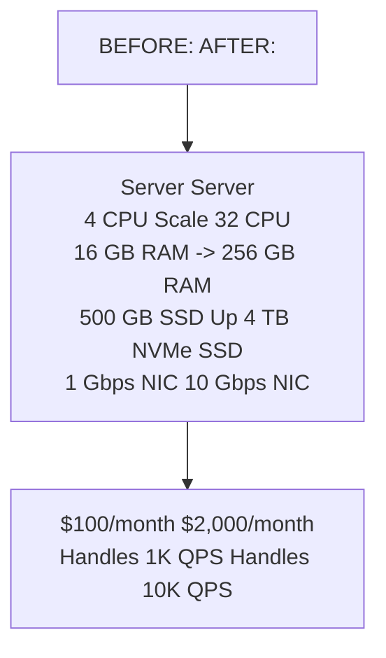

#### Horizontal Scaling (Scale Out)

Add **more machines** of similar size and distribute the load across them.

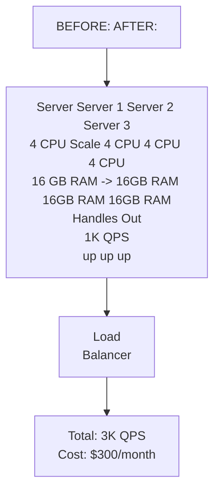

### Head-to-Head Comparison

| Dimension | Vertical Scaling | Horizontal Scaling |
|-----------|-----------------|-------------------|
| **How** | Bigger machine | More machines |
| **Complexity** | Simple (no code changes) | Complex (distributed system) |
| **Cost curve** | Exponential (diminishing returns) | Linear (ideally) |
| **Limit** | Hardware ceiling (single machine max) | No theoretical limit |
| **Downtime** | Usually requires restart | Zero-downtime (add nodes live) |
| **Failure** | Single point of failure | Redundancy built-in |
| **Data consistency** | Easy (single machine) | Hard (distributed state) |
| **Best for** | Databases, legacy apps | Stateless web servers, microservices |
| **Example** | Upgrade DB server to 128 cores | Add 5 more API servers behind LB |

### Cost Curves

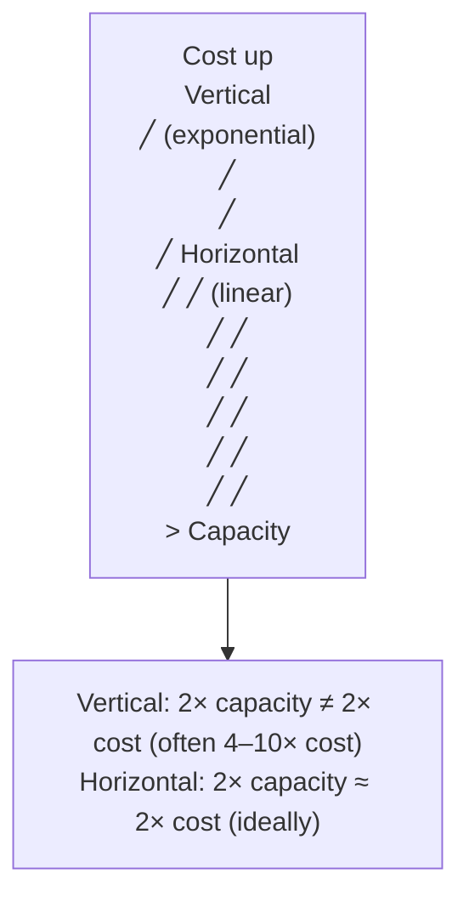

### What Makes Scaling Hard?

#### Stateful vs Stateless

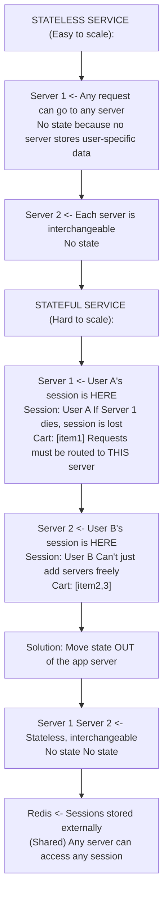

#### The Scaling Dimensions

A system has multiple bottlenecks. You must identify **which dimension** needs scaling:

| Dimension | Symptom | Solution |
|-----------|---------|----------|
| **Compute (CPU)** | High CPU utilization, slow processing | More/faster servers, optimize algorithms |
| **Memory (RAM)** | OOM errors, swapping, cache evictions | More RAM, better data structures, eviction policies |
| **Storage (Disk)** | Disk full, slow I/O | Larger disks, sharding, archival, compression |
| **Network (Bandwidth)** | High latency, packet loss | CDN, compression, protocol optimization |
| **Database (Queries)** | Slow queries, connection pool exhausted | Read replicas, caching, sharding, indexing |
| **Connections** | "Too many connections" errors | Connection pooling, async I/O |

### Scaling Strategies by Component

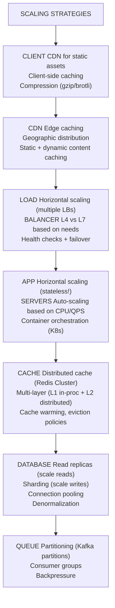

### Database Scaling Deep Dive

Databases are usually the **hardest component to scale** because they are stateful.

#### Read Scaling: Replicas

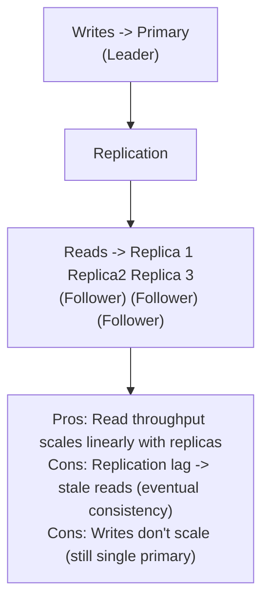

#### Write Scaling: Sharding (Partitioning)

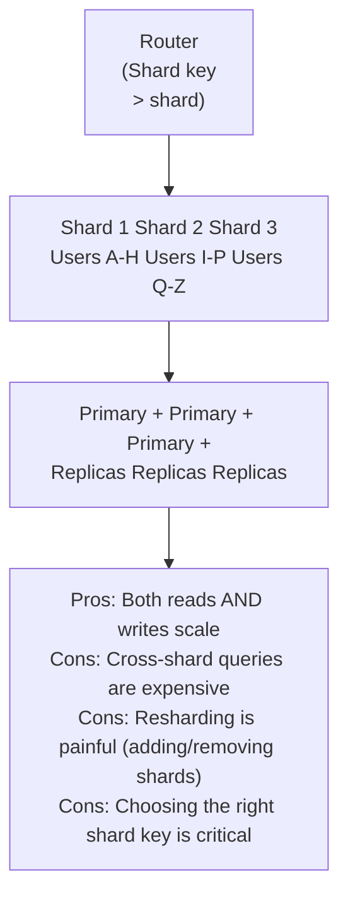

#### Shard Key Selection

| Strategy | How | Pros | Cons | Example |
|----------|-----|------|------|---------|
| **Range-based** | user_id 1-1M → Shard 1, 1M-2M → Shard 2 | Range queries easy | Hot spots if data is uneven | Time-series data |
| **Hash-based** | hash(user_id) % N → Shard N | Even distribution | Range queries impossible | User data |
| **Geographic** | US → Shard 1, EU → Shard 2 | Data locality | Uneven load if one region dominates | Global apps |
| **Directory-based** | Lookup table maps key → shard | Flexible | Lookup table is a bottleneck/SPOF | Complex routing |

### Auto-Scaling

Modern cloud platforms can automatically add/remove capacity:

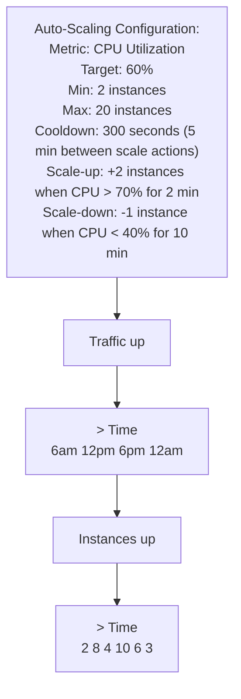

### Scalability Anti-Patterns

| Anti-Pattern | Why It Fails | Fix |
|-------------|-------------|-----|
| **Storing sessions in app server** | Can't add/remove servers freely | Use external session store (Redis) |
| **Single database for everything** | DB becomes the bottleneck | Read replicas, sharding, caching |
| **Synchronous everything** | One slow service blocks the chain | Async processing via message queues |
| **Fat services** | Can't scale hot path independently | Split into focused microservices |
| **Hard-coded connection limits** | Can't handle traffic spikes | Dynamic connection pooling |
| **No caching** | Every request hits the database | Multi-layer caching strategy |
| **Monolithic deployment** | Must scale the entire app even if only search is hot | Independently deployable services |
| **Tight coupling** | Scaling one service requires scaling its dependencies | Loose coupling via APIs and queues |
| **Premature scaling** | Over-engineering for load you don't have yet | Scale when needed, not before |
| **Ignoring the database** | App servers scale but DB doesn't | Always plan DB scaling strategy |

### Amdahl's Law — The Scaling Limit

Not everything can be parallelized. **Amdahl's Law** defines the theoretical speedup limit:

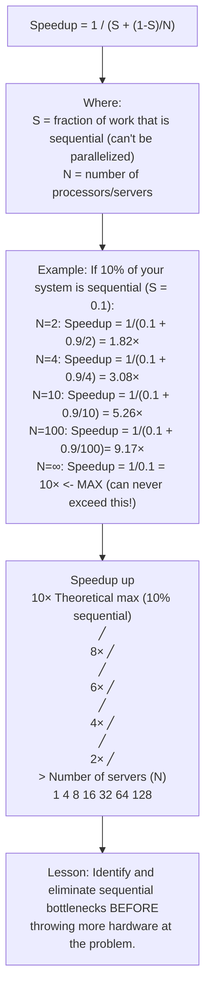

### Common Sequential Bottlenecks

| Bottleneck | Why Sequential | Mitigation |
|-----------|---------------|-----------|
| **Single DB primary for writes** | All writes go through one node | Sharding, write batching |
| **Global locks** | Only one thread can proceed | Fine-grained locks, lock-free algorithms |
| **Leader election** | One leader coordinates | Reduce leader responsibilities |
| **Sequential ID generation** | Must be globally unique + ordered | Snowflake IDs (distributed) |
| **Synchronous API chains** | A must finish before B starts | Async processing, parallel calls |

---

## B. Interview View

### How Scalability Appears in Interviews

Scalability is discussed in **every** system design interview. The interviewer wants to see:

1. You can estimate the scale (QPS, storage, bandwidth)
2. You start with a simple design and **evolve it** to handle more load
3. You know which components to scale and how
4. You understand the trade-offs of each scaling approach

### The Scaling Narrative (How to Present It)

```
Step 1: Start simple
  "Let's start with a single server handling all requests..."

Step 2: Identify the bottleneck
  "At 10K QPS, the database becomes the bottleneck because
   each query takes 5ms and we can do ~200 QPS per connection..."

Step 3: Apply targeted scaling
  "I'd add a Redis cache layer. With 90% cache hit rate,
   only 1K QPS actually hits the database..."

Step 4: Anticipate the next bottleneck
  "When we reach 100K QPS, the app servers become the bottleneck.
   I'd add a load balancer with auto-scaling..."

Step 5: Discuss trade-offs
  "Caching gives us speed but we need to handle cache invalidation
   and accept eventual consistency for product data..."
```

### What Interviewers Expect by Level

| Level | Expectation |
|-------|------------|
| **Junior** | Knows vertical vs horizontal; can say "add more servers" |
| **Mid** | Can identify which component to scale; knows caching, replicas, sharding |
| **Senior** | Designs the full scaling path; discusses trade-offs, Amdahl's Law, auto-scaling |
| **Staff+** | Considers cost efficiency, organizational scaling, data model implications, failure modes at each scale |

### Red Flags

- "Just add more servers" without identifying the actual bottleneck
- Not mentioning database scaling (it's always the hardest part)
- Suggesting sharding without discussing the shard key strategy
- Ignoring the stateful vs stateless distinction
- Not considering cost (over-scaling wastes money)
- Scaling before understanding the current bottleneck
- Not mentioning caching as a scaling strategy

### Common Follow-up Questions

1. "How would you scale this from 1K to 1M QPS?"
2. "What's the first bottleneck you'd hit and how would you address it?"
3. "When would you shard the database? How would you choose the shard key?"
4. "What's the difference between vertical and horizontal scaling?"
5. "How do you handle session state when you scale horizontally?"
6. "What is Amdahl's Law and how does it apply here?"
7. "How would you auto-scale this system? What metrics would you use?"
8. "What happens to the database as you add more app servers?"

---

## C. Practical Engineering View

### Scaling Journey — From 0 to 10M Users

```mermaid
flowchart TB
    N0["Stage 1: Single Server (0 – 1K users)"]
    N1["Single Server"]
    N2["Web App DB<br/>Server Logic"]
    N3["Cost: $20/month"]
    N4["Stage 2: Separate DB (1K – 10K users)"]
    N5["App -&gt; DB<br/>Server (Managed)"]
    N6["Cost: $50/month + $100/month (RDS)"]
    N7["Stage 3: Add Cache + CDN (10K – 100K users)"]
    N8["Client -&gt; CDN -&gt; App Server -&gt; Redis -&gt; DB"]
    N9["Cost: ~$500/month total"]
    N10["Stage 4: Load Balancer + Multiple Servers (100K – 1M users)"]
    N11["Client -&gt; CDN -&gt; LB -&gt; Servers ×3 -&gt; Redis -&gt; DB<br/>Cluster +Read<br/>Replica"]
    N12["Cost: ~$2,000/month"]
    N13["Stage 5: Sharding + Microservices (1M – 10M users)"]
    N14["Client -&gt; CDN -&gt; LB -&gt; API -&gt; Redis -&gt; DB Shards<br/>Gateway Cluster (3 shards)"]
    N15["Auth Product Order<br/>Service Service Service"]
    N16["Cost: ~$10,000-30,000/month"]
    N17["Stage 6: Multi-Region (10M+ users)<br/>+ Global DNS routing<br/>+ Region-local app servers + caches + DB replicas<br/>+ Cross-region replication for writes<br/>Cost: $50,000-200,000+/month"]
    N0 --> N1
    N1 --> N2
    N2 --> N3
    N3 --> N4
    N4 --> N5
    N5 --> N6
    N6 --> N7
    N7 --> N8
    N8 --> N9
    N9 --> N10
    N10 --> N11
    N11 --> N12
    N12 --> N13
    N13 --> N14
    N14 --> N15
    N15 --> N16
    N16 --> N17
```

### Real-World Scaling Numbers

| Company | Scale | Architecture | Key Technique |
|---------|-------|-------------|---------------|
| **Stack Overflow** | 1.3B page views/month | Monolith on 9 servers | Aggressive caching, SQL Server optimization |
| **Instagram** | 2B+ MAU | Django + Cassandra + Redis | Sharding, CDN, async processing |
| **Discord** | 7M+ concurrent users | Rust + Cassandra + Redis | Custom data structures, Rust for performance |
| **Netflix** | 250M+ subscribers | 1000+ microservices on AWS | Regional failover, chaos engineering |
| **Twitter/X** | 500M+ tweets/day | Hybrid fan-out (push + pull) | Manhattan DB, custom caching |

### Operational Concerns at Scale

#### Deployment at Scale

| Scale | Deployment Strategy |
|-------|-------------------|
| 1 server | SSH + restart |
| 5-20 servers | Ansible/Chef, rolling deploy |
| 50+ servers | Kubernetes, blue-green or canary |
| 500+ servers | Progressive rollout (1% → 5% → 25% → 100%) |
| Multi-region | Region-by-region rollout |

#### Monitoring at Scale

```
Monitoring stack grows with scale:

Small (< 10 servers):
  - Basic health checks
  - CloudWatch / simple Grafana
  - Email alerts

Medium (10-100 servers):
  - Prometheus + Grafana
  - Centralized logging (ELK)
  - PagerDuty for on-call

Large (100+ servers):
  - Distributed tracing (Jaeger/Zipkin)
  - Real-time anomaly detection
  - SLO dashboards
  - Automated runbooks
  - Cost monitoring per service
```

#### Cost Optimization

| Strategy | Savings | Trade-off |
|----------|---------|-----------|
| **Reserved instances** | 30-60% vs on-demand | Commit for 1-3 years |
| **Spot instances** for batch jobs | 60-90% savings | Can be terminated anytime |
| **Right-sizing** | 20-40% | Requires monitoring and tuning |
| **Auto-scaling** | Variable | Need to handle cold starts |
| **Caching aggressively** | Reduce DB/compute costs | Cache invalidation complexity |
| **Data tiering** | Hot (SSD) → Warm (HDD) → Cold (S3) | Access latency for cold data |
| **Compression** | Reduce storage + bandwidth | CPU overhead |

### Failure Modes at Scale

| Scale | New Failure Modes |
|-------|------------------|
| **Single server** | Hardware failure, disk full |
| **Multi-server** | Network partition between servers, uneven load |
| **With cache** | Cache stampede, stale data, cache failure cascading to DB |
| **With sharding** | Hot shard, cross-shard failures, resharding downtime |
| **Multi-region** | Cross-region latency spikes, split-brain, data divergence |
| **At massive scale** | Correlated failures (entire AZ down), dependency cascades, noisy neighbors |

---

## D. Example: Scaling a URL Shortener (100 → 100M Users)

### Phase 1: MVP (100 users)

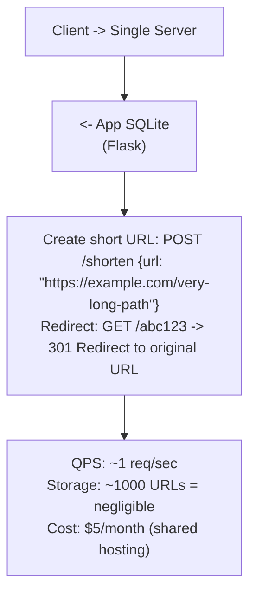

### Phase 2: Growing (10K users, 100 URLs/day)

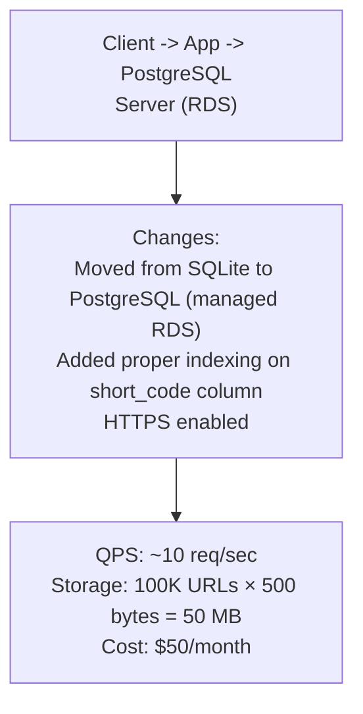

### Phase 3: Scaling Reads (1M users, 10K redirects/sec)

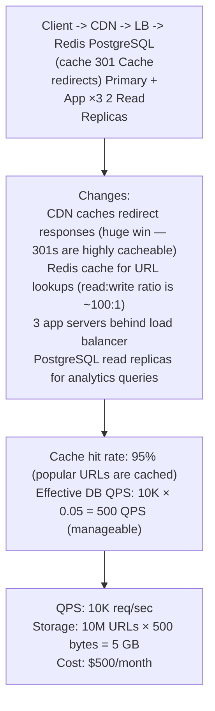

### Phase 4: Scaling Writes + Global (100M users, 100K redirects/sec)

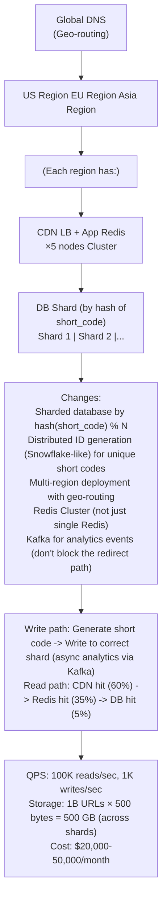

### Scaling Decisions Summary

| Phase | Users | QPS | Key Scaling Move | Cost |
|-------|-------|-----|-----------------|------|
| 1 | 100 | 1 | Single server | $5/mo |
| 2 | 10K | 10 | Managed DB | $50/mo |
| 3 | 1M | 10K | CDN + Cache + LB + Replicas | $500/mo |
| 4 | 100M | 100K | Sharding + Multi-region + Kafka | $20K+/mo |

---

## E. HLD and LLD

### E.1 HLD — Auto-Scaling E-Commerce Platform

#### Requirements

**Functional:**
- Product catalog browsing and search
- User authentication
- Order placement
- Handle flash sales (10× normal traffic for 30 min)

**Non-Functional:**
- Normal: 10K QPS, Peak (flash sale): 100K QPS
- p99 < 200ms during normal, < 500ms during flash sales
- 99.9% availability
- Cost-efficient (don't over-provision for flash sale capacity 24/7)

#### Capacity Estimation

```
Normal load:
  DAU: 5M, QPS: 10K, Peak: 20K
  DB: 2K writes/sec, 8K reads/sec

Flash sale load (10×):
  QPS: 100K (bursts), sustained: 60K
  DB: 20K writes/sec (order creation), 40K reads/sec
  
Need to handle 10× traffic increase within 2 minutes.
```

#### Architecture with Auto-Scaling

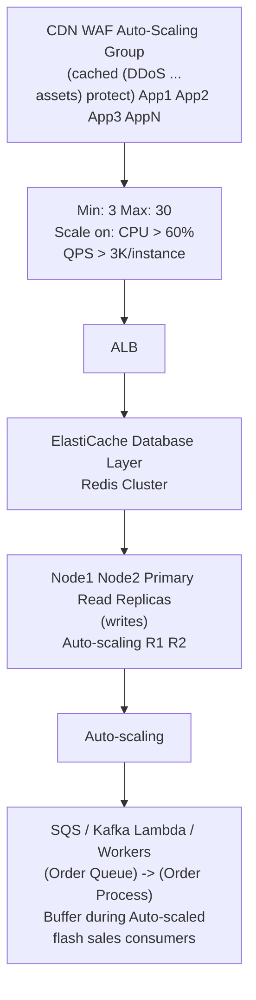

#### Flash Sale Strategy

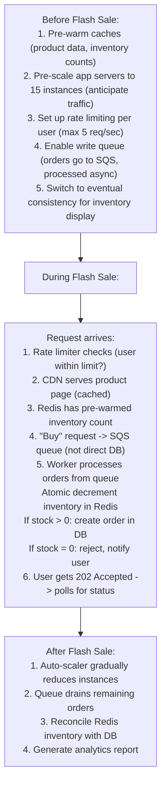

#### Scaling Approach

| Component | Normal (3 instances) | Flash Sale (auto-scaled) | Scale Trigger |
|-----------|---------------------|-------------------------|---------------|
| **App Servers** | 3 | 15-30 | CPU > 60% or QPS > 3K/instance |
| **Redis** | 2-node cluster | 6-node cluster | Memory > 70% |
| **DB Read Replicas** | 2 | 5 | Replication lag > 100ms |
| **Order Workers** | 2 | 10-20 | Queue depth > 1000 |
| **Rate Limit** | 10 req/sec/user | 5 req/sec/user | Flash sale mode |

#### Trade-offs

| Decision | Chosen | Alternative | Why |
|----------|--------|------------|-----|
| **Async orders (queue)** | Yes, during flash sales | Synchronous order creation | Absorb traffic spikes; prevent DB overload |
| **Redis for inventory** | Atomic decrement in Redis | DB row-level lock | Redis handles 100K+ ops/sec; DB can't |
| **Pre-scaling** | Yes, before flash sale | Purely reactive auto-scaling | Auto-scaling takes 2-5 min; flash traffic is instant |
| **202 Accepted** for orders | Yes | Synchronous 201 Created | Don't block the user while order is queued |
| **Eventual consistency** on inventory display | Yes during flash | Strong consistency | Performance > accuracy for display count during spike |

---

### E.2 LLD — Auto-Scaler Decision Engine

#### Classes and Components

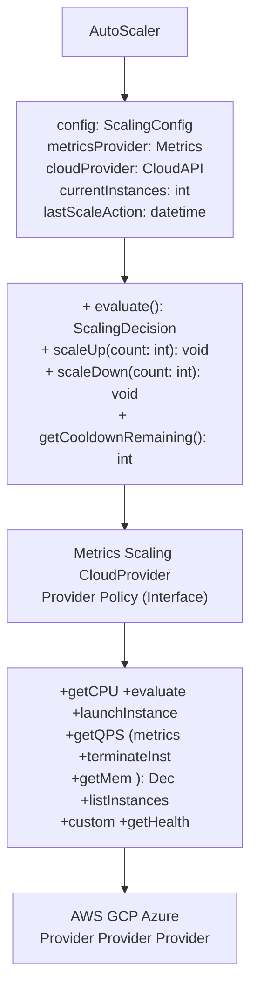

#### Data Models

```java
public class ScalingConfig {
    private String serviceName;
    private int minInstances;          // Never go below this
    private int maxInstances;          // Never exceed this
    private int cooldownSeconds;       // Wait between scale actions
    private double scaleUpThreshold;   // e.g., CPU > 70%
    private double scaleDownThreshold; // e.g., CPU < 40%
    private int scaleUpStep;           // How many to add (e.g., 2)
    private int scaleDownStep;         // How many to remove (e.g., 1)
    private int scaleUpEvaluationPeriods;   // Must exceed for N periods
    private int scaleDownEvaluationPeriods; // Must be below for N periods
    private String metric;             // "cpu", "qps", "memory", "custom"
    // getters and setters
}

public class ScalingDecision {
    private String action;     // "scale_up", "scale_down", "no_action"
    private String reason;     // Human-readable explanation
    private int current;       // Current instance count
    private int target;        // Desired instance count
    private double metricValue;
    private double threshold;
    private LocalDateTime timestamp;
    // getters and setters
}

public class ScalingEvent {
    private String eventId;
    private String serviceName;
    private String action;
    private int fromCount;
    private int toCount;
    private String triggerMetric;
    private double triggerValue;
    private LocalDateTime timestamp;
    private boolean success;
    private String error;
    // getters and setters
}
```

```sql
-- Scaling events log
CREATE TABLE scaling_events (
    id              BIGSERIAL PRIMARY KEY,
    service_name    VARCHAR(100) NOT NULL,
    action          VARCHAR(20) NOT NULL,      -- 'scale_up', 'scale_down'
    from_count      INT NOT NULL,
    to_count        INT NOT NULL,
    trigger_metric  VARCHAR(50),
    trigger_value   DECIMAL(10,2),
    timestamp       TIMESTAMP NOT NULL DEFAULT NOW(),
    completed_at    TIMESTAMP,
    success         BOOLEAN DEFAULT FALSE,
    error_message   TEXT
);

CREATE INDEX idx_scaling_events_service ON scaling_events(service_name, timestamp DESC);
```

#### Pseudocode — Auto-Scaler

```java
public class AutoScaler {
    private final ScalingConfig config;
    private final MetricsProvider metrics;
    private final CloudProvider cloud;
    private LocalDateTime lastScaleTime;
    private int highReadings = 0;
    private int lowReadings = 0;

    public AutoScaler(ScalingConfig config, MetricsProvider metrics, CloudProvider cloud) {
        this.config = config; this.metrics = metrics; this.cloud = cloud;
    }

    /** Called every 30 seconds by scheduler */
    public ScalingDecision evaluate() {
        // 1. Check cooldown
        if (lastScaleTime != null && !cooldownExpired())
            return new ScalingDecision("no_action", "Cooldown active");

        // 2. Get current metrics
        List<Instance> currentInstances = cloud.listInstances(config.getServiceName());
        double metricValue = getMetricValue();

        // 3. Evaluate scale-up
        if (metricValue > config.getScaleUpThreshold()) {
            highReadings++; lowReadings = 0;
            if (highReadings >= config.getScaleUpEvaluationPeriods()) {
                int target = Math.min(
                    currentInstances.size() + config.getScaleUpStep(),
                    config.getMaxInstances());
                if (target > currentInstances.size())
                    return createDecision("scale_up", currentInstances.size(),
                        target, metricValue,
                        config.getMetric() + " (" + metricValue + ") > threshold");
            }
        // 4. Evaluate scale-down
        } else if (metricValue < config.getScaleDownThreshold()) {
            lowReadings++; highReadings = 0;
            if (lowReadings >= config.getScaleDownEvaluationPeriods()) {
                int target = Math.max(
                    currentInstances.size() - config.getScaleDownStep(),
                    config.getMinInstances());
                if (target < currentInstances.size())
                    return createDecision("scale_down", currentInstances.size(),
                        target, metricValue,
                        config.getMetric() + " (" + metricValue + ") < threshold");
            }
        } else {
            highReadings = 0; lowReadings = 0;
        }
        return new ScalingDecision("no_action", "Within thresholds");
    }

    /** Execute a scaling decision */
    public void execute(ScalingDecision decision) {
        if ("no_action".equals(decision.getAction())) return;
        try {
            if ("scale_up".equals(decision.getAction())) {
                int count = decision.getTarget() - decision.getCurrent();
                for (int i = 0; i < count; i++) {
                    cloud.launchInstance(config.getServiceName());
                    waitForHealthy(120);
                }
            } else if ("scale_down".equals(decision.getAction())) {
                int count = decision.getCurrent() - decision.getTarget();
                List<Instance> toTerminate = selectForTermination(count);
                for (Instance inst : toTerminate) {
                    cloud.drainConnections(inst, 30);
                    cloud.terminateInstance(inst);
                }
            }
            lastScaleTime = LocalDateTime.now();
            logEvent(decision, true, null);
        } catch (Exception e) {
            logEvent(decision, false, e.getMessage());
            throw e;
        }
    }

    private double getMetricValue() {
        switch (config.getMetric()) {
            case "cpu": return metrics.getAvgCpu(config.getServiceName());
            case "qps":
                int count = cloud.listInstances(config.getServiceName()).size();
                return metrics.getTotalQps(config.getServiceName()) / count;
            case "memory": return metrics.getAvgMemory(config.getServiceName());
            default: return 0;
        }
    }

    private boolean cooldownExpired() {
        return Duration.between(lastScaleTime, LocalDateTime.now()).getSeconds()
            > config.getCooldownSeconds();
    }

    private List<Instance> selectForTermination(int count) {
        List<Instance> instances = new ArrayList<>(cloud.listInstances(config.getServiceName()));
        instances.sort(Comparator.comparingInt(Instance::getActiveConnections));
        return instances.subList(0, Math.min(count, instances.size()));
    }
}
```

#### Edge Cases

| Edge Case | How to Handle |
|-----------|--------------|
| Scale-up during cooldown but traffic is critical | Have an "emergency override" that bypasses cooldown |
| Cloud API rate limited | Exponential backoff on cloud API calls; batch requests |
| New instance fails health check | Retry launch; if repeated, alert on-call; don't count as scaled |
| Scale-down removes instance mid-request | Connection draining: stop new requests, finish in-flight, then terminate |
| Flapping (rapid scale up/down cycles) | Asymmetric cooldowns: 2 min for scale-up, 10 min for scale-down |
| All instances in one AZ go down | Spread across multiple AZs; auto-scaler launches in healthy AZ |
| Metric provider is down | Use last known good value; alert if stale > 5 min; don't scale on stale data |
| Max instances reached but still overloaded | Alert on-call; consider increasing max; enable aggressive rate limiting |
| Cost runaway (auto-scaled to 100 instances) | Budget alerts; hard max cap; require approval for > N instances |

---

## F. Summary & Practice

### Key Takeaways

1. **Scalability** = handling more load by adding resources proportionally, without degradation
2. **Vertical scaling** (bigger machine) is simple but has limits; **horizontal scaling** (more machines) is complex but unlimited
3. **Stateless services** are trivial to scale horizontally; move state to external stores (Redis, DB)
4. **Database is usually the hardest to scale** — use caching → read replicas → sharding (in that order)
5. **Amdahl's Law**: sequential bottlenecks limit parallel scaling — find and eliminate them first
6. **Auto-scaling** handles traffic variability but has lag — pre-scale for predictable spikes
7. **Caching is the single most effective scaling technique** — can reduce DB load by 90-99%
8. **Scale incrementally**: single server → separate DB → cache → LB + replicas → sharding → multi-region
9. **Cost grows with scale** — use reserved instances, spot instances, and right-sizing to optimize
10. **Don't scale prematurely** — understand your bottleneck before adding complexity

### Revision Checklist

- [ ] Can I explain vertical vs horizontal scaling with trade-offs?
- [ ] Can I explain why stateless services are easier to scale?
- [ ] Do I know the scaling order: cache → replicas → sharding?
- [ ] Can I explain database read replicas and sharding with diagrams?
- [ ] Can I list 4 shard key strategies and their trade-offs?
- [ ] Can I explain Amdahl's Law and identify sequential bottlenecks?
- [ ] Can I describe how auto-scaling works (metrics, thresholds, cooldown)?
- [ ] Can I walk through scaling from 1 server to multi-region?
- [ ] Do I know 5 scalability anti-patterns?
- [ ] Can I estimate the cost at different scale tiers?
- [ ] Can I design a flash-sale scaling strategy (pre-scale, queue, rate limit)?

### Interview Questions

**Conceptual:**

1. What is scalability? How do you measure it?
2. Compare vertical vs horizontal scaling. When would you use each?
3. Why are stateless services easier to scale than stateful ones?
4. What is Amdahl's Law? Give a practical example.
5. What's the difference between read replicas and sharding?

**Design & Strategy:**

6. Walk me through how you'd scale a system from 1K to 10M users.
7. How would you handle a flash sale that brings 10× normal traffic?
8. When would you shard a database? How would you choose the shard key?
9. What caching strategy would you use to reduce DB load by 95%?
10. How would you design auto-scaling for a web application?

**Operational:**

11. What metrics would you use to trigger auto-scaling?
12. How do you handle the "thundering herd" problem when cache expires?
13. What are the failure modes unique to sharded databases?
14. How do you ensure zero-downtime deployments at scale?
15. How do you optimize cloud costs when running at large scale?

### Practice Exercises

1. **Exercise 1**: Draw the architecture for a URL shortener at each scale: 100 users, 10K users, 1M users, 100M users. List what changes at each stage and why.

2. **Exercise 2**: Your PostgreSQL database handles 5K QPS. You need to scale to 50K QPS. 80% of queries are reads. Design the scaling strategy. Calculate how many read replicas you need if each handles 5K QPS. What about the remaining 20% writes?

3. **Exercise 3**: A flash sale starts in 2 hours. Normal traffic is 10K QPS; expected peak is 200K QPS for 15 minutes. Your auto-scaler takes 3 minutes to add instances. Design the complete scaling plan (pre-scaling, queuing, rate limiting, cache warming).

4. **Exercise 4**: Your system has a sequential bottleneck: a single Redis instance doing 50K ops/sec for distributed locking. Using Amdahl's Law, calculate the max throughput improvement from adding 10 more app servers. How would you eliminate the bottleneck?

5. **Exercise 5**: Build a cost model for a system at 3 scale tiers (10K QPS, 100K QPS, 1M QPS). List every component (servers, DB, cache, CDN, LB, queue) and estimate monthly cost on AWS. Find the cost-per-request at each tier.

---

> **Previous**: [04 — Latency vs Throughput](04-latency-vs-throughput.md)
> **Next**: [06 — Availability and Reliability](06-availability-and-reliability.md)
