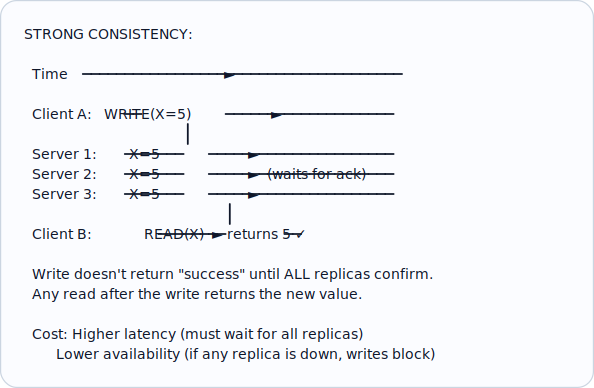
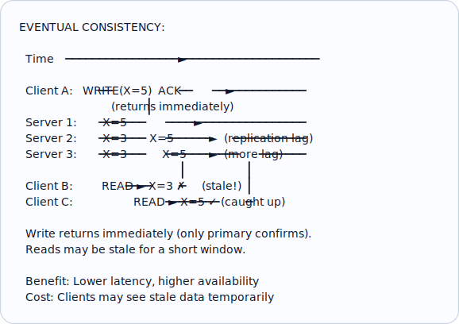
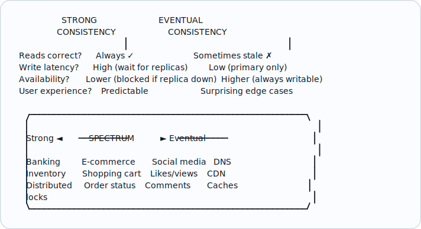
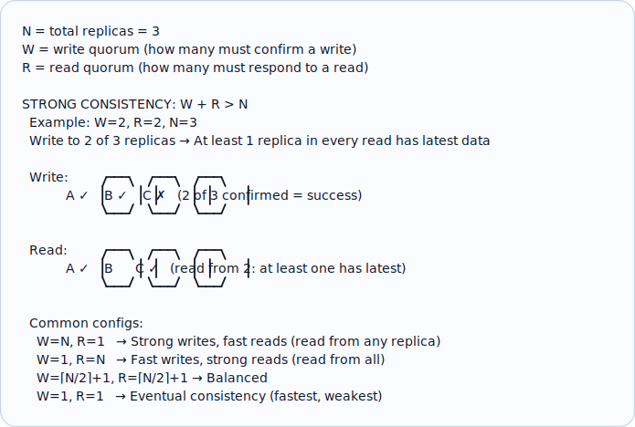
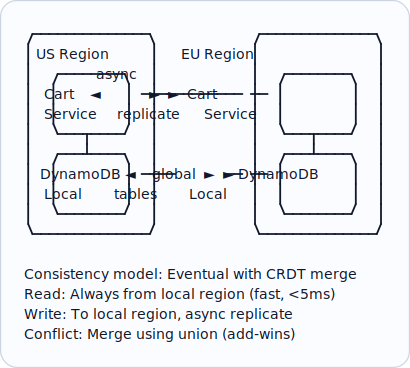
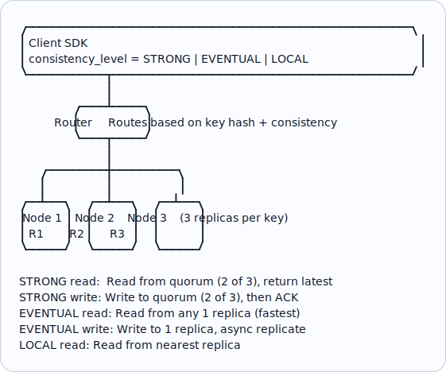

# Topic 7: Consistency

> **Track**: Core Concepts — Fundamentals
> **Difficulty**: Intermediate
> **Prerequisites**: Topics 1–6

---

## Table of Contents

- [A. Concept Explanation](#a-concept-explanation)
- [B. Interview View](#b-interview-view)
- [C. Practical Engineering View](#c-practical-engineering-view)
- [D. Example](#d-example)
- [E. HLD and LLD](#e-hld-and-lld)
- [F. Summary & Practice](#f-summary--practice)

---

## A. Concept Explanation

### What is Consistency?

**Consistency** means that all nodes/replicas in a distributed system see the **same data at the same time**. After a write completes, every subsequent read should return that written value.

```
CONSISTENT (ideal):
  Client writes X = 5
  Server A: X = 5  ✓
  Server B: X = 5  ✓  ← All servers agree immediately
  Server C: X = 5  ✓

INCONSISTENT (reality in distributed systems):
  Client writes X = 5 to Server A
  Server A: X = 5  ✓
  Server B: X = 3  ✗  ← Still has old value (replication lag)
  Server C: X = 3  ✗
  
  → Eventually B and C catch up, but there's a window
    where clients see different values depending on
    which server they hit.
```

### Consistency Models — From Strongest to Weakest

| Model | Guarantee | Performance | Use Case |
|-------|----------|-------------|----------|
| **Linearizability** | Every read sees the most recent write globally | Slowest | Distributed locks, leader election |
| **Sequential Consistency** | Operations appear in some total order consistent with each client's order | Slow | Bank transactions |
| **Causal Consistency** | Causally related ops appear in order; concurrent ops may differ | Moderate | Social media (reply after post) |
| **Read-Your-Writes** | You always see your own writes | Moderate | User profile updates |
| **Monotonic Reads** | You never see older data after seeing newer data | Fast | Dashboard displays |
| **Eventual Consistency** | All replicas converge eventually (no time guarantee) | Fastest | DNS, social media likes, CDN |

### Strong Consistency

Every read returns the most recent write. The system behaves as if there's only one copy of the data.



### Eventual Consistency

After a write, replicas will **eventually** converge to the same value, but reads during the replication window may return stale data.



### Consistency vs Availability Trade-off



### Read-Your-Writes Consistency

A weaker but practical model: you always see your own writes, even if other users might see stale data.

```
Read-Your-Writes:

  User A writes profile name = "Alice"
  User A reads profile → sees "Alice" ✓ (always)
  User B reads profile → might see old name briefly ✗ (OK for many apps)

Implementation strategies:
  1. Route user's reads to the same replica they wrote to
  2. Track write timestamp; if read replica is behind, read from primary
  3. Client-side: cache recent writes, merge with server response
```

### Monotonic Reads

Once you've seen a value, you'll never see an older value on subsequent reads.

```
WITHOUT monotonic reads:
  Read 1 → Server A → X = 5 (latest)
  Read 2 → Server B → X = 3 (older!)   ← Confusing to user!

WITH monotonic reads:
  Read 1 → Server A → X = 5
  Read 2 → Server A → X = 5 (or newer) ← Always same or newer
  
  Implementation: Sticky sessions (route user to same replica)
                  OR: Track read version, reject stale replicas
```

### Quorum Reads and Writes

A practical approach to tunable consistency:



### Conflict Resolution in Eventual Consistency

When two replicas have different values, who wins?

| Strategy | How | Pros | Cons |
|----------|-----|------|------|
| **Last-Write-Wins (LWW)** | Higher timestamp wins | Simple | Data loss if clocks diverge |
| **Vector Clocks** | Track causal history per replica | No data loss | Complex, growing metadata |
| **CRDTs** | Conflict-free data structures | Auto-merge, no coordination | Limited data types |
| **Application-level** | App decides (e.g., merge carts) | Domain-specific logic | More code complexity |

---

## B. Interview View

### What Interviewers Expect

| Level | Expectation |
|-------|------------|
| **Junior** | Knows strong vs eventual consistency |
| **Mid** | Can choose consistency model for a given use case; knows quorum |
| **Senior** | Discusses trade-offs with availability; knows multiple consistency models |
| **Staff+** | Designs tunable consistency; discusses CRDTs, vector clocks, conflict resolution |

### Red Flags

- Saying "always use strong consistency"
- Not knowing eventual consistency exists or when to use it
- Confusing consistency (data) with consistency in ACID (database constraints)
- Not considering the CAP theorem implications
- Ignoring replication lag in their design

### Common Follow-up Questions

1. "What consistency model would you use for this system?"
2. "What happens if two users update the same record simultaneously?"
3. "How do you handle stale reads from a replica?"
4. "What is a quorum and how does it help?"
5. "When is eventual consistency acceptable?"
6. "How would you implement read-your-writes consistency?"

---

## C. Practical Engineering View

### Consistency in Real Databases

| Database | Default Consistency | Tunable? |
|----------|-------------------|----------|
| **PostgreSQL** | Strong (single node) | Read replicas = eventual |
| **MySQL** | Strong (single node) | Semi-sync replicas available |
| **MongoDB** | Eventual (by default) | Yes: write concern, read concern |
| **Cassandra** | Eventual (by default) | Yes: consistency level per query |
| **DynamoDB** | Eventual (by default) | Strong reads available (2× cost) |
| **Redis** | Eventual (async replication) | WAIT command for sync |
| **CockroachDB** | Strong (serializable) | Not tunable (always strong) |
| **Spanner** | Strong (external consistency) | Not tunable (always strong) |

### Practical Consistency Choices

```
Banking / Payments:
  → Strong consistency (can't show wrong balance)
  → Use: Single primary DB, synchronous replication
  → Sacrifice: Latency (writes wait for replicas)

Social Media Feed:
  → Eventual consistency (OK if post appears 2s late)
  → Use: Async replication, CDN caching
  → Benefit: Low latency, high availability

E-Commerce Inventory:
  → Strong for purchase (can't oversell)
  → Eventual for display (show "~50 left" is fine)
  → Use: Strong writes to primary, read from cache/replica

User Profile:
  → Read-your-writes (see your own changes instantly)
  → Eventual for other viewers
  → Use: Sticky sessions or client-side merge
```

### Monitoring Replication Lag

```
Key metrics to track:
  • Replication lag (seconds behind primary)
  • Replica lag bytes (bytes of WAL not yet applied)
  • Read consistency violations (client reports stale data)

Alert thresholds:
  < 1s:   Normal (most apps tolerate this)
  1-5s:   Warning (may affect user experience)
  5-30s:  Critical (stale data becoming noticeable)
  > 30s:  Emergency (replica may be broken)

PostgreSQL: SELECT pg_last_wal_replay_lsn() - pg_last_wal_receive_lsn();
MySQL:      SHOW SLAVE STATUS → Seconds_Behind_Master
Cassandra:  nodetool repair status
```

---

## D. Example: Shopping Cart — Choosing Consistency

### Scenario

E-commerce shopping cart with 10M users, multi-region deployment.

### Option 1: Strong Consistency

```
User adds item to cart → Write to primary DB → Sync replicate → ACK
  Latency: 150ms (cross-region replication)
  If primary is in US and user is in EU: 300ms round trip
  If primary is down: Cart is unavailable ✗

Pros: Cart is always accurate
Cons: Slow for global users, availability issues
```

### Option 2: Eventual Consistency with Conflict Resolution

```
User adds item to cart → Write to LOCAL replica → ACK → Async replicate
  Latency: 5ms (local write)
  If other region is down: Cart still works ✓

Conflict scenario:
  User opens cart on phone: cart = [A, B]
  User opens cart on laptop: cart = [A, B]
  Phone adds item C: cart = [A, B, C]
  Laptop adds item D: cart = [A, B, D]
  → Conflict! Two versions exist

Resolution (CRDT - Add-Wins Set):
  Merge: cart = [A, B, C, D]  ← Union of both
  User sees all items they added. No data loss.
```

### Architecture



---

## E. HLD and LLD

### E.1 HLD — Multi-Region Consistent Key-Value Store

#### Requirements

- Support GET, PUT, DELETE
- Tunable consistency (strong or eventual per request)
- 3 regions, 99.99% availability
- 100K reads/sec, 10K writes/sec

#### Architecture



#### Trade-offs

| Decision | Chosen | Why |
|----------|--------|-----|
| Quorum-based | Yes | Tunable consistency without full replication wait |
| 3 replicas | Balances durability and cost | 5 is more durable but expensive |
| Async replication for eventual | Yes | Sub-ms latency for non-critical reads |

### E.2 LLD — Consistency Manager

#### Pseudocode

```java
public class ConsistencyManager {
    private final List<Replica> replicas;
    private final int quorum; // Typically ceil(N/2) + 1

    public ConsistencyManager(List<Replica> replicas, int quorumSize) {
        this.replicas = replicas; this.quorum = quorumSize;
    }

    public Object read(String key, String level) {
        switch (level) {
            case "STRONG":   return quorumRead(key);
            case "EVENTUAL": return singleRead(key);
            case "LOCAL":    return localRead(key);
            default: throw new IllegalArgumentException("Unknown level: " + level);
        }
    }

    public boolean write(String key, Object value, String level) {
        Map<String, Object> versioned = Map.of(
            "value", value, "timestamp", System.currentTimeMillis(),
            "version", UUID.randomUUID().toString());
        return "STRONG".equals(level) ? quorumWrite(key, versioned)
                                      : asyncWrite(key, versioned);
    }

    /** Read from quorum replicas, return latest version */
    private Object quorumRead(String key) {
        List<Map<String, Object>> responses = parallelCall(
            replicas, r -> r.get(key), quorum, 100);
        Map<String, Object> latest = responses.stream()
            .max(Comparator.comparingLong(r -> (long) r.get("timestamp")))
            .orElseThrow();
        // Read-repair: update stale replicas
        for (Map<String, Object> r : responses)
            if (!r.get("version").equals(latest.get("version")))
                asyncRepair(r, key, latest);
        return latest.get("value");
    }

    /** Write to quorum replicas, wait for confirmation */
    private boolean quorumWrite(String key, Map<String, Object> versioned) {
        List<Boolean> acks = parallelCall(
            replicas, r -> r.put(key, versioned), quorum, 200);
        return acks.size() >= quorum;
    }

    /** Read from any one replica (fastest) */
    private Object singleRead(String key) {
        Replica replica = pickFastestReplica();
        return replica.get(key).get("value");
    }

    /** Write to one replica, async replicate to others */
    private boolean asyncWrite(String key, Map<String, Object> versioned) {
        Replica primary = pickPrimary(key);
        primary.put(key, versioned);
        for (Replica r : replicas)
            if (r != primary) asyncReplicate(r, key, versioned);
        return true;
    }
}
```

#### Edge Cases

| Edge Case | Handling |
|-----------|---------|
| Quorum unreachable (2 of 3 down) | Return error for strong reads; serve stale for eventual |
| Clock skew between replicas | Use hybrid logical clocks (HLC) instead of wall clock |
| Write conflicts (concurrent writes) | LWW with vector clocks; or CRDT merge |
| Read-repair fails | Retry in background; track repair debt metric |
| Network partition between regions | Each region serves local; merge on heal |

---

## F. Summary & Practice

### Key Takeaways

1. **Consistency** = all nodes see the same data at the same time
2. **Strong consistency**: correct but slow; **eventual consistency**: fast but temporarily stale
3. The consistency model should match the **business requirement**, not be one-size-fits-all
4. **Quorum** (W + R > N) gives tunable consistency without waiting for all replicas
5. **Read-your-writes** is often sufficient and much cheaper than full strong consistency
6. **Conflict resolution** strategies: LWW, vector clocks, CRDTs, application-level merge
7. **Replication lag** is the root cause of inconsistency — monitor it
8. **Banking needs strong consistency**; social media can use eventual; many apps use a mix
9. CAP theorem forces a choice between consistency and availability during partitions
10. **Read-repair** and **anti-entropy** help bring stale replicas back in sync

### Revision Checklist

- [ ] Can I list 6 consistency models from strongest to weakest?
- [ ] Can I explain strong vs eventual consistency with diagrams?
- [ ] Can I explain quorum reads/writes with the W + R > N formula?
- [ ] Do I know when to use each consistency model?
- [ ] Can I explain read-your-writes and monotonic reads?
- [ ] Can I describe 4 conflict resolution strategies?
- [ ] Do I know default consistency of PostgreSQL, Cassandra, DynamoDB?

### Interview Questions

1. What is consistency in distributed systems?
2. Compare strong and eventual consistency with examples.
3. What is a quorum? How does W + R > N guarantee consistency?
4. When is eventual consistency acceptable?
5. How would you handle a shopping cart with eventual consistency?
6. What are CRDTs and when would you use them?
7. How do you monitor and handle replication lag?
8. What consistency model would you choose for a banking app vs a social feed?
9. Explain read-your-writes consistency and how to implement it.
10. What happens to consistency during a network partition?

### Practice Exercises

1. **Exercise 1**: For N=5 replicas, list all valid (W, R) combinations that guarantee strong consistency. Which gives the best read performance? Best write performance?

2. **Exercise 2**: Design a shopping cart using eventual consistency with CRDT-based conflict resolution. Show what happens when two devices add different items simultaneously.

3. **Exercise 3**: Your replica lag is 5 seconds. A user updates their profile and immediately refreshes. They see the old data. Design 3 different solutions to give them read-your-writes consistency.

4. **Exercise 4**: You have a social media app where comments must appear in order (causal consistency) but likes can be eventually consistent. Design the data flow for each.

---

> **Previous**: [06 — Availability & Reliability](06-availability-reliability.md)
> **Next**: [08 — CAP Theorem](08-cap-theorem.md)
