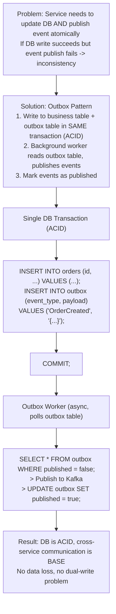
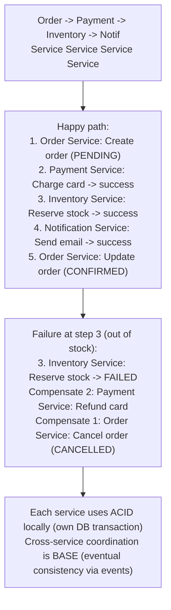
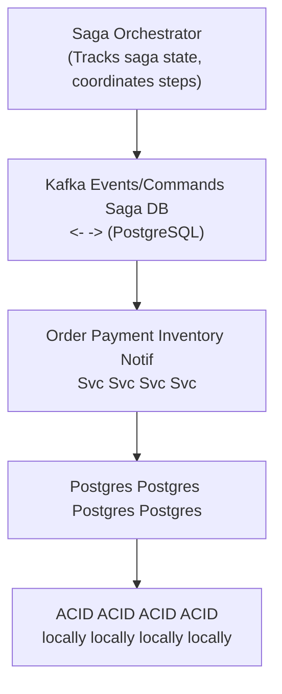

# Topic 9: ACID vs BASE

> **Track**: Core Concepts — Fundamentals
> **Difficulty**: Intermediate
> **Prerequisites**: Topics 1–8 (especially Consistency, CAP Theorem)

---

## Table of Contents

- [A. Concept Explanation](#a-concept-explanation)
- [B. Interview View](#b-interview-view)
- [C. Practical Engineering View](#c-practical-engineering-view)
- [D. Example](#d-example)
- [E. HLD and LLD](#e-hld-and-lld)
- [F. Summary & Practice](#f-summary--practice)

---

## A. Concept Explanation

### ACID Properties

ACID is a set of guarantees for **traditional relational databases** that ensure transactions are processed reliably.

| Property | Meaning | Guarantee |
|----------|---------|-----------|
| **Atomicity** | All or nothing | Either all operations in a transaction succeed, or none do |
| **Consistency** | Valid state transitions | DB moves from one valid state to another (constraints hold) |
| **Isolation** | Transactions don't interfere | Concurrent transactions behave as if they ran sequentially |
| **Durability** | Committed = permanent | Once committed, data survives crashes and power failures |

```
ACID Example — Bank Transfer ($100 from A to B):

  BEGIN TRANSACTION;
    UPDATE accounts SET balance = balance - 100 WHERE id = 'A';
    UPDATE accounts SET balance = balance + 100 WHERE id = 'B';
  COMMIT;

  Atomicity:   If debit succeeds but credit fails → ROLLBACK both
  Consistency: Total money in system stays the same (constraint)
  Isolation:   Another transaction reading A and B sees either
               the old values OR the new values, never a mix
  Durability:  After COMMIT, even if server crashes, the transfer persists
```

### Isolation Levels

Isolation has multiple levels (from weakest to strongest):

| Level | Dirty Read | Non-Repeatable Read | Phantom Read | Performance |
|-------|-----------|-------------------|-------------|-------------|
| **Read Uncommitted** | Possible | Possible | Possible | Fastest |
| **Read Committed** | Prevented | Possible | Possible | Fast |
| **Repeatable Read** | Prevented | Prevented | Possible | Medium |
| **Serializable** | Prevented | Prevented | Prevented | Slowest |

```
Dirty Read:
  T1: UPDATE balance = 500 (not committed yet)
  T2: SELECT balance → sees 500 (reads uncommitted data!)
  T1: ROLLBACK
  T2 read WRONG data.

Non-Repeatable Read:
  T1: SELECT balance → 1000
  T2: UPDATE balance = 500; COMMIT;
  T1: SELECT balance → 500 (different value in same transaction!)

Phantom Read:
  T1: SELECT * WHERE age > 25 → 10 rows
  T2: INSERT INTO users (age=30); COMMIT;
  T1: SELECT * WHERE age > 25 → 11 rows (new "phantom" row!)

Default isolation levels:
  PostgreSQL: Read Committed
  MySQL (InnoDB): Repeatable Read
  SQL Server: Read Committed
  Oracle: Read Committed
```

### BASE Properties

BASE is the model for **distributed NoSQL databases** that trade consistency for availability and performance.

| Property | Meaning | How |
|----------|---------|-----|
| **Basically Available** | System always responds | May return stale data, but never an error |
| **Soft State** | State may change over time | Without input, data may change due to async propagation |
| **Eventually Consistent** | Data converges | All replicas eventually have the same data |

```
BASE Example — Social Media Like Counter:

  User clicks "Like" on a post
  → Write to local replica: likes = 1001 (ACK immediately)
  → Async replicate to other regions
  → For a few seconds:
      US replica: likes = 1001
      EU replica: likes = 1000 (stale)
      Asia replica: likes = 1000 (stale)
  → Eventually: all replicas = 1001

  Basically Available: Every user gets a response (even if stale count)
  Soft State: Like count is "in flux" during replication
  Eventually Consistent: All regions converge to 1001
```

### Head-to-Head Comparison

| Dimension | ACID | BASE |
|-----------|------|------|
| **Philosophy** | Correctness first | Availability first |
| **Consistency** | Strong (immediate) | Eventual (delayed) |
| **Availability** | May block during failures | Always available |
| **Scaling** | Hard to scale horizontally | Easy to scale horizontally |
| **Performance** | Slower (locks, coordination) | Faster (no coordination) |
| **Data model** | Relational, normalized | Denormalized, flexible |
| **Use case** | Banking, inventory, billing | Social media, caching, analytics |
| **CAP alignment** | CP (typically) | AP (typically) |
| **Examples** | PostgreSQL, MySQL, Oracle | Cassandra, DynamoDB, MongoDB |
| **Transaction scope** | Multi-table, multi-row | Single-row (usually) |

### When to Use ACID

```
Use ACID when:
  ✓ Financial transactions (can't lose money)
  ✓ Inventory management (can't oversell)
  ✓ User registration (unique email constraint)
  ✓ Order processing (order + payment must be atomic)
  ✓ Any operation where partial completion is unacceptable
  ✓ Regulatory requirements (audit trails, compliance)

Real examples:
  • Stripe: ACID for payment processing
  • Banks: ACID for all account operations
  • Airlines: ACID for seat reservations
```

### When to Use BASE

```
Use BASE when:
  ✓ High read/write throughput needed
  ✓ Global distribution (multi-region)
  ✓ Eventual accuracy is acceptable
  ✓ Scalability > strict correctness
  ✓ Data is append-only or idempotent
  ✓ No complex multi-entity transactions

Real examples:
  • Netflix: BASE for viewing history, recommendations
  • Twitter: BASE for tweet distribution, like counts
  • Instagram: BASE for feed generation, stories
```

### Distributed Transactions — Bridging ACID and BASE

When a transaction spans multiple services, traditional ACID doesn't work. Solutions:

| Pattern | How | ACID? | Complexity |
|---------|-----|-------|-----------|
| **2PC (Two-Phase Commit)** | Coordinator asks all participants to prepare, then commit | Yes | High; blocking; single point of failure |
| **Saga** | Sequence of local transactions with compensating actions | No (BASE) | Medium; must design compensations |
| **Outbox Pattern** | Write to DB + outbox table atomically; publish events from outbox | Hybrid | Medium; reliable event publishing |
| **TCC (Try-Confirm-Cancel)** | Reserve → Confirm/Cancel in separate steps | Hybrid | High; resource locking |

```
2PC (Two-Phase Commit):
  Coordinator: "Prepare to commit?"
  Service A: "Yes, prepared" (locks held)
  Service B: "Yes, prepared" (locks held)
  Coordinator: "COMMIT"
  Service A: Committed ✓
  Service B: Committed ✓
  
  Problem: If coordinator crashes after "Prepare" → all services BLOCKED

SAGA Pattern:
  Step 1: Order Service → Create Order
  Step 2: Payment Service → Charge Card
  Step 3: Inventory Service → Reserve Stock
  
  If Step 3 fails:
    Compensate Step 2: Refund Card
    Compensate Step 1: Cancel Order
  
  No global lock, but eventual consistency between services
```

---

## B. Interview View

### How This Appears

- "Should we use a relational DB or NoSQL for this?"
- "How do you handle transactions across microservices?"
- "What guarantees does your data layer provide?"

### What Interviewers Expect

| Level | Expectation |
|-------|------------|
| **Junior** | Knows what ACID stands for; knows SQL vs NoSQL |
| **Mid** | Can choose ACID vs BASE per use case; knows isolation levels |
| **Senior** | Designs distributed transactions (Saga, 2PC); knows trade-offs |
| **Staff+** | Hybrid approaches; outbox pattern; exactly-once semantics |

### Red Flags

- Using NoSQL for financial transactions without justification
- Not knowing what ACID stands for
- Thinking all NoSQL is BASE (MongoDB supports transactions)
- Ignoring distributed transaction challenges in microservices
- Not mentioning isolation levels when discussing ACID

### Common Follow-ups

1. "What are the ACID properties?"
2. "When would you choose BASE over ACID?"
3. "How do you handle transactions across microservices?"
4. "What is the Saga pattern? How does it compare to 2PC?"
5. "What isolation level would you use and why?"
6. "Can you use ACID and BASE in the same system?"

---

## C. Practical Engineering View

### Database Selection Guide

```
Decision Tree:

  Need multi-row transactions?
    YES → ACID (PostgreSQL, MySQL)
    NO  ↓
  
  Need horizontal scaling > 10K writes/sec?
    YES → BASE (Cassandra, DynamoDB)
    NO  ↓
  
  Need flexible schema?
    YES → Consider MongoDB (ACID + flexible schema)
    NO  → PostgreSQL (battle-tested ACID)

  Need global distribution with low latency?
    YES → DynamoDB Global Tables (BASE) or Spanner (ACID but expensive)
    NO  → PostgreSQL with read replicas
```

### The Outbox Pattern — Best of Both Worlds



### Monitoring ACID vs BASE Systems

| Metric | ACID System | BASE System |
|--------|------------|-------------|
| **Lock contention** | Monitor deadlocks, lock waits | N/A (no locks) |
| **Transaction duration** | Alert if > threshold | N/A |
| **Replication lag** | Critical if using replicas | Expected; track convergence time |
| **Consistency violations** | Should be zero | Track and measure |
| **Throughput** | Bounded by locks | Track per-node and cluster |

---

## D. Example: E-Commerce Order Processing

### The Problem

An order requires: create order + charge payment + reserve inventory + send notification. These span 4 microservices.

### ACID Approach (Monolith)

```
BEGIN TRANSACTION;
  INSERT INTO orders (...) VALUES (...);
  UPDATE accounts SET balance = balance - 99.99 WHERE user_id = 123;
  UPDATE inventory SET stock = stock - 1 WHERE product_id = 456;
  INSERT INTO notifications (...) VALUES (...);
COMMIT;

Pros: Simple, all-or-nothing, no partial state
Cons: Single database, can't scale services independently
```

### BASE Approach (Microservices with Saga)



---

## E. HLD and LLD

### E.1 HLD — Order Service with Saga Orchestration



### E.2 LLD — Saga Orchestrator

```java
public class SagaOrchestrator {
    private final SagaDb db;
    private final EventBus bus;

    public SagaOrchestrator(SagaDb db, EventBus bus) {
        this.db = db; this.bus = bus;
    }

    public String startSaga(String sagaType, Map<String, Object> data) {
        String sagaId = UUID.randomUUID().toString();
        db.createSaga(sagaId, sagaType, data, "STARTED");
        List<SagaStep> steps = getSteps(sagaType);
        executeStep(sagaId, steps.get(0), data);
        return sagaId;
    }

    public void handleStepResult(String sagaId, String step, boolean success,
                                 Map<String, Object> result) {
        Saga saga = db.getSaga(sagaId);
        if (success) {
            db.markStepComplete(sagaId, step, result);
            SagaStep nextStep = getNextStep(saga.getType(), step);
            if (nextStep != null) {
                Map<String, Object> merged = new HashMap<>(saga.getData());
                merged.putAll(result);
                executeStep(sagaId, nextStep, merged);
            } else {
                db.updateSagaStatus(sagaId, "COMPLETED");
            }
        } else {
            db.updateSagaStatus(sagaId, "COMPENSATING");
            startCompensation(sagaId, step);
        }
    }

    private void startCompensation(String sagaId, String failedStep) {
        List<String> completedSteps = db.getCompletedSteps(sagaId);
        Collections.reverse(completedSteps);
        for (String step : completedSteps) {
            SagaStep compensation = getCompensation(step);
            bus.publish(compensation.getCommand(), sagaId);
            db.markStepCompensated(sagaId, step);
        }
        db.updateSagaStatus(sagaId, "COMPENSATED");
    }

    private void executeStep(String sagaId, SagaStep step, Map<String, Object> data) {
        bus.publish(step.getCommand(), sagaId, data);
        db.markStepStarted(sagaId, step.getName());
    }
}
```

#### Edge Cases

| Edge Case | Handling |
|-----------|---------|
| Compensation fails | Retry with exponential backoff; after N retries, alert for manual fix |
| Saga orchestrator crashes mid-saga | On restart, load incomplete sagas from DB and resume |
| Duplicate events | Idempotency keys on each step; check before executing |
| Timeout waiting for step result | After timeout, trigger compensation |
| Concurrent sagas on same resource | Optimistic locking in each service's local DB |

---

## F. Summary & Practice

### Key Takeaways

1. **ACID** = Atomicity, Consistency, Isolation, Durability — strong guarantees for transactions
2. **BASE** = Basically Available, Soft State, Eventually Consistent — availability over correctness
3. **ACID suits** financial/transactional data; **BASE suits** high-scale, distributed data
4. **Isolation levels** control the trade-off between correctness and performance
5. **Distributed transactions** across microservices use Saga or 2PC patterns
6. **Outbox pattern** bridges ACID (local DB) and BASE (cross-service events)
7. Most real systems use **both**: ACID within each service, BASE between services
8. **2PC is blocking and fragile**; Sagas are more resilient but require compensations
9. Modern NoSQL (MongoDB 4.0+) supports multi-document ACID transactions
10. Choose based on **business requirements**, not technology preference

### Revision Checklist

- [ ] Can I explain each letter in ACID and BASE?
- [ ] Can I list 4 isolation levels and their trade-offs?
- [ ] Can I choose ACID vs BASE for a given use case?
- [ ] Can I explain the Saga pattern with compensation?
- [ ] Can I explain 2PC and its problems?
- [ ] Can I describe the outbox pattern?
- [ ] Do I know which databases support ACID vs BASE?

### Interview Questions

1. What are the ACID properties? Explain each one.
2. What is BASE? When would you use it over ACID?
3. Compare ACID and BASE with a concrete example.
4. What are the SQL isolation levels? What problems does each prevent?
5. How do you handle transactions across microservices?
6. What is the Saga pattern? How does compensation work?
7. What is 2PC? What are its drawbacks?
8. Explain the outbox pattern and when you'd use it.
9. Can you use ACID and BASE in the same system?
10. Your order service uses Saga. The payment succeeds but inventory fails. Walk through the compensation.

### Practice Exercises

1. **Exercise 1**: Design the Saga for an e-commerce order flow (order → payment → inventory → shipping). Define the compensation for each step.

2. **Exercise 2**: You have a monolith with a single PostgreSQL database handling 5K TPS. You're splitting into microservices. Design the data consistency strategy.

3. **Exercise 3**: Implement the outbox pattern for an order service. Show the DB schema, the write path, and the event publishing worker.

4. **Exercise 4**: Compare the isolation levels for these scenarios: (a) analytics dashboard reading live data, (b) bank transfer between accounts, (c) e-commerce product page showing stock count.

---

> **Previous**: [08 — CAP Theorem](08-cap-theorem.md)
> **Next**: [10 — Horizontal vs Vertical Scaling](10-horizontal-vs-vertical-scaling.md)
