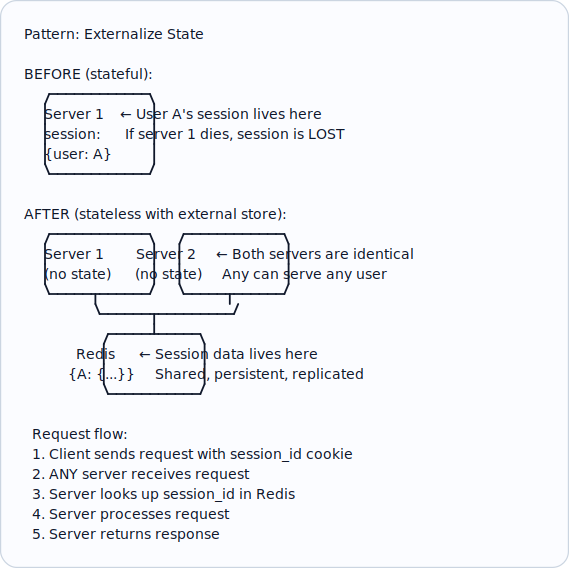
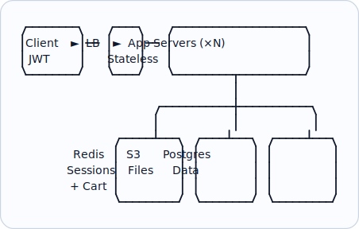

# Topic 11: Stateless vs Stateful

> **Track**: Core Concepts — Fundamentals
> **Difficulty**: Beginner → Intermediate
> **Prerequisites**: Topics 1–10

---

## Table of Contents

- [A. Concept Explanation](#a-concept-explanation)
- [B. Interview View](#b-interview-view)
- [C. Practical Engineering View](#c-practical-engineering-view)
- [D. Example](#d-example)
- [E. HLD and LLD](#e-hld-and-lld)
- [F. Summary & Practice](#f-summary--practice)

---

## A. Concept Explanation

### Definitions

**Stateless**: The server does not store any client context between requests. Each request contains all information needed to process it.

**Stateful**: The server retains client context (session, connection, data) between requests.

```
STATELESS SERVER:
  Request 1: "I'm User A, here's my auth token, give me /profile"
  Request 2: "I'm User A, here's my auth token, give me /orders"
  → Each request is independent. Any server can handle any request.

STATEFUL SERVER:
  Request 1: "Login as User A" → Server stores session {user: A}
  Request 2: "Give me /profile" → Server looks up session to know it's User A
  → Request 2 MUST go to the same server (or session is lost)
```

### Comparison

| Aspect | Stateless | Stateful |
|--------|-----------|---------|
| **Scaling** | Trivial (add servers) | Hard (must migrate/share state) |
| **Load balancing** | Any algorithm works | Needs sticky sessions |
| **Failure recovery** | Seamless (retry on any server) | Session lost on crash |
| **Complexity** | Simple server, client carries context | Complex server, simple client |
| **Performance** | May need extra lookups per request | State is local (fast access) |
| **Examples** | REST APIs, serverless functions | WebSocket servers, game servers, DB connections |

### Making Stateful Services Stateless



### Where State Must Live

| State Type | External Store | Example |
|-----------|---------------|---------|
| **User sessions** | Redis, Memcached | Login sessions, shopping cart |
| **Authentication** | JWT (client-side) or Redis | Auth tokens |
| **Caching** | Redis, CDN | Computed results, API responses |
| **File uploads** | S3, GCS | User uploads, media |
| **Job state** | Database, message queue | Background job progress |
| **WebSocket connections** | In-memory + Redis Pub/Sub | Real-time features |

### Truly Stateful Services

Some services **must** be stateful:

```
1. DATABASES: Store data (the whole point)
   → Scale via replication + sharding

2. WEBSOCKET SERVERS: Maintain persistent connections
   → Use Redis Pub/Sub for cross-server messaging

3. GAME SERVERS: Track game world state
   → Partition by game room/instance

4. STREAM PROCESSORS: Maintain windowed state
   → Kafka Streams, Flink (checkpoint state to durable store)

5. CACHES: Store hot data in memory
   → Redis Cluster (consistent hashing for distribution)
```

---

## B. Interview View

### What Interviewers Expect

- Know the difference and why stateless is preferred for web services
- Know how to externalize state (Redis, JWT, S3)
- Understand sticky sessions and their drawbacks
- Know which services must be stateful and how to manage them

### Red Flags

- Storing sessions in app server memory in a scaled system
- Not considering state when discussing horizontal scaling
- Not mentioning JWT as a stateless auth option

### Common Questions

1. What's the difference between stateless and stateful?
2. Why are stateless services easier to scale?
3. How would you handle sessions in a horizontally scaled system?
4. When must a service be stateful?
5. What is a JWT and how does it enable stateless auth?

---

## C. Practical Engineering View

### JWT for Stateless Authentication

```
STATEFUL AUTH (session-based):
  Login → Server creates session in Redis → Returns session_id cookie
  Every request: Server looks up session_id in Redis
  Logout: Server deletes session from Redis
  Problem: Redis dependency for every request

STATELESS AUTH (JWT-based):
  Login → Server creates JWT with {user_id, role, exp} → Returns JWT
  Every request: Server VERIFIES JWT signature (no external lookup!)
  Logout: JWT is still valid until expiry (can't revoke easily)
  Benefit: No Redis dependency, no session lookup

JWT structure:
  Header.Payload.Signature
  eyJhbGc... . eyJ1c2Vy... . SflKxwRJ...

  Payload (decoded):
  {
    "user_id": 123,
    "role": "admin",
    "exp": 1700000000,
    "iat": 1699990000
  }

Trade-off:
  JWT: Faster (no lookup), but can't revoke until expiry
  Session: Revocable, but requires Redis for every request
  Hybrid: Short-lived JWT (15 min) + refresh token in Redis
```

### Sticky Sessions (When You Can't Avoid State)

```
Sticky sessions: LB routes same user to same server

  User A → always → Server 1
  User B → always → Server 2

  Implementation: LB uses cookie or IP hash

  Problems:
  • Uneven load (one server gets all heavy users)
  • Server crash = all its users lose state
  • Can't auto-scale easily (new servers get no traffic)

  → Almost always better to externalize state instead
```

---

## D. Example: E-Commerce Cart

```
STATEFUL (in-memory cart):
  Server stores cart per user
  User adds item → stored in server memory
  If server crashes → cart is lost
  If LB routes to different server → cart is empty

STATELESS (externalized cart):
  Cart stored in Redis (key: user_id, value: cart JSON)
  Any server can read/write the cart
  If server crashes → cart is safe in Redis
  If Redis crashes → Redis has replicas

  API:
  POST /cart/items  { "product_id": 123, "qty": 1 }
    → Server reads cart from Redis
    → Adds item
    → Writes cart back to Redis
    → Returns updated cart
```

---

## E. HLD and LLD

### E.1 HLD — Stateless API with External State



### E.2 LLD — Session Manager

```java
public class SessionManager {
    private final RedisClient redis;
    private final int ttlSeconds;

    public SessionManager(RedisClient redis, int ttlSeconds) {
        this.redis = redis; this.ttlSeconds = ttlSeconds;
    }

    public String createSession(String userId, Map<String, Object> data) {
        String sessionId = generateSecureToken();
        Map<String, Object> sessionData = new HashMap<>(data);
        sessionData.put("user_id", userId);
        redis.setex("session:" + sessionId, ttlSeconds, toJson(sessionData));
        return sessionId;
    }

    public Map<String, Object> getSession(String sessionId) {
        String data = redis.get("session:" + sessionId);
        if (data != null) {
            redis.expire("session:" + sessionId, ttlSeconds); // Extend TTL
            return fromJson(data);
        }
        return null;
    }

    public void destroySession(String sessionId) {
        redis.delete("session:" + sessionId);
    }
}
```

---

## F. Summary & Practice

### Key Takeaways

1. **Stateless** = no server-side client context; **Stateful** = server remembers client
2. Stateless services are trivially horizontally scalable
3. **Externalize state** to Redis, S3, or databases to make services stateless
4. **JWT** enables stateless authentication (no session lookup)
5. Sticky sessions are a band-aid — externalize state instead
6. Some services (databases, WebSocket, game servers) must be stateful
7. Stateful services need special scaling: replication, sharding, consistent hashing

### Interview Questions

1. Compare stateless and stateful services.
2. Why are stateless services easier to scale?
3. How do you handle sessions in a distributed system?
4. What is JWT and how does it enable stateless auth?
5. Name 3 services that must be stateful and explain how to scale them.
6. What are sticky sessions and why should you avoid them?

### Practice Exercises

1. Convert a stateful Express.js app (in-memory sessions) to stateless using Redis.
2. Design the session management strategy for an app with 1M concurrent users.
3. Compare JWT-based auth vs session-based auth for a banking application.

---

> **Previous**: [10 — Horizontal vs Vertical Scaling](10-horizontal-vs-vertical-scaling.md)
> **Next**: [12 — Load Balancing](12-load-balancing.md)
