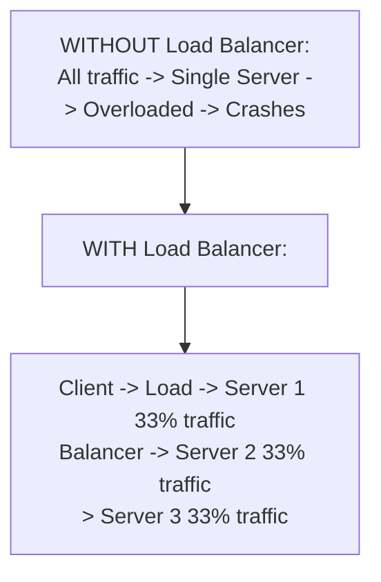
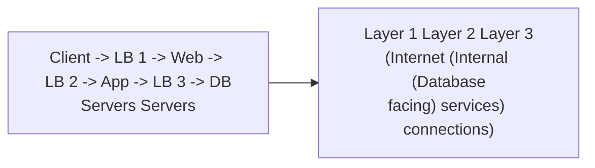
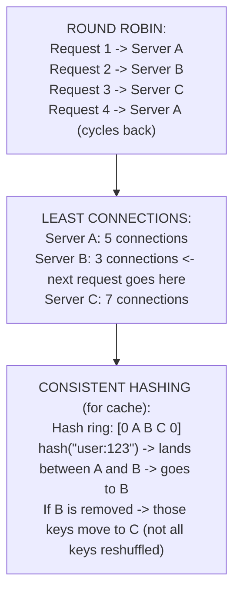
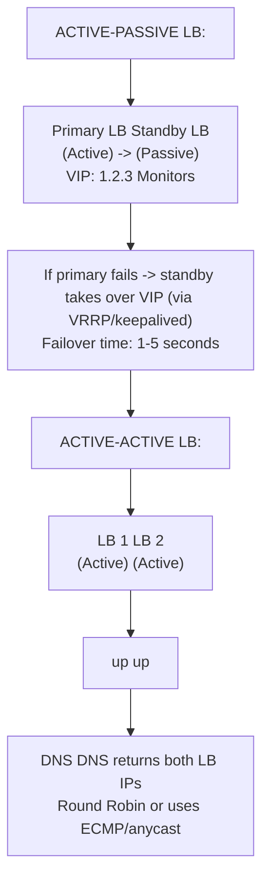
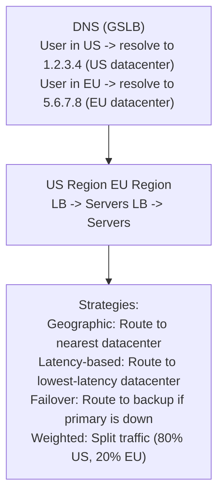
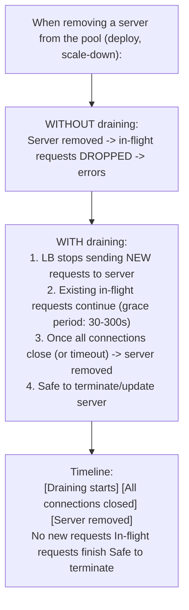
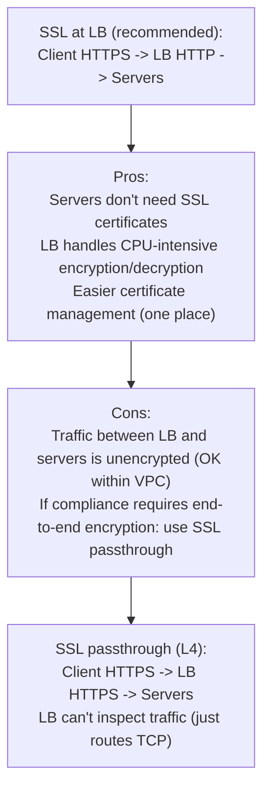
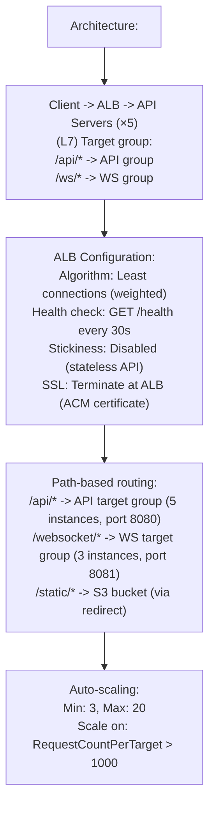
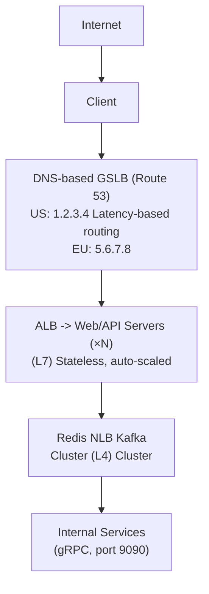

# Topic 12: Load Balancing

> **Track**: Core Concepts — Fundamentals
> **Difficulty**: Beginner → Intermediate
> **Prerequisites**: Topics 1–11

---

## Table of Contents

- [A. Concept Explanation](#a-concept-explanation)
- [B. Interview View](#b-interview-view)
- [C. Practical Engineering View](#c-practical-engineering-view)
- [D. Example](#d-example)
- [E. HLD and LLD](#e-hld-and-lld)
- [F. Summary & Practice](#f-summary--practice)

---

## A. Concept Explanation

### What is Load Balancing?

A **load balancer** distributes incoming network traffic across multiple servers to ensure no single server is overwhelmed, improving availability, throughput, and reliability.



### Where Load Balancers Sit



### L4 vs L7 Load Balancing

| Feature | L4 (Transport) | L7 (Application) |
|---------|----------------|------------------|
| **OSI Layer** | Layer 4 (TCP/UDP) | Layer 7 (HTTP/HTTPS) |
| **Sees** | IP addresses, ports | URLs, headers, cookies, body |
| **Speed** | Faster (less processing) | Slower (must parse HTTP) |
| **Routing** | Based on IP/port only | Based on URL path, headers, cookies |
| **SSL termination** | No (passes through) | Yes (can decrypt HTTPS) |
| **Use case** | TCP load balancing, gaming, non-HTTP | HTTP APIs, web apps, microservices |
| **Example** | AWS NLB, HAProxy (TCP mode) | AWS ALB, Nginx, HAProxy (HTTP mode) |

```
L4 Load Balancer:
  Sees: Source IP 1.2.3.4:5678 → Dest IP 10.0.0.1:80
  Decision: Based on IP hash or round-robin
  Can't see: URL, headers, cookies

L7 Load Balancer:
  Sees: GET /api/users HTTP/1.1  Host: api.example.com  Cookie: session=abc
  Decision: /api/* → API servers, /static/* → CDN, session=abc → Server 2
  Can do: URL routing, header-based routing, SSL termination, compression
```

### Load Balancing Algorithms

| Algorithm | How It Works | Pros | Cons | Best For |
|-----------|-------------|------|------|----------|
| **Round Robin** | Rotates through servers sequentially | Simple, fair | Ignores server load | Equal-capacity servers |
| **Weighted Round Robin** | Round robin with weights per server | Handles mixed capacity | Static weights | Mixed server sizes |
| **Least Connections** | Routes to server with fewest active connections | Adapts to load | Slower (must track connections) | Long-lived connections |
| **Weighted Least Connections** | Least connections + server weights | Best load distribution | Most complex | Production web apps |
| **IP Hash** | Hash of client IP → consistent server | Session affinity | Uneven if IPs cluster | Stateful without sticky sessions |
| **Random** | Randomly pick a server | Simple, no state | Can be uneven | Simple setups |
| **Least Response Time** | Routes to fastest-responding server | Best latency | Requires monitoring | Latency-sensitive apps |
| **Consistent Hashing** | Hash ring; minimal redistribution on change | Minimal disruption | Complex implementation | Cache servers, DB sharding |



### Health Checks

```
Load balancer must know which servers are healthy:

PASSIVE health check:
  LB monitors responses from servers
  If server returns 5xx errors → mark unhealthy
  Pro: No extra traffic
  Con: Slow detection (waits for real traffic)

ACTIVE health check:
  LB periodically pings servers:
    GET /health → 200 OK (healthy)
    GET /health → timeout or 500 (unhealthy)
  
  Config:
    Interval: 10 seconds
    Timeout: 5 seconds
    Healthy threshold: 3 consecutive successes
    Unhealthy threshold: 2 consecutive failures
  
  Unhealthy server → removed from pool
  Recovered server → added back after healthy threshold
```

### High Availability for Load Balancers

The LB itself can be a single point of failure:



### Global Server Load Balancing (GSLB)



---

## B. Interview View

### What Interviewers Expect

| Level | Expectation |
|-------|------------|
| **Junior** | Knows what an LB does; can draw it in architecture |
| **Mid** | Knows L4 vs L7, common algorithms, health checks |
| **Senior** | Discusses GSLB, consistent hashing, LB as potential bottleneck |
| **Staff+** | HA for LBs, DNS-based routing, connection draining, cost implications |

### Red Flags

- Forgetting to add a load balancer in a multi-server design
- Not knowing the difference between L4 and L7
- Using sticky sessions without justification
- Not considering LB failure (single point of failure)

### Common Questions

1. What is a load balancer and why do you need one?
2. Compare L4 vs L7 load balancing.
3. What algorithm would you use for this system?
4. How do you make the load balancer itself highly available?
5. What are health checks and how do they work?
6. When would you use consistent hashing?
7. How does DNS-based load balancing work?

---

## C. Practical Engineering View

### AWS Load Balancer Options

| Service | Type | Use Case | Cost |
|---------|------|----------|------|
| **ALB** | L7 | HTTP/HTTPS, microservices, path routing | ~$20/mo + traffic |
| **NLB** | L4 | TCP/UDP, gaming, IoT, extreme performance | ~$20/mo + traffic |
| **CLB** | L4/L7 (legacy) | Simple HTTP/TCP | ~$20/mo + traffic |
| **Global Accelerator** | GSLB | Multi-region, anycast | ~$20/mo + traffic |

### Connection Draining



### SSL/TLS Termination



---

## D. Example: Scaling an API with Load Balancing



---

## E. HLD and LLD

### E.1 HLD — Multi-Tier Load Balanced Architecture



### E.2 LLD — Simple Load Balancer

```java
public class Server {
    private final String host;
    private final int port;
    private int weight = 1;
    private boolean healthy = true;
    private int activeConnections = 0;
    private long lastHealthCheck = 0;

    public Server(String host, int port, int weight) {
        this.host = host; this.port = port; this.weight = weight;
    }
    // getters and setters
}

public class LoadBalancer {
    private final List<Server> servers = new ArrayList<>();
    private final String algorithm;
    private int rrIndex = 0;

    public LoadBalancer(String algorithm) { this.algorithm = algorithm; }

    public void addServer(Server server) { servers.add(server); }
    public void removeServer(Server server) { servers.remove(server); }

    public List<Server> getHealthyServers() {
        return servers.stream().filter(Server::isHealthy).toList();
    }

    public Server getServer(String clientIp) {
        List<Server> healthy = getHealthyServers();
        if (healthy.isEmpty()) throw new RuntimeException("No healthy servers available");

        switch (algorithm) {
            case "round_robin":          return roundRobin(healthy);
            case "least_connections":    return leastConnections(healthy);
            case "ip_hash":             return ipHash(healthy, clientIp);
            case "weighted_round_robin": return weightedRoundRobin(healthy);
            case "random":              return healthy.get(new Random().nextInt(healthy.size()));
            default: throw new IllegalArgumentException("Unknown algorithm: " + algorithm);
        }
    }

    private Server roundRobin(List<Server> servers) {
        Server server = servers.get(rrIndex % servers.size());
        rrIndex++;
        return server;
    }

    private Server leastConnections(List<Server> servers) {
        return servers.stream().min(Comparator.comparingInt(Server::getActiveConnections)).orElseThrow();
    }

    private Server ipHash(List<Server> servers, String clientIp) {
        int index = Math.abs(clientIp.hashCode()) % servers.size();
        return servers.get(index);
    }

    private Server weightedRoundRobin(List<Server> servers) {
        List<Server> weightedList = new ArrayList<>();
        for (Server s : servers)
            for (int i = 0; i < s.getWeight(); i++) weightedList.add(s);
        Server server = weightedList.get(rrIndex % weightedList.size());
        rrIndex++;
        return server;
    }

    /** Run health checks on all servers */
    public void healthCheck(BiFunction<String, Integer, Boolean> checkFn) {
        for (Server server : servers) {
            try { server.setHealthy(checkFn.apply(server.getHost(), server.getPort())); }
            catch (Exception e) { server.setHealthy(false); }
            server.setLastHealthCheck(System.currentTimeMillis());
        }
    }
}
```

#### Edge Cases

| Edge Case | Handling |
|-----------|---------|
| All servers unhealthy | Return 503; alert ops; check if LB health check is too aggressive |
| Single server much slower | Least-connections naturally routes away; or use least-response-time |
| Connection leak on one server | Monitor per-server connection counts; alert on outliers |
| LB itself overloaded | Scale LB horizontally (DNS round-robin across LBs) |
| Long-lived WebSocket connections | Use separate target group; don't include in least-connections count |

---

## F. Summary & Practice

### Key Takeaways

1. **Load balancers** distribute traffic across servers for availability and throughput
2. **L4** operates on TCP/IP (faster, simpler); **L7** on HTTP (smarter routing)
3. **Round robin** for simple cases; **least connections** for production; **consistent hashing** for caches
4. **Health checks** (active + passive) detect and remove unhealthy servers
5. LBs themselves need **HA** (active-passive or active-active)
6. **SSL termination** at the LB simplifies certificate management
7. **Connection draining** prevents dropped requests during deploys
8. **GSLB** uses DNS for geographic/latency-based routing across regions
9. Modern cloud LBs (ALB, NLB) handle most use cases out of the box
10. Every system design diagram should include a load balancer

### Interview Questions

1. What is a load balancer and why is it needed?
2. Compare L4 and L7 load balancing.
3. Describe 4 load balancing algorithms and when to use each.
4. How do health checks work?
5. How do you make the load balancer itself highly available?
6. What is consistent hashing and when would you use it?
7. What is connection draining?
8. Where would you place load balancers in a microservices architecture?
9. What is SSL termination and where should it happen?
10. How does DNS-based global load balancing work?

### Practice Exercises

1. **Exercise 1**: Design the LB strategy for an app with: (a) 10 API servers, (b) 3 WebSocket servers, (c) 5 gRPC internal services. Choose L4 vs L7, algorithm, and health check config for each.

2. **Exercise 2**: Your LB uses round-robin but one server is 2× more powerful. Design a weighted scheme. What happens if the powerful server goes down?

3. **Exercise 3**: Implement consistent hashing for a cache cluster. Show what happens when a node is added or removed.

---

> **Previous**: [11 — Stateless vs Stateful](11-stateless-vs-stateful.md)
> **Next**: [13 — Reverse Proxy](13-reverse-proxy.md)
