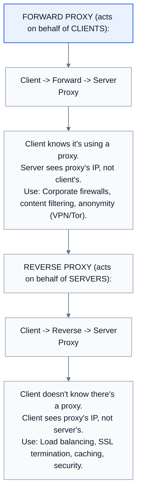
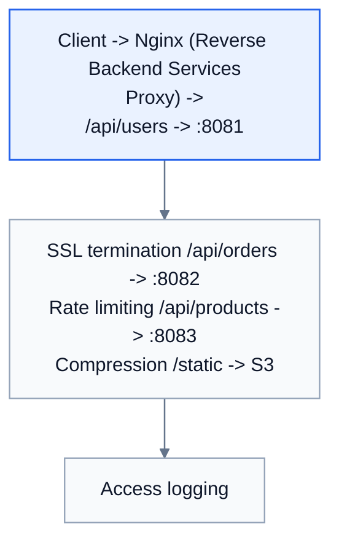
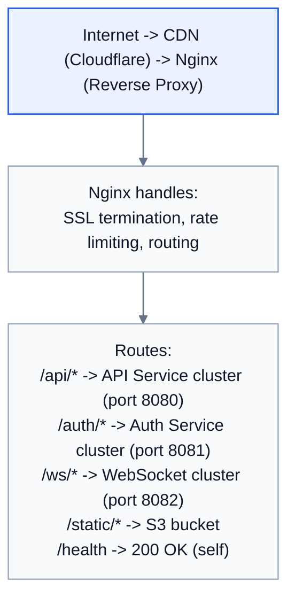

# Topic 13: Reverse Proxy

> **Track**: Core Concepts — Fundamentals
> **Difficulty**: Beginner → Intermediate
> **Prerequisites**: Topics 1–12 (especially Load Balancing)

---

## Table of Contents

- [A. Concept Explanation](#a-concept-explanation)
- [B. Interview View](#b-interview-view)
- [C. Practical Engineering View](#c-practical-engineering-view)
- [D. Example](#d-example)
- [E. HLD and LLD](#e-hld-and-lld)
- [F. Summary & Practice](#f-summary--practice)

---

## A. Concept Explanation

### Forward Proxy vs Reverse Proxy



### What a Reverse Proxy Does

| Function | Description |
|----------|-------------|
| **Load balancing** | Distribute traffic across multiple backend servers |
| **SSL termination** | Handle HTTPS encryption/decryption |
| **Caching** | Cache static content (HTML, CSS, JS, images) |
| **Compression** | Gzip/Brotli compress responses |
| **Security** | Hide backend server IPs; block malicious requests |
| **Rate limiting** | Throttle requests per client |
| **Request routing** | Route by URL path, host header, or other criteria |
| **Authentication** | Verify auth tokens before passing to backend |
| **A/B testing** | Route percentage of traffic to different backends |
| **Logging** | Centralized access logging and metrics |

### Reverse Proxy vs Load Balancer

```
A load balancer IS a type of reverse proxy that focuses on traffic distribution.
A reverse proxy is a broader concept that includes LB + many other features.

Reverse Proxy only (1 backend):
  Client → Nginx → Single App Server
  (Still useful for SSL, caching, compression, security)

Load Balancer (multiple backends):
  Client → Nginx → App Server 1
                 → App Server 2
                 → App Server 3

In practice, Nginx/HAProxy/Traefik serve as both reverse proxy AND load balancer.
```

### Popular Reverse Proxies

| Tool | Strengths | Use Case |
|------|-----------|----------|
| **Nginx** | Fast, stable, widely used | Web serving, reverse proxy, LB |
| **HAProxy** | Best-in-class LB performance | High-traffic load balancing |
| **Traefik** | Auto-discovery, K8s native | Microservices, containers |
| **Envoy** | Service mesh sidecar, L7 features | Service-to-service (Istio) |
| **Caddy** | Automatic HTTPS, simple config | Small projects, easy TLS |
| **AWS ALB** | Managed, auto-scaling | AWS cloud deployments |
| **Cloudflare** | Global CDN + reverse proxy | DDoS protection, edge caching |

---

## B. Interview View

### What Interviewers Expect

- Know when to use a reverse proxy (almost always in production)
- Understand the difference from a forward proxy
- Know key features: SSL, caching, compression, routing
- Can name specific tools (Nginx, HAProxy)

### Red Flags

- Confusing forward and reverse proxy
- Not including a reverse proxy in production architecture
- Not knowing about SSL termination

### Common Questions

1. What is a reverse proxy and how does it differ from a forward proxy?
2. What features does a reverse proxy provide?
3. How is a reverse proxy different from a load balancer?
4. Where would you place a reverse proxy in your architecture?
5. What reverse proxy would you use and why?

---

## C. Practical Engineering View

### Nginx Configuration Example

```
# /etc/nginx/nginx.conf

upstream api_servers {
    least_conn;
    server 10.0.1.1:8080 weight=3;
    server 10.0.1.2:8080 weight=1;
    server 10.0.1.3:8080 weight=1;
}

server {
    listen 443 ssl;
    server_name api.example.com;

    ssl_certificate /etc/ssl/cert.pem;
    ssl_certificate_key /etc/ssl/key.pem;

    # Compression
    gzip on;
    gzip_types application/json text/plain text/css;

    # Cache static assets
    location /static/ {
        proxy_cache my_cache;
        proxy_cache_valid 200 1h;
        proxy_pass http://api_servers;
    }

    # API routing
    location /api/ {
        proxy_pass http://api_servers;
        proxy_set_header X-Real-IP $remote_addr;
        proxy_set_header X-Forwarded-For $proxy_add_x_forwarded_for;
        proxy_set_header Host $host;
    }

    # Rate limiting
    limit_req_zone $binary_remote_addr zone=api:10m rate=10r/s;
    location /api/expensive {
        limit_req zone=api burst=20;
        proxy_pass http://api_servers;
    }
}
```

---

## D. Example: API Gateway Pattern with Reverse Proxy



---

## E. HLD and LLD

### E.1 HLD — Reverse Proxy Layer



### E.2 LLD — Request Router

```java
public class ReverseProxy {
    private final Map<String, Route> routes = new LinkedHashMap<>();
    private final RateLimiter rateLimiter = new RateLimiter();
    private final Cache cache = new Cache();

    public void addRoute(String pathPrefix, List<String> backends, String lbAlgo) {
        routes.put(pathPrefix, new Route(backends, new LoadBalancer(lbAlgo)));
    }

    public Response handleRequest(Request request) {
        // Rate limiting
        if (!rateLimiter.allow(request.getClientIp()))
            return new Response(429, "Too Many Requests");

        // Check cache
        if ("GET".equals(request.getMethod())) {
            Response cached = cache.get(request.getUrl());
            if (cached != null) return cached;
        }

        // Route to backend
        Route route = matchRoute(request.getPath());
        if (route == null) return new Response(404, "Not Found");

        Server backend = route.getLb().getServer(request.getClientIp());

        // Forward request with headers
        Map<String, String> headers = Map.of(
            "X-Real-IP", request.getClientIp(),
            "X-Forwarded-For", request.getClientIp(),
            "X-Request-ID", UUID.randomUUID().toString());
        Response response = backend.forward(request, headers);

        // Cache if cacheable
        if ("GET".equals(request.getMethod()) && response.getStatus() == 200)
            cache.set(request.getUrl(), response, 300);

        return response;
    }
}
```

---

## F. Summary & Practice

### Key Takeaways

1. **Reverse proxy** sits between clients and servers, acting on behalf of servers
2. Key functions: **SSL termination, caching, compression, routing, rate limiting, security**
3. A **load balancer is a subset** of reverse proxy functionality
4. Every production system should have a reverse proxy (Nginx, HAProxy, Traefik)
5. **Forward proxy** = for clients; **Reverse proxy** = for servers

### Interview Questions

1. What is a reverse proxy? How does it differ from a forward proxy?
2. List 5 functions of a reverse proxy.
3. Why use a reverse proxy even with a single backend server?
4. Compare Nginx, HAProxy, and Traefik.
5. Where does SSL termination happen in your architecture?

### Practice Exercises

1. Configure Nginx as a reverse proxy for 3 API servers with SSL, caching, and rate limiting.
2. Design an architecture using a reverse proxy for path-based routing to 5 microservices.
3. Compare the performance of direct server access vs through a reverse proxy with caching.

---

> **Previous**: [12 — Load Balancing](12-load-balancing.md)
> **Next**: [14 — API Gateway](14-api-gateway.md)
