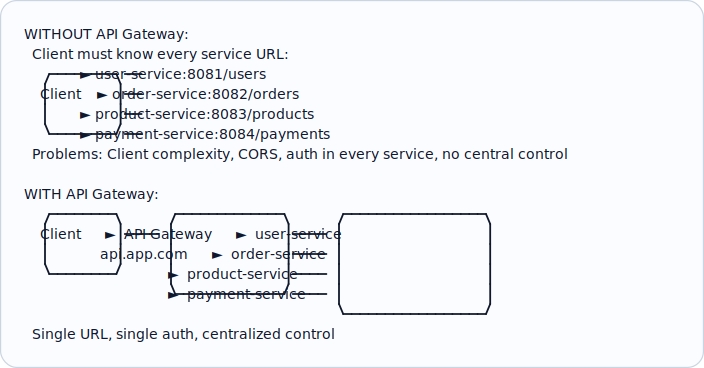
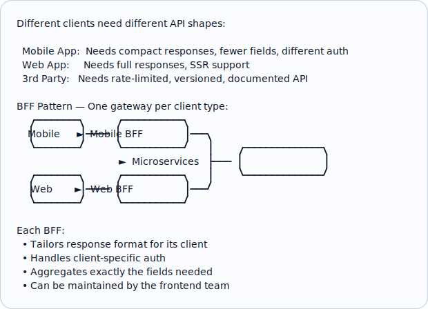
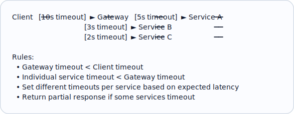
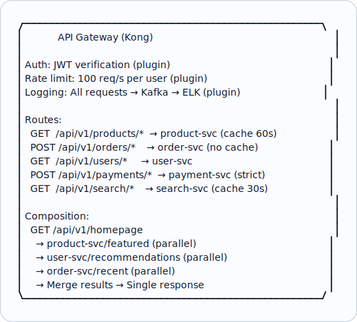
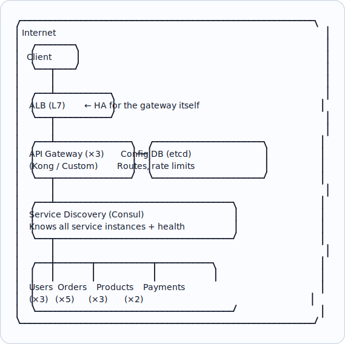

# Topic 14: API Gateway

> **Track**: Core Concepts — Fundamentals
> **Difficulty**: Intermediate
> **Prerequisites**: Topics 1–13 (especially Load Balancing, Reverse Proxy)

---

## Table of Contents

- [A. Concept Explanation](#a-concept-explanation)
- [B. Interview View](#b-interview-view)
- [C. Practical Engineering View](#c-practical-engineering-view)
- [D. Example](#d-example)
- [E. HLD and LLD](#e-hld-and-lld)
- [F. Summary & Practice](#f-summary--practice)

---

## A. Concept Explanation

### What is an API Gateway?

An **API Gateway** is a single entry point for all client requests in a microservices architecture. It acts as a reverse proxy that routes, composes, and manages API calls.



### API Gateway Responsibilities

| Function | Description |
|----------|-------------|
| **Request routing** | Route /users → user-service, /orders → order-service |
| **Authentication/Authorization** | Verify JWT/API keys before forwarding |
| **Rate limiting** | Per-client or per-API throttling |
| **Request/Response transformation** | Modify headers, body, format |
| **API composition** | Aggregate multiple service calls into one response |
| **Protocol translation** | REST to gRPC, HTTP to WebSocket |
| **Caching** | Cache frequent read responses |
| **Circuit breaking** | Prevent cascade failures |
| **Logging & monitoring** | Centralized request logging, metrics |
| **API versioning** | Route /v1/* and /v2/* to different services |
| **Load balancing** | Distribute across service instances |

### API Gateway vs Reverse Proxy vs Load Balancer

| Feature | Load Balancer | Reverse Proxy | API Gateway |
|---------|--------------|---------------|-------------|
| Traffic distribution | ✓ | ✓ | ✓ |
| SSL termination | Some | ✓ | ✓ |
| Caching | ✗ | ✓ | ✓ |
| Auth/AuthZ | ✗ | Basic | ✓ Full |
| Rate limiting | ✗ | Basic | ✓ Advanced |
| API composition | ✗ | ✗ | ✓ |
| Protocol translation | ✗ | ✗ | ✓ |
| Request transformation | ✗ | Limited | ✓ |
| Developer portal | ✗ | ✗ | ✓ |

### Backend for Frontend (BFF) Pattern



### Popular API Gateways

| Tool | Type | Best For |
|------|------|----------|
| **Kong** | Open source + Enterprise | Full-featured, plugin ecosystem |
| **AWS API Gateway** | Managed | Serverless, Lambda integration |
| **Apigee (Google)** | Managed | Enterprise, analytics, monetization |
| **Nginx + Lua** | Self-hosted | Custom logic, high performance |
| **Traefik** | Open source | Kubernetes, auto-discovery |
| **Envoy + Istio** | Service mesh | Service-to-service, advanced traffic |
| **Express Gateway** | Open source | Node.js ecosystem |
| **Spring Cloud Gateway** | Open source | Java/Spring ecosystem |

---

## B. Interview View

### What Interviewers Expect

| Level | Expectation |
|-------|------------|
| **Junior** | Knows API gateway exists; can draw it in architecture |
| **Mid** | Lists key functions; knows when to use one |
| **Senior** | Discusses BFF pattern, gateway as bottleneck, composition |
| **Staff+** | Gateway fleet management, multi-tenancy, cost, failure modes |

### Red Flags

- Not having a gateway in a microservices design
- Putting business logic in the gateway
- Not considering the gateway as a potential SPOF
- Auth in every microservice instead of centralizing at gateway

### Common Questions

1. What is an API gateway and why use one?
2. What's the difference between an API gateway and a reverse proxy?
3. What is the BFF pattern?
4. What are the downsides of using an API gateway?
5. How do you handle API versioning?

---

## C. Practical Engineering View

### API Gateway Anti-Patterns

```
DON'T:
  ✗ Put business logic in the gateway
  ✗ Make the gateway a monolithic bottleneck
  ✗ Skip health checks on backend services
  ✗ Forget rate limiting (DDoS vulnerability)
  ✗ Cache mutable data aggressively
  ✗ Skip timeouts (one slow service blocks gateway)

DO:
  ✓ Keep gateway thin (routing, auth, rate limiting only)
  ✓ Set timeouts for every backend call
  ✓ Implement circuit breakers for each service
  ✓ Monitor gateway latency as a key metric
  ✓ Use connection pooling to backends
  ✓ Deploy multiple gateway instances behind a load balancer
```

### Gateway Timeout Strategy



---

## D. Example: E-Commerce API Gateway



---

## E. HLD and LLD

### E.1 HLD — Gateway Architecture



### E.2 LLD — API Composition

```java
/** Composes multiple backend API calls into a single response */
public class APIComposer {
    private final ServiceRegistry registry;
    private final int timeoutSec;
    private final ExecutorService executor = Executors.newCachedThreadPool();

    public APIComposer(ServiceRegistry registry, int timeoutSec) {
        this.registry = registry; this.timeoutSec = timeoutSec;
    }

    /**
     * compositionConfig = [
     *   {"key": "products", "service": "product-svc", "path": "/featured"},
     *   {"key": "orders",   "service": "order-svc",   "path": "/recent"},
     *   {"key": "user",     "service": "user-svc",    "path": "/profile"},
     * ]
     */
    public Map<String, Object> compose(List<Map<String, String>> compositionConfig) {
        Map<String, Future<Object>> futures = new LinkedHashMap<>();
        for (Map<String, String> config : compositionConfig) {
            futures.put(config.get("key"),
                executor.submit(() -> callService(config.get("service"), config.get("path"))));
        }

        Map<String, Object> results = new LinkedHashMap<>();
        for (var entry : futures.entrySet()) {
            try {
                results.put(entry.getKey(),
                    entry.getValue().get(timeoutSec, TimeUnit.SECONDS));
            } catch (TimeoutException e) {
                results.put(entry.getKey(), Map.of("error", "timeout", "fallback", true));
            } catch (Exception e) {
                results.put(entry.getKey(), Map.of("error", e.getMessage(), "fallback", true));
            }
        }
        return results;
    }

    private Object callService(String serviceName, String path) {
        ServiceInstance instance = registry.getHealthyInstance(serviceName);
        return httpClient.get("http://" + instance.getHost() + ":" + instance.getPort() + path);
    }
}
```

---

## F. Summary & Practice

### Key Takeaways

1. **API Gateway** = single entry point for all client API calls in microservices
2. Key functions: **routing, auth, rate limiting, composition, protocol translation**
3. API gateway is a **superset** of reverse proxy and load balancer
4. **BFF pattern**: separate gateways per client type (mobile, web, 3rd-party)
5. Keep the gateway **thin** — no business logic
6. The gateway itself needs **HA** (multiple instances behind LB)
7. Set **timeouts** and **circuit breakers** for every backend service
8. Popular options: Kong (OSS), AWS API Gateway (managed), Apigee (enterprise)

### Interview Questions

1. What is an API gateway? Why is it needed in microservices?
2. How does an API gateway differ from a reverse proxy?
3. What is the BFF pattern and when would you use it?
4. What are the downsides of an API gateway?
5. How do you prevent the gateway from becoming a bottleneck?
6. How would you implement API versioning?
7. How does API composition work at the gateway level?

### Practice Exercises

1. Design an API gateway for a social media platform with mobile, web, and public API clients using the BFF pattern.
2. Your gateway handles 50K RPS. One backend service becomes slow (5s responses). Design the circuit breaker and timeout strategy.
3. Implement API rate limiting at the gateway level: 100 req/s per user, 1000 req/s per IP, 10K req/s global.

---

> **Previous**: [13 — Reverse Proxy](13-reverse-proxy.md)
> **Next**: [15 — CDN](15-cdn.md)
