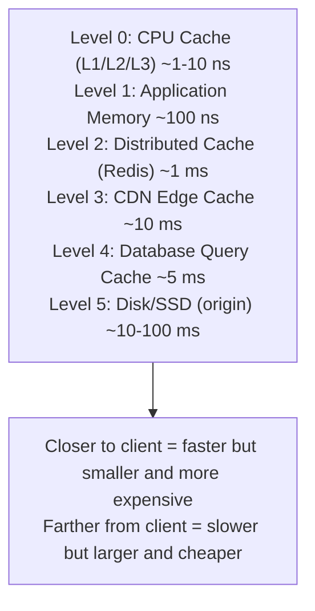
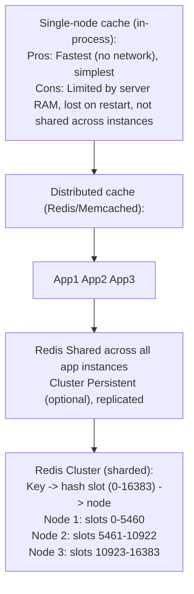
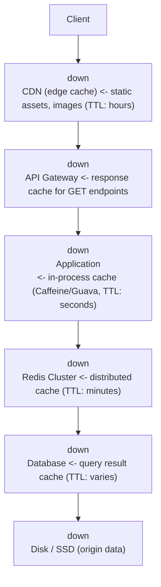

# Topic 16: Caching

> **Track**: Core Concepts — Fundamentals
> **Difficulty**: Intermediate
> **Prerequisites**: Topics 1–15

---

## Table of Contents

- [A. Concept Explanation](#a-concept-explanation)
- [B. Interview View](#b-interview-view)
- [C. Practical Engineering View](#c-practical-engineering-view)
- [D. Example](#d-example)
- [E. HLD and LLD](#e-hld-and-lld)
- [F. Summary & Practice](#f-summary--practice)

---

## A. Concept Explanation

### What is Caching?

Caching stores copies of frequently accessed data in a **faster storage layer** so future requests are served more quickly, reducing load on slower backend systems.

```
WITHOUT Cache:
  App → Database (10ms query) → Every single time

WITH Cache:
  App → Cache (0.5ms) → HIT → Return immediately
                       → MISS → Database (10ms) → Store in cache → Return

Cache hit rate of 95% means:
  95% of requests: 0.5ms (from cache)
  5% of requests: 10ms (from DB, then cached)
  Average: 0.95 × 0.5 + 0.05 × 10 = 0.975ms (vs 10ms without cache = 10× faster)
```

### Cache Levels



### Caching Strategies

#### Cache-Aside (Lazy Loading)

```
Read path:
  1. App checks cache for key
  2. Cache HIT → return data
  3. Cache MISS → read from DB → write to cache → return data

Write path:
  1. App writes to DB
  2. App invalidates/deletes cache key

Pros: Only requested data is cached; cache failure doesn't break reads
Cons: Cache miss penalty (3 trips); stale data possible
Best for: General-purpose, read-heavy workloads
```

#### Read-Through

```
Read path:
  1. App reads from cache
  2. Cache MISS → cache itself fetches from DB → stores → returns

  App only talks to cache, never directly to DB for reads.

Pros: Simpler app code; cache manages DB interaction
Cons: Cache library must support it; first read still slow
Best for: When cache provider supports it (e.g., NCache, Hazelcast)
```

#### Write-Through

```
Write path:
  1. App writes to cache
  2. Cache synchronously writes to DB
  3. ACK returned after both succeed

Pros: Cache is always up-to-date; no stale reads
Cons: Higher write latency (write to cache + DB); cache fills with unread data
Best for: Systems where reads after writes must be consistent
```

#### Write-Behind (Write-Back)

```
Write path:
  1. App writes to cache
  2. Cache ACKs immediately
  3. Cache asynchronously writes to DB (batched)

Pros: Very fast writes; can batch DB writes for efficiency
Cons: Data loss risk if cache crashes before DB write; complexity
Best for: High write throughput where slight data loss is acceptable
```

#### Write-Around

```
Write path:
  1. App writes directly to DB (bypasses cache)
  2. Cache is NOT updated
  3. Next read triggers cache-aside (cache miss → DB → cache)

Pros: Cache not flooded with write-heavy data that may not be read
Cons: Recent writes always cause cache misses
Best for: Write-heavy workloads where data is rarely re-read immediately
```

### Comparison Table

| Strategy | Read Latency | Write Latency | Consistency | Data Loss Risk |
|----------|-------------|---------------|-------------|---------------|
| Cache-Aside | Miss: high, Hit: low | Low (DB only) | Possible stale | None |
| Read-Through | Miss: high, Hit: low | Low (DB only) | Possible stale | None |
| Write-Through | Always low | High (cache + DB) | Strong | None |
| Write-Behind | Always low | Very low | Eventual | Yes (cache crash) |
| Write-Around | Miss: high, Hit: low | Low (DB only) | Possible stale | None |

### Eviction Policies

| Policy | How | Best For |
|--------|-----|----------|
| **LRU** (Least Recently Used) | Evict least recently accessed | General purpose (most common) |
| **LFU** (Least Frequently Used) | Evict least frequently accessed | Data with stable access patterns |
| **FIFO** (First In First Out) | Evict oldest entry | Simple cache, time-based relevance |
| **TTL** (Time To Live) | Evict after fixed time | Data with known expiry |
| **Random** | Evict random entry | When access patterns are uniform |

### Cache Invalidation

The hardest problem in caching:

```
"There are only two hard things in Computer Science:
 cache invalidation and naming things." — Phil Karlton

Strategies:
  1. TTL (Time-based): Set expiry. Simple but stale window.
  2. Event-based: DB change → publish event → invalidate cache.
  3. Write-through: Update cache on every write. No stale data.
  4. Manual purge: Admin/deploy trigger purges specific keys.
  5. Version key: user:123:v5 → increment version on change.
```

### Distributed Cache



### Cache Stampede (Thundering Herd)

```
Problem:
  Popular key expires → 1000 concurrent requests → ALL miss cache
  → 1000 queries to DB simultaneously → DB overloaded!

Solutions:
  1. LOCKING: First request acquires lock, others wait
     Request 1: Lock key → fetch from DB → set cache → unlock
     Request 2-1000: Wait for lock → cache HIT
  
  2. EARLY REFRESH: Refresh cache BEFORE TTL expires
     TTL = 60s, refresh at 50s (probabilistic)
     
  3. STALE-WHILE-REVALIDATE: Serve stale, refresh in background
     Return expired value immediately, async refresh
```

---

## B. Interview View

### What Interviewers Expect

| Level | Expectation |
|-------|------------|
| **Junior** | Knows caching improves performance; mentions Redis |
| **Mid** | Knows cache-aside pattern; understands TTL, eviction |
| **Senior** | Discusses write strategies, invalidation, stampede, distributed cache |
| **Staff+** | Multi-tier caching, cache warming, cost analysis, consistency guarantees |

### Red Flags

- Not mentioning caching in a read-heavy system
- Not knowing cache invalidation strategies
- Assuming cache is always consistent with DB
- Not considering cache failure scenarios

### Common Questions

1. What caching strategy would you use for this system?
2. How do you handle cache invalidation?
3. What happens when the cache goes down?
4. What is a cache stampede and how do you prevent it?
5. Compare Redis vs Memcached.
6. Where would you place caches in this architecture?

---

## C. Practical Engineering View

### Redis vs Memcached

| Feature | Redis | Memcached |
|---------|-------|-----------|
| Data structures | Strings, hashes, lists, sets, sorted sets | Strings only |
| Persistence | RDB + AOF | None |
| Replication | Primary-replica | None |
| Cluster mode | Yes (built-in) | Client-side sharding |
| Pub/Sub | Yes | No |
| Lua scripting | Yes | No |
| Max value size | 512 MB | 1 MB |
| Multi-threaded | Single-threaded (io-threads in 6.0+) | Multi-threaded |
| Use case | Feature-rich cache, sessions, queues | Simple high-throughput cache |

### Cache Monitoring

```
Key metrics:
  • Hit rate:    target > 95% (below 80% = investigate)
  • Miss rate:   spikes indicate key expiry or new traffic patterns
  • Eviction rate: high = cache too small
  • Memory usage: alert at 80% capacity
  • Latency (p99): Redis should be < 1ms
  • Connection count: monitor for leaks
  • Key count: track growth rate

Redis commands:
  INFO stats → hit/miss rates
  INFO memory → memory usage
  SLOWLOG GET → slow commands
  CLIENT LIST → connection details
```

---

## D. Example: E-Commerce Product Page Caching

```
Product page needs: product details + price + reviews + recommendations

Caching strategy:
  Product details: Cache-aside, TTL 1 hour (changes rarely)
  Price: Write-through, TTL 5 min (must be accurate)
  Reviews: Cache-aside, TTL 10 min (eventual consistency OK)
  Recommendations: Cache-aside, TTL 30 min (ML model, changes daily)

  Cache key design:
    product:{id}:details    → {"name": "...", "description": "..."}
    product:{id}:price      → {"price": 29.99, "currency": "USD"}
    product:{id}:reviews    → {"avg_rating": 4.5, "count": 234}
    product:{id}:recs       → [{"id": 456}, {"id": 789}]

Performance:
  Without cache: 4 DB queries × 10ms = 40ms
  With cache (95% hit): 4 Redis lookups × 0.5ms = 2ms
  Speedup: 20×
```

---

## E. HLD and LLD

### E.1 HLD — Multi-Tier Caching



### E.2 LLD — Cache Service

```java
public class CacheService {
    private final RedisClient redis;
    private final LocalCache local; // Optional in-process cache

    public CacheService(RedisClient redis, LocalCache local) {
        this.redis = redis; this.local = local;
    }

    public Object get(String key) {
        // L1: Check local cache
        if (local != null) {
            Object value = local.get(key);
            if (value != null) return value;
        }
        // L2: Check Redis
        String raw = redis.get(key);
        if (raw != null) {
            Object value = fromJson(raw);
            if (local != null) local.set(key, value, 30); // Short local TTL
            return value;
        }
        return null; // Cache miss
    }

    public void set(String key, Object value, int ttlSeconds) {
        redis.setex(key, ttlSeconds, toJson(value));
        if (local != null) local.set(key, value, Math.min(30, ttlSeconds));
    }

    public void invalidate(String key) {
        redis.delete(key);
        if (local != null) local.delete(key);
    }

    /** Cache-aside with stampede protection */
    public Object getOrLoad(String key, Supplier<Object> loaderFn, int ttlSeconds) {
        Object value = get(key);
        if (value != null) return value;

        // Acquire lock to prevent stampede
        String lockKey = "lock:" + key;
        if (redis.setnx(lockKey, "1", 10)) {
            try {
                value = loaderFn.get();
                set(key, value, ttlSeconds);
                return value;
            } finally { redis.delete(lockKey); }
        } else {
            // Another request is loading; wait and retry
            try { Thread.sleep(100); } catch (InterruptedException ignored) {}
            return get(key); // Should be populated by now
        }
    }
}
```

---

## F. Summary & Practice

### Key Takeaways

1. Caching stores frequently accessed data in faster storage to reduce latency
2. **Cache-aside** is the most common pattern; **write-through** for strong consistency
3. **Eviction**: LRU is the default; TTL for time-sensitive data
4. **Cache invalidation** is the hardest problem — use TTL + event-based invalidation
5. **Cache stampede**: prevent with locking, early refresh, or stale-while-revalidate
6. **Redis** for feature-rich cache; **Memcached** for simple high-throughput
7. **Multi-tier caching**: CDN → Gateway → In-process → Redis → DB
8. Monitor **hit rate** (>95% target), eviction rate, memory, and latency
9. Design cache keys carefully: `entity:{id}:{field}`
10. Cache failure should degrade gracefully (fall through to DB), not crash the system

### Interview Questions

1. What are the different caching strategies?
2. Compare cache-aside vs write-through vs write-behind.
3. How do you handle cache invalidation?
4. What is a cache stampede and how do you prevent it?
5. Compare Redis and Memcached.
6. Where would you add caching in this architecture?
7. What eviction policy would you use and why?
8. How do you handle cache warmup after a deploy?
9. What happens if Redis goes down?
10. Design a multi-tier caching strategy for an e-commerce platform.

### Practice Exercises

1. **Exercise 1**: Design the caching strategy for a social media feed. Consider: feed data, user profiles, post content, like counts. Specify strategy, TTL, and eviction for each.

2. **Exercise 2**: Your Redis cluster has a 60% hit rate. Diagnose and propose 5 improvements to get it above 95%.

3. **Exercise 3**: Implement a write-behind cache that batches writes to the database every 5 seconds. Handle the case where the cache crashes with unbatched writes.

---

> **Previous**: [15 — CDN](15-cdn.md)
> **Next**: [17 — Message Queues](17-message-queues.md)
