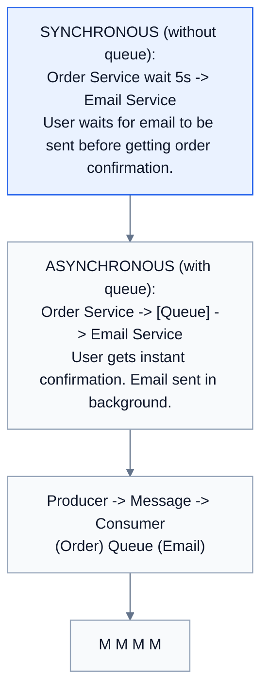
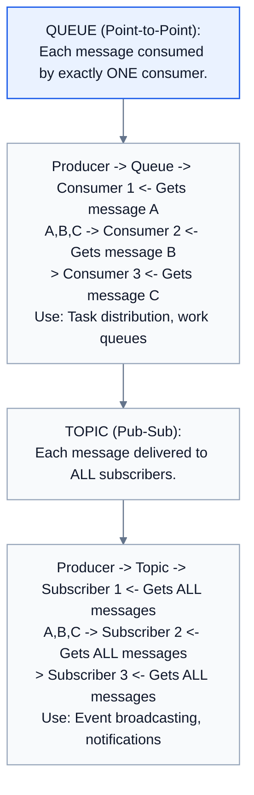
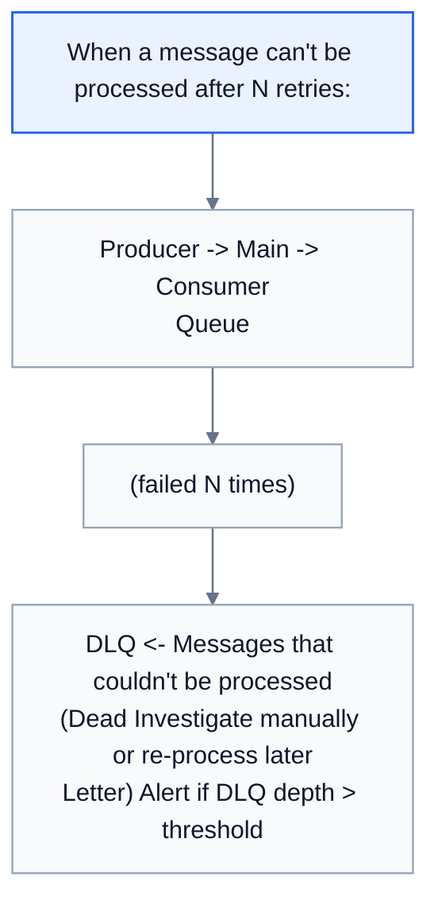
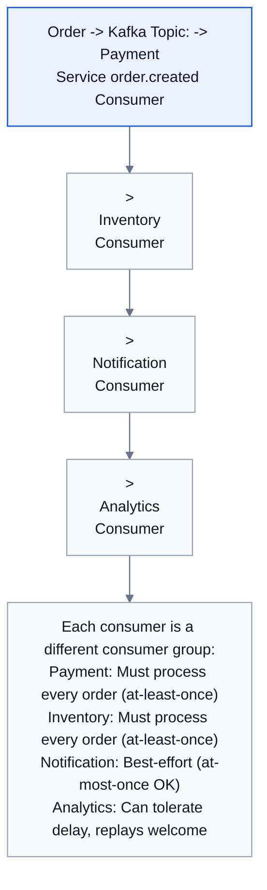
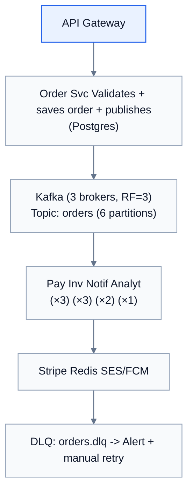

# Topic 17: Message Queues

> **Track**: Core Concepts — Fundamentals
> **Difficulty**: Intermediate
> **Prerequisites**: Topics 1–16

---

## Table of Contents

- [A. Concept Explanation](#a-concept-explanation)
- [B. Interview View](#b-interview-view)
- [C. Practical Engineering View](#c-practical-engineering-view)
- [D. Example](#d-example)
- [E. HLD and LLD](#e-hld-and-lld)
- [F. Summary & Practice](#f-summary--practice)

---

## A. Concept Explanation

### What is a Message Queue?

A **message queue** is middleware that enables asynchronous communication between services by buffering messages between a **producer** (sender) and **consumer** (receiver).



### Why Use Message Queues?

| Benefit | Without Queue | With Queue |
|---------|-------------|-----------|
| **Decoupling** | Services directly call each other | Services communicate via messages |
| **Buffering** | Traffic spikes overwhelm downstream | Queue absorbs spikes |
| **Reliability** | If consumer is down, message lost | Queue persists messages |
| **Scalability** | Producer waits for consumer | Consumers scale independently |
| **Retry** | App must implement retry logic | Queue retries on failure |
| **Ordering** | Hard to guarantee across services | Queue maintains order (FIFO) |

### Queue vs Topic (Point-to-Point vs Pub-Sub)



### Delivery Guarantees

| Guarantee | Meaning | Implementation | Use Case |
|-----------|---------|---------------|----------|
| **At-most-once** | Message may be lost, never duplicated | Fire and forget, no ACK | Metrics, logging (loss OK) |
| **At-least-once** | Message never lost, may be duplicated | ACK after processing; retry on failure | Payments (with idempotency) |
| **Exactly-once** | Never lost, never duplicated | Idempotent consumer + at-least-once | Bank transfers (hardest) |

```
AT-LEAST-ONCE flow:
  1. Producer sends message → Queue stores it
  2. Queue delivers to consumer
  3. Consumer processes message
  4. Consumer sends ACK to queue
  5. Queue removes message
  
  If consumer crashes before ACK:
    Queue re-delivers message (consumer may process it twice!)
    Solution: Make consumer idempotent (processing same message twice has no extra effect)
```

### Dead Letter Queue (DLQ)



### Popular Message Queue Systems

| System | Type | Ordering | Throughput | Use Case |
|--------|------|----------|-----------|----------|
| **RabbitMQ** | Queue | Per-queue FIFO | 10K-50K msg/s | Task queues, RPC |
| **Apache Kafka** | Log/Topic | Per-partition | 1M+ msg/s | Event streaming, analytics |
| **AWS SQS** | Queue | Standard: best-effort; FIFO: strict | 3K-30K msg/s | Serverless, AWS integration |
| **AWS SNS + SQS** | Pub-Sub + Queue | Varies | 30K+ msg/s | Fan-out pattern |
| **Redis Streams** | Log | Per-stream | 100K+ msg/s | Lightweight streaming |
| **Apache Pulsar** | Log/Topic | Per-partition | 1M+ msg/s | Multi-tenant streaming |
| **NATS** | Pub-Sub | Per-subject | 10M+ msg/s | Microservices, IoT |

---

## B. Interview View

### What Interviewers Expect

| Level | Expectation |
|-------|------------|
| **Junior** | Knows queues decouple services; can name SQS or RabbitMQ |
| **Mid** | Knows delivery guarantees; can design a task queue |
| **Senior** | Chooses between Kafka/SQS/RabbitMQ with justification; DLQ, idempotency |
| **Staff+** | Partitioning strategy, ordering guarantees, exactly-once semantics |

### Red Flags

- Synchronous calls between all microservices (no async anywhere)
- Not considering message ordering requirements
- Not mentioning DLQ for failure handling
- Choosing Kafka for a simple task queue (overkill)

### Common Questions

1. Why use a message queue?
2. Compare Kafka vs RabbitMQ vs SQS.
3. What are delivery guarantees and which would you choose?
4. What is a dead letter queue?
5. How do you ensure message ordering?
6. How do you handle duplicate messages?

---

## C. Practical Engineering View

### Kafka vs RabbitMQ Decision

```
Choose KAFKA when:
  ✓ High throughput (100K+ msg/s)
  ✓ Need to replay messages (event sourcing)
  ✓ Multiple consumers need the same events
  ✓ Stream processing (Kafka Streams, ksqlDB)
  ✓ Long retention (days/weeks of messages)

Choose RABBITMQ when:
  ✓ Complex routing (headers, topics, fanout exchanges)
  ✓ Task queues (work distribution)
  ✓ Request-reply pattern (RPC)
  ✓ Message priority
  ✓ Simpler operations (smaller scale)

Choose SQS when:
  ✓ Serverless / AWS-native architecture
  ✓ No operational overhead desired
  ✓ Simple queue semantics
  ✓ Auto-scaling consumers (Lambda)
```

### Monitoring

```
Key metrics:
  • Queue depth: Messages waiting to be consumed (spikes = consumer too slow)
  • Consumer lag: How far behind consumer is (Kafka-specific)
  • Processing rate: Messages consumed per second
  • Error rate: Failed message processing rate
  • DLQ depth: Messages in dead letter queue (should be ~0)
  • End-to-end latency: Time from produce to consume

Alerts:
  Queue depth > 10K for 5 min → Consumer scaling needed
  Consumer lag > 1 hour → Investigate consumer
  DLQ depth > 0 → Investigate failed messages
  Error rate > 5% → Possible bug in consumer
```

---

## D. Example: Order Processing Pipeline



---

## E. HLD and LLD

### E.1 HLD — Async Order Processing



### E.2 LLD — Message Consumer with Retry

```java
public class MessageConsumer {
    private final QueueClient queue;
    private final Consumer<String> handler;
    private final QueueClient dlq;
    private final RedisClient redis;
    private final int maxRetries;

    public MessageConsumer(QueueClient queue, Consumer<String> handler,
                           QueueClient dlq, RedisClient redis, int maxRetries) {
        this.queue = queue; this.handler = handler;
        this.dlq = dlq; this.redis = redis; this.maxRetries = maxRetries;
    }

    public void start() {
        while (true) {
            Message message = queue.receive(1000);
            if (message != null) process(message);
        }
    }

    private void process(Message message) {
        int retryCount = message.getAttributeOrDefault("retry_count", 0);
        try {
            // Idempotency check
            if (alreadyProcessed(message.getId())) { queue.ack(message); return; }

            handler.accept(message.getBody());
            markProcessed(message.getId());
            queue.ack(message);

        } catch (RetryableException e) {
            if (retryCount < maxRetries) {
                queue.nack(message, (int) Math.pow(2, retryCount));
            } else {
                dlq.send(message, e.getMessage());
                queue.ack(message);
                alert("Message " + message.getId() + " sent to DLQ after " + maxRetries + " retries");
            }
        } catch (NonRetryableException e) {
            dlq.send(message, e.getMessage());
            queue.ack(message);
        }
    }

    private boolean alreadyProcessed(String messageId) {
        return redis.exists("processed:" + messageId);
    }

    private void markProcessed(String messageId) {
        redis.setex("processed:" + messageId, 86400, "1");
    }
}
```

---

## F. Summary & Practice

### Key Takeaways

1. **Message queues** enable async, decoupled communication between services
2. **Queue** = point-to-point (one consumer); **Topic** = pub-sub (all subscribers)
3. **Delivery guarantees**: at-most-once, at-least-once (most common), exactly-once (hardest)
4. **DLQ** catches messages that fail after max retries — always set one up
5. **Kafka** for high-throughput streaming; **RabbitMQ** for task queues; **SQS** for serverless
6. **Idempotent consumers** are essential with at-least-once delivery
7. Monitor **queue depth, consumer lag, error rate, DLQ depth**
8. Queues absorb traffic spikes — a key resilience pattern

### Interview Questions

1. Why use a message queue?
2. Compare queue (point-to-point) vs topic (pub-sub).
3. What are delivery guarantees? Which would you choose for payments?
4. What is a DLQ and when is it needed?
5. Compare Kafka, RabbitMQ, and SQS.
6. How do you handle duplicate messages?
7. How do you ensure message ordering in Kafka?
8. Design an async order processing pipeline.

### Practice Exercises

1. **Exercise 1**: Design the message queue architecture for an e-commerce platform. Identify all events, which queue system to use, and consumer groups.
2. **Exercise 2**: Implement an idempotent consumer that processes payment events. Handle duplicates, retries, and DLQ.
3. **Exercise 3**: Your Kafka consumer lag is growing. Diagnose and fix (consider partitions, consumer count, processing time).

---

> **Previous**: [16 — Caching](16-caching.md)
> **Next**: [18 — Event-Driven Architecture](18-event-driven-architecture.md)
