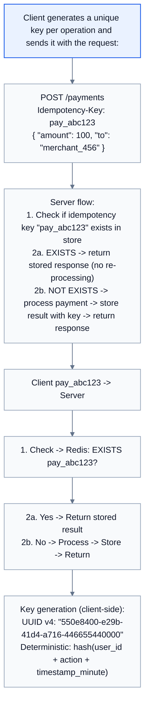
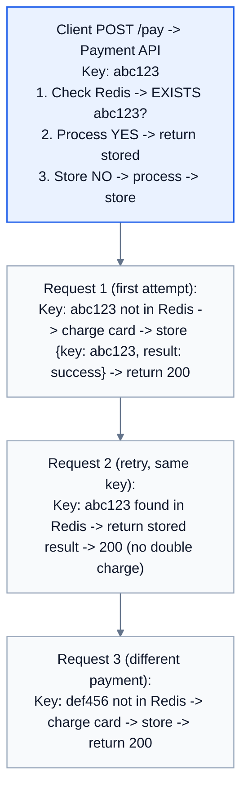
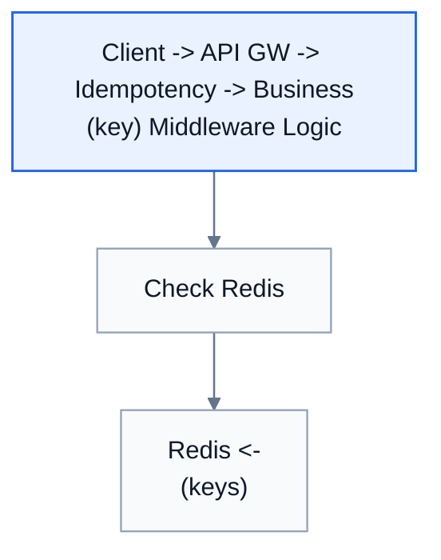

# Topic 21: Idempotency

> **Track**: Core Concepts — Fundamentals
> **Difficulty**: Intermediate
> **Prerequisites**: Topics 1–20

---

## Table of Contents

- [A. Concept Explanation](#a-concept-explanation)
- [B. Interview View](#b-interview-view)
- [C. Practical Engineering View](#c-practical-engineering-view)
- [D. Example](#d-example)
- [E. HLD and LLD](#e-hld-and-lld)
- [F. Summary & Practice](#f-summary--practice)

---

## A. Concept Explanation

### What is Idempotency?

An operation is **idempotent** if performing it multiple times has the same effect as performing it once.

```
IDEMPOTENT:
  SET balance = 100          → Always results in balance = 100
  DELETE /users/123          → User 123 gone (calling again = still gone)
  GET /users/123             → Returns same data (no side effects)
  PUT /users/123 {name: "A"}→ User 123 name is "A" (calling again = same)

NOT IDEMPOTENT:
  balance += 100             → Each call adds 100 (200, 300, ...)
  POST /orders {item: "A"}  → Each call creates a NEW order
  INSERT INTO orders (...)   → Each call adds a NEW row
```

### Why Idempotency Matters

```
Scenario: User clicks "Pay" button
  Request sent → Network timeout → Did the payment go through?
  
  WITHOUT idempotency:
    Client retries → Server processes payment AGAIN → User charged TWICE!
  
  WITH idempotency:
    Client retries with same idempotency key → Server recognizes duplicate
    → Returns original result → User charged ONCE
```

### HTTP Method Idempotency

| Method | Idempotent? | Safe? | Notes |
|--------|------------|-------|-------|
| **GET** | Yes | Yes | No side effects |
| **HEAD** | Yes | Yes | Like GET without body |
| **PUT** | Yes | No | Replaces entire resource |
| **DELETE** | Yes | No | Resource gone; deleting again = still gone |
| **POST** | No | No | Creates new resource each time |
| **PATCH** | Depends | No | Depends on implementation |

### Idempotency Key Pattern



### Idempotency at Different Layers

| Layer | How | Example |
|-------|-----|---------|
| **API** | Idempotency-Key header | Stripe, PayPal APIs |
| **Database** | UPSERT / ON CONFLICT | INSERT ... ON CONFLICT DO NOTHING |
| **Message Queue** | Dedup by message ID | SQS deduplication, Kafka exactly-once |
| **Application** | Check-then-act with lock | Check if order exists before creating |

---

## B. Interview View

### What Interviewers Expect

- Know what idempotency means and why it matters
- Can implement the idempotency key pattern
- Understand which HTTP methods are idempotent
- Know how idempotency relates to retries and message queues

### Red Flags

- Not considering duplicate requests in payment/order systems
- Not knowing POST is not idempotent
- Implementing retries without idempotency protection

### Common Questions

1. What is idempotency?
2. Why is it important in distributed systems?
3. How would you make a payment API idempotent?
4. Which HTTP methods are idempotent?
5. How do you implement the idempotency key pattern?

---

## C. Practical Engineering View

### Stripe's Idempotency Implementation

```
Stripe API:
  POST /v1/charges
  Idempotency-Key: abc123
  
  • Keys expire after 24 hours
  • Same key + same parameters = return original response
  • Same key + different parameters = 400 error
  • Server stores: key → {status, response, params_hash}
  
  State machine:
    STARTED → PROCESSING → COMPLETED
                         → FAILED
    
  If request arrives while PROCESSING → wait and return result
  If COMPLETED → return stored response
  If FAILED → allow retry (new attempt)
```

### Database-Level Idempotency

```sql
-- Using UPSERT (idempotent insert)
INSERT INTO payments (idempotency_key, user_id, amount, status)
VALUES ('pay_abc123', 123, 100.00, 'completed')
ON CONFLICT (idempotency_key) DO NOTHING;
-- Second call: no-op, no duplicate

-- Using unique constraints
CREATE UNIQUE INDEX idx_idempotency ON payments (idempotency_key);
-- Duplicate insert → constraint violation → catch and return existing
```

---

## D. Example: Idempotent Payment Service



---

## E. HLD and LLD

### E.1 HLD — Idempotent API Layer



### E.2 LLD — Idempotency Middleware

```java
public class IdempotencyMiddleware {
    private Object redis;
    private int ttl;

    public IdempotencyMiddleware(Object redisClient, int ttlHours) {
        this.redis = redisClient;
        this.ttl = ttlHours * 3600;
    }

    public Object handle(Object request, Object nextHandler) {
        // key = request.headers.get("Idempotency-Key")
        // if not key
        // return next_handler(request)  # No key = normal processing
        // Check for existing result
        // stored = redis.get(f"idemp:{key}")
        // if stored
        // stored = json.loads(stored)
        // Verify request params match
        // ...
        return null;
    }

    public Object hashParams(Object request) {
        // return hashlib.sha256(json.dumps(request.body, sort_keys=true).encode()).hexdigest()
        return null;
    }
}
```

---

## F. Summary & Practice

### Key Takeaways

1. **Idempotent** = doing it twice has the same effect as doing it once
2. Critical for **payments, orders, and any operation with retries**
3. **Idempotency key pattern**: client sends unique key; server deduplicates
4. **GET, PUT, DELETE** are idempotent; **POST** is not
5. Store idempotency keys in **Redis** with TTL (typically 24h)
6. Verify that retried requests have the **same parameters**
7. Handle the **in-progress** state (request being processed when duplicate arrives)
8. Database **UPSERT** provides idempotency at the storage layer

### Interview Questions

1. What is idempotency?
2. Why is it important in distributed systems?
3. How do you make a POST endpoint idempotent?
4. How does Stripe implement idempotency?
5. What happens if a retry has different parameters but the same key?
6. How do you implement idempotency in message consumers?

### Practice Exercises

1. **Exercise 1**: Implement an idempotent payment API with Redis-based dedup. Handle: first request, duplicate, in-progress duplicate, and failed request retry.
2. **Exercise 2**: Design idempotency for a Kafka consumer processing order events. Ensure at-least-once delivery with no duplicate processing.
3. **Exercise 3**: Your idempotency key store (Redis) goes down. Design the fallback strategy.

---

> **Previous**: [20 — Rate Limiting](20-rate-limiting.md)
> **Next**: [22 — Circuit Breaker](22-circuit-breaker.md)
