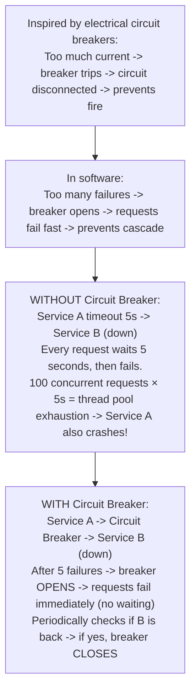
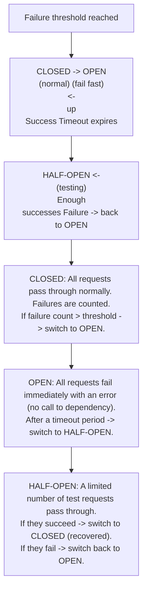
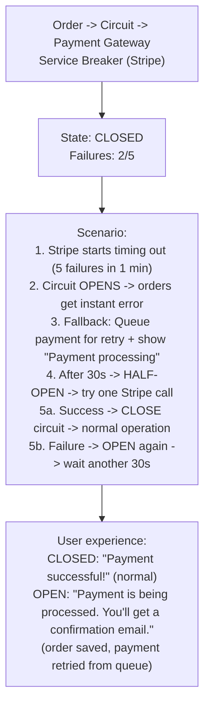
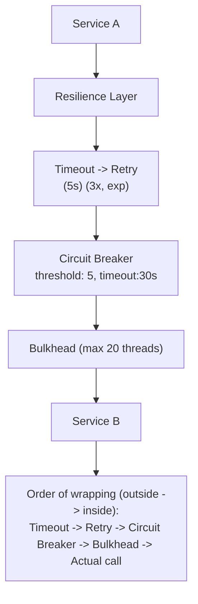

# Topic 22: Circuit Breaker

> **Track**: Core Concepts — Fundamentals
> **Difficulty**: Intermediate
> **Prerequisites**: Topics 1–21

---

## Table of Contents

- [A. Concept Explanation](#a-concept-explanation)
- [B. Interview View](#b-interview-view)
- [C. Practical Engineering View](#c-practical-engineering-view)
- [D. Example](#d-example)
- [E. HLD and LLD](#e-hld-and-lld)
- [F. Summary & Practice](#f-summary--practice)

---

## A. Concept Explanation

### What is a Circuit Breaker?

A **circuit breaker** is a resilience pattern that prevents a service from repeatedly calling a failing dependency, giving the dependency time to recover and preventing cascade failures.



### Circuit Breaker States



### Configuration Parameters

| Parameter | Typical Value | Purpose |
|-----------|-------------|---------|
| **Failure threshold** | 5 failures | Number of failures before opening |
| **Success threshold** | 3 successes | Successes in half-open before closing |
| **Timeout** | 30-60 seconds | Time in open state before testing |
| **Monitoring window** | 60 seconds | Time window for counting failures |
| **Failure rate** | 50% | % of failures to trigger (alternative to count) |
| **Slow call threshold** | 5 seconds | Calls slower than this count as failures |

### What Happens When the Circuit is Open?

```
Options for handling requests when circuit is open:

1. FAIL FAST: Return error immediately
   → 503 Service Unavailable + "Dependency unavailable, try later"

2. FALLBACK: Return cached/default data
   → Product price from cache (may be stale)
   → Default recommendations instead of personalized

3. QUEUE: Buffer request for later
   → Add to retry queue, process when circuit closes

4. ALTERNATIVE: Route to backup service
   → If primary payment gateway is down, try secondary
```

---

## B. Interview View

### What Interviewers Expect

| Level | Expectation |
|-------|------------|
| **Junior** | Knows circuit breaker prevents cascade failures |
| **Mid** | Can explain 3 states; knows when to use fallbacks |
| **Senior** | Configures thresholds; designs fallback strategies; monitors breaker state |
| **Staff+** | Combines with retry, timeout, bulkhead; discusses distributed circuit breaking |

### Red Flags

- Not preventing cascade failures in microservices
- Not mentioning fallback strategies
- Setting thresholds too aggressively (opens too easily or too hard to trigger)

### Common Questions

1. What is a circuit breaker? Why is it needed?
2. Explain the three states.
3. What happens when the circuit is open?
4. How do you configure the thresholds?
5. How does a circuit breaker prevent cascade failures?
6. What fallback strategies would you use?

---

## C. Practical Engineering View

### Libraries

| Language | Library |
|----------|---------|
| Java | Resilience4j, Hystrix (deprecated) |
| Python | pybreaker, tenacity |
| Go | gobreaker, sony/gobreaker |
| Node.js | opossum |
| .NET | Polly |

### Monitoring

```
Key metrics to track:
  • Circuit state (closed/open/half-open) per dependency
  • Failure rate over time
  • Number of rejected requests (while open)
  • Time spent in open state
  • Fallback invocation rate
  • Recovery time (open → half-open → closed)

Alerts:
  Circuit opened → Warning (dependency may be failing)
  Circuit open > 5 min → Critical (sustained outage)
  Multiple circuits open → SEV1 (systemic issue)

Dashboard: Show circuit state for each dependency as traffic lights
  Payment Gateway: 🟢 CLOSED
  Email Service:   🔴 OPEN (3 min)
  Inventory API:   🟡 HALF-OPEN
```

### Bulkhead Pattern (Complement to Circuit Breaker)

```
Bulkhead isolates failures by limiting resources per dependency:

WITHOUT Bulkhead:
  Thread pool: 100 threads (shared for all dependencies)
  Service B is slow → all 100 threads stuck waiting for B
  → No threads left for Service C or D → total failure!

WITH Bulkhead:
  Service B: max 30 threads
  Service C: max 30 threads
  Service D: max 30 threads
  Reserve: 10 threads
  
  Service B is slow → only 30 threads stuck
  Services C and D: still have their own 30 threads → unaffected

Circuit Breaker + Bulkhead:
  Bulkhead limits concurrent calls (prevents thread exhaustion)
  Circuit Breaker detects failures (prevents repeated calls)
  Together: defense in depth against dependency failures
```

---

## D. Example: Payment Service with Circuit Breaker



---

## E. HLD and LLD

### E.1 HLD — Resilient Service Communication



### E.2 LLD — Circuit Breaker Implementation

```java
// Dependencies in the original example:
// import time
// import threading
// from enum import Enum

public enum State {
    CLOSED,
    OPEN,
    HALF_OPEN
}

public class CircuitBreaker {
    private Object failureThreshold;
    private Object successThreshold;
    private Object timeout;
    private Object window;
    private Object state;
    private int failureCount;
    private int successCount;
    private Instant lastFailureTime;
    private Instant lastStateChange;
    private Object lock;

    public CircuitBreaker(Object failureThreshold, Object successThreshold, Object timeoutSec, Object monitoringWindowSec) {
        this.failureThreshold = failureThreshold;
        this.successThreshold = successThreshold;
        this.timeout = timeoutSec;
        this.window = monitoringWindowSec;
        this.state = State.CLOSED;
        this.failureCount = 0;
        this.successCount = 0;
        this.lastFailureTime = 0;
        this.lastStateChange = System.currentTimeMillis();
        this.lock = threading.Lock();
    }

    public Object call(Object func, Object fallback) {
        // with lock
        // if state == State.OPEN
        // if time.time() - last_state_change > timeout
        // _transition(State.HALF_OPEN)
        // else
        // if fallback
        // return fallback(*args, **kwargs)
        // raise CircuitOpenError("Circuit is open")
        // ...
        return null;
    }

    public Object onSuccess() {
        // with lock
        // if state == State.HALF_OPEN
        // success_count += 1
        // if success_count >= success_threshold
        // _transition(State.CLOSED)
        // elif state == State.CLOSED
        // failure_count = 0  # Reset on success
        return null;
    }

    public Object onFailure() {
        // with lock
        // last_failure_time = time.time()
        // if state == State.HALF_OPEN
        // _transition(State.OPEN)
        // elif state == State.CLOSED
        // failure_count += 1
        // if failure_count >= failure_threshold
        // _transition(State.OPEN)
        return null;
    }

    public Object transition(Object newState) {
        // state = new_state
        // failure_count = 0
        // success_count = 0
        // last_state_change = time.time()
        // log.info(f"Circuit breaker → {new_state.value}")
        return null;
    }

    public Object isOpen() {
        // return state == State.OPEN
        return null;
    }
}
```

---

## F. Summary & Practice

### Key Takeaways

1. **Circuit breaker** prevents cascade failures by failing fast when a dependency is down
2. **Three states**: CLOSED (normal) → OPEN (fail fast) → HALF-OPEN (testing recovery)
3. Configure **failure threshold, timeout, success threshold** based on the dependency
4. Provide **fallbacks**: cached data, default values, queued retries, alternative services
5. Combine with **retry, timeout, and bulkhead** for defense in depth
6. **Monitor** circuit state, failure rate, and rejected requests
7. Use established libraries (Resilience4j, Polly, opossum)

### Interview Questions

1. What is the circuit breaker pattern?
2. Explain the three states and transitions.
3. What fallback strategies would you use?
4. How do you configure circuit breaker thresholds?
5. How does circuit breaker prevent cascade failures?
6. What is the bulkhead pattern and how does it complement circuit breaker?
7. Design a resilient payment service using circuit breaker.

### Practice Exercises

1. **Exercise 1**: Implement a circuit breaker with failure rate-based triggering (e.g., >50% failure rate in 60s window).
2. **Exercise 2**: Design the fallback strategy for an e-commerce checkout when the payment gateway, inventory service, and email service each have circuit breakers.
3. **Exercise 3**: Configure the resilience stack (timeout + retry + circuit breaker + bulkhead) for 5 different dependencies with varying reliability.

---

> **Previous**: [21 — Idempotency](21-idempotency.md)
> **Next**: [23 — Retry, Timeout, Backoff](23-retry-timeout-backoff.md)
