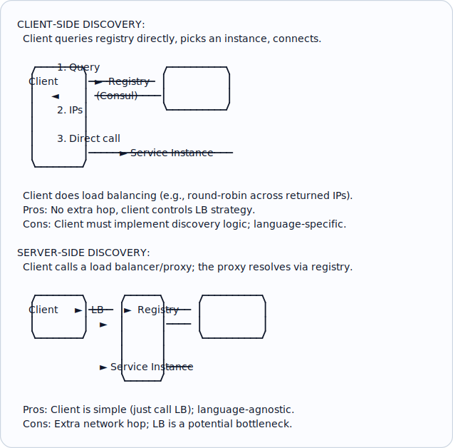
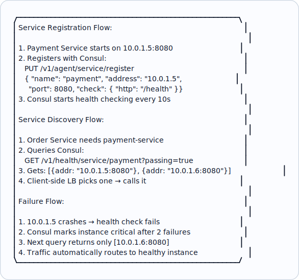
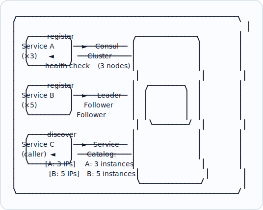

# Topic 24: Service Discovery

> **Track**: Core Concepts — Fundamentals
> **Difficulty**: Intermediate
> **Prerequisites**: Topics 1–23 (especially Load Balancing, Microservices)

---

## Table of Contents

- [A. Concept Explanation](#a-concept-explanation)
- [B. Interview View](#b-interview-view)
- [C. Practical Engineering View](#c-practical-engineering-view)
- [D. Example](#d-example)
- [E. HLD and LLD](#e-hld-and-lld)
- [F. Summary & Practice](#f-summary--practice)

---

## A. Concept Explanation

### What is Service Discovery?

In a microservices architecture, services need to find each other. **Service discovery** is the mechanism by which a service locates the network address (IP + port) of another service at runtime.

```
WITHOUT service discovery:
  Order Service → hardcoded: http://10.0.1.5:8080/payments
  Problem: IP changes on deploy, scaling, or failure → broken calls

WITH service discovery:
  Order Service → "I need payment-service" → Registry → "10.0.1.5:8080, 10.0.1.6:8080"
  Registry always has current addresses. Services register/deregister dynamically.
```

### Client-Side vs Server-Side Discovery



### Service Registration

| Pattern | How | Pros | Cons |
|---------|-----|------|------|
| **Self-registration** | Service registers itself on startup | Simple; no extra infra | Service must know about registry |
| **Third-party registration** | Sidecar/platform registers the service | Service is unaware of registry | Requires orchestrator (K8s, Nomad) |

```
SELF-REGISTRATION:
  Service starts → POST /register {name: "payment", ip: "10.0.1.5", port: 8080}
  Service sends heartbeat every 10s
  Service stops → POST /deregister
  If heartbeat missed → registry removes it (TTL-based)

THIRD-PARTY (Kubernetes):
  Deploy pod → K8s registers pod IP in Service object
  Pod dies → K8s removes it automatically
  Service has no registration code. K8s handles everything.
```

### Service Discovery Tools

| Tool | Type | Health Checks | Key-Value Store | Best For |
|------|------|--------------|----------------|----------|
| **Consul** (HashiCorp) | AP (with CP option) | HTTP, TCP, gRPC, script | Yes | Multi-DC, service mesh |
| **etcd** | CP (Raft) | TTL-based | Yes | Kubernetes backend, config |
| **ZooKeeper** | CP (ZAB) | Ephemeral nodes | Yes (paths) | Legacy, Kafka, Hadoop |
| **Eureka** (Netflix) | AP | Heartbeat | No | Spring Cloud, Java |
| **Kubernetes DNS** | Built-in | Liveness/readiness probes | No | K8s-native apps |
| **AWS Cloud Map** | Managed | ECS/EKS integration | No | AWS-native |

### DNS-Based Service Discovery

```
Kubernetes uses DNS for service discovery:

  Service name: payment-service
  Namespace: production
  
  DNS record: payment-service.production.svc.cluster.local → 10.0.1.5
  
  Client just calls: http://payment-service:8080/charge
  Kubernetes DNS resolves to current pod IPs automatically.

  Headless service (returns all pod IPs):
    DNS query → [10.0.1.5, 10.0.1.6, 10.0.1.7]
    Client picks one (client-side LB)
  
  ClusterIP service (returns virtual IP):
    DNS query → 10.96.0.100 (virtual IP)
    kube-proxy routes to a healthy pod (server-side LB)
```

---

## B. Interview View

### What Interviewers Expect

| Level | Expectation |
|-------|------------|
| **Junior** | Knows services need to find each other dynamically |
| **Mid** | Knows client-side vs server-side discovery; can mention Consul or K8s DNS |
| **Senior** | Discusses health checks, failover, multi-DC discovery |
| **Staff+** | Service mesh integration, DNS caching pitfalls, split-brain scenarios |

### Red Flags

- Hardcoding service IPs
- Not considering what happens when a service instance dies
- Not mentioning health checks in discovery

### Common Questions

1. What is service discovery and why is it needed?
2. Compare client-side and server-side discovery.
3. How does Kubernetes handle service discovery?
4. What happens when a service instance crashes?
5. Compare Consul, etcd, and ZooKeeper.

---

## C. Practical Engineering View

### Health Checks

```
Types of health checks:
  HTTP: GET /health → 200 OK
  TCP: Can connect to port? Yes/No
  gRPC: grpc.health.v1.Health/Check → SERVING
  Script: Custom script returns exit code 0

Consul health check config:
  {
    "check": {
      "http": "http://localhost:8080/health",
      "interval": "10s",
      "timeout": "3s",
      "deregister_critical_service_after": "60s"
    }
  }

  Healthy: 3 consecutive passing checks
  Critical: 2 consecutive failing checks
  Deregister: Remove from registry after 60s of critical status
```

### DNS Caching Pitfalls

```
Problem: DNS results are cached. If a service IP changes, clients may use stale IPs.

  Service moves to new IP → DNS updated → clients still using cached old IP
  
Solutions:
  1. Low TTL: Set DNS TTL to 5-10s (but increases DNS query load)
  2. Client-side refresh: Periodically re-resolve DNS
  3. Health-aware routing: LB/proxy checks health, skips stale IPs
  4. Service mesh: Sidecar proxy handles discovery (no DNS caching issue)

Java gotcha: JVM caches DNS forever by default!
  Fix: networkaddress.cache.ttl=10 in java.security
```

---

## D. Example: Microservice Discovery with Consul



---

## E. HLD and LLD

### E.1 HLD — Service Discovery Architecture



### E.2 LLD — Service Registry

```java
// Dependencies in the original example:
// import time
// import threading

public class ServiceInstance {
    private Object serviceName;
    private Object host;
    private int port;
    private Object metadata;
    private boolean healthy;
    private Instant lastHeartbeat;
    private String id;

    public ServiceInstance(Object serviceName, Object host, int port, Object metadata) {
        this.serviceName = serviceName;
        this.host = host;
        this.port = port;
        this.metadata = metadata || {};
        this.healthy = true;
        this.lastHeartbeat = System.currentTimeMillis();
        this.id = "{serviceName}-{host}-" + port;
    }
}

public class ServiceRegistry {
    private Map<String, Object> services;
    private int ttl;
    private Object lock;

    public ServiceRegistry(int heartbeatTtl) {
        this.services = new HashMap<>();
        this.ttl = heartbeatTtl;
        this.lock = threading.Lock();
        // _start_reaper()
    }

    public Object register(Object instance) {
        // with lock
        // if instance.service_name not in services
        // services[instance.service_name] = {}
        // services[instance.service_name][instance.id] = instance
        return null;
    }

    public Object deregister(String serviceName, String instanceId) {
        // with lock
        // services.get(service_name, {}).pop(instance_id, null)
        return null;
    }

    public Object heartbeat(String serviceName, String instanceId) {
        // with lock
        // instance = services.get(service_name, {}).get(instance_id)
        // if instance
        // instance.last_heartbeat = time.time()
        // instance.healthy = true
        return null;
    }

    public List<Object> discover(String serviceName, boolean healthyOnly) {
        // with lock
        // instances = services.get(service_name, {}).values()
        // if healthy_only
        // return [i for i in instances if i.healthy]
        // return list(instances)
        return null;
    }

    public Object startReaper() {
        // Remove instances that missed heartbeats
        // def reap()
        // while true
        // time.sleep(ttl // 2)
        // now = time.time()
        // with lock
        // for svc_name, instances in services.items()
        // for iid, inst in list(instances.items())
        // ...
        return null;
    }
}
```

---

## F. Summary & Practice

### Key Takeaways

1. **Service discovery** dynamically locates service instances at runtime
2. **Client-side**: client queries registry and load-balances; **Server-side**: LB/proxy handles it
3. **Self-registration**: service registers itself; **Third-party**: K8s/orchestrator handles it
4. **Health checks** ensure only healthy instances receive traffic
5. **Kubernetes DNS** is the simplest approach for K8s environments
6. **Consul** is popular for multi-DC, non-K8s environments
7. Watch for **DNS caching** issues (especially JVM)
8. Service mesh (Istio/Envoy) handles discovery transparently via sidecars

### Interview Questions

1. What is service discovery? Why is it needed in microservices?
2. Compare client-side and server-side discovery.
3. How does Kubernetes handle service discovery?
4. What happens when a service instance crashes?
5. Compare Consul, etcd, and ZooKeeper.
6. What are the DNS caching pitfalls?
7. How does a service mesh handle discovery?

### Practice Exercises

1. **Exercise 1**: Design service discovery for a 20-microservice system deployed on bare metal (no K8s). Choose a tool and explain registration, health checks, and failover.
2. **Exercise 2**: Your Kubernetes service returns stale pod IPs for 30 seconds after a pod dies. Diagnose and fix.
3. **Exercise 3**: Implement a simple service registry with registration, heartbeat, health-based filtering, and automatic deregistration.

---

> **Previous**: [23 — Retry, Timeout, Backoff](23-retry-timeout-backoff.md)
> **Next**: [25 — Distributed Locks](25-distributed-locks.md)
