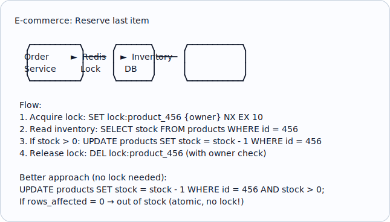
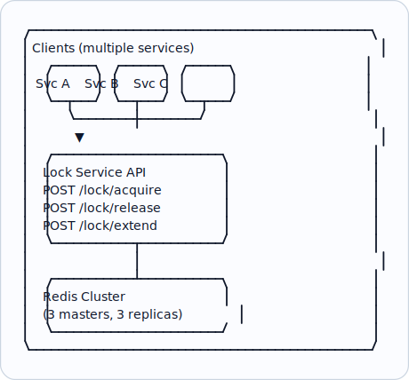

# Topic 25: Distributed Locks

> **Track**: Core Concepts — Fundamentals
> **Difficulty**: Intermediate → Advanced
> **Prerequisites**: Topics 1–24

---

## Table of Contents

- [A. Concept Explanation](#a-concept-explanation)
- [B. Interview View](#b-interview-view)
- [C. Practical Engineering View](#c-practical-engineering-view)
- [D. Example](#d-example)
- [E. HLD and LLD](#e-hld-and-lld)
- [F. Summary & Practice](#f-summary--practice)

---

## A. Concept Explanation

### What is a Distributed Lock?

A **distributed lock** ensures that only one process across multiple machines can access a shared resource at a time. It's the distributed equivalent of a mutex/semaphore.

```
WITHOUT distributed lock:
  Server 1: Read inventory = 1 → Sell to User A → Write inventory = 0
  Server 2: Read inventory = 1 → Sell to User B → Write inventory = 0
  Result: 2 items sold but only 1 in stock! (oversold)

WITH distributed lock:
  Server 1: ACQUIRE lock("item_123") ✓
  Server 1: Read = 1 → Sell → Write = 0
  Server 1: RELEASE lock("item_123")
  Server 2: ACQUIRE lock("item_123") ✓ (now gets it)
  Server 2: Read = 0 → "Out of stock" → no sale
  Result: Correct! Only 1 item sold.
```

### Requirements for a Good Distributed Lock

| Requirement | Meaning |
|------------|---------|
| **Mutual exclusion** | Only one client holds the lock at a time |
| **Deadlock-free** | Lock is eventually released even if holder crashes |
| **Fault-tolerant** | Lock system survives node failures |
| **Low latency** | Acquiring/releasing is fast |
| **Fairness** (optional) | First-come, first-served ordering |
| **Reentrant** (optional) | Same client can acquire the same lock multiple times |

### Implementation Options

| Approach | Tool | Pros | Cons |
|----------|------|------|------|
| **Redis (SET NX EX)** | Redis | Fast, simple | Not safe if Redis master fails before replication |
| **Redlock** | Redis (multi-node) | Safer than single Redis | Controversial; clock-dependent |
| **ZooKeeper** | ZooKeeper | Strong consistency; ephemeral nodes | Slower; operational complexity |
| **etcd** | etcd | CP system; lease-based | Slower than Redis |
| **Database** | PostgreSQL advisory lock | Simple; no extra infra | Slower; DB becomes bottleneck |
| **DynamoDB** | Conditional writes | Serverless-friendly | Eventually consistent by default |

### Redis Distributed Lock

```
ACQUIRE lock:
  SET lock:item_123 owner_id NX EX 30
  
  NX: Only set if key doesn't exist (mutual exclusion)
  EX 30: Auto-expire in 30 seconds (deadlock prevention)
  owner_id: Unique identifier (UUID) to ensure only owner can release

RELEASE lock:
  -- Lua script (atomic check-and-delete)
  if redis.call("GET", KEYS[1]) == ARGV[1] then
    return redis.call("DEL", KEYS[1])
  else
    return 0
  end
  
  Why Lua? Must be atomic: check owner AND delete in one operation.
  Without Lua: GET → (another process acquires) → DEL → wrong lock deleted!

Problem: Lock expires while holder is still working (GC pause, slow processing)
  → Another process acquires the lock → TWO holders! 
  
  Solutions:
  1. Set long enough TTL (but then deadlock takes longer to resolve)
  2. Lock extension: Background thread renews lock before expiry
  3. Fencing tokens: Monotonically increasing token validates operations
```

### Fencing Tokens

```
Problem: Lock expires, two clients think they hold the lock.

Solution: Fencing token (monotonically increasing number)

  Client A: Acquire lock → token = 33
  Client A: GC pause (lock expires)
  Client B: Acquire lock → token = 34
  
  Client A resumes: Write to DB with token 33
  DB checks: Last token was 34 (from B) → 33 < 34 → REJECT A's write
  Client B: Write to DB with token 34 → 34 >= 34 → ACCEPT

  The resource (DB) validates the fencing token.
  Stale lock holders are rejected.
```

### ZooKeeper Distributed Lock

```
ZooKeeper uses ephemeral sequential nodes:

  1. Client creates: /locks/item_123/lock-0000000001 (ephemeral + sequential)
  2. Client lists children of /locks/item_123/
  3. If client's node is the LOWEST number → lock acquired
  4. Otherwise, watch the node with the next-lower number
  5. When that node is deleted → try again

  Benefits:
  • Ephemeral: If client disconnects, ZK automatically deletes the node
  • Sequential: Provides fair ordering (FIFO)
  • Watch: Efficient notification (no polling)
  • CP system: Strong consistency guaranteed
```

---

## B. Interview View

### What Interviewers Expect

| Level | Expectation |
|-------|------------|
| **Junior** | Knows why distributed locks are needed |
| **Mid** | Can implement Redis lock with NX + EX; knows TTL is needed |
| **Senior** | Knows Redlock controversy, fencing tokens, ZK vs Redis trade-offs |
| **Staff+** | Discusses lock-free alternatives, performance implications, correctness proofs |

### Red Flags

- Not using TTL (deadlock if holder crashes)
- Not checking owner before release (wrong lock deleted)
- Using single Redis for critical locking without understanding replication risk
- Not considering what happens when lock expires during processing

### Common Questions

1. Why do you need distributed locks?
2. How do you implement a lock with Redis?
3. What happens if the lock holder crashes?
4. What is a fencing token and why is it needed?
5. Compare Redis vs ZooKeeper for distributed locking.
6. What is the Redlock algorithm?

---

## C. Practical Engineering View

### When to Avoid Distributed Locks

```
Prefer alternatives when possible:

1. OPTIMISTIC LOCKING (database):
   UPDATE inventory SET stock = stock - 1 
   WHERE id = 123 AND stock > 0 AND version = expected_version;
   → No lock needed; DB handles concurrency.

2. IDEMPOTENT OPERATIONS:
   Use idempotency keys instead of locks for dedup.

3. QUEUE-BASED SERIALIZATION:
   Route related operations to same queue partition.
   Consumer processes sequentially → no lock needed.

4. COMPARE-AND-SWAP (CAS):
   Atomic operation: update only if current value matches expected.

Distributed locks are a LAST RESORT. They add latency, complexity, and failure modes.
```

### Lock Monitoring

```
Key metrics:
  • Lock acquisition time (p50, p99)
  • Lock hold duration
  • Lock contention rate (failed acquisitions)
  • Lock timeout/expiry rate (indicates holders too slow)
  • Deadlock occurrences

Alerts:
  Lock hold time > 10s → Investigate slow processing
  Contention rate > 50% → Consider reducing lock scope
  Expiry rate > 1% → Increase TTL or optimize processing
```

---

## D. Example: Inventory Reservation with Lock



---

## E. HLD and LLD

### E.1 HLD — Lock Service



### E.2 LLD — Distributed Lock with Redis

```java
// Dependencies in the original example:
// import uuid
// import time

public class DistributedLock {
    private Object redis;
    private String lockName;
    private int ttl;
    private String ownerId;
    private Object renewalThread;

    public DistributedLock(Object redisClient, String lockName, int ttlSec) {
        this.redis = redisClient;
        this.lockName = "lock:" + lockName;
        this.ttl = ttlSec;
        this.ownerId = UUID.randomUUID().toString();
        this.renewalThread = null;
    }

    public boolean acquire(double waitTimeout) {
        // Try to acquire the lock within wait_timeout seconds
        // deadline = time.time() + wait_timeout
        // while time.time() < deadline
        // acquired = redis.set(
        // lock_name, owner_id, nx=true, ex=ttl
        // )
        // if acquired
        // _start_renewal()
        // ...
        return false;
    }

    public boolean release() {
        // Release the lock (only if we own it)
        // _stop_renewal()
        // Atomic check-and-delete via Lua
        // lua_script =
        // if redis.call("GET", KEYS[1]) == ARGV[1] then
        // return redis.call("DEL", KEYS[1])
        // else
        // return 0
        // ...
        return false;
    }

    public Object startRenewal() {
        // Renew lock before TTL expires
        // import threading
        // def renew()
        // while true
        // time.sleep(ttl // 3)
        // if not _extend()
        // break
        // _renewal_thread = threading.Thread(target=renew, daemon=true)
        // ...
        return null;
    }

    public boolean extend() {
        // lua_script =
        // if redis.call("GET", KEYS[1]) == ARGV[1] then
        // return redis.call("EXPIRE", KEYS[1], ARGV[2])
        // else
        // return 0
        // end
        // result = redis.eval(lua_script, 1, lock_name, owner_id, ttl)
        // return result == 1
        return false;
    }

    public Object stopRenewal() {
        // _renewal_thread = null  # Daemon thread will stop
        return null;
    }

    public Object enter() {
        // if not acquire()
        // raise TimeoutError("Could not acquire lock")
        // return self
        return null;
    }

    public Object exit() {
        // release()
        return null;
    }
}
```

---

## F. Summary & Practice

### Key Takeaways

1. **Distributed locks** ensure mutual exclusion across multiple machines
2. **Redis SET NX EX** is the simplest implementation (fast but less safe)
3. Always use **TTL** to prevent deadlocks from crashed holders
4. Always **check owner** before releasing (Lua script for atomicity)
5. **Fencing tokens** protect against expired-lock race conditions
6. **ZooKeeper** offers stronger guarantees but is slower
7. **Prefer alternatives**: optimistic locking, CAS, queue serialization
8. Distributed locks are a **last resort** — they add latency and complexity

### Interview Questions

1. Why do you need distributed locks?
2. Implement a distributed lock using Redis.
3. What happens if the lock holder crashes?
4. What is a fencing token?
5. Compare Redis vs ZooKeeper for locking.
6. When should you avoid distributed locks?
7. What is the Redlock algorithm and why is it controversial?

### Practice Exercises

1. **Exercise 1**: Implement a Redis distributed lock with automatic renewal and safe release.
2. **Exercise 2**: Design inventory reservation for 10K concurrent purchases. Compare: distributed lock vs optimistic locking vs queue serialization.
3. **Exercise 3**: Your Redis lock holder has a 30s TTL but processing takes 45s sometimes. Design the solution.

---

> **Previous**: [24 — Service Discovery](24-service-discovery.md)
> **Next**: [26 — Sharding](26-sharding.md)
