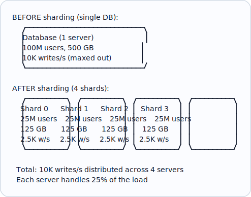
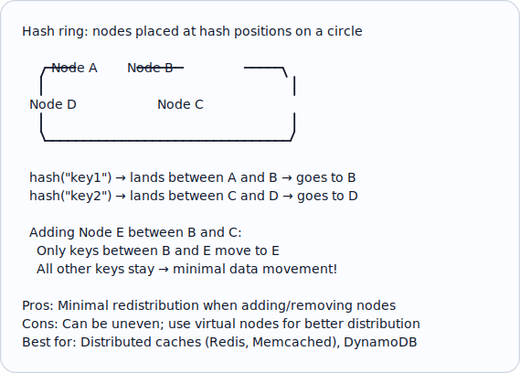
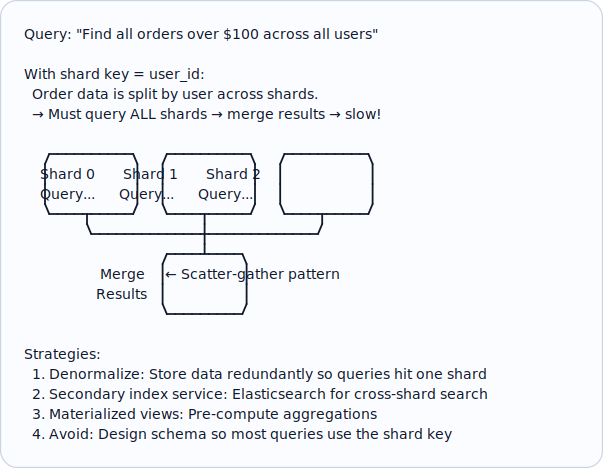
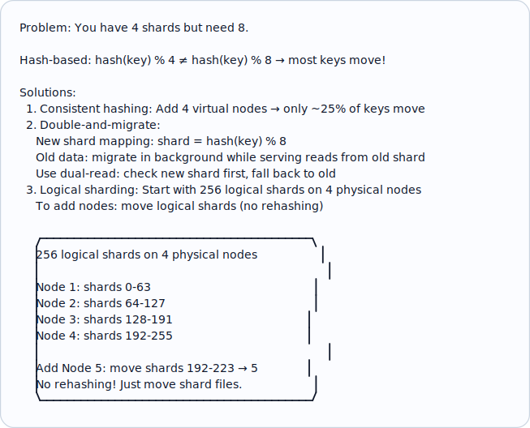
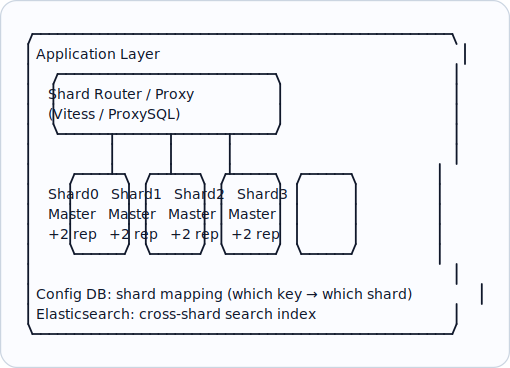

# Topic 26: Sharding

> **Track**: Core Concepts — Fundamentals
> **Difficulty**: Intermediate → Advanced
> **Prerequisites**: Topics 1–25

---

## Table of Contents

- [A. Concept Explanation](#a-concept-explanation)
- [B. Interview View](#b-interview-view)
- [C. Practical Engineering View](#c-practical-engineering-view)
- [D. Example](#d-example)
- [E. HLD and LLD](#e-hld-and-lld)
- [F. Summary & Practice](#f-summary--practice)

---

## A. Concept Explanation

### What is Sharding?

**Sharding** (horizontal partitioning) splits a large dataset across multiple database servers (shards), where each shard holds a subset of the data. It enables write scaling beyond a single machine.



### Sharding Strategies

#### 1. Range-Based Sharding

```
Shard by value range of the shard key:

  Shard 0: user_id 1 - 25,000,000
  Shard 1: user_id 25,000,001 - 50,000,000
  Shard 2: user_id 50,000,001 - 75,000,000
  Shard 3: user_id 75,000,001 - 100,000,000

Pros: Simple, range queries easy (find all users 1-1000)
Cons: Hotspots (new users all go to last shard), uneven distribution
Best for: Time-series data (shard by date range)
```

#### 2. Hash-Based Sharding

```
Shard = hash(shard_key) % num_shards

  hash("user_123") % 4 = 2 → Shard 2
  hash("user_456") % 4 = 0 → Shard 0
  hash("user_789") % 4 = 3 → Shard 3

Pros: Even distribution, no hotspots
Cons: Range queries impossible; resharding is painful (all data moves)
Best for: Key-value lookups, user data
```

#### 3. Consistent Hashing



#### 4. Directory-Based Sharding

```
A lookup table maps each entity to its shard:

  Lookup table:
    user_123 → Shard 2
    user_456 → Shard 0
    user_789 → Shard 1

Pros: Flexible, can move individual entities between shards
Cons: Lookup table is a SPOF and bottleneck; extra hop
Best for: Multi-tenant SaaS (each tenant on a specific shard)
```

### Comparison

| Strategy | Distribution | Range Queries | Resharding | Complexity |
|----------|-------------|--------------|-----------|-----------|
| Range | Uneven (hotspots) | Easy | Hard | Low |
| Hash | Even | Impossible | Very hard | Low |
| Consistent Hash | Even | Impossible | Minimal movement | Medium |
| Directory | Flexible | Depends | Easy (update table) | High |

### Choosing a Shard Key

```
GOOD shard keys:
  ✓ High cardinality (many unique values)
  ✓ Even distribution
  ✓ Used in most queries (avoids cross-shard queries)
  ✓ Doesn't change over time

EXAMPLES:
  E-commerce: user_id (queries are per-user)
  Chat app: conversation_id (messages queried per conversation)
  Analytics: timestamp (time-range queries)
  Multi-tenant: tenant_id (data isolation)

BAD shard keys:
  ✗ country_code (only ~200 values, uneven)
  ✗ boolean fields (only 2 values!)
  ✗ frequently changing values
```

### Cross-Shard Queries (The Hard Problem)



---

## B. Interview View

### What Interviewers Expect

| Level | Expectation |
|-------|------------|
| **Junior** | Knows sharding splits data across DBs |
| **Mid** | Knows hash vs range; can pick a shard key |
| **Senior** | Handles cross-shard queries, resharding, consistent hashing |
| **Staff+** | Multi-dimensional sharding, shard rebalancing, migration strategy |

### Red Flags

- Sharding too early (premature optimization)
- Not considering cross-shard query implications
- Choosing a poor shard key
- Not mentioning resharding challenges

### Common Questions

1. What is sharding? Why is it needed?
2. Compare hash-based vs range-based sharding.
3. How do you choose a shard key?
4. How do you handle cross-shard queries?
5. What is consistent hashing?
6. How do you add a new shard without downtime?

---

## C. Practical Engineering View

### When to Shard

```
DON'T shard until:
  1. Vertical scaling is exhausted (biggest instance type)
  2. Read replicas don't help (write bottleneck)
  3. Caching doesn't help (cache hit rate already high)
  4. You've profiled and confirmed DB is the bottleneck

Scaling path BEFORE sharding:
  1. Optimize queries + indexes
  2. Add caching (Redis)
  3. Vertical scaling (bigger DB instance)
  4. Read replicas (for read-heavy workloads)
  5. Archive old data
  6. THEN shard (last resort for writes)
```

### Resharding



---

## D. Example: Sharding a User Database

```
100M users, growing 10% monthly
Current: Single PostgreSQL, maxed at 10K writes/s
Need: 40K writes/s headroom

Design:
  Shard key: user_id (hash-based)
  Shards: 8 (with consistent hashing for future growth)
  
  Routing:
    shard = consistent_hash(user_id) → shard_3
    connection = shard_connections[shard_3]
    connection.execute(query)

  Schema per shard (identical):
    users (user_id, name, email, ...)
    orders (order_id, user_id, ...)
    
  Cross-shard: "Find users by email" → Elasticsearch secondary index
  Global sequences: Snowflake ID generator (no auto-increment)
```

---

## E. HLD and LLD

### E.1 HLD — Sharded Database Architecture



### E.2 LLD — Shard Router

```java
// Dependencies in the original example:
// import hashlib

public class ShardRouter {
    private List<Object> connections;
    private Object ring;
    private Object sortedKeys;

    public ShardRouter(Map<String, Object> shardConnections, List<Object> numVirtualNodes) {
        this.connections = shardConnections;
        this.ring = new HashMap<>();
        // _build_ring(num_virtual_nodes)
    }

    public Object buildRing(List<Object> numVirtualNodes) {
        // for shard_id in connections
        // for i in range(num_virtual_nodes)
        // key = f"{shard_id}:vn{i}"
        // hash_val = _hash(key)
        // ring[hash_val] = shard_id
        // sorted_keys = sorted(ring.keys())
        return null;
    }

    public String getShard(String shardKey) {
        // Get the shard ID for a given shard key using consistent hashing
        // hash_val = _hash(str(shard_key))
        // for ring_key in sorted_keys
        // if hash_val <= ring_key
        // return ring[ring_key]
        // return ring[sorted_keys[0]]  # Wrap around
        return null;
    }

    public Object getConnection(String shardKey) {
        // shard_id = get_shard(shard_key)
        // return connections[shard_id]
        return null;
    }

    public Object execute(String shardKey, String query, Object params) {
        // conn = get_connection(shard_key)
        // return conn.execute(query, params)
        return null;
    }

    public Object scatterGather(String query, Object params) {
        // Execute query on ALL shards and merge results
        // results = []
        // for shard_id, conn in connections.items()
        // results.extend(conn.execute(query, params))
        // return results
        return null;
    }

    public int hash(String key) {
        // return int(hashlib.md5(key.encode()).hexdigest(), 16)
        return 0;
    }
}
```

---

## F. Summary & Practice

### Key Takeaways

1. **Sharding** splits data across multiple DB servers for write scaling
2. **Hash-based**: even distribution but no range queries; **Range-based**: supports ranges but hotspot risk
3. **Consistent hashing** minimizes data movement when adding/removing shards
4. Choose shard key carefully: high cardinality, even distribution, used in most queries
5. **Cross-shard queries** are expensive — design schema to avoid them
6. Shard as a **last resort** after optimizing, caching, scaling vertically, and read replicas
7. Use **logical sharding** (many logical shards on few physical nodes) for easier resharding
8. Tools: Vitess (MySQL), Citus (PostgreSQL), native (MongoDB, Cassandra)

### Interview Questions

1. What is sharding? When do you need it?
2. Compare hash-based vs range-based sharding.
3. How do you choose a shard key?
4. What is consistent hashing? Why use it?
5. How do you handle cross-shard queries?
6. How do you add a new shard without downtime?
7. What are the alternatives before sharding?

### Practice Exercises

1. **Exercise 1**: Design the sharding strategy for a social media platform (users, posts, comments, likes). Choose shard keys and handle cross-shard queries.
2. **Exercise 2**: Implement consistent hashing with virtual nodes. Demonstrate that adding a node only moves ~1/N of keys.
3. **Exercise 3**: You have 4 shards and one is a hotspot (3× more traffic). Diagnose and fix.

---

> **Previous**: [25 — Distributed Locks](25-distributed-locks.md)
> **Next**: [27 — Replication](27-replication.md)
