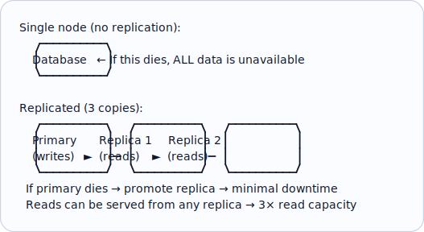
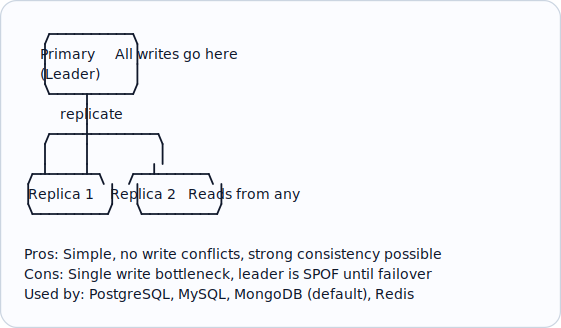
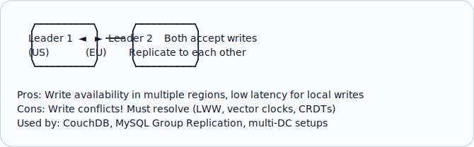
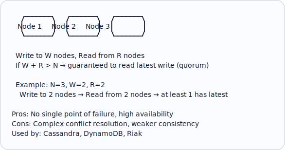
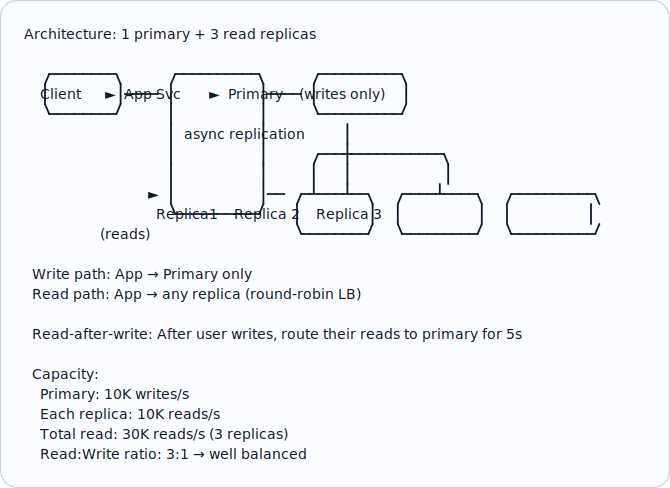
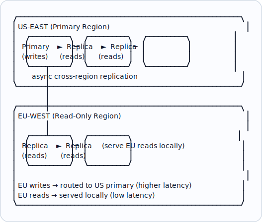

# Topic 27: Replication

> **Track**: Core Concepts — Fundamentals
> **Difficulty**: Intermediate → Advanced
> **Prerequisites**: Topics 1–26 (especially Consistency, CAP)

---

## Table of Contents

- [A. Concept Explanation](#a-concept-explanation)
- [B. Interview View](#b-interview-view)
- [C. Practical Engineering View](#c-practical-engineering-view)
- [D. Example](#d-example)
- [E. HLD and LLD](#e-hld-and-lld)
- [F. Summary & Practice](#f-summary--practice)

---

## A. Concept Explanation

### What is Replication?

**Replication** is the process of maintaining copies of data on multiple machines to improve availability, fault tolerance, and read performance.



### Replication Topologies

#### Single-Leader (Primary-Replica)



#### Multi-Leader



#### Leaderless



### Synchronous vs Asynchronous Replication

| Type | How | Latency | Consistency | Data Loss Risk |
|------|-----|---------|-------------|---------------|
| **Synchronous** | Write ACK after ALL replicas confirm | High | Strong | None |
| **Asynchronous** | Write ACK after primary writes; replicas catch up | Low | Eventual | Yes (if primary fails before replication) |
| **Semi-synchronous** | Write ACK after primary + 1 replica confirm | Medium | Strong-ish | Low (at least 1 replica has data) |

```
SYNCHRONOUS:
  Client → Primary → write → replicate → Replica 1 ACK → Replica 2 ACK → Client ACK
  Slow but safe.

ASYNCHRONOUS:
  Client → Primary → write → Client ACK → (replicate to replicas in background)
  Fast but replica may lag behind.

  Replication lag:
    Primary: balance = 1000
    Replica (1s behind): balance = 900 (stale!)
    User writes on primary, reads from replica → sees old data!
```

### Replication Lag Problems

| Problem | Cause | Solution |
|---------|-------|---------|
| **Stale reads** | Async replica is behind primary | Read-your-writes: route user's reads to primary after their write |
| **Non-monotonic reads** | Reads from different replicas | Monotonic reads: pin user to one replica |
| **Phantom reads** | Replica missing recent inserts | Bounded staleness: only read from replicas within N seconds of primary |
| **Causality violation** | Event B replicated before event A | Causal consistency: track dependencies |

---

## B. Interview View

### What Interviewers Expect

| Level | Expectation |
|-------|------------|
| **Junior** | Knows replication provides redundancy |
| **Mid** | Single-leader vs multi-leader; sync vs async |
| **Senior** | Replication lag solutions; quorum; failover strategies |
| **Staff+** | Multi-region replication; conflict resolution; consistency trade-offs |

### Red Flags

- Not including replication in a production database design
- Not knowing the difference between sync and async replication
- Ignoring replication lag implications for user experience

### Common Questions

1. What is replication and why is it needed?
2. Compare single-leader, multi-leader, and leaderless replication.
3. What is replication lag and how do you handle it?
4. Compare synchronous and asynchronous replication.
5. How does quorum work?

---

## C. Practical Engineering View

### PostgreSQL Streaming Replication

```
Primary (pg1):
  postgresql.conf:
    wal_level = replica
    max_wal_senders = 5

Replica (pg2):
  recovery.conf:
    primary_conninfo = 'host=pg1 port=5432'
    
  Sync mode:
    synchronous_commit = on
    synchronous_standby_names = 'pg2'
    → Primary waits for pg2 ACK before confirming write

  Async mode:
    synchronous_commit = off
    → Primary confirms immediately, pg2 catches up

Monitoring:
  SELECT pg_last_wal_receive_lsn() - pg_last_wal_replay_lsn() AS lag_bytes;
  SELECT now() - pg_last_xact_replay_timestamp() AS lag_time;
```

### Failover

```
Automatic failover when primary crashes:

  1. Detect failure: Heartbeat timeout (10-30s)
  2. Elect new primary: Promote replica with least lag
  3. Redirect traffic: Update DNS / connection pool config
  4. Reconfigure replicas: Point remaining replicas to new primary
  5. Old primary recovery: Rejoin as replica (may need re-sync)

  Tools: Patroni (PostgreSQL), Orchestrator (MySQL), Sentinel (Redis)

Split-brain risk:
  Old primary comes back online → thinks it's still primary
  → Two primaries writing → data divergence!
  
  Prevention:
  • Fencing: STONITH (Shoot The Other Node In The Head)
  • Epoch/term numbers: Reject writes from old primary
  • Quorum-based: Need majority to be primary
```

---

## D. Example: Read-Heavy Application with Replicas



---

## E. HLD and LLD

### E.1 HLD — Multi-Region Replication



### E.2 LLD — Read/Write Routing

```java
public class ReplicationRouter {
    private Object primary;
    private List<Object> replicas;
    private Object rrIndex;
    private Object recentWriters;

    public ReplicationRouter(Object primaryConn, List<Object> replicaConns) {
        this.primary = primaryConn;
        this.replicas = replicaConns;
        this.rrIndex = 0;
        this.recentWriters = new HashMap<>();
    }

    public Object getConnection(String queryType, String userId) {
        // if query_type == "write"
        // if user_id
        // recent_writers[user_id] = time.time()
        // return primary
        // Read-after-write consistency
        // if user_id and user_id in recent_writers
        // if time.time() - recent_writers[user_id] < 5:  # 5s window
        // return primary  # Route to primary for fresh reads
        // ...
        return null;
    }

    public Object executeRead(Object query, Object params, Object userId) {
        // conn = get_connection("read", user_id)
        // return conn.execute(query, params)
        return null;
    }

    public Object executeWrite(Object query, Object params, Object userId) {
        // conn = get_connection("write", user_id)
        // return conn.execute(query, params)
        return null;
    }
}
```

---

## F. Summary & Practice

### Key Takeaways

1. **Replication** copies data across machines for availability and read scaling
2. **Single-leader**: simple, no conflicts; **Multi-leader**: multi-region writes; **Leaderless**: high availability
3. **Synchronous**: strong consistency, higher latency; **Asynchronous**: low latency, possible data loss
4. **Replication lag** causes stale reads — mitigate with read-after-write consistency
5. **Failover** must detect failure, promote replica, and prevent split-brain
6. **Quorum** (W + R > N) guarantees reading latest write in leaderless systems
7. Most production systems use **semi-synchronous** (1 sync replica + async replicas)
8. Replication is for **read scaling and availability**, not write scaling (use sharding for writes)

### Interview Questions

1. What is replication? Why is it needed?
2. Compare single-leader, multi-leader, and leaderless.
3. Compare sync vs async replication.
4. What is replication lag and how do you handle it?
5. How does failover work? What is split-brain?
6. What is quorum? How does W + R > N work?
7. Design a multi-region database with replication.

### Practice Exercises

1. **Exercise 1**: Design the replication topology for a global e-commerce platform with users in US, EU, and Asia. Specify sync/async for each link.
2. **Exercise 2**: Your async replica has 30 seconds of lag during peak hours. Diagnose and propose 3 solutions.
3. **Exercise 3**: Implement read-after-write consistency routing for a primary + 3 replica setup.

---

> **Previous**: [26 — Sharding](26-sharding.md)
> **Next**: [28 — Partitioning](28-partitioning.md)
