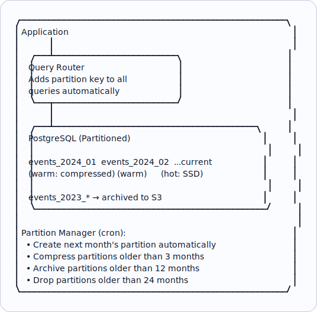

# Topic 28: Partitioning

> **Track**: Core Concepts — Fundamentals
> **Difficulty**: Intermediate
> **Prerequisites**: Topics 1–27 (especially Sharding, Replication)

---

## Table of Contents

- [A. Concept Explanation](#a-concept-explanation)
- [B. Interview View](#b-interview-view)
- [C. Practical Engineering View](#c-practical-engineering-view)
- [D. Example](#d-example)
- [E. HLD and LLD](#e-hld-and-lld)
- [F. Summary & Practice](#f-summary--practice)

---

## A. Concept Explanation

### What is Partitioning?

**Partitioning** divides a large table into smaller, more manageable pieces. Unlike sharding (which distributes across multiple servers), partitioning can happen within a single database instance.

```
Partitioning vs Sharding:
  PARTITIONING: Split table within ONE database (logical)
  SHARDING: Split data across MULTIPLE databases (physical)

  In practice, the terms overlap. Sharding is often called "horizontal partitioning across nodes."
```

### Types of Partitioning

#### Horizontal Partitioning (Row-based)

```
Split rows into separate partitions based on a column value:

  Original table: orders (10M rows)
  
  Partition by date range:
    orders_2023_q1: Jan-Mar 2023 (2.5M rows)
    orders_2023_q2: Apr-Jun 2023 (2.5M rows)
    orders_2023_q3: Jul-Sep 2023 (2.5M rows)
    orders_2023_q4: Oct-Dec 2023 (2.5M rows)

  Query: SELECT * FROM orders WHERE created_at = '2023-06-15'
  → DB only scans orders_2023_q2 (2.5M rows instead of 10M = 4× faster)
  → This is called "partition pruning"
```

#### Vertical Partitioning (Column-based)

```
Split columns into separate tables:

  Original: users (id, name, email, bio, avatar_url, preferences_json)

  Frequently accessed:
    users_core (id, name, email)          ← Small, fast reads
  
  Rarely accessed:
    users_profile (id, bio, avatar_url)   ← Larger, infrequent reads
    users_settings (id, preferences_json) ← Large JSON blobs
  
  Benefits: Core queries don't load heavy columns (bio, JSON).
  This is essentially normalization taken further.
```

### Partitioning Strategies (Horizontal)

| Strategy | How | Pros | Cons | Best For |
|----------|-----|------|------|----------|
| **Range** | By value range (dates, IDs) | Range queries efficient; easy to understand | Hotspots (recent data) | Time-series, logs |
| **List** | By discrete values | Query specific partitions | Must know all values | Region, category, status |
| **Hash** | hash(key) % N | Even distribution | Range queries hit all partitions | Uniform access patterns |
| **Composite** | Combination (range + hash) | Flexible | Complex | Large-scale, multi-dimensional |

```
RANGE:
  PARTITION BY RANGE (created_at)
    PARTITION p2023q1 VALUES LESS THAN ('2023-04-01')
    PARTITION p2023q2 VALUES LESS THAN ('2023-07-01')

LIST:
  PARTITION BY LIST (region)
    PARTITION p_us VALUES IN ('US', 'CA')
    PARTITION p_eu VALUES IN ('UK', 'DE', 'FR')
    PARTITION p_asia VALUES IN ('JP', 'IN', 'SG')

HASH:
  PARTITION BY HASH (user_id) PARTITIONS 8
  → user_id % 8 determines partition
```

### Partition Pruning

```
The database optimizer skips irrelevant partitions:

  Table: orders (partitioned by month)
  Query: SELECT * FROM orders WHERE order_date BETWEEN '2023-06-01' AND '2023-06-30'

  WITHOUT partitioning: Full table scan (10M rows)
  WITH partitioning: Only scan June partition (800K rows) → 12× faster

  Key requirement: Query WHERE clause must include the partition key!
  
  Bad query (no pruning):
    SELECT * FROM orders WHERE customer_name = 'Alice'
    → Scans ALL partitions (partition key is order_date, not customer_name)
```

---

## B. Interview View

### What Interviewers Expect

| Level | Expectation |
|-------|------------|
| **Junior** | Knows partitioning splits tables for performance |
| **Mid** | Knows range vs hash vs list; understands partition pruning |
| **Senior** | Designs partition strategy for specific workloads; handles data lifecycle |
| **Staff+** | Composite partitioning, partition management automation, migration strategies |

### Red Flags

- Confusing partitioning with sharding without nuance
- Not mentioning partition pruning (the main benefit)
- Not considering what happens when queries don't include the partition key

### Common Questions

1. What is partitioning? How does it differ from sharding?
2. Compare range, list, and hash partitioning.
3. What is partition pruning?
4. How would you partition a time-series table?
5. When is partitioning NOT helpful?

---

## C. Practical Engineering View

### PostgreSQL Table Partitioning

```sql
-- Range partitioning by date
CREATE TABLE orders (
    id BIGINT,
    user_id BIGINT,
    amount DECIMAL,
    created_at TIMESTAMP
) PARTITION BY RANGE (created_at);

-- Create partitions
CREATE TABLE orders_2024_01 PARTITION OF orders
    FOR VALUES FROM ('2024-01-01') TO ('2024-02-01');
CREATE TABLE orders_2024_02 PARTITION OF orders
    FOR VALUES FROM ('2024-02-01') TO ('2024-03-01');

-- Automate: Create future partitions via pg_partman or cron job
-- Archive: Detach old partitions and move to cold storage

-- Query (partition pruning happens automatically):
EXPLAIN SELECT * FROM orders WHERE created_at = '2024-01-15';
-- Output: Scan on orders_2024_01 (only this partition scanned)
```

### Data Lifecycle with Partitions

```
Hot/Warm/Cold strategy:

  Hot (current month):   SSD, no compression, full indexes
  Warm (3-12 months):    SSD, compressed, partial indexes
  Cold (>12 months):     HDD/S3, heavily compressed, minimal indexes
  Archive (>3 years):    Detach partition, export to S3 Glacier

  Dropping old data:
    WITHOUT partitioning: DELETE FROM orders WHERE created_at < '2022-01-01'
    → Slow (row-by-row delete), generates huge WAL, bloats table

    WITH partitioning: DROP TABLE orders_2021_q4;
    → Instant! Just drops the file. No row-by-row delete.
```

---

## D. Example: Analytics Event Table

```
Table: events (500M rows/month, 2 year retention)
Total: ~12B rows

Partition strategy: Range by month + Hash by user_id (composite)

  PARTITION BY RANGE (event_date) 
  SUBPARTITION BY HASH (user_id) SUBPARTITIONS 16

  events_2024_01_p0 ... events_2024_01_p15  (Jan 2024, 16 sub-partitions)
  events_2024_02_p0 ... events_2024_02_p15  (Feb 2024, 16 sub-partitions)

Query patterns:
  "Events for user X in Jan 2024":
    → Prune to events_2024_01 → then hash to specific sub-partition
    → Scans ~2M rows instead of 12B (6000× reduction!)
  
  "All events in Jan 2024":
    → Scans all 16 sub-partitions of events_2024_01
    → 500M rows instead of 12B (24× reduction)

Retention: DROP PARTITION for months > 24 months old (instant cleanup)
```

---

## E. HLD and LLD

### E.1 HLD — Partitioned Data Architecture



### E.2 LLD — Partition Manager

```java
// Dependencies in the original example:
// from datetime import datetime, timedelta

public class PartitionManager {
    private Object db;
    private String table;
    private int retention;

    public PartitionManager(Object dbConn, String tableName, int retentionMonths) {
        this.db = dbConn;
        this.table = tableName;
        this.retention = retentionMonths;
    }

    public Object createFuturePartitions(int monthsAhead) {
        // Pre-create partitions for upcoming months
        // for i in range(months_ahead)
        // date = datetime.now() + timedelta(days=30 * (i + 1))
        // partition_name = f"{table}_{date.strftime('%Y_%m')}"
        // start = date.replace(day=1).strftime('%Y-%m-%d')
        // end = (date.replace(day=1) + timedelta(days=32)).replace(day=1).strftime('%Y-%m-%d')
        // db.execute(f
        // CREATE TABLE IF NOT EXISTS {partition_name}
        // ...
        return null;
    }

    public Object archiveOldPartitions(int archiveAfterMonths) {
        // Detach and export partitions older than threshold
        // cutoff = datetime.now() - timedelta(days=30 * archive_after_months)
        // old_partitions = _get_partitions_before(cutoff)
        // for partition in old_partitions
        // Export to S3
        // db.execute(f"COPY {partition} TO '/tmp/{partition}.csv' CSV")
        // upload_to_s3(f"/tmp/{partition}.csv", f"archive/{partition}.csv")
        // Detach and drop
        // ...
        return null;
    }

    public Object dropExpiredPartitions() {
        // Drop partitions beyond retention period
        // cutoff = datetime.now() - timedelta(days=30 * retention)
        // expired = _get_partitions_before(cutoff)
        // for partition in expired
        // db.execute(f"DROP TABLE IF EXISTS {partition}")
        return null;
    }
}
```

---

## F. Summary & Practice

### Key Takeaways

1. **Partitioning** divides tables into smaller pieces for query performance
2. **Horizontal**: split rows (range, list, hash); **Vertical**: split columns
3. **Partition pruning** is the main benefit — DB skips irrelevant partitions
4. **Range partitioning** is best for time-series data
5. Queries **must include the partition key** to benefit from pruning
6. Partitioning enables efficient **data lifecycle** (hot/warm/cold/archive)
7. **DROP PARTITION** is instant vs slow DELETE for data cleanup
8. Partitioning is within one DB; sharding is across multiple DBs

### Interview Questions

1. What is partitioning? How does it differ from sharding?
2. Compare range, list, and hash partitioning.
3. What is partition pruning and why is it important?
4. How would you partition a time-series table?
5. How do you handle data lifecycle with partitions?
6. When is partitioning not helpful?

### Practice Exercises

1. **Exercise 1**: Design a partitioning strategy for an IoT platform storing 1B sensor readings/month with 2-year retention. Include hot/warm/cold tiers.
2. **Exercise 2**: Your partitioned orders table has 12 monthly partitions. Queries filtering by user_id (not the partition key) are slow. Design the solution.
3. **Exercise 3**: Implement a partition manager that auto-creates future partitions and archives old ones to S3.

---

> **Previous**: [27 — Replication](27-replication.md)
> **Next**: [29 — Leader-Follower](29-leader-follower.md)
