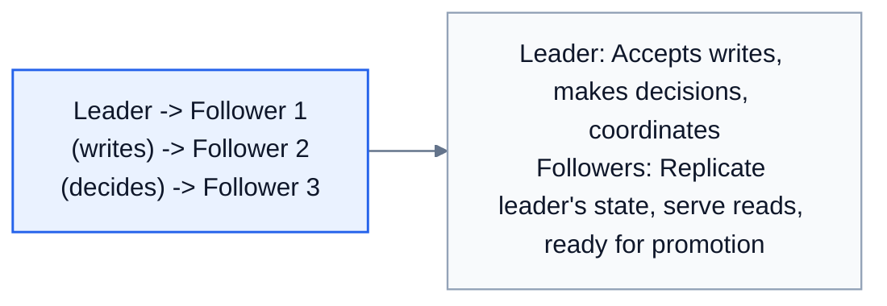
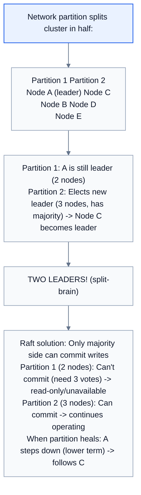
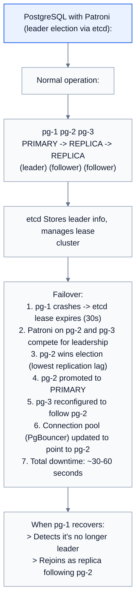
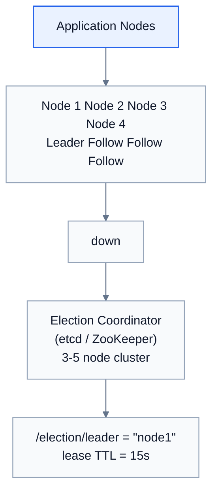

# Topic 29: Leader-Follower (Leader Election)

> **Track**: Core Concepts — Fundamentals
> **Difficulty**: Intermediate → Advanced
> **Prerequisites**: Topics 1–28 (especially Replication, Consensus)

---

## Table of Contents

- [A. Concept Explanation](#a-concept-explanation)
- [B. Interview View](#b-interview-view)
- [C. Practical Engineering View](#c-practical-engineering-view)
- [D. Example](#d-example)
- [E. HLD and LLD](#e-hld-and-lld)
- [F. Summary & Practice](#f-summary--practice)

---

## A. Concept Explanation

### What is Leader-Follower?

The **leader-follower** (also called primary-replica or master-slave) pattern designates one node as the **leader** that coordinates work, while **followers** replicate state or standby for failover.



### Leader Election

When the leader fails, the system must elect a new leader. This is **leader election**.

```
Normal state:
  Leader (Node A) ← active
  Follower (Node B)
  Follower (Node C)

Leader fails:
  Leader (Node A) ← DEAD
  Follower (Node B) ← "I should be leader!"
  Follower (Node C) ← "No, I should!"

Election needed:
  → Consensus algorithm decides → Node B becomes new leader
  → Node C follows Node B
  → When Node A recovers, it joins as follower
```

### Election Algorithms

| Algorithm | How | Used By |
|-----------|-----|---------|
| **Bully Algorithm** | Highest-ranked node wins | Simple systems |
| **Raft** | Majority vote with term numbers | etcd, Consul, CockroachDB |
| **Paxos** | Complex majority consensus | Google Spanner, Chubby |
| **ZAB** | ZooKeeper Atomic Broadcast | ZooKeeper (Kafka, HBase) |
| **Lease-based** | Leader holds a time-limited lease; must renew | Many distributed systems |

### Raft Leader Election (Simplified)

```
Raft has 3 roles: Leader, Candidate, Follower

NORMAL OPERATION:
  Leader sends heartbeats to followers every 150ms
  Followers reset their election timeout on each heartbeat

LEADER FAILURE DETECTION:
  Follower doesn't receive heartbeat within timeout (300-500ms)
  → Follower becomes Candidate

ELECTION:
  1. Candidate increments term number (epoch)
  2. Candidate votes for itself
  3. Candidate requests votes from other nodes
  4. If Candidate gets majority (>N/2) → becomes Leader
  5. If another Candidate gets majority first → become Follower
  6. If no majority (split vote) → new election with new term

TERM NUMBERS prevent stale leaders:
  Term 5: Node A is leader
  Node A gets network-partitioned
  Term 6: Node B elected leader (majority)
  Node A comes back with term 5 → sees term 6 → steps down to follower

5-node cluster: needs 3 votes (majority) → tolerates 2 failures
3-node cluster: needs 2 votes → tolerates 1 failure
```

### Split-Brain Problem



### Lease-Based Leadership

```
Leader holds a time-limited lease (e.g., 30 seconds):

  1. Leader acquires lease: "I'm leader until T+30s"
  2. Leader must renew before lease expires
  3. If leader fails to renew → lease expires → election

  Benefits:
  • Simple to implement (Redis SET NX EX, etcd lease)
  • No complex consensus needed
  • Guaranteed leader uniqueness within lease period

  Risks:
  • Clock skew: Leader thinks lease is valid, but others see it expired
  • GC pause: Leader paused during lease renewal → lease expires
  • Solution: Use fencing tokens (see Topic 25)
```

---

## B. Interview View

### What Interviewers Expect

| Level | Expectation |
|-------|------------|
| **Junior** | Knows leader handles writes, followers replicate |
| **Mid** | Knows leader election happens on failure; mentions Raft or ZooKeeper |
| **Senior** | Discusses split-brain, term numbers, quorum-based election |
| **Staff+** | Lease-based vs consensus-based, fencing, multi-region leader election |

### Red Flags

- Not considering what happens when the leader fails
- Not knowing about split-brain
- Assuming leader election is instant (it takes time → brief unavailability)

### Common Questions

1. What is leader election? Why is it needed?
2. How does Raft elect a leader?
3. What is split-brain? How do you prevent it?
4. What happens during the time between leader failure and new election?
5. Compare Raft, Paxos, and ZAB.
6. What is a lease-based leader?

---

## C. Practical Engineering View

### Leader Election in Practice

```
Using ZooKeeper:
  Nodes create ephemeral sequential znodes: /election/node-0001, /election/node-0002
  Lowest number = leader
  Leader dies → ephemeral node deleted → next lowest becomes leader

Using etcd:
  etcd has built-in election API:
    campaignCtx = election.Campaign(ctx, "my-leader")
    // Blocks until this node becomes leader
    // Lease-based: must renew to maintain leadership

Using Redis (simple but less safe):
  SET leader node_a NX EX 30  // Acquire lease for 30s
  // Must renew before 30s
  // Risk: Redis replication lag could cause dual leaders
```

### Monitoring Leader Elections

```
Key metrics:
  • Election frequency: How often elections happen (should be rare)
  • Election duration: Time from leader loss to new leader (target: <5s)
  • Leadership stability: Time between elections
  • Follower lag: How far behind followers are

Alerts:
  Election > 1 per hour → Investigate leader stability
  Election duration > 30s → Possible network issue
  Follower lag > 10s → Replica catching up, may cause stale reads
```

---

## D. Example: Database Primary Failover



---

## E. HLD and LLD

### E.1 HLD — Leader Election Service



### E.2 LLD — Lease-Based Leader Election

```java
// Dependencies in the original example:
// import time
// import threading

public class LeaderElection {
    private String nodeId;
    private Object etcd;
    private int leaseTtl;
    private Object isLeader;
    private String leaseId;
    private Object running;

    public LeaderElection(String nodeId, Object etcdClient, int leaseTtl) {
        this.nodeId = nodeId;
        this.etcd = etcdClient;
        this.leaseTtl = leaseTtl;
        this.isLeader = false;
        this.leaseId = null;
        this.running = true;
    }

    public Object start(Object onBecomeLeader, Object onLoseLeadership) {
        // Start the election loop
        // while _running
        // if not is_leader
        // _try_become_leader(on_become_leader)
        // else
        // if not _renew_lease()
        // is_leader = false
        // on_lose_leadership()
        // ...
        return null;
    }

    public Object tryBecomeLeader(Object callback) {
        // try
        // Create lease
        // lease_id = etcd.lease(lease_ttl)
        // Try to acquire leadership (atomic put-if-absent)
        // success = etcd.put_if_absent(
        // "/election/leader",
        // node_id,
        // lease=lease_id
        // ...
        return null;
    }

    public boolean renewLease() {
        // try
        // etcd.refresh_lease(lease_id)
        // return true
        // except Exception
        // return false  # Lost leadership
        return false;
    }

    public Object resign() {
        // Voluntarily give up leadership
        // if is_leader
        // etcd.delete("/election/leader")
        // etcd.revoke_lease(lease_id)
        // is_leader = false
        return null;
    }

    public String getCurrentLeader() {
        // return etcd.get("/election/leader")
        return null;
    }

    public Object stop() {
        // _running = false
        // resign()
        return null;
    }
}
```

---

## F. Summary & Practice

### Key Takeaways

1. **Leader-follower**: one node leads (writes/coordinates), others follow (replicate/standby)
2. **Leader election** selects a new leader when the current one fails
3. **Raft**: majority-vote election with term numbers; most popular modern consensus
4. **Split-brain**: two leaders after network partition; prevented by requiring majority quorum
5. **Lease-based**: leader holds time-limited lease; simpler but clock-dependent
6. **Fencing tokens** protect against stale leaders acting on expired leases
7. Election causes **brief unavailability** (seconds to minutes)
8. Tools: etcd, ZooKeeper, Consul for election; Patroni for DB failover

### Interview Questions

1. What is leader election? When is it needed?
2. How does Raft elect a leader?
3. What is split-brain and how do you prevent it?
4. What happens during the gap between leader failure and new election?
5. Compare lease-based vs consensus-based leader election.
6. How does PostgreSQL/MySQL handle primary failover?
7. What is a fencing token?

### Practice Exercises

1. **Exercise 1**: Implement lease-based leader election using Redis. Handle: acquisition, renewal, voluntary resignation, and crash recovery.
2. **Exercise 2**: Design a 5-node Raft cluster. Simulate: leader failure, split vote, network partition. Show which nodes can serve reads/writes in each scenario.
3. **Exercise 3**: Your PostgreSQL primary fails. Design the automatic failover process including: detection, election, promotion, reconfiguration, and client reconnection.

---

> **Previous**: [28 — Partitioning](28-partitioning.md)
> **Next**: [30 — Consensus Algorithms](30-consensus-algorithms.md)
