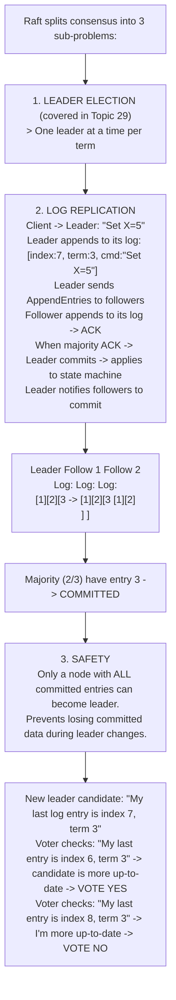
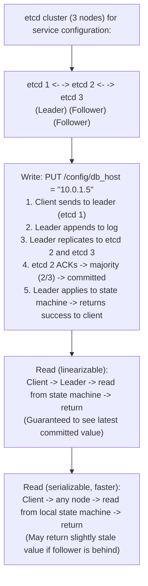
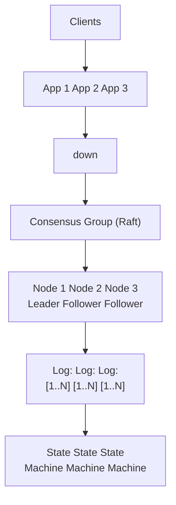

# Topic 30: Consensus Algorithms

> **Track**: Core Concepts — Fundamentals
> **Difficulty**: Advanced
> **Prerequisites**: Topics 1–29 (especially CAP, Replication, Leader-Follower)

---

## Table of Contents

- [A. Concept Explanation](#a-concept-explanation)
- [B. Interview View](#b-interview-view)
- [C. Practical Engineering View](#c-practical-engineering-view)
- [D. Example](#d-example)
- [E. HLD and LLD](#e-hld-and-lld)
- [F. Summary & Practice](#f-summary--practice)

---

## A. Concept Explanation

### What is Consensus?

**Consensus** is the process by which distributed nodes agree on a single value or decision, even when some nodes fail or messages are delayed.

```
The problem:
  Node A: "The value is X"
  Node B: "The value is Y"
  Node C: "I didn't get the message"
  
  How do they all agree on ONE value?

Consensus guarantees:
  1. AGREEMENT: All non-faulty nodes decide the same value
  2. VALIDITY: The decided value was proposed by some node
  3. TERMINATION: All non-faulty nodes eventually decide
  4. INTEGRITY: Each node decides at most once
```

### Why Consensus is Hard

```
FLP Impossibility Theorem (1985):
  In an asynchronous system where even ONE node can crash,
  there is NO algorithm that guarantees consensus in bounded time.

  → Real systems use timeouts and randomization to work around this.
  → Raft, Paxos work in practice but cannot guarantee termination
     in theory (they may need multiple rounds).

Byzantine Generals Problem:
  What if nodes LIE (send conflicting messages)?
  → Byzantine Fault Tolerance (BFT) algorithms handle this
  → Requires 3f+1 nodes to tolerate f Byzantine (malicious) nodes
  → Used in blockchain (PBFT, Tendermint)
  → Most internal systems assume non-Byzantine (crash faults only)
```

### Major Consensus Algorithms

| Algorithm | Year | Tolerates | Rounds | Used By |
|-----------|------|-----------|--------|---------|
| **Paxos** | 1989 | Crash faults | Multiple | Google Spanner, Chubby |
| **Raft** | 2014 | Crash faults | 1-2 | etcd, Consul, CockroachDB, TiKV |
| **ZAB** | 2011 | Crash faults | 1-2 | ZooKeeper |
| **PBFT** | 1999 | Byzantine faults | 3 | Hyperledger, some blockchains |
| **Viewstamped Replication** | 1988 | Crash faults | 1-2 | Academic reference |

### Raft Consensus (Detailed)



### Paxos (Simplified)

```
Paxos has 3 roles: Proposer, Acceptor, Learner

Phase 1: PREPARE
  Proposer: "Prepare proposal #5" → sends to all Acceptors
  Acceptors: If #5 > any previous promise → "Promise to accept ≥ #5"
  Proposer collects majority promises → proceeds to Phase 2

Phase 2: ACCEPT
  Proposer: "Accept proposal #5 with value V" → sends to Acceptors
  Acceptors: If no higher promise made → "Accepted #5 = V"
  When majority accept → value V is CHOSEN

Why Paxos is hard:
  • Multiple proposers can conflict → livelock (neither gets majority)
  • Multi-round: may take many rounds to converge
  • Hard to implement correctly (famously difficult)
  
  Raft was designed as an "understandable alternative to Paxos"
```

### Quorum

```
Quorum = minimum number of nodes needed to make a decision

  N = total nodes
  Majority quorum = floor(N/2) + 1

  N=3: quorum = 2  (tolerates 1 failure)
  N=5: quorum = 3  (tolerates 2 failures)
  N=7: quorum = 4  (tolerates 3 failures)

  Why odd numbers?
    N=4: quorum = 3 (tolerates 1 failure) — same as N=3!
    N=5: quorum = 3 (tolerates 2 failures) — better!
    → Odd N gives more fault tolerance per node

  Write quorum + Read quorum > N → guaranteed to read latest write
    W=2, R=2, N=3: 2+2=4 > 3 ✓ (strong consistency)
    W=1, R=3, N=3: 1+3=4 > 3 ✓ (fast writes, slow reads)
    W=1, R=1, N=3: 1+1=2 < 3 ✗ (may read stale data)
```

---

## B. Interview View

### What Interviewers Expect

| Level | Expectation |
|-------|------------|
| **Junior** | Knows consensus = nodes agreeing on a value |
| **Mid** | Knows Raft basics; quorum concept |
| **Senior** | Can explain Raft log replication; knows Paxos at high level |
| **Staff+** | FLP impossibility; Byzantine vs crash faults; multi-Paxos; Raft optimizations |

### Red Flags

- Claiming consensus is easy or trivial
- Not knowing about quorum
- Confusing consensus with simple replication
- Not mentioning that consensus requires majority

### Common Questions

1. What is distributed consensus? Why is it needed?
2. Explain how Raft works (leader election + log replication).
3. What is a quorum? Why use odd-numbered clusters?
4. Compare Raft and Paxos.
5. What is the FLP impossibility theorem?
6. What is Byzantine fault tolerance?

---

## C. Practical Engineering View

### Choosing Cluster Size

```
3 nodes: Tolerates 1 failure. Minimum for production.
  Pros: Low cost, low latency (only 2 nodes need to ACK)
  Cons: ANY single failure leaves no fault tolerance margin
  Use: Small deployments, dev/staging

5 nodes: Tolerates 2 failures. Standard for production.
  Pros: Can survive rolling upgrades (1 down) + 1 failure
  Cons: More cost, slightly higher write latency
  Use: Production etcd, ZooKeeper, Consul clusters

7 nodes: Tolerates 3 failures. Rarely needed.
  Pros: Maximum fault tolerance
  Cons: Diminishing returns; higher write latency (4 ACKs needed)
  Use: Multi-AZ critical infrastructure
```

### Performance Considerations

```
Consensus adds latency to writes:
  Single node write: ~1ms
  3-node Raft write: ~5-10ms (leader + 1 follower ACK)
  5-node Raft write: ~5-15ms (leader + 2 follower ACKs)
  Cross-region Raft: ~100-300ms (WAN latency)

Optimization: Batching
  Instead of per-write consensus → batch 100 writes → 1 consensus round
  etcd: ~10K writes/s with batching
  
Multi-Raft (CockroachDB, TiKV):
  Instead of 1 Raft group for all data → 1 Raft group per data range
  Parallelism: different ranges replicated independently
  Scale: thousands of Raft groups on the same cluster
```

---

## D. Example: Distributed Configuration Store



---

## E. HLD and LLD

### E.1 HLD — Consensus-Based Replicated Store



### E.2 LLD — Simplified Raft Log Replication

```java
public class RaftNode {
    private Object id;
    private Object peers;
    private String role;
    private Object currentTerm;
    private Object votedFor;
    private Object log;
    private Object commitIndex;
    private Object stateMachine;

    public RaftNode(Object nodeId, List<Object> peers) {
        this.id = nodeId;
        this.peers = peers;
        this.role = "follower";
        this.currentTerm = 0;
        this.votedFor = null;
        this.log = new ArrayList<>();
        this.commitIndex = 0;
        this.stateMachine = new HashMap<>();
    }

    public boolean propose(Map<String, Object> command) {
        // Leader proposes a new entry (client write)
        // if role != "leader"
        // return false  # Redirect to leader
        // Append to local log
        // entry = {"term": current_term, "command": command}
        // log.append(entry)
        // index = len(log)
        // Replicate to followers
        // ...
        return false;
    }

    public Object sendAppendEntries(Object peer, Object entries, Object leaderCommit) {
        // Send AppendEntries RPC to a follower
        // response = rpc_call(peer, "append_entries", {
        // "term": current_term,
        // "leader_id": id,
        // "entries": entries,
        // "leader_commit": leader_commit,
        // })
        // return response.get("success", false)
        return null;
    }

    public Object handleAppendEntries(Object request) {
        // Follower handles AppendEntries from leader
        // if request["term"] < current_term
        // return {"success": false, "term": current_term}
        // current_term = request["term"]
        // role = "follower"
        // Append new entries
        // for entry in request["entries"]
        // log.append(entry)
        // ...
        return null;
    }

    public Object applyToStateMachine(Object command) {
        // if command["type"] == "set"
        // state_machine[command["key"]] = command["value"]
        return null;
    }

    public Object applyCommitted() {
        // Apply all committed but unapplied entries
        // for i in range(commit_index)
        // if i < len(log)
        // _apply_to_state_machine(log[i]["command"])
        return null;
    }

    public Object read(String key) {
        // Read from state machine (linearizable if leader)
        // if role == "leader"
        // return state_machine.get(key)
        // return null  # Redirect to leader for linearizable read
        return null;
    }
}
```

---

## F. Summary & Practice

### Key Takeaways

1. **Consensus** = distributed nodes agreeing on a single value
2. **Raft**: leader-based; splits into leader election + log replication + safety
3. **Paxos**: proposal-based; mathematically proven but hard to implement
4. **Quorum** = majority of nodes; use **odd-numbered** clusters (3, 5, 7)
5. **FLP theorem**: consensus can't be guaranteed in bounded time with even 1 failure
6. **Byzantine faults** (malicious nodes) need 3f+1 nodes; **crash faults** need 2f+1
7. Consensus adds **write latency** (must wait for majority ACK)
8. **Multi-Raft** enables parallel consensus for different data ranges
9. Production tools: **etcd** (Raft), **ZooKeeper** (ZAB), **Consul** (Raft)
10. Most engineers don't implement consensus — they use existing systems

### Interview Questions

1. What is distributed consensus?
2. Explain Raft's log replication process.
3. What is a quorum? Why odd-numbered clusters?
4. Compare Raft and Paxos.
5. What is the FLP impossibility theorem?
6. How does consensus affect write latency?
7. What is the difference between crash faults and Byzantine faults?
8. How does CockroachDB use multi-Raft?

### Practice Exercises

1. **Exercise 1**: Trace a Raft write through a 5-node cluster. Show the log state of each node after the write is committed.
2. **Exercise 2**: A 5-node etcd cluster loses 2 nodes. What can it still do? What if it loses 3?
3. **Exercise 3**: Design a distributed lock service using Raft consensus. Compare with the Redis-based lock from Topic 25.

---

> **Previous**: [29 — Leader-Follower](29-leader-follower.md)
> **Next**: [31 — Indexing](31-indexing.md)
