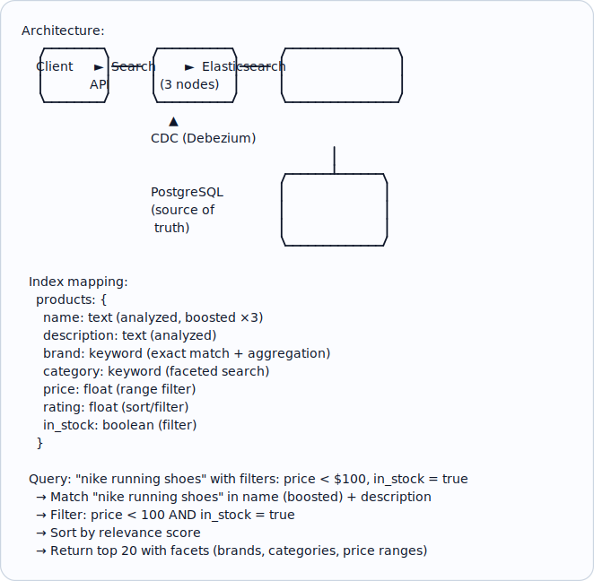
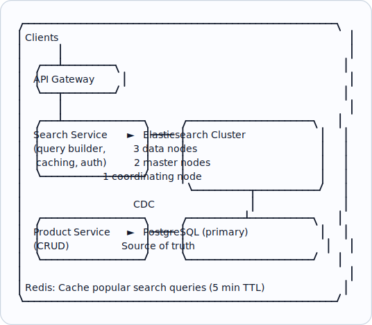

# Topic 32: Full-Text Search

> **Track**: Core Concepts — Fundamentals
> **Difficulty**: Intermediate
> **Prerequisites**: Topics 1–31 (especially Indexing)

---

## Table of Contents

- [A. Concept Explanation](#a-concept-explanation)
- [B. Interview View](#b-interview-view)
- [C. Practical Engineering View](#c-practical-engineering-view)
- [D. Example](#d-example)
- [E. HLD and LLD](#e-hld-and-lld)
- [F. Summary & Practice](#f-summary--practice)

---

## A. Concept Explanation

### What is Full-Text Search?

**Full-text search** allows users to search for documents or records by matching words and phrases within text content, rather than exact field matches. It handles natural language: typos, synonyms, stemming, and relevance ranking.

```
REGULAR SQL SEARCH:
  SELECT * FROM products WHERE name LIKE '%running shoe%'
  Problems:
    • Slow (full scan, no index)
    • No ranking (which result is most relevant?)
    • No typo tolerance ("runnin shoe" → no results)
    • No stemming ("running" won't match "run" or "runner")

FULL-TEXT SEARCH:
  Query: "runnin shoes"
  → Typo correction: "running shoes"
  → Stemming: "running" → "run", "shoes" → "shoe"
  → Inverted index lookup: instant
  → Ranked results: most relevant first
  → Highlights matching terms in results
```

### Inverted Index

```
The core data structure behind full-text search:

  Documents:
    Doc 1: "The quick brown fox"
    Doc 2: "The lazy brown dog"
    Doc 3: "Quick fox jumps"

  Inverted Index:
    "brown" → [Doc 1, Doc 2]
    "dog"   → [Doc 2]
    "fox"   → [Doc 1, Doc 3]
    "jumps" → [Doc 3]
    "lazy"  → [Doc 2]
    "quick" → [Doc 1, Doc 3]
    "the"   → [Doc 1, Doc 2]  (often removed as a "stop word")

  Query: "quick fox"
    → "quick" → [Doc 1, Doc 3]
    → "fox"   → [Doc 1, Doc 3]
    → Intersection: [Doc 1, Doc 3]
    → Doc 1 has both terms → higher relevance score
```

### Text Processing Pipeline

```
Raw text → Analyzer → Indexed terms

  1. CHARACTER FILTERS: Remove HTML, normalize unicode
     "<p>Café</p>" → "Cafe"
  
  2. TOKENIZER: Split into tokens
     "running-shoes 2024" → ["running", "shoes", "2024"]
  
  3. TOKEN FILTERS:
     Lowercase:    "Running" → "running"
     Stop words:   Remove "the", "is", "and", etc.
     Stemming:     "running" → "run", "shoes" → "shoe"
     Synonyms:     "sneakers" → "shoes"
     
  Result: "Buy Running-Shoes 2024!" → ["buy", "run", "shoe", "2024"]
```

### Relevance Scoring (TF-IDF / BM25)

```
TF-IDF (Term Frequency × Inverse Document Frequency):

  TF: How often the term appears in THIS document
    "running" appears 3 times in Doc A → high TF

  IDF: How rare the term is across ALL documents
    "the" appears in every doc → low IDF (not useful)
    "elasticsearch" appears in 2 docs → high IDF (very useful)

  Score = TF × IDF
    Common words ("the", "is") → low score
    Rare, relevant words → high score

BM25 (modern improvement over TF-IDF):
  • Saturates TF (10 occurrences isn't 10× more relevant than 1)
  • Accounts for document length (shorter docs with match = more relevant)
  • Used by Elasticsearch, Lucene, PostgreSQL FTS
```

### Search Engines

| Engine | Type | Best For |
|--------|------|----------|
| **Elasticsearch** | Distributed search + analytics | Full-text search at scale, log analysis |
| **OpenSearch** | Fork of Elasticsearch (AWS) | AWS-managed search |
| **Apache Solr** | Distributed search | Enterprise search |
| **Typesense** | Lightweight search | Simple search, low latency |
| **Meilisearch** | Lightweight search | Developer-friendly, typo tolerance |
| **PostgreSQL FTS** | Built-in DB feature | Simple search within PostgreSQL |
| **Algolia** | SaaS search | Instant search, hosted |

---

## B. Interview View

### What Interviewers Expect

| Level | Expectation |
|-------|------------|
| **Junior** | Knows LIKE is slow; mentions Elasticsearch |
| **Mid** | Understands inverted index; knows when to use search engine vs DB |
| **Senior** | Discusses relevance tuning, analyzers, index design, scaling |
| **Staff+** | Multi-language search, search architecture, query optimization |

### Red Flags

- Using SQL LIKE for text search at scale
- Not considering search relevance/ranking
- Not knowing about inverted indexes

### Common Questions

1. How does full-text search work?
2. What is an inverted index?
3. When would you use Elasticsearch vs PostgreSQL full-text search?
4. How does relevance scoring work?
5. How would you implement search for an e-commerce site?

---

## C. Practical Engineering View

### Elasticsearch vs PostgreSQL FTS

```
Choose POSTGRESQL FTS when:
  ✓ Simple search needs (blog, small product catalog)
  ✓ < 1M documents
  ✓ Don't want another infrastructure component
  ✓ Search is a secondary feature

Choose ELASTICSEARCH when:
  ✓ Complex search (facets, aggregations, fuzzy matching)
  ✓ > 1M documents or high query volume
  ✓ Search is a primary feature
  ✓ Need real-time analytics on search data
  ✓ Multi-language support
  ✓ Autocomplete, suggestions, "did you mean?"
```

### Keeping Search in Sync with Database

```
Problem: Data lives in PostgreSQL. Search index in Elasticsearch.
  How to keep them in sync?

  Option 1: DUAL WRITE (simple but risky)
    App writes to DB AND ES in same request
    Risk: DB succeeds, ES fails → inconsistent

  Option 2: CDC (Change Data Capture) — RECOMMENDED
    DB → WAL/binlog → Debezium → Kafka → ES Consumer → ES
    Eventually consistent but reliable.

  Option 3: OUTBOX PATTERN
    App writes to DB + outbox table in same transaction
    Background worker reads outbox → updates ES

  Option 4: PERIODIC REINDEX
    Cron job re-indexes changed documents every N minutes
    Simple but higher latency.
```

---

## D. Example: E-Commerce Product Search



---

## E. HLD and LLD

### E.1 HLD — Search Architecture



### E.2 LLD — Search Service

```java
public class SearchService {
    private Object es;
    private Object cache;

    public SearchService(Object esClient, Object cacheClient) {
        this.es = esClient;
        this.cache = cacheClient;
    }

    public Map<String, Object> searchProducts(String query, Map<String, Object> filters, int page, int size) {
        // Check cache
        // cache_key = f"search:{hash(query + str(filters) + str(page))}"
        // cached = cache.get(cache_key)
        // if cached
        // return json.loads(cached)
        // Build Elasticsearch query
        // es_query = {
        // "query": {
        // ...
        return null;
    }

    public List<Object> buildFilters(Map<String, Object> filters) {
        // if not filters
        // return []
        // clauses = []
        // if "price_min" in filters
        // clauses.append({"range": {"price": {"gte": filters["price_min"]}}})
        // if "price_max" in filters
        // clauses.append({"range": {"price": {"lte": filters["price_max"]}}})
        // if "brand" in filters
        // ...
        return null;
    }

    public Object formatHit(Object hit) {
        // return {
        // "id": hit["_id"],
        // "score": hit["_score"],
        // **hit["_source"],
        // "highlights": hit.get("highlight", {}),
        // }
        return null;
    }
}
```

---

## F. Summary & Practice

### Key Takeaways

1. **Full-text search** finds documents by matching words with relevance ranking
2. **Inverted index** maps each term to the documents containing it
3. **Text analysis** pipeline: tokenize → lowercase → stem → remove stop words
4. **BM25** is the standard relevance scoring algorithm
5. **Elasticsearch** for complex search at scale; **PostgreSQL FTS** for simple cases
6. Keep search index in sync via **CDC** (Debezium) or outbox pattern
7. Use **facets/aggregations** for filtering (brand, category, price range)
8. Cache popular queries in Redis for performance

### Interview Questions

1. How does full-text search work?
2. What is an inverted index?
3. When would you use Elasticsearch vs a database?
4. How do you keep the search index in sync with the database?
5. How does relevance scoring work?
6. Design search for an e-commerce platform.
7. How would you handle autocomplete/typeahead?
8. How do you handle multi-language search?

### Practice Exercises

1. **Exercise 1**: Design the search architecture for a job board with 10M listings. Include index mapping, query strategy, and sync mechanism.
2. **Exercise 2**: Your Elasticsearch cluster returns results in 500ms. Diagnose and optimize to achieve <50ms p99 latency.
3. **Exercise 3**: Implement autocomplete search with prefix matching, typo tolerance, and recent search history.

---

> **Previous**: [31 — Indexing](31-indexing.md)
> **Next**: [33 — Blob Storage](33-blob-storage.md)
