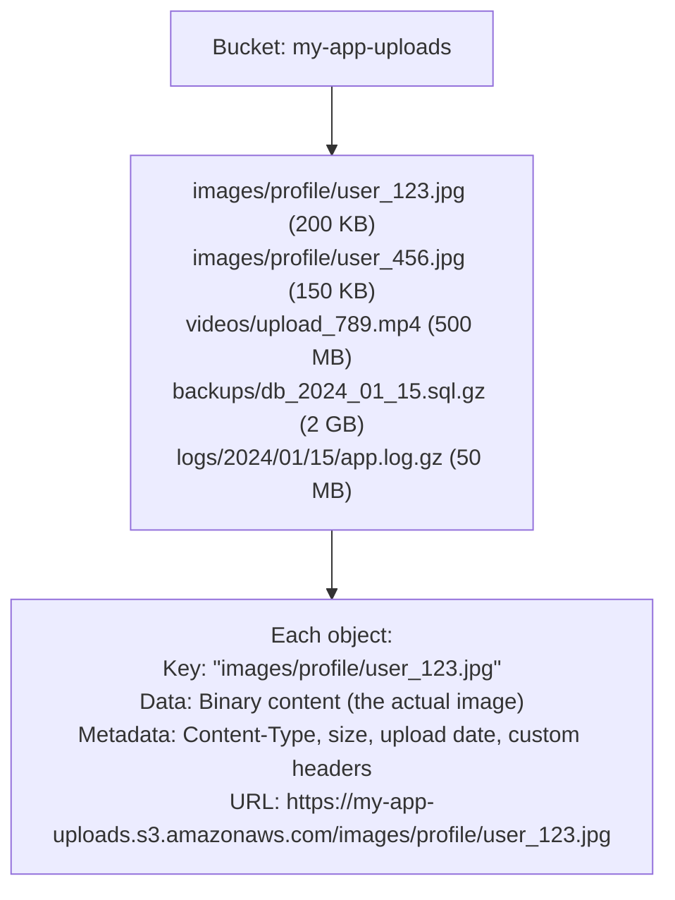
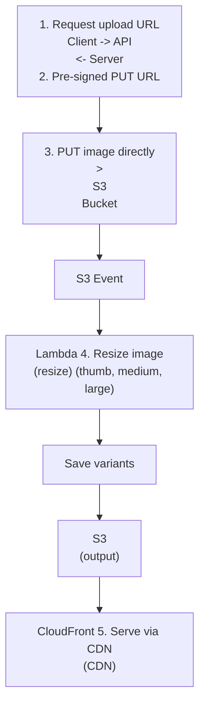
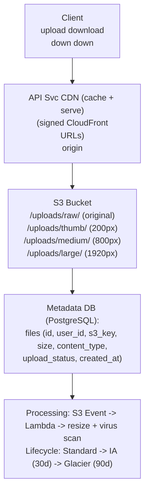

# Topic 33: Blob Storage

> **Track**: Core Concepts — Fundamentals
> **Difficulty**: Intermediate
> **Prerequisites**: Topics 1–32

---

## Table of Contents

- [A. Concept Explanation](#a-concept-explanation)
- [B. Interview View](#b-interview-view)
- [C. Practical Engineering View](#c-practical-engineering-view)
- [D. Example](#d-example)
- [E. HLD and LLD](#e-hld-and-lld)
- [F. Summary & Practice](#f-summary--practice)

---

## A. Concept Explanation

### What is Blob Storage?

**Blob (Binary Large Object) Storage** is a service for storing unstructured data — files, images, videos, backups, logs — as objects rather than in rows/columns. Each object has a unique key, the data itself, and metadata.

```
RELATIONAL DB:              BLOB/OBJECT STORAGE:
  Rows + Columns              Key + Data + Metadata
  Structured data             Unstructured data
  SQL queries                 GET/PUT by key
  Max ~1 GB per field         Objects up to 5 TB
  Expensive per GB            Cheap per GB ($0.023/GB/month S3)
```

### Object Storage Model



### Object Storage Providers

| Provider | Service | Durability | Cost (Standard) |
|----------|---------|-----------|----------------|
| **AWS** | S3 | 99.999999999% (11 nines) | $0.023/GB/month |
| **Google Cloud** | Cloud Storage | 99.999999999% | $0.020/GB/month |
| **Azure** | Blob Storage | 99.999999999% | $0.018/GB/month |
| **MinIO** | Self-hosted (S3-compatible) | Configurable | Infrastructure cost |
| **Cloudflare** | R2 | 99.999999999% | $0.015/GB/month, no egress fees |

### Storage Classes (S3 Example)

| Class | Access | Cost/GB/month | Retrieval | Use Case |
|-------|--------|-------------|-----------|----------|
| **Standard** | Frequent | $0.023 | Instant | Active data, serving content |
| **Infrequent Access** | Monthly | $0.0125 | Instant + retrieval fee | Backups, older data |
| **Glacier Instant** | Quarterly | $0.004 | Milliseconds | Archive with instant access |
| **Glacier Flexible** | Yearly | $0.0036 | Minutes to hours | Long-term archive |
| **Glacier Deep** | Rarely | $0.00099 | 12-48 hours | Compliance, 7-year retention |

### Pre-Signed URLs

```
Problem: Client needs to upload/download files directly to/from S3,
         but S3 bucket is private.

Solution: Server generates a pre-signed URL with temporary access.

  UPLOAD flow:
  1. Client → Server: "I want to upload profile_pic.jpg"
  2. Server generates pre-signed PUT URL (valid 15 min)
  3. Server → Client: "PUT to this URL: https://s3.../user_123.jpg?signature=abc&expires=..."
  4. Client → S3: PUT file directly (no server bandwidth used!)
  5. Client → Server: "Upload complete, here's the key"
  6. Server saves key in database

  DOWNLOAD flow:
  1. Client → Server: "I need user_123's profile pic"
  2. Server generates pre-signed GET URL (valid 1 hour)
  3. Server → Client: "GET from this URL: https://s3.../user_123.jpg?signature=xyz"
  4. Client → S3: GET file directly

  Benefits:
  • Server doesn't handle file bytes (saves bandwidth + CPU)
  • Temporary access (expires after N minutes)
  • Client uploads/downloads at S3 speed, not server speed
```

---

## B. Interview View

### What Interviewers Expect

| Level | Expectation |
|-------|------------|
| **Junior** | Knows to store files in S3, not in the database |
| **Mid** | Pre-signed URLs, storage classes, CDN integration |
| **Senior** | Lifecycle policies, multipart upload, cross-region replication |
| **Staff+** | Cost optimization, compliance (encryption, retention), data lake architecture |

### Red Flags

- Storing images/files as BLOBs in the database
- Not using pre-signed URLs (routing all traffic through the server)
- Not considering CDN for serving static content

### Common Questions

1. Where would you store user-uploaded images?
2. How do you handle large file uploads?
3. What are pre-signed URLs?
4. How do you optimize blob storage costs?
5. How do you serve files globally with low latency?

---

## C. Practical Engineering View

### Multipart Upload

```
For large files (>100 MB), upload in parts:

  1. Initiate multipart upload → get upload_id
  2. Upload parts (each 5-100 MB) in parallel
     Part 1: bytes 0-50MB       → ETag: "abc"
     Part 2: bytes 50-100MB     → ETag: "def"
     Part 3: bytes 100-150MB    → ETag: "ghi"
  3. Complete upload: send list of parts + ETags
  4. S3 assembles parts into final object

  Benefits:
  • Parallel upload (faster)
  • Retry individual parts (not entire file)
  • Resume interrupted uploads
  • No single request size limit
```

### Lifecycle Policies

```
Automate cost optimization:

  Rule 1: Move to Infrequent Access after 30 days
  Rule 2: Move to Glacier after 90 days
  Rule 3: Delete after 365 days

  S3 Lifecycle config:
  {
    "Rules": [{
      "ID": "archive-old-uploads",
      "Status": "Enabled",
      "Transitions": [
        {"Days": 30, "StorageClass": "STANDARD_IA"},
        {"Days": 90, "StorageClass": "GLACIER"}
      ],
      "Expiration": {"Days": 365}
    }]
  }

  Cost impact for 10 TB:
    All Standard: $230/month
    With lifecycle: ~$80/month (65% savings)
```

---

## D. Example: Image Upload Service



---

## E. HLD and LLD

### E.1 HLD — File Storage Architecture



### E.2 LLD — Upload Service

```java
// Dependencies in the original example:
// import boto3
// import uuid

public class FileUploadService {
    private Object s3;
    private Object db;
    private String bucket;
    private String cdn;

    public FileUploadService(Object s3Client, Object db, String bucket, String cdnDomain) {
        this.s3 = s3Client;
        this.db = db;
        this.bucket = bucket;
        this.cdn = cdnDomain;
    }

    public Map<String, Object> requestUpload(String userId, String filename, String contentType, int sizeBytes) {
        // Validate
        // if size_bytes > 50 * 1024 * 1024:  # 50 MB limit
        // raise ValueError("File too large. Use multipart upload.")
        // allowed_types = ["image/jpeg", "image/png", "image/webp"]
        // if content_type not in allowed_types
        // raise ValueError(f"Unsupported type: {content_type}")
        // Generate unique key
        // file_id = str(uuid.uuid4())
        // ...
        return null;
    }

    public Object confirmUpload(String fileId, String userId) {
        // Called after client completes upload
        // file = db.get("SELECT * FROM files WHERE id = %s AND user_id = %s",
        // (file_id, user_id))
        // Verify file exists in S3
        // s3.head_object(Bucket=bucket, Key=file["s3_key"])
        // db.execute("UPDATE files SET status = 'uploaded' WHERE id = %s", (file_id,))
        // Trigger async processing (resize, virus scan)
        // return {"status": "uploaded", "url": f"https://{cdn}/{file['s3_key']}"}
        return null;
    }

    public String getDownloadUrl(String fileId) {
        // file = db.get("SELECT s3_key FROM files WHERE id = %s", (file_id,))
        // return f"https://{cdn}/{file['s3_key']}"
        return null;
    }
}
```

---

## F. Summary & Practice

### Key Takeaways

1. **Blob/Object storage** (S3, GCS, Azure Blob) for files, images, videos — not a database
2. **Never store files in the database** — use object storage + metadata in DB
3. **Pre-signed URLs** let clients upload/download directly to S3 (offload server)
4. **Multipart upload** for large files (parallel, resumable)
5. **Storage classes** reduce costs: Standard → IA → Glacier (lifecycle policies)
6. Serve via **CDN** (CloudFront) for global low-latency access
7. **11 nines durability** — S3 won't lose your data
8. Process uploads asynchronously (resize, virus scan, thumbnail)

### Interview Questions

1. Where would you store user-uploaded files?
2. What are pre-signed URLs and why use them?
3. How do you handle large file uploads (>1 GB)?
4. How do you optimize storage costs?
5. How do you serve files globally with low latency?
6. Design an image upload and serving pipeline.
7. How do you handle file deletions and retention?

### Practice Exercises

1. **Exercise 1**: Design the file storage architecture for a cloud document editor (like Google Docs). Handle: upload, versioning, sharing, real-time collaboration.
2. **Exercise 2**: Your S3 bill is $50K/month for 2 PB of data. Design a lifecycle policy to reduce it by 60%.
3. **Exercise 3**: Implement a video upload service with multipart upload, progress tracking, and transcoding pipeline.

---

> **Previous**: [32 — Full-Text Search](32-full-text-search.md)
> **Next**: [34 — Stream Processing](34-stream-processing.md)
