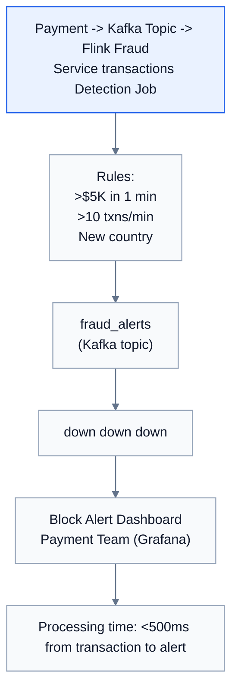
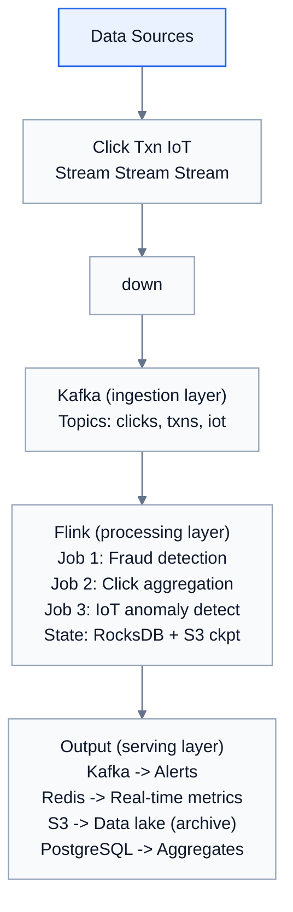

# Topic 34: Stream Processing

> **Track**: Core Concepts — Fundamentals
> **Difficulty**: Intermediate → Advanced
> **Prerequisites**: Topics 1–33 (especially Message Queues, Event-Driven)

---

## Table of Contents

- [A. Concept Explanation](#a-concept-explanation)
- [B. Interview View](#b-interview-view)
- [C. Practical Engineering View](#c-practical-engineering-view)
- [D. Example](#d-example)
- [E. HLD and LLD](#e-hld-and-lld)
- [F. Summary & Practice](#f-summary--practice)

---

## A. Concept Explanation

### What is Stream Processing?

**Stream processing** is the continuous, real-time processing of data as it arrives, rather than collecting it first and processing it later (batch). Events are processed within milliseconds to seconds of being generated.

```
BATCH PROCESSING:
  Collect all data → Store → Process periodically (hourly/daily)
  Example: "Generate daily sales report at midnight"
  Latency: Hours

STREAM PROCESSING:
  Process each event as it arrives → Immediate results
  Example: "Detect fraudulent transaction NOW"
  Latency: Milliseconds to seconds
```

### Stream vs Batch

| Aspect | Batch Processing | Stream Processing |
|--------|-----------------|-------------------|
| **Latency** | Minutes to hours | Milliseconds to seconds |
| **Data** | Bounded (finite dataset) | Unbounded (continuous flow) |
| **Processing** | All at once | Event by event |
| **State** | Disk-based | In-memory (with checkpointing) |
| **Fault tolerance** | Restart from beginning | Checkpoint + replay |
| **Use case** | Reports, ETL, ML training | Fraud detection, alerts, dashboards |

### Stream Processing Operations

```
1. FILTER: Discard events that don't match criteria
   All events → [amount > 1000] → High-value transactions only

2. MAP / TRANSFORM: Modify each event
   {raw: "..."} → parse → {user_id: 123, amount: 50.00}

3. AGGREGATE: Combine events over a window
   Count clicks per URL per 5-minute window

4. JOIN: Combine two streams
   Clicks stream + Impressions stream → Click-through rate

5. WINDOWING: Group events by time
   Tumbling window: [0-5min][5-10min][10-15min] (non-overlapping)
   Sliding window: [0-5min][1-6min][2-7min] (overlapping)
   Session window: Group by user activity gaps
```

### Windowing

```
TUMBLING WINDOW (fixed, non-overlapping):
  |---5min---|---5min---|---5min---|
  |  events  |  events  |  events  |
  Count per window. No overlap. Simple.

SLIDING WINDOW (fixed, overlapping):
  |---5min---|
     |---5min---|
        |---5min---|
  Slides by 1 min. Each event in multiple windows.
  "Average over last 5 minutes, updated every minute"

SESSION WINDOW (gap-based):
  |--user activity--|  gap  |--user activity--|
  Groups events with gaps < threshold (e.g., 30 min inactivity).
  "Count page views per user session"
```

### Stream Processing Frameworks

| Framework | Language | Latency | State | Best For |
|-----------|---------|---------|-------|----------|
| **Apache Kafka Streams** | Java | ms | Built-in (RocksDB) | Kafka-native apps |
| **Apache Flink** | Java/Scala | ms | Built-in (managed) | Complex event processing |
| **Apache Spark Streaming** | Java/Scala/Python | seconds (micro-batch) | Built-in | Unified batch + stream |
| **AWS Kinesis Data Analytics** | SQL/Java | seconds | Managed | AWS-native |
| **Apache Storm** | Java | ms | External | Legacy real-time |
| **Apache Pulsar Functions** | Java/Python | ms | Built-in | Pulsar-native |

---

## B. Interview View

### What Interviewers Expect

| Level | Expectation |
|-------|------------|
| **Junior** | Knows stream = real-time; batch = periodic |
| **Mid** | Knows Kafka + Flink/Spark; understands windowing |
| **Senior** | Discusses exactly-once semantics, state management, watermarks |
| **Staff+** | Late data handling, backpressure, stream-table duality |

### Red Flags

- Using batch where real-time is needed (fraud detection)
- Not considering late-arriving data
- Not knowing any stream processing framework

### Common Questions

1. What is stream processing? How does it differ from batch?
2. What is windowing? Compare tumbling, sliding, session.
3. How do you handle late-arriving data?
4. Compare Kafka Streams, Flink, and Spark Streaming.
5. How do you achieve exactly-once processing?

---

## C. Practical Engineering View

### Exactly-Once Semantics

```
The hardest problem in stream processing:

AT-MOST-ONCE: Process and forget. May lose events.
AT-LEAST-ONCE: Retry on failure. May process duplicates.
EXACTLY-ONCE: Process each event exactly once. Hardest.

Flink's exactly-once:
  1. Checkpoint state periodically (distributed snapshots)
  2. On failure: restore from last checkpoint
  3. Replay events from Kafka (offsets stored in checkpoint)
  4. Kafka transactional producer: atomic writes
  
  Result: Each event affects output exactly once
  Trade-off: Checkpointing adds latency (100ms-1s)

Kafka Streams exactly-once:
  processing.guarantee = "exactly_once_v2"
  Uses Kafka transactions internally
```

### Handling Late Data

```
Problem: Event happened at 10:00 but arrives at 10:05.
  The 10:00-10:05 window already closed!

WATERMARK: "I believe all events up to time T have arrived"
  Watermark = max_event_time - allowed_lateness
  
  Example: allowed_lateness = 5 minutes
    Events arriving up to 5 min late → included in correct window
    Events arriving > 5 min late → dropped or sent to side output

  Flink:
    .assignTimestampsAndWatermarks(
      WatermarkStrategy.forBoundedOutOfOrderness(Duration.ofMinutes(5))
    )
```

### Backpressure

```
Problem: Producer is faster than consumer.

  Producer: 100K events/s
  Consumer: 50K events/s
  → Buffer fills up → OOM or data loss!

Solutions:
  1. BUFFER + SPILL: Buffer in Kafka (disk-backed). Consumer catches up.
  2. THROTTLE PRODUCER: Signal producer to slow down.
  3. SCALE CONSUMER: Add more consumer instances / partitions.
  4. DROP: Drop low-priority events when overloaded.

Flink: Built-in backpressure (TCP-based flow control between operators)
Kafka Streams: Consumer lag monitoring → auto-scale
```

---

## D. Example: Real-Time Fraud Detection



---

## E. HLD and LLD

### E.1 HLD — Stream Processing Pipeline



### E.2 LLD — Stream Processor

```java
public class StreamProcessor {
    private Object consumer;
    private Map<String, Object> handlers;
    private Map<String, Object> windows;
    private Object state;

    public StreamProcessor(Object kafkaConsumer, Map<String, Object> outputHandlers) {
        this.consumer = kafkaConsumer;
        this.handlers = outputHandlers;
        this.windows = new HashMap<>();
        this.state = new HashMap<>();
    }

    public Object process(List<Object> topics, int windowSizeSec) {
        // consumer.subscribe(topics)
        // for message in consumer
        // event = json.loads(message.value)
        // event_time = event.get("timestamp", time.time())
        // 1. Filter
        // if not _should_process(event)
        // continue
        // 2. Transform
        // ...
        return null;
    }

    public Object getWindowKey(Object event, Object eventTime, int windowSize) {
        // window_start = int(event_time // window_size) * window_size
        // entity_key = event.get("user_id", "global")
        // return f"{entity_key}:{window_start}"
        return null;
    }

    public Object aggregate(Object windowKey, Object event) {
        // if window_key not in windows
        // windows[window_key] = {"count": 0, "sum": 0.0, "events": []}
        // w = windows[window_key]
        // w["count"] += 1
        // w["sum"] += event.get("amount", 0)
        // w["events"].append(event)
        return null;
    }

    public List<Object> evaluateRules(Object windowKey, Object event) {
        // alerts = []
        // w = windows.get(window_key, {})
        // Rule: More than $5000 in a window
        // if w.get("sum", 0) > 5000
        // alerts.append({"type": "high_spend", "window": window_key, "total": w["sum"]})
        // Rule: More than 10 transactions in a window
        // if w.get("count", 0) > 10
        // alerts.append({"type": "high_frequency", "window": window_key, "count": w["count"]})
        // ...
        return null;
    }

    public Object emit(Object alert) {
        // for handler in handlers.values()
        // handler.send(alert)
        return null;
    }
}
```

---

## F. Summary & Practice

### Key Takeaways

1. **Stream processing** = real-time, event-by-event processing (ms latency)
2. **Batch processing** = periodic, bounded dataset processing (hours latency)
3. **Windowing**: tumbling (fixed, non-overlapping), sliding (overlapping), session (gap-based)
4. **Exactly-once** is achievable with checkpointing + Kafka transactions
5. **Late data** handled via watermarks and allowed lateness
6. **Flink** for complex event processing; **Kafka Streams** for Kafka-native; **Spark** for unified batch+stream
7. **Backpressure** prevents consumer overload — use Kafka buffering + auto-scaling
8. Common use cases: fraud detection, real-time analytics, alerting, IoT

### Interview Questions

1. What is stream processing? How does it differ from batch?
2. What is windowing? Compare the three types.
3. How do you handle late-arriving data?
4. How do you achieve exactly-once processing?
5. Compare Kafka Streams, Flink, and Spark Streaming.
6. What is backpressure and how do you handle it?
7. Design a real-time fraud detection system.

### Practice Exercises

1. **Exercise 1**: Design a real-time analytics dashboard showing clicks, page views, and conversions per minute for an e-commerce site.
2. **Exercise 2**: Implement a stream processor that detects anomalous login patterns (>5 failed logins in 10 minutes from different IPs).
3. **Exercise 3**: Your Flink job has 30 seconds of consumer lag during peak hours. Diagnose and optimize.

---

> **Previous**: [33 — Blob Storage](33-blob-storage.md)
> **Next**: [35 — Batch Processing](35-batch-processing.md)
