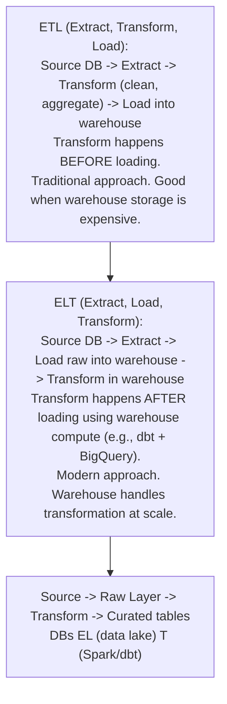
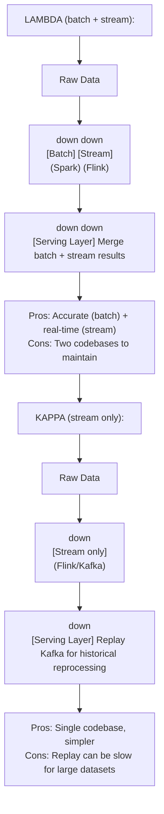
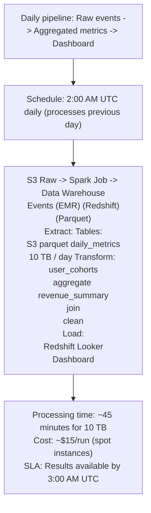
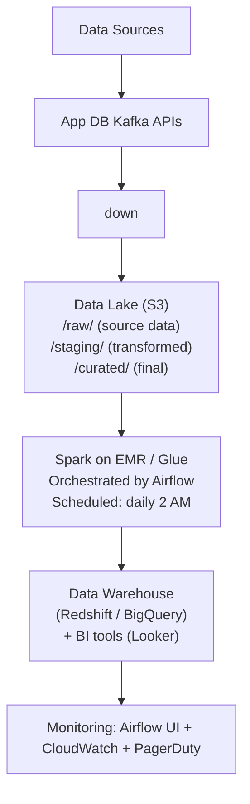

# Topic 35: Batch Processing

> **Track**: Core Concepts — Fundamentals
> **Difficulty**: Intermediate
> **Prerequisites**: Topics 1–34 (especially Stream Processing)

---

## Table of Contents

- [A. Concept Explanation](#a-concept-explanation)
- [B. Interview View](#b-interview-view)
- [C. Practical Engineering View](#c-practical-engineering-view)
- [D. Example](#d-example)
- [E. HLD and LLD](#e-hld-and-lld)
- [F. Summary & Practice](#f-summary--practice)

---

## A. Concept Explanation

### What is Batch Processing?

**Batch processing** operates on a large, bounded dataset all at once, typically on a schedule. It processes data that has already been collected, producing results after the entire dataset is processed.

```
Stream: Process each event as it arrives (real-time)
Batch:  Collect data → Process all at once → Output results

Examples:
  • Daily sales report: Process all transactions from yesterday
  • ML model training: Train on all historical data
  • ETL pipeline: Extract from DB → Transform → Load into data warehouse
  • Billing: Calculate all user invoices at end of month
  • Search index rebuild: Re-index all documents nightly
```

### MapReduce Paradigm

```
The foundational batch processing model (Google, 2004):

INPUT DATA (distributed across nodes):
  File 1: "the cat sat on the mat"
  File 2: "the dog sat on the log"

MAP phase (parallel, per-record):
  File 1 → ("the",1), ("cat",1), ("sat",1), ("on",1), ("the",1), ("mat",1)
  File 2 → ("the",1), ("dog",1), ("sat",1), ("on",1), ("the",1), ("log",1)

SHUFFLE (group by key):
  "the"  → [1, 1, 1, 1]
  "cat"  → [1]
  "sat"  → [1, 1]
  "on"   → [1, 1]
  ...

REDUCE phase (aggregate per key):
  "the"  → 4
  "cat"  → 1
  "sat"  → 2
  "on"   → 2

OUTPUT: Word counts across all files
```

### Batch Processing Frameworks

| Framework | Language | Speed | Best For |
|-----------|---------|-------|----------|
| **Apache Spark** | Java/Scala/Python/R | Fast (in-memory) | General-purpose batch + ML |
| **Apache Hadoop (MapReduce)** | Java | Slow (disk-based) | Legacy, very large datasets |
| **Apache Hive** | SQL | Moderate | SQL on Hadoop/data lake |
| **dbt** | SQL | Fast | Data warehouse transformations |
| **Apache Airflow** | Python (orchestrator) | N/A (orchestrates) | Workflow scheduling |
| **AWS Glue** | Python/Spark | Fast | Managed ETL on AWS |
| **Presto/Trino** | SQL | Fast | Interactive queries on data lake |

### ETL vs ELT



### Lambda vs Kappa Architecture



---

## B. Interview View

### What Interviewers Expect

| Level | Expectation |
|-------|------------|
| **Junior** | Knows batch = scheduled, large-scale data processing |
| **Mid** | Knows Spark; can design basic ETL pipeline |
| **Senior** | Lambda/Kappa architecture; data lake design; partitioning strategy |
| **Staff+** | Cost optimization, data quality, exactly-once ETL, schema evolution |

### Red Flags

- Using batch where real-time is needed
- Not considering idempotency in batch jobs (re-running produces duplicates)
- No monitoring or alerting for batch job failures

### Common Questions

1. What is batch processing? When would you use it?
2. Compare batch vs stream processing.
3. What is ETL? Compare ETL vs ELT.
4. Explain MapReduce.
5. What is the Lambda architecture?
6. How do you handle batch job failures?

---

## C. Practical Engineering View

### Idempotent Batch Jobs

```
Problem: Batch job fails halfway → re-run → duplicate data!

Solutions:
  1. OVERWRITE: Write entire partition, don't append
     INSERT OVERWRITE INTO sales_daily PARTITION (date='2024-01-15')
     Re-run replaces the partition entirely.

  2. UPSERT: Use merge/upsert instead of insert
     MERGE INTO target USING source ON target.id = source.id
     WHEN MATCHED THEN UPDATE
     WHEN NOT MATCHED THEN INSERT

  3. STAGING TABLE: Write to temp → swap atomically
     Write results to sales_daily_staging
     If successful: RENAME sales_daily_staging → sales_daily
     If failed: DROP sales_daily_staging (no partial data)
```

### Workflow Orchestration (Airflow)

```java
import java.time.LocalDate;
import org.springframework.batch.core.Job;
import org.springframework.batch.core.Step;
import org.springframework.batch.core.configuration.annotation.JobBuilderFactory;
import org.springframework.batch.core.configuration.annotation.StepBuilderFactory;
import org.springframework.context.annotation.Bean;
import org.springframework.context.annotation.Configuration;

@Configuration
public class DailyEtlJobConfiguration {
    @Bean
    public Job dailyEtlJob(
            JobBuilderFactory jobs,
            Step extractStep,
            Step transformStep,
            Step loadStep) {
        return jobs.get("dailyEtlJob")
                .start(extractStep)
                .next(transformStep)
                .next(loadStep)
                .build();
    }

    @Bean
    public EtlRunContext etlRunContext() {
        return new EtlRunContext(LocalDate.now().minusDays(1));
    }

    public record EtlRunContext(LocalDate businessDate) {}
}
```

### Monitoring Batch Jobs

```
Key metrics:
  • Job duration (trending up = investigate)
  • Data volume processed (sudden drop = data source issue)
  • Record count (input vs output — mismatch = bug)
  • Error rate (failed records / total records)
  • SLA compliance (finished before deadline?)
  • Resource usage (CPU, memory, disk I/O)

Alerts:
  Job failed → P2 alert → on-call investigates
  Job > 2× normal duration → Warning
  Output records < 80% of expected → Data quality alert
  Job didn't start on schedule → Scheduler issue
```

---

## D. Example: Daily Analytics Pipeline



---

## E. HLD and LLD

### E.1 HLD — Data Pipeline Architecture



### E.2 LLD — Batch Job Framework

```java
public class BatchJob {
    private String jobName;
    private String executionDate;
    private Map<String, Object> metrics;

    public BatchJob(String jobName, String executionDate) {
        this.jobName = jobName;
        this.executionDate = executionDate;
        this.metrics = Map.of("input_count", 0, "output_count", 0, "error_count", 0);
    }

    public Object run() {
        // try
        // log.info(f"Starting {job_name} for {execution_date}")
        // Extract
        // raw_data = extract()
        // metrics["input_count"] = len(raw_data)
        // Transform
        // transformed = transform(raw_data)
        // Validate
        // ...
        return null;
    }

    public List<Object> extract() {
        // raise NotImplementedError
        return null;
    }

    public List<Object> transform(List<Object> data) {
        // raise NotImplementedError
        return null;
    }

    public Object validate(List<Object> data) {
        // Data quality checks
        // if len(data) == 0
        // raise ValueError("Transform produced zero records")
        // Add more checks: null rates, schema validation, etc.
        return null;
    }

    public Object load(List<Object> data) {
        // raise NotImplementedError
        return null;
    }

    public int reportMetrics() {
        // monitoring.emit(f"batch.{job_name}.input_count", metrics["input_count"])
        // monitoring.emit(f"batch.{job_name}.output_count", metrics["output_count"])
        return 0;
    }
}

public class DailySalesAggregation {
    // State inferred from the original Python example.

    public Object extract() {
        // return spark.read.parquet(f"s3://raw/sales/{execution_date}/")
        return null;
    }

    public Object transform(Object data) {
        // return data.groupBy("product_id", "region") \
        // .agg(sum("amount").alias("total_sales"),
        // count("*").alias("transaction_count"))
        return null;
    }

    public Object load(Object data) {
        // data.write.mode("overwrite") \
        // .partitionBy("region") \
        // .parquet(f"s3://curated/daily_sales/{execution_date}/")
        return null;
    }
}
```

---

## F. Summary & Practice

### Key Takeaways

1. **Batch processing** operates on bounded datasets on a schedule (hourly/daily)
2. **MapReduce** = Map (parallel transform) → Shuffle (group) → Reduce (aggregate)
3. **Spark** is the modern standard; Hadoop MapReduce is legacy
4. **ETL** transforms before loading; **ELT** loads raw then transforms in warehouse
5. **Lambda architecture**: batch + stream layers; **Kappa**: stream-only with replay
6. **Idempotent jobs**: overwrite partitions, use upsert, or staging tables
7. **Airflow** for orchestration; schedule, retry, dependency management
8. Monitor: job duration, record counts, data quality, SLA compliance
9. Batch is best for **reports, ML training, ETL, billing, re-indexing**

### Interview Questions

1. What is batch processing? When would you use it vs stream?
2. Explain MapReduce with an example.
3. What is ETL? Compare ETL vs ELT.
4. How do you make batch jobs idempotent?
5. What is the Lambda architecture? Compare with Kappa.
6. How do you handle batch job failures?
7. Design a daily analytics pipeline.

### Practice Exercises

1. **Exercise 1**: Design a daily ETL pipeline for an e-commerce platform: extract from 5 source databases, transform into a star schema, load into a data warehouse.
2. **Exercise 2**: Your nightly batch job takes 6 hours but the SLA is 4 hours. Diagnose and optimize.
3. **Exercise 3**: Design a batch + stream architecture (Lambda) for a real-time dashboard that also needs historical accuracy.

---

> **Previous**: [34 — Stream Processing](34-stream-processing.md)
> **Next**: [36 — Observability](36-observability.md)
