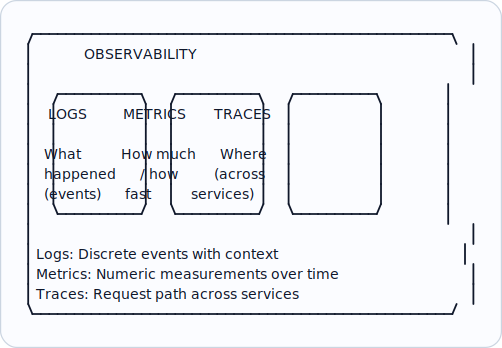
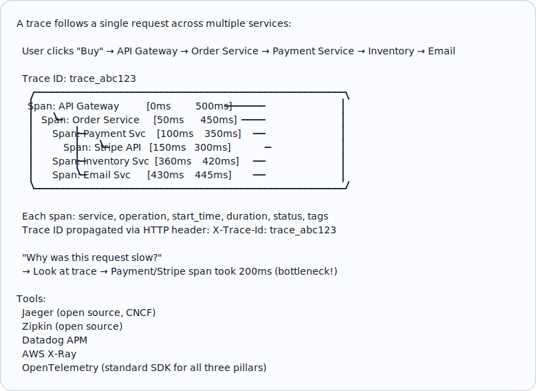
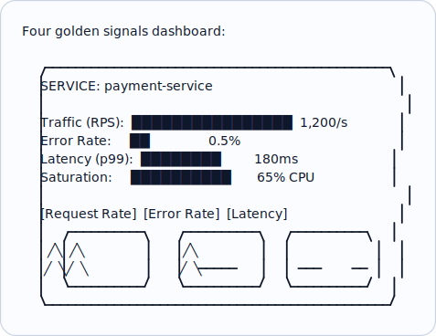
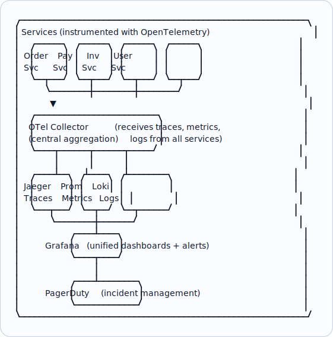
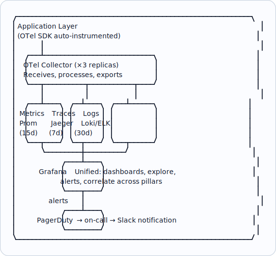

# Topic 36: Observability

> **Track**: Core Concepts — Fundamentals
> **Difficulty**: Intermediate
> **Prerequisites**: Topics 1–35

---

## Table of Contents

- [A. Concept Explanation](#a-concept-explanation)
- [B. Interview View](#b-interview-view)
- [C. Practical Engineering View](#c-practical-engineering-view)
- [D. Example](#d-example)
- [E. HLD and LLD](#e-hld-and-lld)
- [F. Summary & Practice](#f-summary--practice)

---

## A. Concept Explanation

### What is Observability?

**Observability** is the ability to understand the internal state of a system by examining its outputs. It answers: "What is happening inside the system right now, and why?"

```
MONITORING: "Is the system working?"  (known-unknowns)
  → Dashboards, alerts, uptime checks

OBSERVABILITY: "WHY is the system behaving this way?" (unknown-unknowns)
  → Explore, correlate, drill down into any question

Observability = Monitoring + ability to ask arbitrary questions about system state
```

### Three Pillars of Observability



### Logs

```
Structured log (JSON — preferred):
  {
    "timestamp": "2024-01-15T10:30:00Z",
    "level": "ERROR",
    "service": "payment-service",
    "trace_id": "abc123",
    "user_id": "usr_789",
    "message": "Payment failed",
    "error": "Card declined",
    "amount": 99.99,
    "duration_ms": 250
  }

Log levels:
  DEBUG:   Detailed debugging (dev only, never in prod)
  INFO:    Normal operations ("Order created", "User logged in")
  WARN:    Unexpected but handled ("Retry succeeded on 2nd attempt")
  ERROR:   Failure requiring attention ("Payment failed")
  FATAL:   System cannot continue ("Database connection lost")

Log aggregation tools:
  ELK Stack (Elasticsearch + Logstash + Kibana)
  Loki + Grafana (lightweight, label-based)
  Datadog Logs
  Splunk
  AWS CloudWatch Logs
```

### Metrics

```
Numeric measurements collected over time:

TYPES:
  Counter:   Monotonically increasing (total_requests, error_count)
  Gauge:     Current value (cpu_usage, active_connections, queue_depth)
  Histogram: Distribution of values (request_duration_ms, response_size)
  Summary:   Pre-calculated percentiles (p50, p95, p99 latency)

KEY METRICS (RED method for services):
  Rate:    Requests per second
  Errors:  Error rate (errors / total requests)
  Duration: Latency percentiles (p50, p95, p99)

KEY METRICS (USE method for resources):
  Utilization: % of resource used (CPU 80%)
  Saturation:  Queue depth, backlog
  Errors:      Resource errors (disk I/O errors)

Tools:
  Prometheus + Grafana (industry standard, pull-based)
  Datadog (SaaS, full-featured)
  CloudWatch Metrics (AWS)
  StatsD + Graphite
  InfluxDB + Telegraf
```

### Traces (Distributed Tracing)



### OpenTelemetry (OTel)

```
The vendor-neutral standard for observability instrumentation:

  App code → OTel SDK → OTel Collector → Backend (Jaeger, Prometheus, etc.)

  Supports: Traces, Metrics, Logs (unified API)
  Languages: Java, Python, Go, Node.js, .NET, C++, Rust
  
  Benefits:
  • Instrument once, send to any backend
  • No vendor lock-in
  • Auto-instrumentation for common frameworks (Express, Spring, Flask)
  • W3C Trace Context standard for trace propagation
```

---

## B. Interview View

### What Interviewers Expect

| Level | Expectation |
|-------|------------|
| **Junior** | Knows logging and basic metrics |
| **Mid** | Knows three pillars; mentions Prometheus + Grafana |
| **Senior** | Designs observability strategy; SLOs, alerting, tracing |
| **Staff+** | Observability-driven development; cost optimization; cardinality management |

### Red Flags

- Not mentioning observability in a system design
- Only logging, no metrics or tracing
- No alerting strategy
- Not correlating logs, metrics, and traces

### Common Questions

1. What is observability? How does it differ from monitoring?
2. What are the three pillars of observability?
3. How does distributed tracing work?
4. What metrics would you track for this service?
5. How do you set up alerting?
6. What is OpenTelemetry?

---

## C. Practical Engineering View

### SLOs and Alerting

```
SLI (Service Level Indicator): A metric that measures service quality
  Example: "99.5% of requests complete in < 200ms"

SLO (Service Level Objective): Target for an SLI
  Example: "p99 latency < 500ms, availability > 99.9%"

Error Budget: How much failure is allowed
  99.9% availability = 0.1% error budget = 8.7 hours/year of downtime

Alerting based on SLOs (burn rate):
  If error budget consumed at 10× normal rate for 5 min → Page on-call
  If error budget consumed at 2× normal rate for 1 hour → Warning
  If 50% of monthly error budget consumed → Review meeting

Multi-window alerting (Google SRE):
  Short window (5 min) + Long window (1 hour) = reduces false alarms
  Both must fire → page
```

### Alerting Best Practices

```
GOOD alerts:
  ✓ Actionable: Someone can DO something about it
  ✓ Symptom-based: "Users are seeing errors" not "CPU is high"
  ✓ Proportional: Severity matches business impact
  ✓ Deduplicated: Not 100 alerts for the same issue

BAD alerts:
  ✗ "CPU > 80%": Is anything actually broken? (cause-based, not symptom)
  ✗ Alert on every warning log: Too noisy, alert fatigue
  ✗ No runbook: On-call doesn't know what to do
  ✗ Alert without context: "Error rate high" — which service? which endpoint?

Alert tiers:
  P1 (Page): User-facing outage, data loss risk → immediate response
  P2 (Alert): Degraded service, approaching SLO breach → respond in 30 min
  P3 (Ticket): Non-urgent issue → investigate during business hours
  P4 (Log): Informational, no action needed
```

### Dashboards



---

## D. Example: Observability Stack for Microservices



---

## E. HLD and LLD

### E.1 HLD — Observability Platform



### E.2 LLD — Instrumentation Middleware

```java
// Dependencies in the original example:
// import time
// import uuid
// from opentelemetry import trace, metrics

public class ObservabilityMiddleware {
    private Object logger;

    public ObservabilityMiddleware(Object logger) {
        this.logger = logger;
    }

    public Object handle(Object request, Object nextHandler) {
        // Extract or create trace context
        // trace_id = request.headers.get("X-Trace-Id", str(uuid.uuid4()))
        // with tracer.start_as_current_span(
        // f"{request.method} {request.path}",
        // attributes={
        // "http.method": request.method,
        // "http.url": request.path,
        // "user.id": request.user_id,
        // ...
        return null;
    }
}
```

---

## F. Summary & Practice

### Key Takeaways

1. **Observability** = understanding system internals from external outputs
2. **Three pillars**: Logs (events), Metrics (numbers over time), Traces (request paths)
3. **Structured logging** (JSON) enables searching and filtering at scale
4. **RED method** for services: Rate, Errors, Duration
5. **USE method** for resources: Utilization, Saturation, Errors
6. **Distributed tracing** follows a request across services via trace ID
7. **OpenTelemetry** is the vendor-neutral standard for instrumentation
8. **SLO-based alerting** reduces noise; alert on user-facing symptoms, not causes
9. **Grafana + Prometheus + Jaeger + Loki** = standard open-source observability stack
10. Correlate across pillars: trace ID links logs, metrics, and traces

### Interview Questions

1. What is observability? How does it differ from monitoring?
2. What are the three pillars of observability?
3. How does distributed tracing work?
4. What metrics would you track for a payment service?
5. How do you set up alerting that avoids alert fatigue?
6. What is OpenTelemetry?
7. Design the observability stack for a 20-microservice system.

### Practice Exercises

1. **Exercise 1**: Design the observability strategy for an e-commerce platform. Specify metrics, logs, traces, dashboards, and alerting rules for each service.
2. **Exercise 2**: A user reports "checkout is slow." Using observability tools, describe the investigation process from alert to root cause.
3. **Exercise 3**: Your team gets 50 alerts/day and most are false alarms. Redesign the alerting strategy using SLO-based alerting.

---

> **Previous**: [35 — Batch Processing](35-batch-processing.md)
> **Next**: [37 — Logging, Metrics, Tracing](37-logging-metrics-tracing.md)
