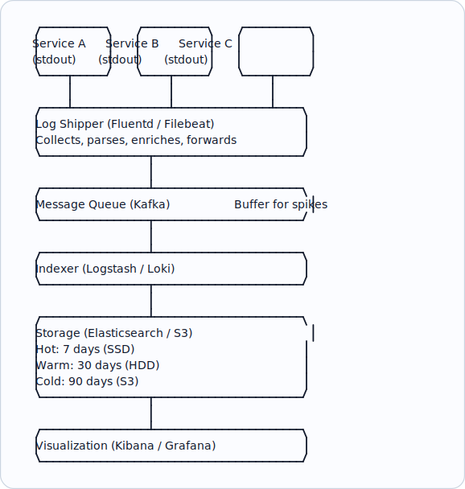
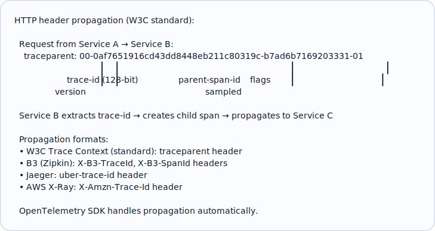
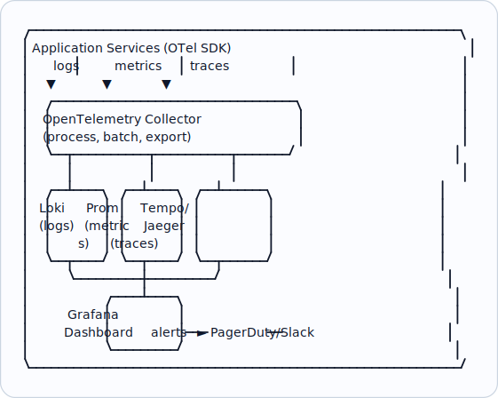

# Topic 37: Logging, Metrics, and Tracing (Deep Dive)

> **Track**: Core Concepts — Fundamentals
> **Difficulty**: Intermediate
> **Prerequisites**: Topics 1–36 (especially Observability)

---

## Table of Contents

- [A. Concept Explanation](#a-concept-explanation)
- [B. Interview View](#b-interview-view)
- [C. Practical Engineering View](#c-practical-engineering-view)
- [D. Example](#d-example)
- [E. HLD and LLD](#e-hld-and-lld)
- [F. Summary & Practice](#f-summary--practice)

---

## A. Concept Explanation

### Logging Deep Dive

Topic 36 introduced the three pillars. This topic dives into **implementation details, tooling, and best practices** for each.

#### Structured vs Unstructured Logging

```
UNSTRUCTURED (bad):
  2024-01-15 10:30:00 ERROR Payment failed for user 123 amount $99.99

  Problems:
  • Hard to parse programmatically
  • Can't filter by user_id or amount
  • Different formats across services

STRUCTURED (good — JSON):
  {
    "timestamp": "2024-01-15T10:30:00Z",
    "level": "error",
    "service": "payment-svc",
    "message": "Payment failed",
    "user_id": "usr_123",
    "amount": 99.99,
    "currency": "USD",
    "error_code": "card_declined",
    "trace_id": "tr_abc",
    "span_id": "sp_def"
  }

  Benefits:
  • Machine-parseable → searchable in ELK/Loki
  • Filter: service=payment-svc AND level=error AND amount>50
  • Correlate with traces via trace_id
```

#### Log Aggregation Architecture



### Metrics Deep Dive

#### Prometheus Metric Types

```java
import io.micrometer.core.instrument.Counter;
import io.micrometer.core.instrument.Gauge;
import io.micrometer.core.instrument.MeterRegistry;
import io.micrometer.core.instrument.Timer;
import java.util.concurrent.atomic.AtomicInteger;

public final class MetricsRegistry {
    private final Counter httpRequestsTotal;
    private final Counter paymentFailuresTotal;
    private final AtomicInteger activeConnections;
    private final Timer requestLatency;

    public MetricsRegistry(MeterRegistry registry) {
        this.httpRequestsTotal = Counter.builder("http_requests_total")
                .description("Total HTTP requests")
                .tag("service", "payment-service")
                .register(registry);

        this.paymentFailuresTotal = Counter.builder("payment_failures_total")
                .description("Failed payment attempts")
                .register(registry);

        this.activeConnections = registry.gauge("active_connections", new AtomicInteger(0));

        this.requestLatency = Timer.builder("http_request_latency")
                .description("End-to-end request latency")
                .publishPercentiles(0.5, 0.95, 0.99)
                .register(registry);
    }

    public void recordRequest(String endpoint, int statusCode, Runnable handler) {
        httpRequestsTotal.increment();
        requestLatency.record(handler);
        if (statusCode >= 500) {
            paymentFailuresTotal.increment();
        }
    }

    public void connectionOpened() {
        activeConnections.incrementAndGet();
    }

    public void connectionClosed() {
        activeConnections.decrementAndGet();
    }
}
```

#### PromQL Examples

```
# Request rate (per second, 5-min average)
rate(http_requests_total[5m])

# Error rate percentage
rate(http_requests_total{status=~"5.."}[5m]) / rate(http_requests_total[5m]) * 100

# p99 latency
histogram_quantile(0.99, rate(request_duration_seconds_bucket[5m]))

# CPU usage per pod
rate(container_cpu_usage_seconds_total{namespace="production"}[5m])

# Alert rule: error rate > 1% for 5 minutes
alert: HighErrorRate
expr: rate(http_requests_total{status=~"5.."}[5m]) / rate(http_requests_total[5m]) > 0.01
for: 5m
labels:
  severity: critical
annotations:
  summary: "High error rate on {{ $labels.service }}"
```

### Distributed Tracing Deep Dive

#### Trace Context Propagation



#### Sampling Strategies

```
Problem: Tracing every request is expensive at scale.
  100K RPS × 5 spans each = 500K spans/sec → expensive storage!

Sampling strategies:
  1. HEAD SAMPLING: Decide at entry point (random %)
     Sample 10% of requests → miss 90% of errors
     
  2. TAIL SAMPLING: Decide after request completes
     Sample ALL errors + 10% of successful → better signal
     More complex (must buffer spans)

  3. ADAPTIVE SAMPLING: Dynamic rate based on traffic
     Low traffic: 100% sampling
     High traffic: 1% sampling
     Errors: always 100%

  4. PRIORITY SAMPLING: Sample based on importance
     Payment requests: 100%
     Health checks: 0%
     Normal API calls: 10%
```

---

## B. Interview View

### What Interviewers Expect

| Level | Expectation |
|-------|------------|
| **Junior** | Knows to add logging; mentions log levels |
| **Mid** | Structured logging; Prometheus metrics; basic tracing |
| **Senior** | Log aggregation pipeline; PromQL; sampling strategies; correlation |
| **Staff+** | Cardinality management; cost optimization; custom instrumentation |

### Red Flags

- Unstructured logging in a distributed system
- No metrics beyond basic uptime
- Not propagating trace context across services
- Not considering log/metric volume and cost

### Common Questions

1. How do you implement structured logging?
2. What metrics would you collect for a payment service?
3. How does trace context propagation work?
4. How do you handle the cost of observability at scale?
5. Write a PromQL query for error rate and p99 latency.

---

## C. Practical Engineering View

### High Cardinality Problem

```
CARDINALITY = number of unique label combinations

  LOW cardinality (good):
    http_requests{method="GET", status="200"}  → ~20 combinations
    
  HIGH cardinality (dangerous):
    http_requests{user_id="usr_123"}  → millions of unique users!
    → Prometheus stores a separate time series for each combination
    → 10M users × 5 metrics = 50M time series → Prometheus OOM!

  Rules:
  ✓ Use labels with bounded values: method, status, service, region
  ✗ Never use as labels: user_id, request_id, email, IP address
  → Put high-cardinality data in LOGS, not metrics
```

### Cost Optimization

```
Log volume at scale:
  20 services × 1000 RPS × 1 KB/log = 20 MB/s = 1.7 TB/day!
  
  Strategies to reduce:
  1. Log levels: Only INFO+ in production (no DEBUG)
  2. Sampling: Log 10% of successful requests, 100% of errors
  3. Compression: gzip logs before shipping (5-10× reduction)
  4. Retention tiers: 7 days hot, 30 days warm, 90 days cold
  5. Drop noise: Skip health check logs, frequent heartbeats
  
  Metrics:
  6. Reduce cardinality: Fewer labels = fewer time series
  7. Increase scrape interval: 30s instead of 15s for less-critical metrics
  
  Traces:
  8. Tail sampling: Only store interesting traces (errors, slow, sampled)
  9. Reduce span attributes: Only essential metadata
```

---

## D. Example: Debugging a Production Issue

```
Scenario: Users report "checkout is slow"

1. METRICS (Grafana dashboard):
   → p99 latency spike to 5s (normally 200ms) at 14:30
   → Error rate: 2% (normally 0.1%)
   → Service: payment-svc

2. TRACES (Jaeger):
   → Find slow traces for payment-svc
   → Trace shows: Stripe API span = 4.5s (normally 100ms)
   → Stripe is the bottleneck

3. LOGS (Loki/Kibana):
   → Filter: service=payment-svc AND level=error AND time>14:30
   → "Stripe API timeout after 5000ms"
   → "Circuit breaker opened for stripe-gateway"
   → 50 occurrences in 10 minutes

4. ROOT CAUSE: Stripe experiencing degradation
5. MITIGATION: Circuit breaker active → fallback to queued payments
6. RESOLUTION: Stripe recovers at 14:45 → circuit closes → normal latency

Time to diagnose: ~5 minutes (with proper observability)
Without observability: hours of guessing
```

---

## E. HLD and LLD

### E.1 HLD — Full Observability Stack



### E.2 LLD — Logging Library

```java
// Dependencies in the original example:
// import json
// import time
// import logging
// import traceback

public class StructuredLogger {
    private String service;
    private Object defaults;
    private Object logger;

    public StructuredLogger(String serviceName, Map<String, Object> defaultFields) {
        this.service = serviceName;
        this.defaults = defaultFields || {};
        this.logger = logging.getLogger(serviceName);
    }

    public Object log(String level, String message) {
        // entry = {
        // "timestamp": time.strftime("%Y-%m-%dT%H:%M:%SZ", time.gmtime()),
        // "level": level,
        // "service": service,
        // "message": message,
        // **defaults,
        // **kwargs,
        // }
        // ...
        return null;
    }

    public Object info(String message) {
        // _log("info", message, **kwargs)
        return null;
    }

    public Object error(String message) {
        // _log("error", message, **kwargs)
        return null;
    }

    public Object warn(String message) {
        // _log("warn", message, **kwargs)
        return null;
    }

    public Object withContext() {
        // Create child logger with additional default fields
        // new_defaults = {**defaults, **kwargs}
        // return StructuredLogger(service, new_defaults)
        return null;
    }
}
```

---

## F. Summary & Practice

### Key Takeaways

1. **Structured logging** (JSON) is essential — enables search, filter, correlation
2. **Log aggregation**: services → shipper → buffer → indexer → storage → UI
3. **Prometheus metric types**: Counter (totals), Gauge (current), Histogram (distribution)
4. **PromQL** for querying: `rate()`, `histogram_quantile()`, alert rules
5. **Trace propagation** via W3C `traceparent` header across services
6. **Sampling** reduces cost: tail sampling > head sampling for quality
7. **High cardinality** labels kill Prometheus — use bounded values only
8. **Correlation**: trace_id links logs ↔ metrics ↔ traces
9. **Cost management**: log levels, sampling, compression, retention tiers
10. **Investigation flow**: Metrics (what) → Traces (where) → Logs (why)

### Interview Questions

1. Compare structured vs unstructured logging.
2. What are the four Prometheus metric types?
3. How does distributed trace propagation work?
4. What is the high cardinality problem?
5. How do you manage observability costs at scale?
6. Walk through debugging a production latency issue using all three pillars.
7. What sampling strategies exist for distributed tracing?

### Practice Exercises

1. **Exercise 1**: Design the logging, metrics, and tracing strategy for a 15-microservice e-commerce platform. Specify tools, retention, and alerting rules.
2. **Exercise 2**: Write PromQL queries for: request rate per endpoint, error rate, p95 latency, and a multi-window alert rule.
3. **Exercise 3**: Your observability stack costs $20K/month. Propose 5 strategies to reduce it to $8K without losing critical visibility.

---

> **Previous**: [36 — Observability](36-observability.md)
> **Next**: [38 — Security Fundamentals](38-security-fundamentals.md)
