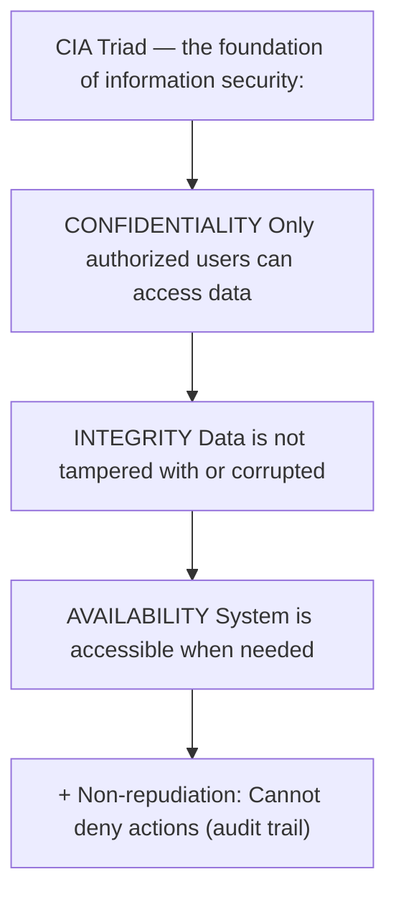
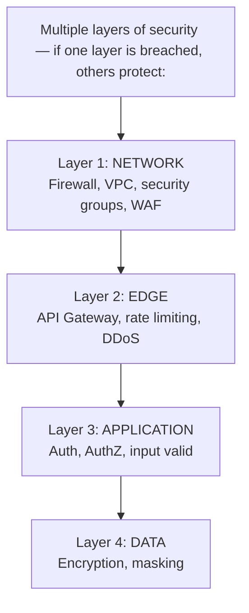
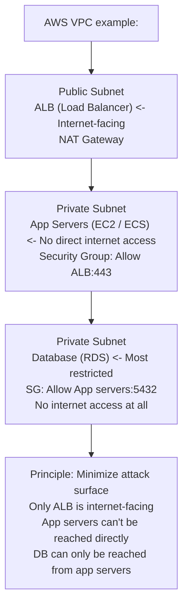
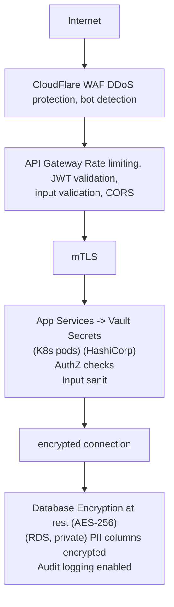
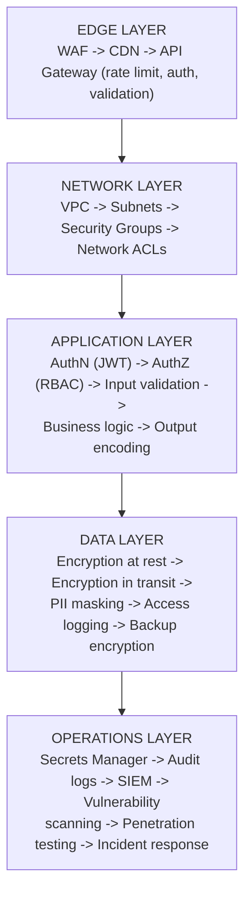

# Topic 38: Security Fundamentals

> **Track**: Core Concepts — Fundamentals
> **Difficulty**: Intermediate
> **Prerequisites**: Topics 1–37

---

## Table of Contents

- [A. Concept Explanation](#a-concept-explanation)
- [B. Interview View](#b-interview-view)
- [C. Practical Engineering View](#c-practical-engineering-view)
- [D. Example](#d-example)
- [E. HLD and LLD](#e-hld-and-lld)
- [F. Summary & Practice](#f-summary--practice)

---

## A. Concept Explanation

### Why Security in System Design?

Every system design must address security. A brilliantly designed system that is easily compromised is a failed design. Security should be considered **from the start**, not bolted on later.



### Common Threats (OWASP Top 10 Highlights)

| Threat | Description | Mitigation |
|--------|-------------|-----------|
| **Injection** (SQLi, NoSQLi) | Malicious input executed as code | Parameterized queries, input validation |
| **Broken Authentication** | Weak passwords, session hijacking | MFA, secure session management |
| **Sensitive Data Exposure** | Unencrypted PII, secrets in logs | Encryption at rest/transit, secret vaults |
| **Broken Access Control** | Users access unauthorized resources | RBAC/ABAC, principle of least privilege |
| **Security Misconfiguration** | Default passwords, open ports, verbose errors | Hardening, automated security scans |
| **XSS** (Cross-Site Scripting) | Injecting scripts into web pages | Output encoding, CSP headers |
| **CSRF** (Cross-Site Request Forgery) | Forged requests from authenticated user | CSRF tokens, SameSite cookies |
| **SSRF** (Server-Side Request Forgery) | Server makes requests to internal resources | Allowlist URLs, network segmentation |
| **DDoS** | Overwhelming the system with traffic | Rate limiting, WAF, CDN, auto-scaling |

### Defense in Depth



### Zero Trust Architecture

```
Traditional: "Trust everything inside the network perimeter"
  Problem: Once an attacker is inside → full access to everything

Zero Trust: "Never trust, always verify"
  Every request is authenticated and authorized, regardless of source.
  
  Principles:
  1. Verify identity for every request (no implicit trust)
  2. Least privilege access (minimal permissions)
  3. Micro-segmentation (services can only reach what they need)
  4. Encrypt all traffic (even internal service-to-service)
  5. Continuous monitoring and validation

  Implementation:
  • mTLS between all services (Istio/Envoy)
  • JWT tokens validated at every service, not just the gateway
  • Network policies in Kubernetes (pod-to-pod restrictions)
  • IAM roles with minimal permissions
```

### Input Validation

```
NEVER trust user input. Validate everything.

  Server-side validation (mandatory):
    • Type checking: Is "age" actually a number?
    • Range checking: Is age between 0 and 150?
    • Length checking: Is name < 255 characters?
    • Format checking: Is email a valid email?
    • Sanitization: Strip HTML tags, escape special characters
    • Allowlist: Only accept known-good values for enums

  SQL Injection prevention:
    BAD:  query = f"SELECT * FROM users WHERE id = {user_input}"
          user_input = "1; DROP TABLE users;"  → deletes table!
    
    GOOD: query = "SELECT * FROM users WHERE id = %s"
          cursor.execute(query, (user_input,))  → parameterized, safe
```

---

## B. Interview View

### What Interviewers Expect

| Level | Expectation |
|-------|------------|
| **Junior** | Knows HTTPS, input validation, SQL injection |
| **Mid** | Defense in depth, OWASP top threats, encryption basics |
| **Senior** | Zero trust, threat modeling, security architecture review |
| **Staff+** | Compliance (SOC2, GDPR), security culture, incident response |

### Red Flags

- No mention of security in system design
- Storing passwords in plain text
- No encryption for sensitive data
- Trusting all internal network traffic
- Not considering input validation

### Common Questions

1. How would you secure this system?
2. What are the main security concerns for this design?
3. How do you prevent SQL injection?
4. What is defense in depth?
5. How do you handle secrets management?

---

## C. Practical Engineering View

### Secrets Management

```
NEVER hardcode secrets in code or config files!

BAD:
  DB_PASSWORD = "super_secret_123"  # In source code
  aws_secret_key = "AKIA..."        # In .env committed to git

GOOD:
  Use a secrets manager:
  • AWS Secrets Manager / Parameter Store
  • HashiCorp Vault
  • GCP Secret Manager
  • Azure Key Vault
  • Kubernetes Secrets (encrypted at rest)

  Application code:
    db_password = secrets_manager.get_secret("db/production/password")
    
  Rotation:
    Secrets Manager auto-rotates DB passwords every 30 days
    Application fetches latest secret on each connection
```

### Network Security



### Security Headers

```
HTTP security headers every API/web app should set:

  Strict-Transport-Security: max-age=31536000; includeSubDomains
  → Force HTTPS for 1 year

  Content-Security-Policy: default-src 'self'
  → Prevent XSS by restricting script sources

  X-Content-Type-Options: nosniff
  → Prevent MIME type sniffing

  X-Frame-Options: DENY
  → Prevent clickjacking (embedding in iframe)

  X-XSS-Protection: 1; mode=block
  → Browser XSS filter

  Referrer-Policy: strict-origin-when-cross-origin
  → Control referrer information leakage

  Permissions-Policy: camera=(), microphone=()
  → Restrict browser features
```

---

## D. Example: Securing an E-Commerce Platform



---

## E. HLD and LLD

### E.1 HLD — Security Architecture



### E.2 LLD — Input Validation Middleware

```java
// Dependencies in the original example:
// import re
// from dataclasses import dataclass

public class InputValidator {
    // State inferred from the original Python example.

    public String validateEmail(String email) {
        // email = email.strip().lower()
        // pattern = r'^[a-zA-Z0-9._%+-]+@[a-zA-Z0-9.-]+\.[a-zA-Z]{2,}$'
        // if not re.match(pattern, email) or len(email) > 254
        // raise ValueError("Invalid email format")
        // return email
        return null;
    }

    public String validateString(String value, String fieldName, Object minLen, Object maxLen, boolean allowHtml) {
        // if not isinstance(value, str)
        // raise ValueError(f"{field_name} must be a string")
        // value = value.strip()
        // if len(value) < min_len or len(value) > max_len
        // raise ValueError(f"{field_name} must be {min_len}-{max_len} chars")
        // if not allow_html
        // value = re.sub(r'<[^>]+>', '', value)  # Strip HTML tags
        // Prevent null bytes
        // ...
        return null;
    }

    public double validateAmount(Object amount, Object minVal, Object maxVal) {
        // try
        // amount = float(amount)
        // except (TypeError, ValueError)
        // raise ValueError("Amount must be a number")
        // if amount < min_val or amount > max_val
        // raise ValueError(f"Amount must be between {min_val} and {max_val}")
        // return round(amount, 2)
        return 0;
    }

    public String validateId(String value, String fieldName) {
        // Validate UUID or numeric ID
        // value = str(value).strip()
        // uuid_pattern = r'^[0-9a-f]{8}-[0-9a-f]{4}-[0-9a-f]{4}-[0-9a-f]{4}-[0-9a-f]{12}$'
        // numeric_pattern = r'^\d{1,20}$'
        // if not (re.match(uuid_pattern, value) or re.match(numeric_pattern, value))
        // raise ValueError(f"Invalid {field_name}")
        // return value
        return null;
    }
}

public class SecurityMiddleware {
    private int rateLimiter;
    private Object auth;

    public SecurityMiddleware(int rateLimiter, Object authService) {
        this.rateLimiter = rateLimiter;
        this.auth = authService;
    }

    public Object processRequest(Object request) {
        // 1. Rate limiting
        // if not rate_limiter.allow(request.client_ip)
        // return Response(429, "Too Many Requests")
        // 2. Security headers
        // response_headers = {
        // "X-Content-Type-Options": "nosniff",
        // "X-Frame-Options": "DENY",
        // "Strict-Transport-Security": "max-age=31536000",
        // ...
        return null;
    }
}
```

---

## F. Summary & Practice

### Key Takeaways

1. **CIA Triad**: Confidentiality, Integrity, Availability — the foundation
2. **Defense in depth**: multiple security layers (network, edge, app, data)
3. **Zero Trust**: never trust, always verify — even internal traffic
4. **Input validation**: parameterized queries, sanitization, allowlists
5. **Secrets management**: Vault/Secrets Manager, never hardcode
6. **Network security**: VPC, private subnets, security groups, least privilege
7. **Security headers**: HSTS, CSP, X-Frame-Options on every response
8. **OWASP Top 10**: injection, broken auth, XSS, CSRF, SSRF, misconfig
9. Always mention security in system design interviews
10. Security is **everyone's responsibility**, not just the security team

### Interview Questions

1. How would you secure this system design?
2. What is defense in depth?
3. How do you prevent SQL injection?
4. What is Zero Trust architecture?
5. How do you manage secrets in a microservices system?
6. What security headers should every web application set?
7. How do you handle DDoS attacks?
8. What are the OWASP Top 10?

### Practice Exercises

1. **Exercise 1**: Perform a security review of a basic e-commerce system design. Identify 10 security improvements.
2. **Exercise 2**: Design the network architecture for a multi-tier application on AWS. Show VPCs, subnets, security groups, and data flow.
3. **Exercise 3**: Your application stores credit card numbers in plain text in the database. Design the migration to a secure architecture.

---

> **Previous**: [37 — Logging, Metrics, Tracing](37-logging-metrics-tracing.md)
> **Next**: [39 — Authentication](39-authentication.md)
